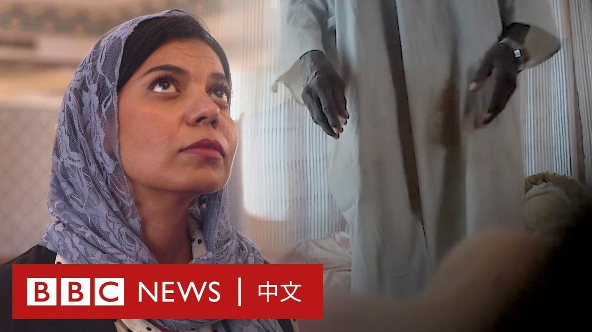

D英国广播公司BBC 北京时间 2023-08-11T11:00:01Z 1689834022212378624 BBC一项调查显示，在苏丹等阿拉伯国家，女性被精神治疗师以“心灵疗法”的名义施展性侵害的情况非常普遍。

经过一年的访问，有超过80名女性证实她们遭到性骚扰甚至强奸。BBC的卧底记者亦在调查过程中经历了一名治疗师的性骚扰。 https://t.co/DWRJqsUKJg   D英国广播公司BBC 北京时间 2023-08-11T08:49:28Z 1689801170653417472 大西洋理事会智库高级研究员丹兹曼（Sarah Bauerle Danzman）认为，公布的限制措施比此前讨论中一些人建议的范围更窄，但仍代表着政府监管“前所未有”地扩大：“这绝对是一件大事，而且肯定与过去的政策大为不同。”https://t.co/4SuYQHJbIW   