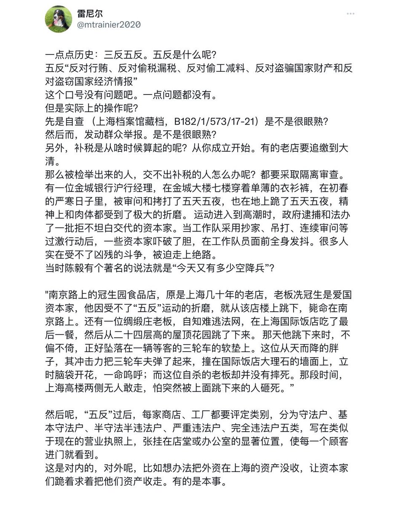
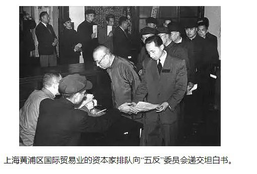
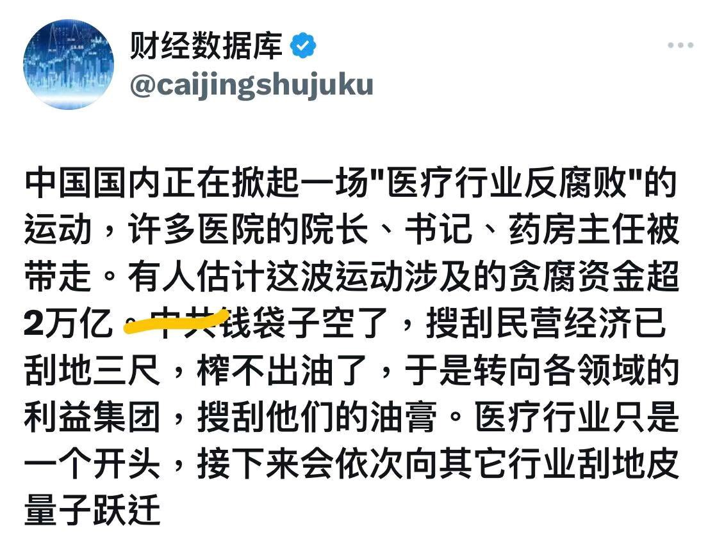
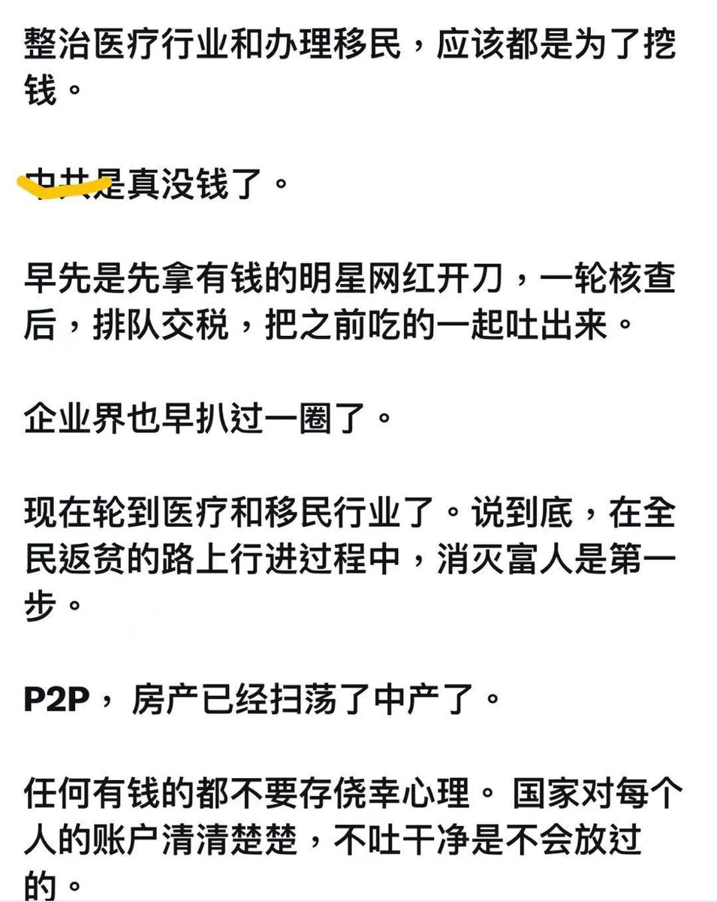
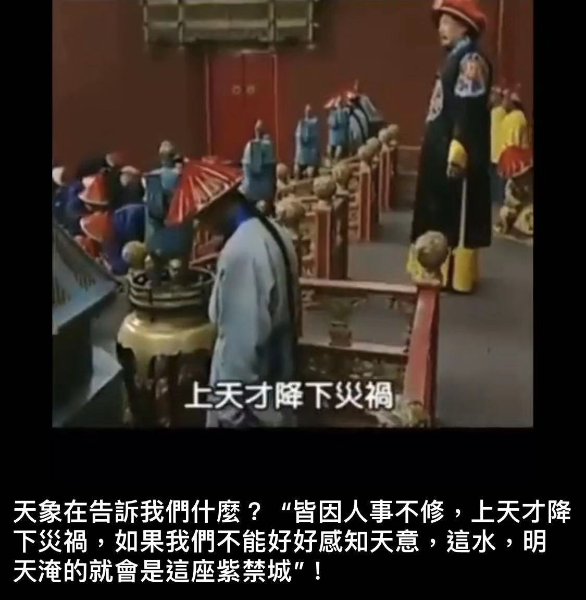

Petrichor 北京时间 2023-08-11T22:49:48Z 1690012647926673408 金政委萎了，公开承认“美国有58个盟友，而中国只要一个盟友，即朝鲜，但有等于没有”。有个关键问题，金政委没有讲，那就是中国领导人为什么把中国从美国的盟友变成美国的敌人？这样的转变对中国人民没有任何好处！ https://t.co/IbFmS0noRS   Petrichor 北京时间 2023-08-11T20:26:23Z 1689976554158194688 现实是历史的再一次重复而已。打土豪、分田地，从来就是主旋律。共产党玩这一套轻车熟路。出口外贸下行，企业倒闭，有人就怀疑政府无钱养公务员和维稳人员，政府对付百姓办法多去了，榨百姓的油，易如反掌。记住，只要还有一条被子，那必在赵家人身上。 https://t.co/WCYVxjZEP1   Petrichor 北京时间 2023-08-11T16:47:21Z 1689921433542021120 苦不苦，想想伦敦王汉铮这个250。 https://t.co/wq4f57Q3TJ   Petrichor 北京时间 2023-08-11T09:58:19Z 1689818497449119745 马勒戈壁，假新闻、先进性都是这么制造出来的。我对你们没有要求，只求你真实、不撒谎，连这都做不到吗？除了作假，你们还能干点什么吗？小时候，你妈没有教你不撒谎吗？还是家教本来就不好啊！ https://t.co/fWrhQccrtu   Petrichor 北京时间 2023-08-11T10:57:14Z 1689833321969184768 中国人是讲究天人合一的。以前，天降大灾，皇帝都得下罪己诏，反思自己的决策，痛改前非。现在皇帝是彻底的唯物主义者，死不认错，既要…又要…不能用现在的他否定过去的他，横竖他都有理，封控清零是正确的，全面躺倒也是正确的。 https://t.co/OhpiBGuq6b   Petrichor 北京时间 2023-08-11T11:05:57Z 1689835518173855744 沧海横流，方显英雄本色。
激流勇进，好男儿敢担当。 https://t.co/w9oJKln2Xu   Petrichor 北京时间 2023-08-11T10:14:50Z 1689822653090054144 中国外交部好像对美国国家制度什么也不懂的样子。众议院和参议院通过的法案，总统签字就生效了，如何“立马纠正错误决定”？以为如中国一样习近平一句话就改变一切，治国如翻烧饼？ https://t.co/9ju3AVIWcL   Petrichor 北京时间 2023-08-11T01:13:34Z 1689686437912879154 中国大妈臭美的代价。2023年8月9日上午9时许，四川雅安雨城区 11名穿戴考究的大妈，相约到陇西河鱼鳞坝处拍照。她们不顾河道边的警戒线和无视安全警示，执意进入河道摆拍。结果水库泄水造成其中7人不幸遇难。 https://t.co/WBsaW5zsPf   Petrichor 北京时间 2023-08-11T01:40:14Z 1689693150044983297 中國和朝鲜有1334公里邊境線﹐其中陸界45公里﹐水界1289公里。隔鴨綠江向朝鲜望去﹐常能看見軍人活動的身影以及觀察哨﹑瞭望塔之類的設施。有的乘船旅遊項目﹐可以把遊客帶到距離朝鲜很近的地方﹐站崗的女兵﹑閑聊的軍人﹐都能看到。不過﹐要不是有人提醒﹐很難發現岸邊還有暗堡。禁拍照，否则后果严重 https://t.co/9b8p3HhLBZ   