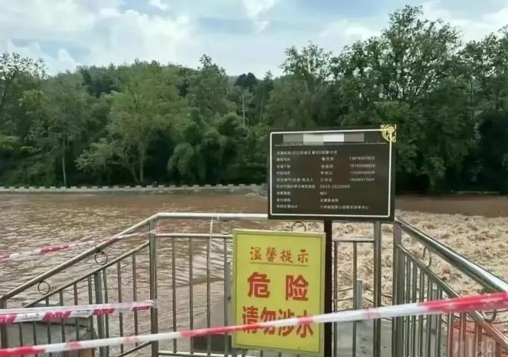

Petrichor 北京时间 2023-08-11T11:05:57Z 1689835518173855744 沧海横流，方显英雄本色。
激流勇进，好男儿敢担当。 https://t.co/w9oJKln2Xu   Petrichor 北京时间 2023-08-11T10:14:50Z 1689822653090054144 中国外交部好像对美国国家制度什么也不懂的样子。众议院和参议院通过的法案，总统签字就生效了，如何“立马纠正错误决定”？以为如中国一样习近平一句话就改变一切，治国如翻烧饼？ https://t.co/9ju3AVIWcL   Petrichor 北京时间 2023-08-11T01:13:34Z 1689686437912879154 中国大妈臭美的代价。2023年8月9日上午9时许，四川雅安雨城区 11名穿戴考究的大妈，相约到陇西河鱼鳞坝处拍照。她们不顾河道边的警戒线和无视安全警示，执意进入河道摆拍。结果水库泄水造成其中7人不幸遇难。 https://t.co/WBsaW5zsPf   Petrichor 北京时间 2023-08-11T01:40:14Z 1689693150044983297 中國和朝鲜有1334公里邊境線﹐其中陸界45公里﹐水界1289公里。隔鴨綠江向朝鲜望去﹐常能看見軍人活動的身影以及觀察哨﹑瞭望塔之類的設施。有的乘船旅遊項目﹐可以把遊客帶到距離朝鲜很近的地方﹐站崗的女兵﹑閑聊的軍人﹐都能看到。不過﹐要不是有人提醒﹐很難發現岸邊還有暗堡。禁拍照，否则后果严重 https://t.co/9b8p3HhLBZ   