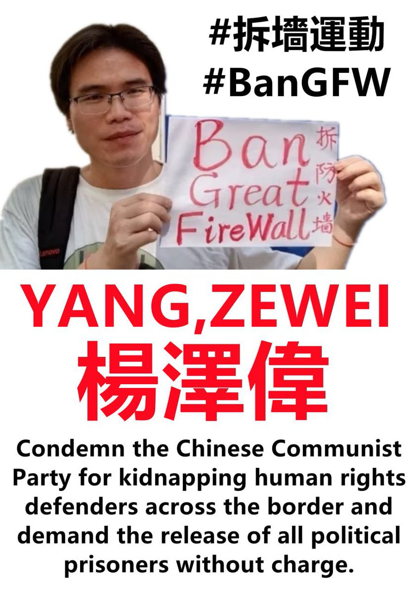
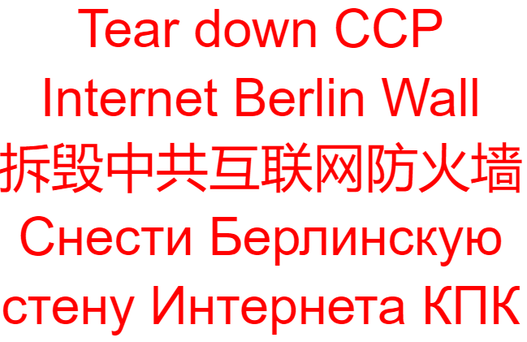

拆墙运动公号 北京时间 2023-08-11T17:32:24Z 1689932771257470976 #拆墙运动 运动发起人 #杨泽伟 ，他为拆除中共 #互联网防火墙 被中共跨国从老挝抓捕回中国，关押在湖南衡阳未成年看守所。
人权捍卫者 #林生亮 一直为他呐喊追查下落，追查涉案恶警，换来全世界各界的关注。
我们每个人在捍卫人权的路上不再孤单！孤单的是你连自己的权利都不争取的人。
恶毒的独裁中共不会同情任何一个弱者，它只会对弱者 变本加厉，只有你自己站出对抗的时候！才会不再惧怕！到那时才是独裁中共最担心害怕的！
虽然 #杨泽伟 被中共跨国抓捕回中国，但是我们每一个人更应该站起来！因为当我们都站起来的时候，独裁中共才会害怕！
拆除独裁中共 #互联网防火墙 是我们大家的责任！因为它不但捂住生活在中国的人的眼睛、堵住生活在中国的人的嘴巴，而且中共还洗脑仇恨教育，将会给世界带来更大灾难！
今天更多人参与 #拆墙运动 吧！拆毁中共愚民墙！
拆除愚民墙后，我们将不再恐惧！中共政权将会灭亡！   