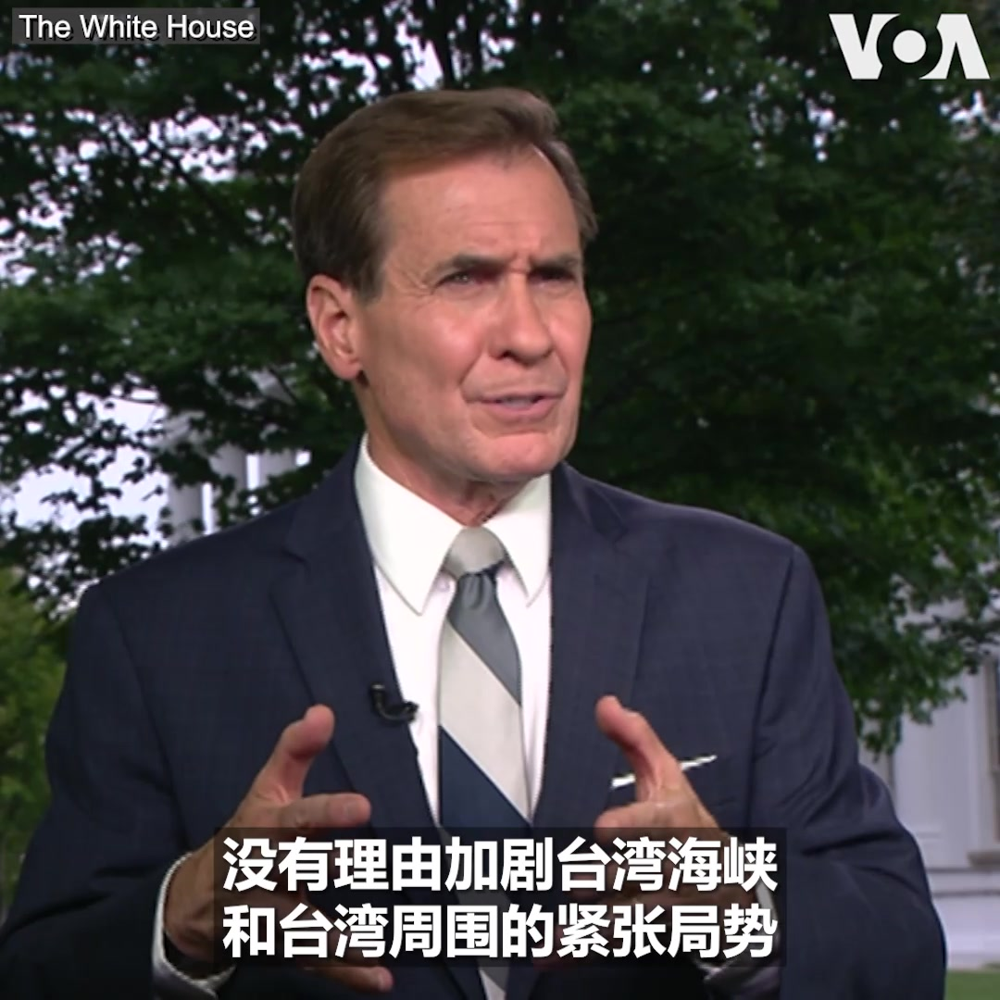
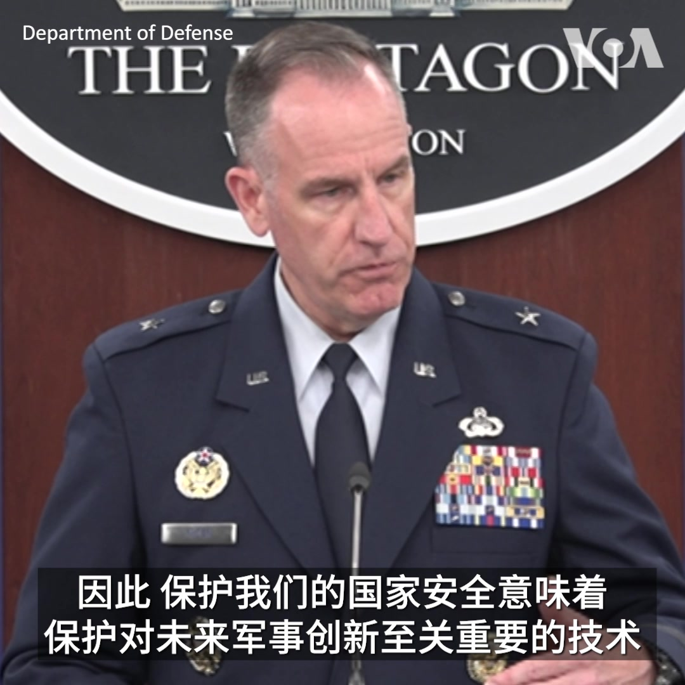
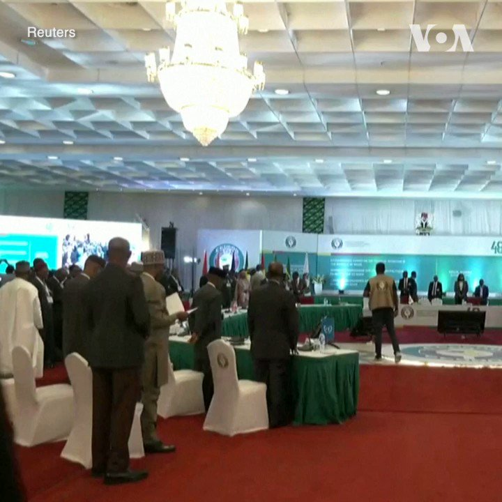
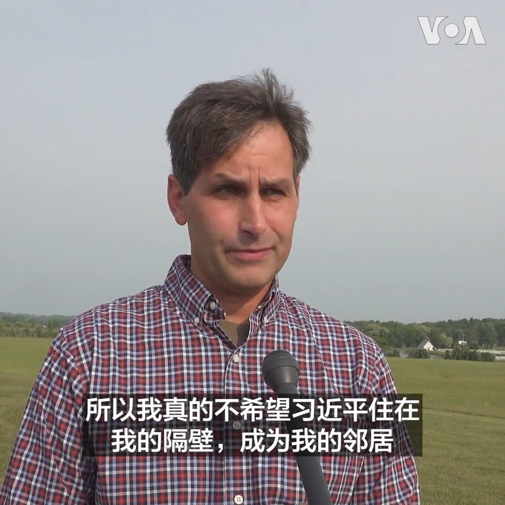

美国之音中文网 北京时间 2023-08-11T22:27:49Z 1690007112951242752 菲律宾武装部队总参谋长罗米奥·布劳纳8月10日视察了巴拉望省普林塞萨港的一座军事基地。这里距离菲律宾和中国有争议的第二托马斯浅滩（中国称仁爱礁）大约200英里。上周六，中国海警船在附近海域阻拦并向菲律宾海警船和运送补给物资的包租船发射水炮。菲律宾对此表达了强烈抗议。 https://t.co/Fs23qglLkq   美国之音中文网 北京时间 2023-08-11T22:59:02Z 1690014969494982656 印度一名超级影星的粉丝为最新电影上映欢欣鼓舞 https://t.co/KQECMo0uf9   美国之音中文网 北京时间 2023-08-11T23:12:03Z 1690018244852408320 人权观察敦促尼日尔政变领导人尊重被推翻总统的人权 https://t.co/9eAXWVONsV   美国之音中文网 北京时间 2023-08-11T23:21:38Z 1690020655536730112 乌克兰官员说，俄军8月11日对乌克兰西部的伊凡诺-弗兰克维斯科地区的民用基础设施发动空袭，造成一名八岁儿童死亡。此前，乌克兰政府发布了全国空袭警报。 俄罗斯政府当天表示，俄军在周四晚间击落了两架飞往库尔斯克市的乌军无人机。 https://t.co/0sRgA8n7yY   美国之音中文网 北京时间 2023-08-11T19:24:03Z 1689960866769424385 旅美华人三年疫情之后重返中国：反向文化冲击 https://t.co/Pj2lY0Svjw   美国之音中文网 北京时间 2023-08-11T18:11:03Z 1689942497114693632 中国北方多日洪灾至少78死 河北计划2年完成重建 https://t.co/CzvmAwetNb   美国之音中文网 北京时间 2023-08-11T15:42:33Z 1689905127598272512 新西兰公布安全威胁报告 指控中国从事间谍活动和外国干涉 https://t.co/Ocnsn2h0Qp   美国之音中文网 北京时间 2023-08-11T13:09:04Z 1689866498742034432 中国称捕获CIA间谍 军工集团人员派意大利遭吸收 https://t.co/grSts1TeDt   美国之音中文网 北京时间 2023-08-11T10:04:33Z 1689820066941149184 专家：中国面对经济困境可能变得更加咄咄逼人 https://t.co/DNXUnsbOko   美国之音中文网 北京时间 2023-08-11T10:49:03Z 1689831264273248256 墨西哥称将对芬太尼前体化学品进行数字监控 https://t.co/7eV4vGmowD   美国之音中文网 北京时间 2023-08-11T12:02:43Z 1689849804501704705 揭谎频道：美国高价卖过时武器给台湾？文字报道：https://t.co/cO5Bzw5DhE https://t.co/aBBHIalknK   美国之音中文网 北京时间 2023-08-11T12:08:34Z 1689851276610461697 北戴河会议讨论什么？评论指中共危机四伏 习近平无力回天 https://t.co/g3JYHLALZw   美国之音中文网 北京时间 2023-08-11T06:29:17Z 1689765892421222402 台湾副总统及下届总统候选人赖清德本周末将在纽约过境，前往巴拉圭参加总统就职典礼。白宫国安会战略沟通协调员约翰.科比8月10日在接受美国之音采访时表示，美国的一个中国政策没有改变，中国没有理由对赖清德的过境做出过度反应，加剧紧张局势。 https://t.co/Gz5Q3V4NaW   美国之音中文网 北京时间 2023-08-11T06:30:00Z 1689766071669002240 中国多处粮仓遭灾，大片农田面临绝收，也暴露出农业生产中的问题。“信息与战略研究所”经济学者李恒青认为，中国要真正解决农业问题，必须走城镇化道路，也要让那些离开土地的农民不受农管、城管的“祸害”。但中国户口制度阻碍改革，因为中共“觉得农村人更好压榨和管理”。完整版 https://t.co/XO8MDNd5u6 https://t.co/8wLFLLObu1   美国之音中文网 北京时间 2023-08-11T07:00:01Z 1689773623999885312 昔日富豪姚振华被讨薪者当街围殴。中共支持 “民营经济31条”墨汁未干，”举报阻碍民营经济发展壮大问题线索”音犹在耳，为何对姚振华被打不表态不行动？领英配合中宣部买到中国门票，十年后败退中国。默多克、谷歌、领英前赴后继，为何看中共次次走眼？请看美国之音8月11日上午9点《时事大家谈》。 https://t.co/ZlGVvdtvAU   美国之音中文网 北京时间 2023-08-11T10:04:35Z 1689820075132694528 拜登对华限制令：中国政府怒斥 业者平静 https://t.co/DNKUxBE7l0   美国之音中文网 北京时间 2023-08-11T06:35:33Z 1689767467655352321 被中国关押的澳大利亚记者写“情书”回家 https://t.co/WtIvJZbNhl   美国之音中文网 北京时间 2023-08-11T08:22:03Z 1689794271015215104 尼日尔军政权：邻国若军事干预，他们将杀死被推翻的总统巴祖姆 https://t.co/bDSVECs654   美国之音中文网 北京时间 2023-08-11T08:22:05Z 1689794278577643521 台湾副总统将在美过境，专家：中国或不会有过度军事反应 以避免选举副作用 https://t.co/V9HHttVE8L   美国之音中文网 北京时间 2023-08-11T08:51:03Z 1689801567137079296 菲律宾军方称将向有争议的岛礁运送更多物资 https://t.co/ruQf8gB9JY   美国之音中文网 北京时间 2023-08-11T02:54:03Z 1689711726143668225 野火肆虐毛伊岛，拜登宣布扩大对夏威夷的援助 https://t.co/doFrnn6Wmx   美国之音中文网 北京时间 2023-08-11T04:56:34Z 1689742557658730497 伊朗将四名美国囚犯转为软禁 https://t.co/3kAnobP1VP   美国之音中文网 北京时间 2023-08-11T04:56:36Z 1689742565216866305 西共体下令启动待命部队,以恢复尼日尔宪政 https://t.co/XMq8muJjcf   美国之音中文网 北京时间 2023-08-11T05:26:03Z 1689749978753941504 中国和瓦格纳在非洲：是朋友还是敌人？ https://t.co/UEWvQ9uDbL   美国之音中文网 北京时间 2023-08-11T05:39:34Z 1689753379365703683 报告：中国针对德国技术“通过后门”获得许可证 https://t.co/WLxRGx6yMM   美国之音中文网 北京时间 2023-08-11T05:51:39Z 1689756419145211904 “我想强调，从国防部的角度来看，这个行动有多么重要，”美国五角大楼发言人帕特.莱德准将8月10日在例行记者会上谈到拜登总统周三签署的限制对华投资的行政命令时说。他表示，该命令将会是国防部应对来自中国的步调挑战的重要组成部分。 https://t.co/yVxgi2Fb7O   美国之音中文网 北京时间 2023-08-11T05:53:18Z 1689756836759470081 拜登总统签署行政令，限制美国资本流入中国某些敏感科技领域。中国批评此举“背离美方一贯提倡的市场经济”。时评人张杰博士认为，把握监管和自由之间的度很重要，解决之道在于分权制衡，这正是美国和中国的区别。#时事大家谈 完整版：https://t.co/XO8MDNd5u6 https://t.co/9Uzvi4D3gP   美国之音中文网 北京时间 2023-08-11T06:09:04Z 1689760801694072832 华北洪灾损失惨重 分析: 中国经济恐雪上加霜 https://t.co/IPvAOyP6F7   美国之音中文网 北京时间 2023-08-11T06:16:05Z 1689762568905412613 华北洪灾损失惨重 分析: 中国经济恐雪上加霜 https://t.co/rtxssraq13   美国之音中文网 北京时间 2023-08-11T02:25:03Z 1689704428071452672 香港律政司就高院拒批《愿荣光归香港》禁制令上诉 https://t.co/NR3L3Qw3HO   美国之音中文网 北京时间 2023-08-11T02:25:05Z 1689704435596038144 香港“二胡伯伯”疑奏《愿荣光》被票控 称不希望返回“文字狱”时代引国际笑话 https://t.co/X3KsZ2AlHc   美国之音中文网 北京时间 2023-08-11T02:39:33Z 1689708077497688064 美国七月通胀数据令人鼓舞，美联储继续观望可能性增大 https://t.co/zg5vS0wyly   美国之音中文网 北京时间 2023-08-11T03:03:39Z 1689714140401590273 挪威东南部区域的洪水10日迫使民众疏散。流经赫纳福斯 Hønefossen 的贝格纳河 Begna10日河水暴涨，漫过河岸。市镇当局担心滑坡不得不疏散民众。 https://t.co/Pe7tX2AAlB   美国之音中文网 北京时间 2023-08-11T03:25:03Z 1689719527939125248 国事光析: 专制政治是中国遭遇的最大祸水 https://t.co/dMf5Y6YNuC   美国之音中文网 北京时间 2023-08-11T03:50:17Z 1689725876743667713 西非国家经济共同体8月10日在阿布贾召开特别峰会，为陷于动荡的尼日尔政局寻找解决方案。尼日利亚总统蒂努布强调，寻求通过外交途径解决尼日尔危机至关重要。尼日尔上月中旬发生军事政变。军政府迄今为止拒绝了联合国、西非国家以及非盟提出的多项和解建议。 https://t.co/ToKEGmfeiP   美国之音中文网 北京时间 2023-08-11T00:29:20Z 1689675305982599179 流亡印度的藏人10日在达兰萨拉举行游行，纪念国际囚犯公正日 International Prisoners' Justice Day 。参加游行的西藏妇女会的成员举着披露中国政府迫害西藏被关押者的图片和标语，呼吁国际社会关注西藏和中国其他地方的政治犯。 https://t.co/YRmCfXdxSF   美国之音中文网 北京时间 2023-08-11T00:40:03Z 1689678001871687680 外界将关注北京如何应对美限制对中国敏感高科技领域投资 https://t.co/gcIyX9gR7T   美国之音中文网 北京时间 2023-08-11T01:11:26Z 1689685903621464076 “从前战争是炸弹和刺刀，现在的战争是官僚和商业，”密西根州米克斯塔县(Mecosta County)居民正在为自己的家园而战——中国国轩公司计划在当地建厂生产电动车电池，承诺24亿美元投资和两千多个工作机会，但当地居民表示“我不想和习近平做邻居。”更多报道请持续关注。 https://t.co/kSvxejqQsb   美国之音中文网 北京时间 2023-08-11T01:12:02Z 1689686052284563456 中国将在新的监管推动中要求所有应用程序共享业务详细信息 https://t.co/pUwUxoFf3b   美国之音中文网 北京时间 2023-08-11T01:40:03Z 1689693102209118208 香港警方以涉嫌违反国安法为由，逮捕与612人道基金相关十人 https://t.co/rlLQxvvKPm   美国之音中文网 北京时间 2023-08-11T01:52:27Z 1689696222984949760 美国海军8月10日公布的一系列视频显示，美国海军陆战队第26远征队（MEU）搭载海军“巴丹号”两栖攻击舰前往海湾地区，以应对伊朗近来在霍尔木兹海峡及附近海域对商船的骚扰和扣押。上个月，五角大楼还向海湾地区增派多架F-35和F-16战机以及导弹驱逐舰，增强对当地商船的保护。 https://t.co/LHlB3fiskk   美国之音中文网 北京时间 2023-08-11T01:53:33Z 1689696498978783232 乌克兰宣布设立人道走廊允许滞留乌港的货船离境 https://t.co/dW7d55FA7N   