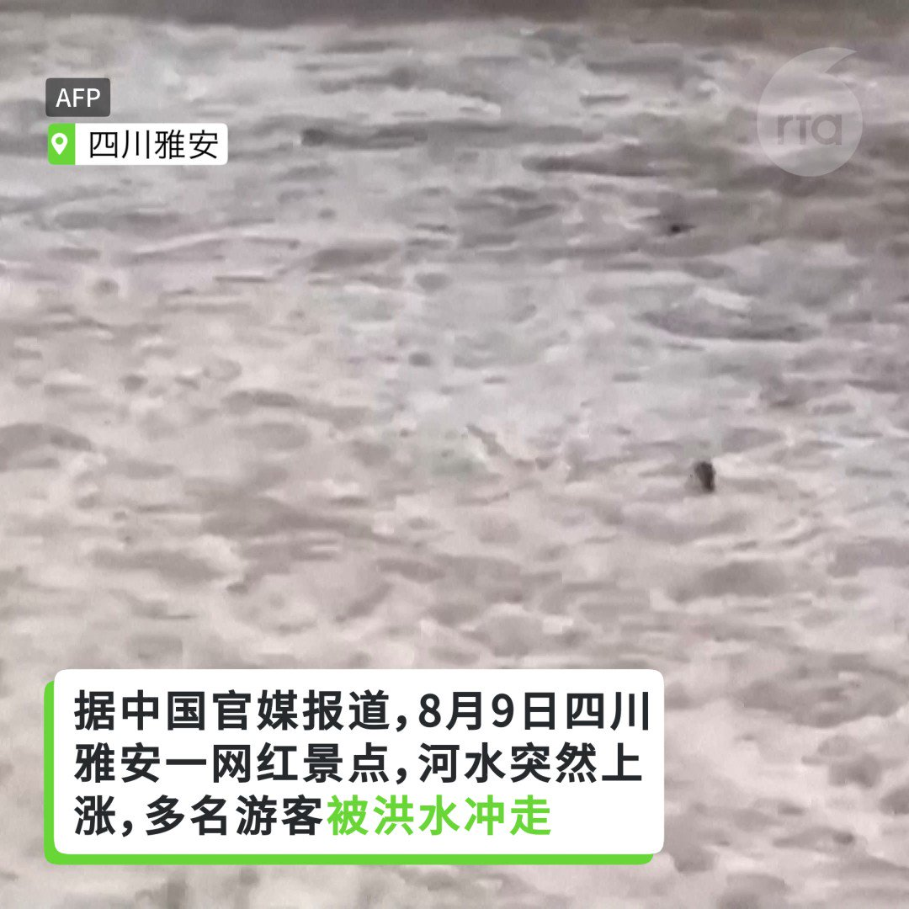

自由亚洲电台 北京时间 2023-08-11T04:47:41Z 1689740322065235968 最近，流亡在美国的中国异议人士、作家 #苏晓康 推出新作《#海恸》，深入分析了中国问题及世界局势。
那么书名《海恸》的"恸"字是什么意思？
苏晓康又是如何看待四十年来所谓的"大国崛起"以及中共专制扩张问题的根源？
以下请听本台记者凯迪对苏晓康的专访。 https://t.co/V5p5LUmBfZ   自由亚洲电台 北京时间 2023-08-11T06:00:43Z 1689758703380217858 据中国官媒报道8月9日上午，四川雅安一网红景点河水突然上涨，多名正在河道内戏水的游客被洪水冲走。目前4人获救，7人遇难。涉事原因在正调查当中。 https://t.co/q4tBG9M1u1   自由亚洲电台 北京时间 2023-08-11T02:36:22Z 1689707275219517441 中国教育培训机构新东方在杭州的线下中心近日被全面关闭，这些机构被关闭的起因与一名网红的举报有关。 https://t.co/PPSKeET0uP   自由亚洲电台 北京时间 2023-08-11T03:07:08Z 1689715016675835904 本周三，美国总统拜登签署行政令，禁止美国投资中国可用于军事用途的敏感技术行业，以补充此前一系列的对华关键技术出口管制措施。虽然有议员批评此举力度不足，但仍有学者认为，新规无疑是对中国投资环境和尖端技术发展的又一重创。 https://t.co/NzHbU6qa1V   自由亚洲电台 北京时间 2023-08-11T00:26:56Z 1689674701021511680 中国海警日前阻挠菲律宾船只前往南海仁爱礁补给，两国关系更加紧张。马尼拉宣布，已暂停中国企业承包的马尼拉湾填海工程。 https://t.co/rQ97NrrTXz   