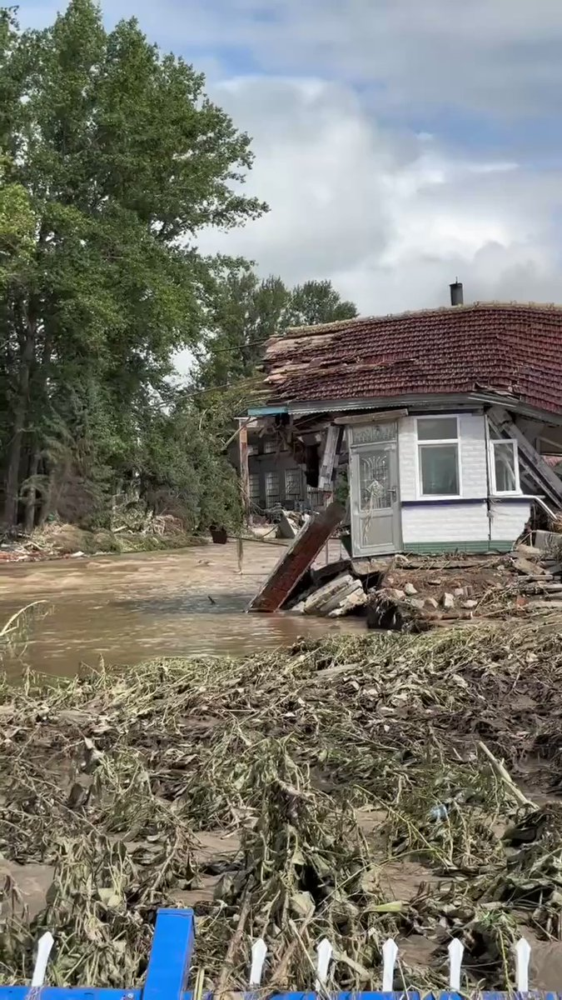
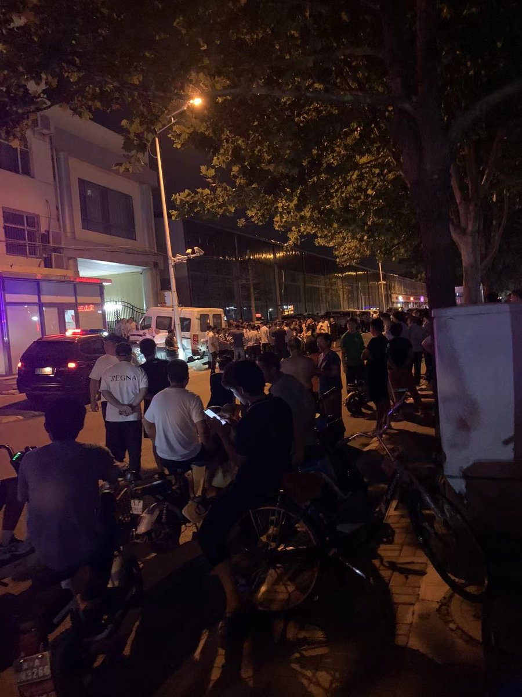
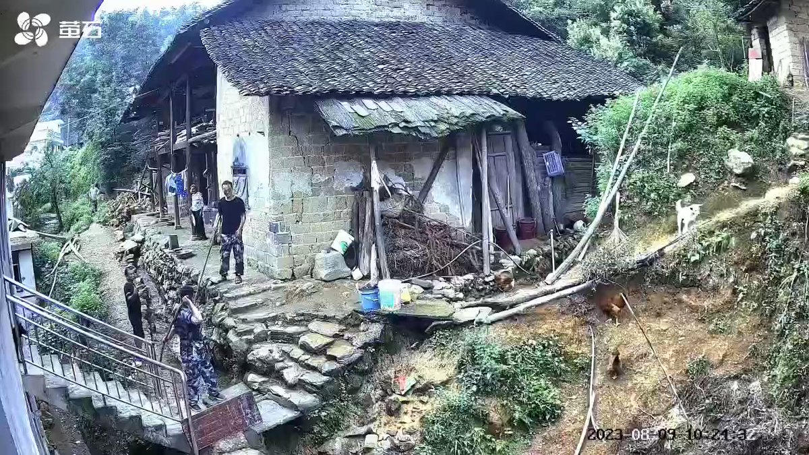
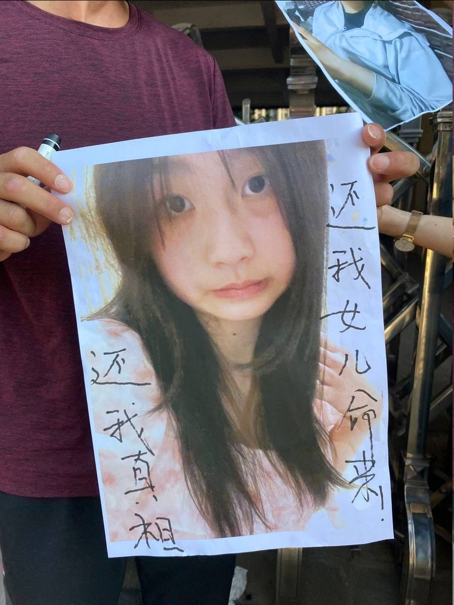
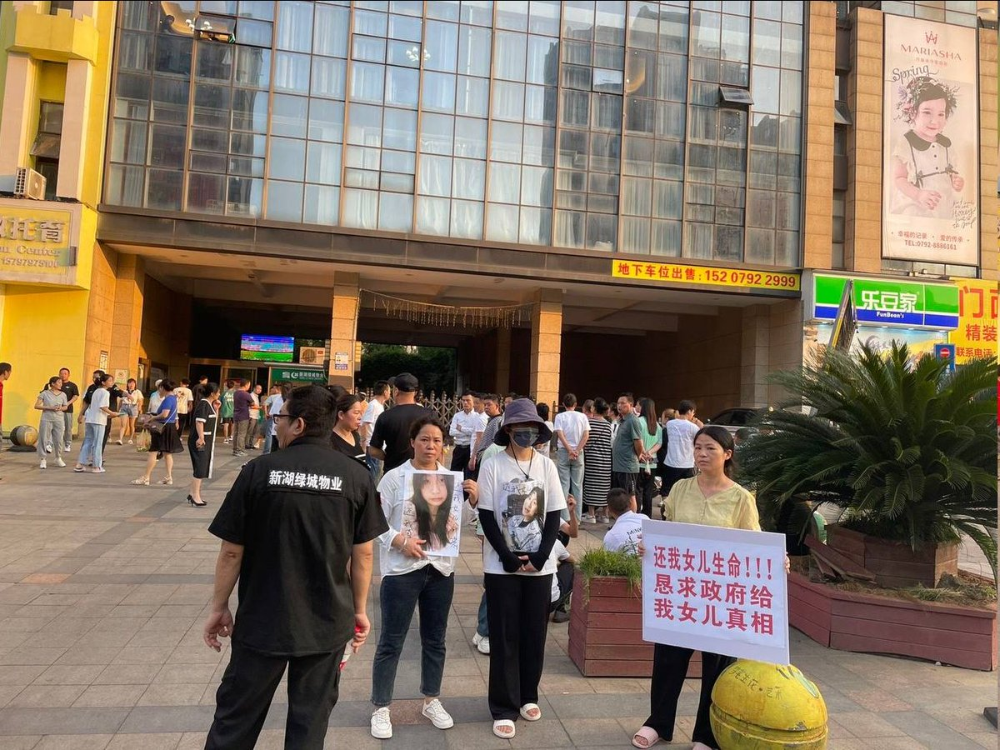
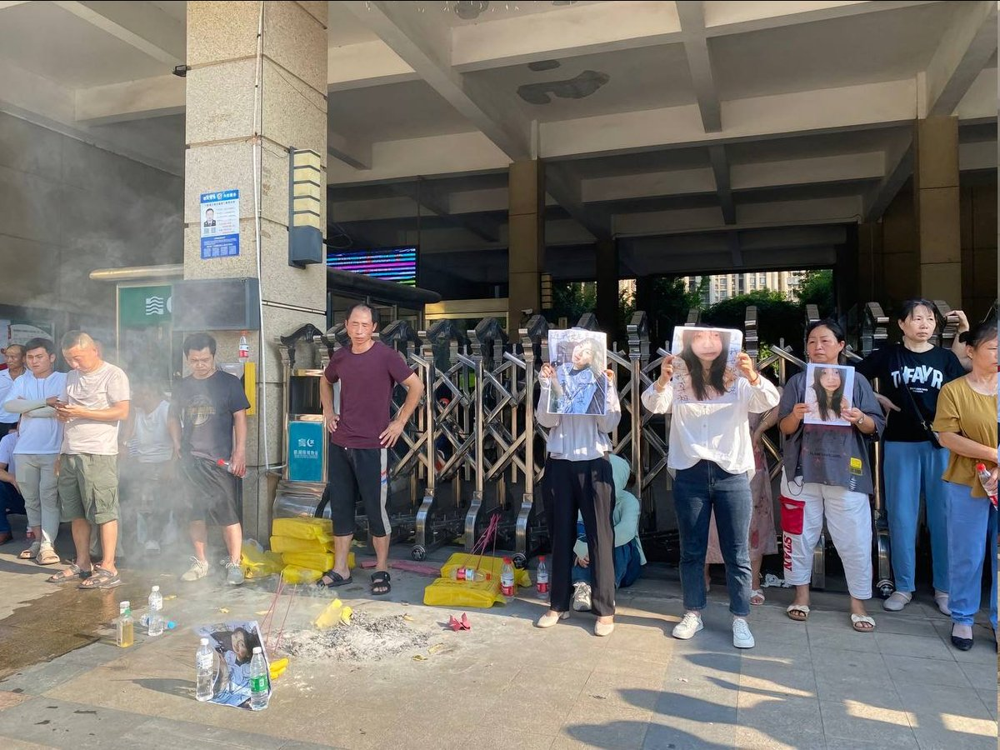

谁将十万横扫三江 北京时间 2023-08-11T10:14:12Z 1689822492725223424 黑龙江五常市遇到洪水灾害的小河里岛村子，一句天灾不责人，注定下次“天灾”还会发生 https://t.co/7PXI06eBxv   谁将十万横扫三江 北京时间 2023-08-11T06:34:37Z 1689767233084706817 RT @whyyoutouzhele: 8月10日晚，石家庄桥西区居委会疑似发生群体事件 https://t.co/wTcPrp1j3E   谁将十万横扫三江 北京时间 2023-08-11T06:46:26Z 1689770206770745346 红衣大妈摔砸苹果店内手机，大骂该牌手机的使用者与购买者都是“外国人的走狗”。
当场激情背诵《满江红》《定风波》《木兰辞》
并且抽查路人背诗，无差别辱骂工作人员和吃瓜群众是“鬼东西”“黑社会”“汉奸”
扬言自己的弟弟是海军陆战队队员,要跟自己代表中国跟美国开战。自己如果有孩子，一定让自己的孩子为国捐躯   谁将十万横扫三江 北京时间 2023-08-11T06:56:03Z 1689772628352159750 湖南新化县维山，进村打狗，养了八年的狗被打死，地方政策，没栓起来就打死 https://t.co/BRzfLCFOjl   谁将十万横扫三江 北京时间 2023-08-11T07:03:43Z 1689774556674932736 RT @OctRevolution17: 【齐齐哈尔体育馆坍塌，杀死学生的是谁？】
我们主张建立独立工会，捍卫工人权利，对工作场所的安全进行日常民主监督的重要性。
https://t.co/2W19kL8cOH
chinaworker.isa@gmail.com
#中共 #社会…   谁将十万横扫三江 北京时间 2023-08-11T07:04:34Z 1689774772128043009 美国夏威夷严重山林大火初步已知造成至少6人死亡，大量民众在撤离疏散，逃生者跳入大海保命。城市废墟景象。 https://t.co/QD2PQu2jxX   谁将十万横扫三江 北京时间 2023-08-11T07:33:45Z 1689782114462711808 成磊：在中国被关押的记者说，她想念阳光

作者：Stephen McDonell
7小时前

截至本周末，一名在中国被拘留了三年的澳大利亚记者首次公开发表讲话。

我想念太阳。在我的牢房里，阳光透过窗户，但我每年只能站在里面10个小时，”程磊在给澳大利亚人民的一封公开信中说，信是给每个月都能和她说话的外交官口述的。

“我不敢相信我住在澳大利亚时经常避开阳光......我回到墨尔本的前两周可能会下雨，”

“我已经三年没见过一棵树了，

澳大利亚驻华大使格雷厄姆·弗莱彻试图进入法院见证诉讼，但没有成功。

甚至她的家人也不知道她被指控了什么，除了据说这涉及传递“国家机密”。

因不明原因被囚禁在中国

在中国，构成国家机密的是一个非常模糊的概念，可能涉及政府认为敏感的任何内容。

今天发布的这封信充满了对她在澳大利亚生活的怀念，她的家人在她10岁时从湖南省移民到这个国家。

她说，1987年，我记得我第一次和家人一起露营，我爸爸开着一辆[澳大利亚]700美元[360英镑]的汽车。

我重温了每一次丛林漫步、河流、湖泊、海滩，游泳和野餐，有迷幻的日落，被星星照亮的天空，以及灌木丛中寂静而秘密的交响乐。

在监狱里，这位前电视主播说，她“秘密说出我在澳大利亚参观和开车经过的地方的名字”。

在她描述的“一封写给2500万人的情书”中，程女士说，她回忆起陌生人和朋友的善良，这种善良的记忆“现在又回到了我身边，并在监狱里恢复了我”。

她说，她怀念海盐、黑色幽默、昆士兰热带和西澳大利亚永无止境的蓝天，以及脚趾间的沙子。

有人猜测，对程女士的判决被推迟了，这样她的案件就可以在中国政府与澳大利亚同行的交易中作为讨价还价的筹码。

澳大利亚总理安东尼·阿尔巴尼斯被邀请到北京会见习近平。然而，他在国内承受着相当大的压力，在程女士和澳大利亚同胞杨恒军获释之前，他要不去旅行。

她信的结尾可能包含最重要的一行：“最重要的是，我想念我的孩子。”   谁将十万横扫三江 北京时间 2023-08-11T08:04:45Z 1689789916279111680 ☝️ https://t.co/qxYuQcTmFO   谁将十万横扫三江 北京时间 2023-08-11T09:04:04Z 1689804842662084608 江西九江🔥 她15岁，中考完，暑假里曾经的中学同学邀她去县城玩，8月3号出门，8月5号凌晨在九江市坠楼死亡，九江公安调查了三天让我们以自杀结案，把尸体领回去火化，是的，自她死亡后我们看不到尸体，没有拿到结案书我们看不到尸体，我们不接受这个提议，因为她根本没有自杀的动机，我们恳求九江公安能给我们一个事实真相，而不是一个疑点重重的潦草结案。我们恳求大众一起监督，我们只是想要一个真相。 她才15岁，她的人生本该是灿烂绽放而不该是就此凋零。   谁将十万横扫三江 北京时间 2023-08-11T09:07:49Z 1689805786594349056 8月10日江苏常州，金坛吾悦广场，外卖小哥去送单把车停在停车场，被吾悦广场的保安锁车，饿了么和美团摇人过来和保安干仗 https://t.co/cPmmSSeHGH   谁将十万横扫三江 北京时间 2023-08-11T09:09:27Z 1689806200135974912 卡友“一灯”老家的村子一个村就没了14个人！现抖音已下架该视频 https://t.co/dRtuLfbdOy   