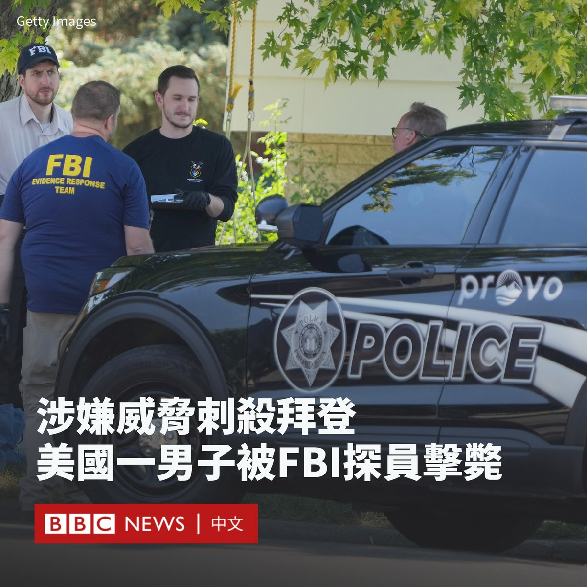
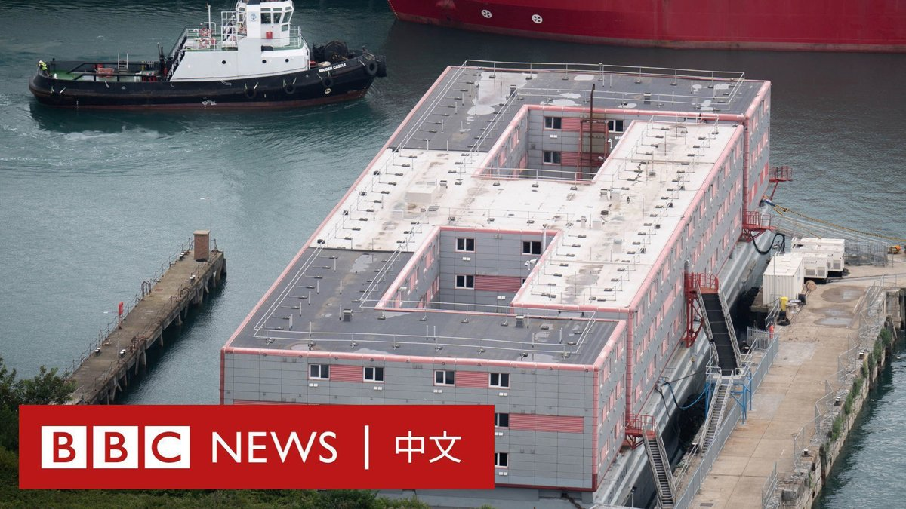
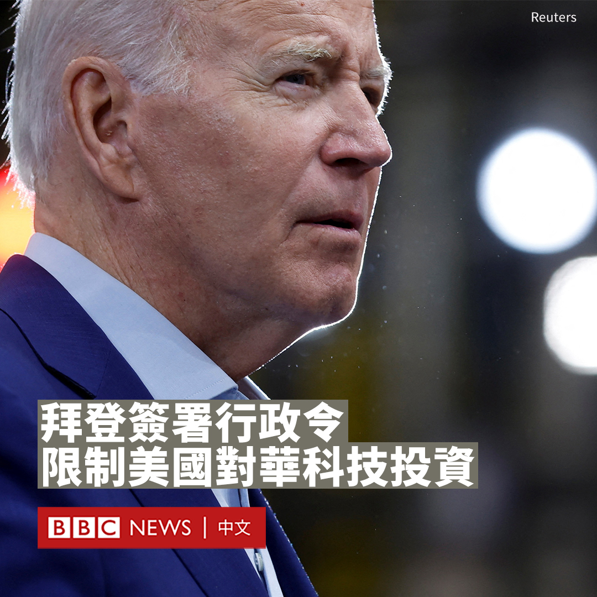
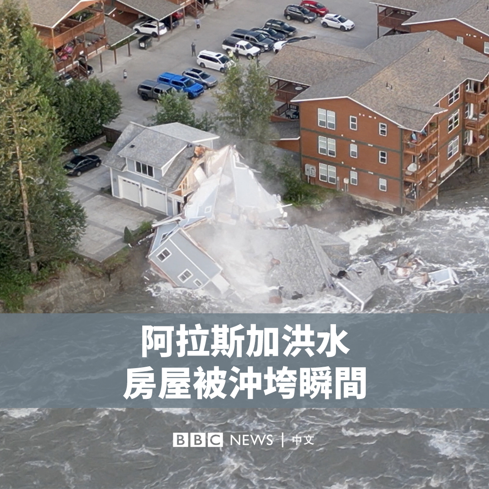
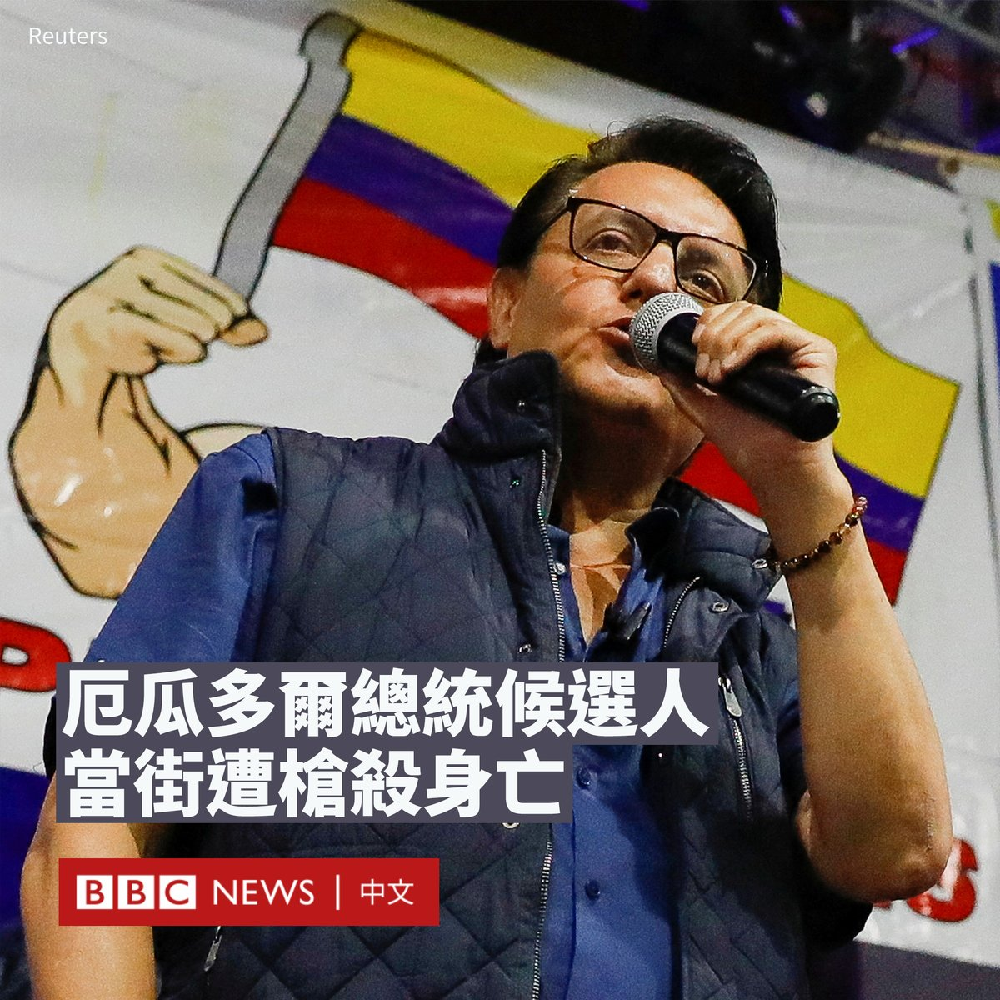

D英国广播公司BBC 北京时间 2023-08-10T20:33:29Z 1689615952172736513 澳大利亚籍记者成蕾被中国收押三年后，首次透过外交官发表公开信，讲述自己状况。 https://t.co/Gx7nOulOSf   D英国广播公司BBC 北京时间 2023-08-10T16:27:20Z 1689554006505340928 【最新消息】美国夏威夷州毛伊岛（Maui）官员表示，当地发生的野火已导致至少36人死亡。

据报道，迅速蔓延的大火摧毁了毛伊岛上历史悠久的小镇拉海纳（Lahaina），许多建筑被夷为平地。由于飓风加剧了火势，一些来不及逃离的人们跳入海中求生。 https://t.co/bw3ZV53Zno   D英国广播公司BBC 北京时间 2023-08-10T17:30:42Z 1689569952981028864 美国一名男子在网上发布针对总统拜登（Joe Biden）和其他官员的暴力威胁帖子后，周三（8月9日）在联邦调查局（FBI）的突击行动中被击毙。

这名男子名为克雷格·罗伯逊（Craig Robertson），住在犹他州盐湖城以南的普罗沃（Provo）。

联邦调查局在声明中说，特工们06:15左右正试图前往他的住家执行搜查令时发生了枪击，但拒绝透露更多细节。

法庭文件显示，罗伯逊在社交媒体上发帖威胁拜登，以及正在对前总统特朗普（Donald Trump）提起刑事指控的检察官阿尔文·布拉格（Alvin Bragg）等官员。

“我听说拜登要来犹他州。翻出我的老吉利服（Ghillie suit；一种类似灌木丛的伪装服），擦亮M24狙击步枪。”罗伯逊在脸书上写道。起诉书将该帖子形容是对拜登的“真实威胁”。

据报道，罗伯逊在两个Facebook账户上发布了类似数十条暴力信息和武器照片，一直持续到周二（8月8日）。当时他写道：“也许犹他州本周会出名，因为狙击手在这里干掉了马克思主义者拜登。”

起诉书称，罗伯逊今年3月在特朗普拥有的社交网络“Truth Social”上发布了针对检察官布拉格的威胁信息，这引起了联邦特工的注意。

联邦调查局探员随后前往寻找该嫌犯，但他告诉探员，这篇帖子是一个“梦”，并称“没有搜查令就不要回来！”

拜登将于周四（8月10日）首次以总统身份访问犹他州，他将访问一家退伍军人医院，并在帕克城参加筹款活动。   D英国广播公司BBC 北京时间 2023-08-10T15:14:58Z 1689535795634507776 英国政府准备了一艘能容纳高达500人的住宿船以安置寻求庇护者，但居住条件引起人权团体不满。

有登上船的移民对BBC说，船上的环境让他感觉“就像进入恶魔岛监狱”。 https://t.co/9fnJ18pa5z   D英国广播公司BBC 北京时间 2023-08-10T12:24:00Z 1689492769080000513 美国总统拜登（Joe Biden）周三（8月9日）签署一项行政命令，禁止美国公司对中国部分高科技领域敏感技术的投资。

该行政令指示财政部限制企业在三个领域中对中国实体的投资，包括半导体与微电子、量子信息技术和部分人工智能系统。

政府还将要求美国公司向财政部通报对其他人工智能和半导体技术公司的投资情况。

白宫表示，之所以选择这三类是因为它们在加速发展先进军事、情报、监视和网络能力方面起到关键作用。

中国周四（8月10日）对该限制措施表示“强烈不满、坚决反对”，已向美方提出严正交涉。

中国外交部批评华盛顿“打着国家安全的幌子”，“大搞泛安全化、泛政治化，其真实目的是剥夺中国发展权利，维护一己霸权私利”，是经济胁迫和科技霸凌，违反市场经济和公平竞争原则。

美国政府高级官员表示，这一行政令是基于国家安全考虑，而非经济利益，其涵盖的类别范围也很窄，旨在削弱中国利用美国对其科技公司的投资来提升其军事水平的能力。

该行政令预计不会适用于所谓的证券投资，即公司通过股票市场对公司进行被动投资，而是侧重于私募股权、风险投资和合资企业等主动投资。

财政部表示，该命令只会影响未来的投资，而不溯及以往，但可能会要求企业披露之前的交易。

该行政令不会立刻生效。美国财政部将就限制的具体范围征求公众意见，到最终实施可能需时数月。

中国商务部表示，美国以“去风险”的名义在投资领域搞“脱钩断链”，背离了美方一贯提倡的市场经济和公平竞争原则，影响企业正常经营决策，破坏国际经贸秩序，也扰乱了全球产业链供应链安全。

美国官员则坚称，这禁令旨在解决“最迫切的”国家安全风险，而不是要让两国相互依赖的经济脱钩。   D英国广播公司BBC 北京时间 2023-08-10T13:51:09Z 1689514703729430528 台湾副总统赖清德即将启程出访台湾邦交国巴拉圭，他此行将绕开华盛顿，过境纽约和旧金山。

从李登辉到赖清德，台湾高级官员“过境美国”时，会到访哪个城市、待多久、与谁碰面、会不会公开活动、北京又会如何反应等话题，一直是台美断交40多年来观察台美中关系的特定模式。https://t.co/IRHmxBsAow   D英国广播公司BBC 北京时间 2023-08-10T11:10:53Z 1689474371465957376 美国阿拉斯加州首府朱诺附近的一座冰川大坝决堤引发大洪水。一段航拍画面记录了一栋房屋被洪水冲垮的瞬间。 https://t.co/25fvy1zwff   D英国广播公司BBC 北京时间 2023-08-10T10:10:37Z 1689459201968574464 在距厄瓜多尔大选仅10天之际，一名总统候选人周三（8月9日）当街被枪杀身亡。

59岁的总统候选人、厄瓜多尔国民代表大会前议员费尔南多·维拉维森西奥（Fernando Villavicencio）在首都基多出席一次活动后遭到袭击。

他竞选团队的一名成员对当地媒体称，维拉维森西奥正要上车时，一名男子上前朝他的头部开枪。

目击者称，维拉维森西奥身中三枪。

现场画面显示，枪击事件发生后，人们纷纷匍匐在地上寻找掩护，场面混乱。

现任总统吉列尔莫·拉索（Guillermo Lasso）在社交媒体上证实了他的死讯。

厄瓜多尔总统选举定于8月20日举行。

拉索表示，他对这起谋杀事件感到“愤怒和震惊”，并承诺罪犯不会逍遥法外。

厄瓜多尔总检察长办公室周三在社交媒体上表示，一名嫌疑人在枪战中受伤身亡。

由于近期贩毒集团在厄瓜多尔的活动日益猖獗，该国暴力犯罪激增，这也成为总统竞选中的一个核心议题。

在维拉维森西奥遇害之前，曼塔市市长奥古斯丁·英特里亚戈（Agustín Intriago）于7月被杀。   D英国广播公司BBC 北京时间 2023-08-10T07:57:06Z 1689425603764633600 西非的尼日尔成为非洲萨赫勒地区又一受到军事统治的国家，整体地区安全堪忧，其影响并不仅仅局限于非洲。 https://t.co/BspA5OsdA0   