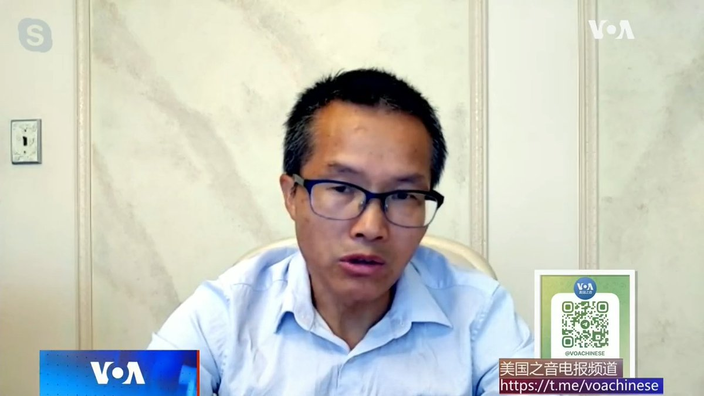
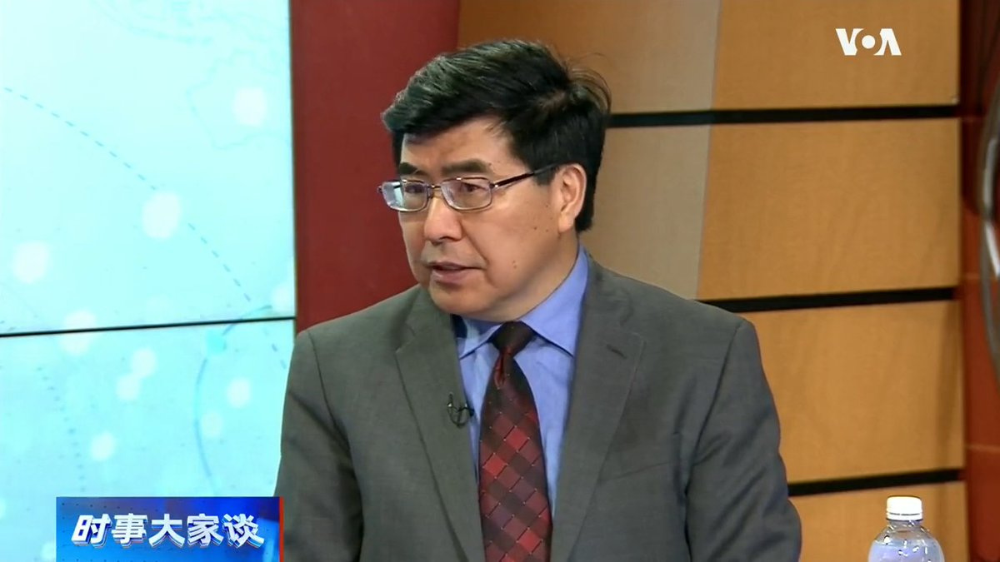

美国之音中文网 北京时间 2023-08-10T05:44:04Z 1689392124738023424 拜登总统签署行政命令，禁止美国人投资于中国某些敏感技术 https://t.co/Yb8Dmd8ojq   美国之音中文网 北京时间 2023-08-10T05:57:32Z 1689395513152700417 尽管经济步履蹒跚，中国不太可能中断对朝鲜的援助 https://t.co/k0j2ueYQmV   美国之音中文网 北京时间 2023-08-10T06:02:00Z 1689396636500262914 中国留学生在伦敦涂鸦“社会主义核心价值观”标语，称是“反殖民西方的虚假自由”。“中国战略分析智库”研究员邓聿文说，在民主国家可以表达各种思想，包括反民主思想，但是中国涂鸦作者以霸道行为让别人付出代价，即使在自由主义故乡英国也超出了自由的边界。 #完整版：https://t.co/1AepXBmyXC https://t.co/sN9Niu9PpU   美国之音中文网 北京时间 2023-08-10T06:12:03Z 1689399166198546434 美国疾控中心认为厄里斯的增加不代表新冠变异病毒的主要改变 https://t.co/hJvMM8HPe5   美国之音中文网 北京时间 2023-08-10T02:59:02Z 1689350591699386368 白宫周三出台行政命令，限制美国对华投资。纽约城市大学政治学教授夏明说，美国会对关键领域的咽喉点实行很多控制，明显减少中国享受的利好，硅谷开发的东西，北京中关村第二天醒来就得不到了。 #完整版：https://t.co/1AepXBmyXC https://t.co/s88DwzcMlF   美国之音中文网 北京时间 2023-08-10T03:14:59Z 1689354607867142144 一群来自日本的霹雳舞者目前正在法国访问。他们为当地观众表演，同时也为明年的巴黎奥运会热身。霹雳舞和滑板、冲浪、攀岩一道，将成为2024年巴黎夏季奥运会的新增项目。霹雳舞于上世纪70年代起源于美国纽约。 https://t.co/goB5PbTQ94   美国之音中文网 北京时间 2023-08-10T03:32:03Z 1689358900729098241 莫斯科东北一座城镇的工厂发生大爆炸 https://t.co/dJNevzVuVA   美国之音中文网 北京时间 2023-08-10T00:05:02Z 1689306805896400896 拜登总统即将发布行政命令，限制对中国敏感技术公司投资 https://t.co/IMVvhk01JG   美国之音中文网 北京时间 2023-08-10T01:06:03Z 1689322158026317824 美国商务部：460多家公司对美国527亿美元半导体芯片补助款有兴趣 https://t.co/wg2Cwg1lrx   美国之音中文网 北京时间 2023-08-10T00:21:35Z 1689310969548394496 佛罗里达州一幸运者赢得15.8亿美元“超级百万”彩票头奖 https://t.co/wDdNDWsg1X   