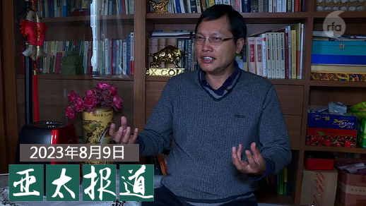
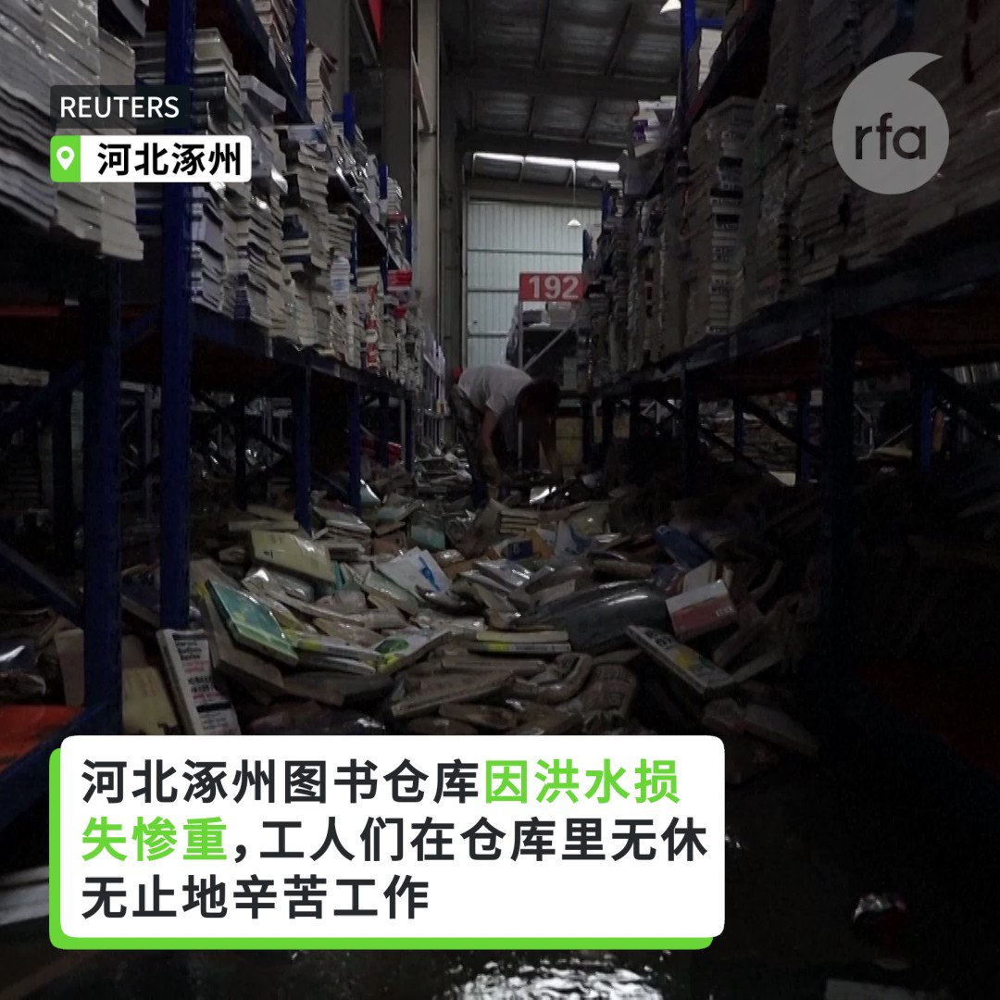
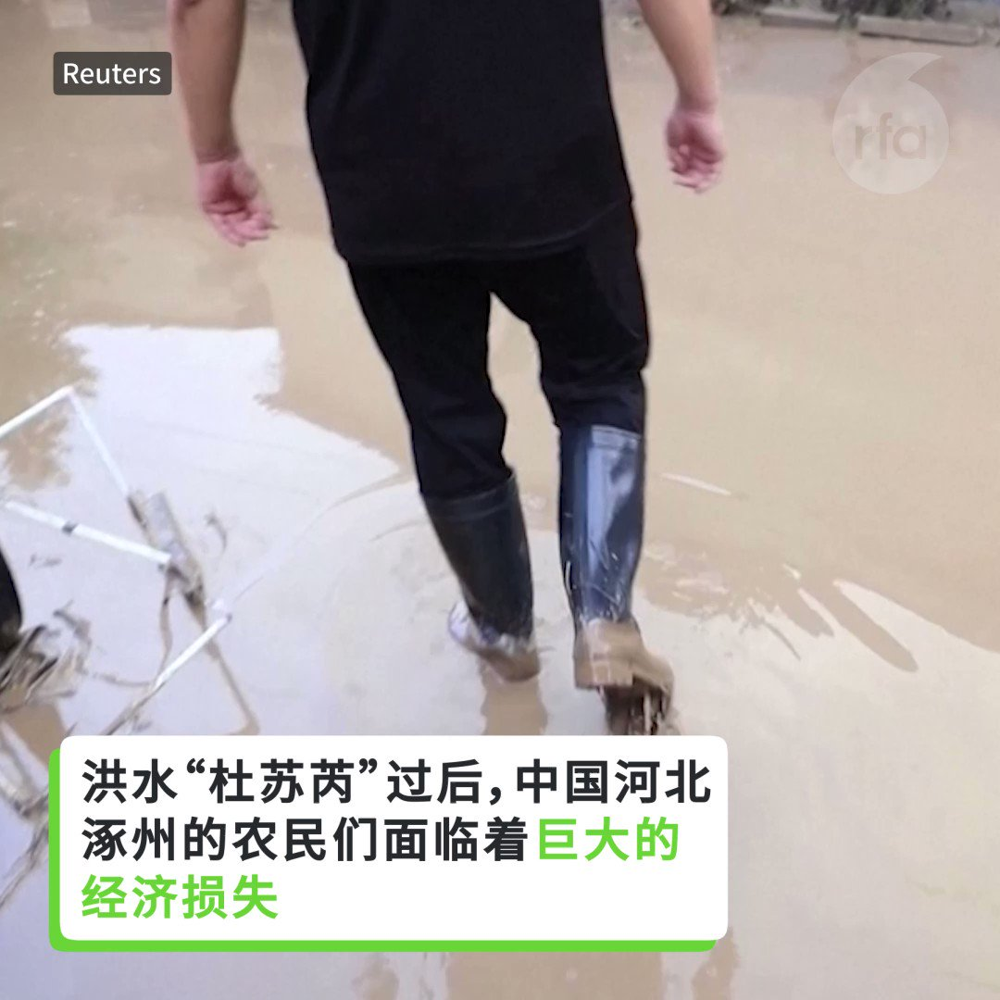

自由亚洲电台 北京时间 2023-08-10T08:50:29Z 1689439035737976832 RT @RFA_Chinese: #伦敦涂鸦墙事件 引发全球热议，然而相关话题却在中国网络被禁，反共的"二次创作"图片也被屏蔽。 《环球时报》前主编胡锡进发文想息事宁人，然而爱国网红及海外艺术家的批评仍然此起彼落。https://t.co/IgXUdA4QJp   自由亚洲电台 北京时间 2023-08-10T09:54:51Z 1689455237742923776 RT @RFA_Chinese: 中国经济学者 #胡星斗 最近向高层提出让中国走出当前局势困境的十条建议引发网络热议。他在建议中提到重申"以经济建设为中心"、回归邓小平的"韬光养晦"，坚持"领导人任期制"以及"让民企成为市场主体"等。

这些与当前中共政策完全背道而驰的建议有任…   自由亚洲电台 北京时间 2023-08-10T09:55:16Z 1689455342998958080 RT @RFA_Chinese: 美国拜登政府预计将发布一一项行政命令，禁止美国风险投资和私募股权投资公司投资部分中国科技企业，这一命令反映华盛顿方面阻止中国开发尖端科技的努力进一步升级。 https://t.co/56IbMdLswu   自由亚洲电台 北京时间 2023-08-10T06:21:24Z 1689401518603304962 带头在东伦敦红砖巷社会主义核心价值观涂鸦的王汉铮称自己被网暴，家庭住址、电话号码和父母信息全部被晾在网上。他恳请广大愤怒网友“不要这样”，并说愿一人承担所有质疑和后果。

您认为，网友的这种做法是否合理？ https://t.co/St6F9Q4ywD   自由亚洲电台 北京时间 2023-08-10T06:27:55Z 1689403161176584193 【#亚太报道（2023-8-9）】
欢迎收听和订阅播客【亚太报道】 https://t.co/MjLNSvVMqc

北京经济学者 #胡星斗 提 #摆脱困局10条/#乔鑫鑫 在 #老挝 被捕现囚禁湖南/美华裔水兵遭指控波及在役华人/#港警 赴加参赛遇示威/中国 #运动式反腐 波及跨国企业 https://t.co/rrq6GjXlK9   自由亚洲电台 北京时间 2023-08-10T06:28:44Z 1689403366194163712 涿州是中国出版业的重要枢纽，在涿州遭受特大洪水袭击后，许多出版公司和书库的仓库变成了漂浮的书海，损失估计数百万美元。 https://t.co/B9owOGpiFi   自由亚洲电台 北京时间 2023-08-10T09:02:26Z 1689442045960638464 RT @RFA_Chinese: 带头在东伦敦红砖巷社会主义核心价值观涂鸦的王汉铮称自己被网暴，家庭住址、电话号码和父母信息全部被晾在网上。他恳请广大愤怒网友“不要这样”，并说愿一人承担所有质疑和后果。

您认为，网友的这种做法是否合理？ https://t.co/St6F9Q…   自由亚洲电台 北京时间 2023-08-10T00:40:06Z 1689315630263283712 专栏 | #纵横大历史：第五十九讲　派出工作组

在上一讲中，我们谈到了文革初期成为政治批判对象的“三家村”是怎么回事。在今天的这一讲当中，我们会继续顺着时间顺序，来讲文革运动蔓延的情况。 https://t.co/WbqD7wWMla   自由亚洲电台 北京时间 2023-08-10T02:33:09Z 1689344079338102784 洪水“杜苏芮”过后，中国河北涿州的农民们面临着巨大经济损失。43岁的鸡蛋和山羊养殖户周路，在洪水袭来之前，羊群数量曾达到 1500只，现在只剩20-30只。在过去的三天里，他一直在清理山羊尸体和淤泥，鸡蛋加工厂也遭受了巨大损失。 https://t.co/GUG4UwGDF1   自由亚洲电台 北京时间 2023-08-10T02:17:09Z 1689340052164476928 据日本共同社消息，中国方面已经告知日本方面，9月在印尼召开的东盟会议期间，考虑安排日本首相岸田文雄与中国国务院总理李强进行会谈。 https://t.co/7iLhSkOg5Q   自由亚洲电台 北京时间 2023-08-10T02:51:29Z 1689348691357028352 美国检方日前对两名华裔海军水兵提起指控，二人涉嫌向中国情报机构泄露美军机密。有学者表示，该事件情节恶劣，虽不至于掀起社会层面的反华裔浪潮，但会影响在敏感领域就业的华裔群体。 https://t.co/pspTtuBEvL   自由亚洲电台 北京时间 2023-08-10T04:04:29Z 1689367063767474177 中国经济学者 #胡星斗 最近向高层提出让中国走出当前局势困境的十条建议引发网络热议。他在建议中提到重申"以经济建设为中心"、回归邓小平的"韬光养晦"，坚持"领导人任期制"以及"让民企成为市场主体"等。

这些与当前中共政策完全背道而驰的建议有任何被采纳的可能吗？ https://t.co/uggLAwjluK   自由亚洲电台 北京时间 2023-08-10T00:38:58Z 1689315341472821248 美国拜登政府预计将发布一一项行政命令，禁止美国风险投资和私募股权投资公司投资部分中国科技企业，这一命令反映华盛顿方面阻止中国开发尖端科技的努力进一步升级。 https://t.co/56IbMdLswu   自由亚洲电台 北京时间 2023-08-10T02:17:57Z 1689340254556495872 评论 | #胡平：#河北洪灾 谁之罪？ https://t.co/jgYN3F56Cn   自由亚洲电台 北京时间 2023-08-10T00:07:47Z 1689307497528737792 继2021年2月后， #中国 再次出现 #通缩 迹象。中国国家统计局表示，随着市场需求逐步扩大，物价将逐步回升。不过，有经济学者认为，市场供大于求与中国的经济政策过于短视有关。若商品价格持续下降，恐怕会造成恶性循环。 https://t.co/HvL25bmqeE   自由亚洲电台 北京时间 2023-08-10T00:09:35Z 1689307947288158209 专栏 | #劳工通讯：安徽马鞍山市慈湖高新区金星钛白集团有限公司发生有限空间作业事故，造成工人死亡 (五) https://t.co/I5UXbUtdJT   