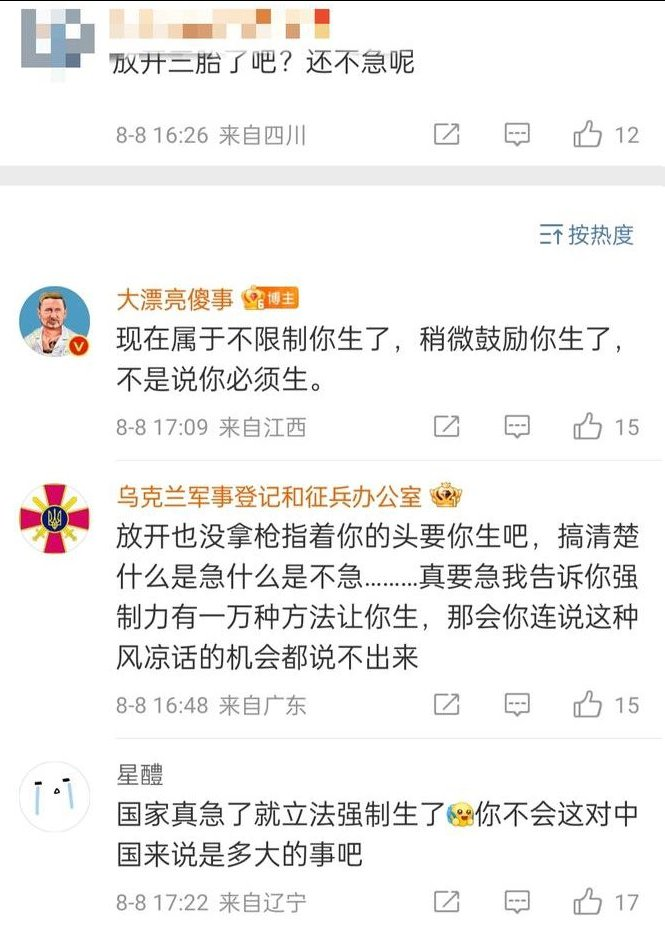
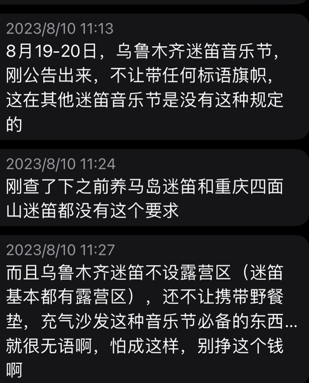
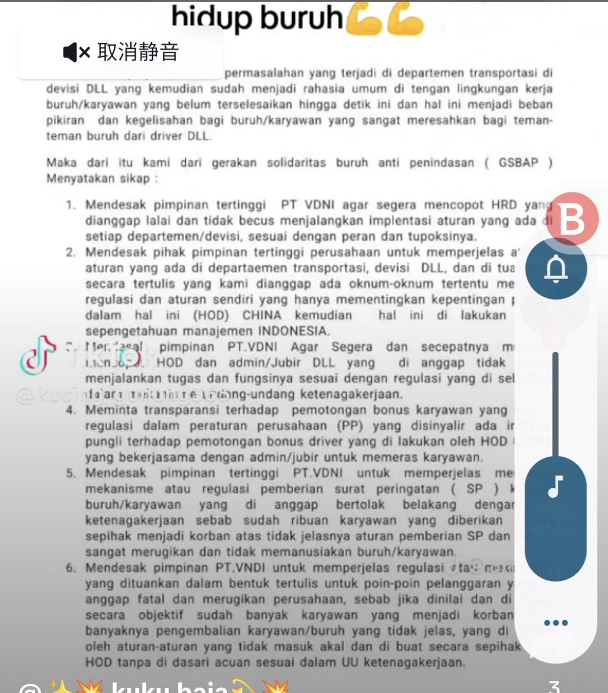
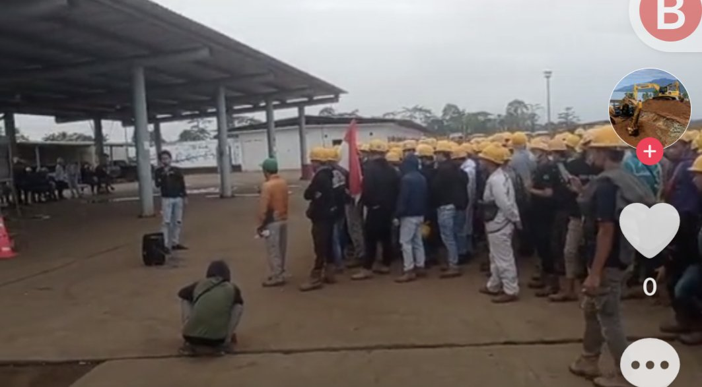
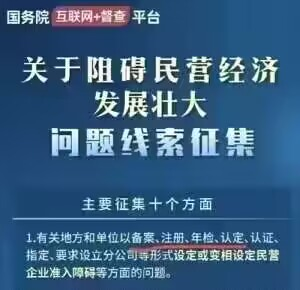
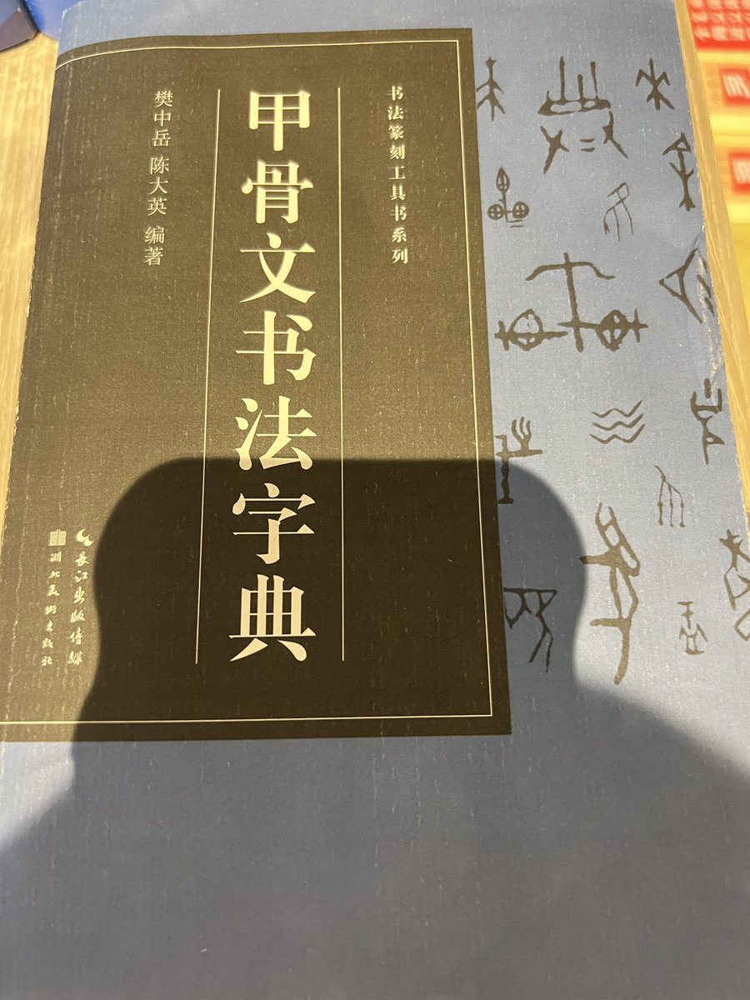
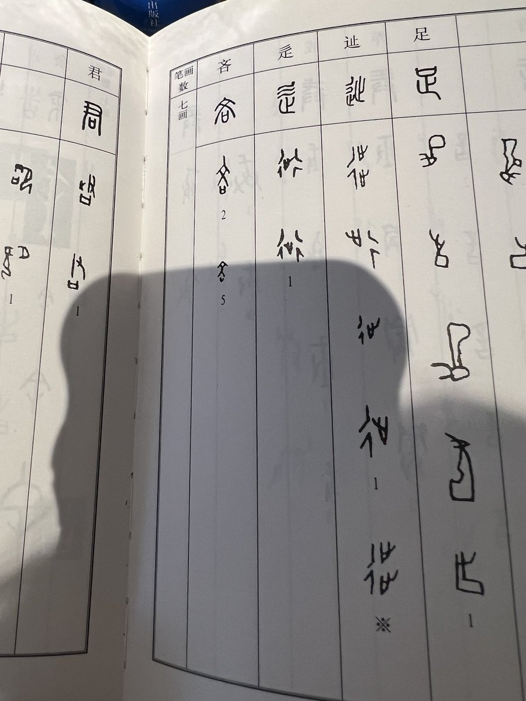
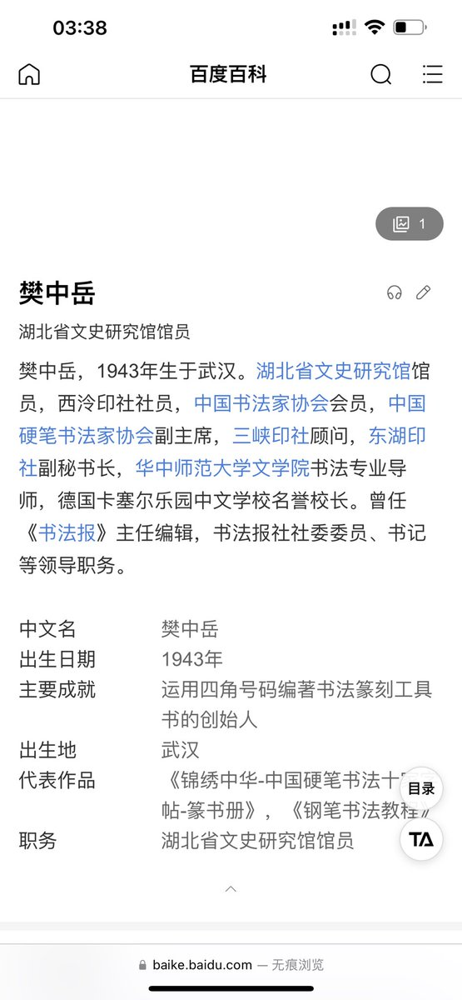
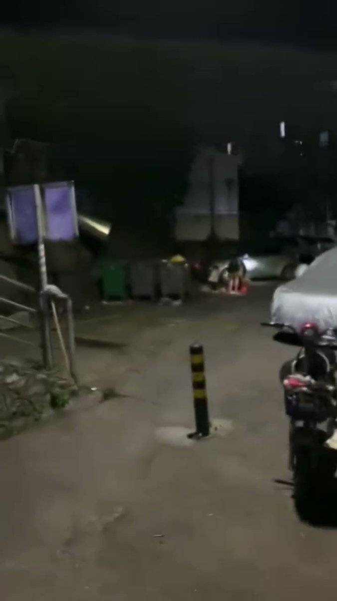

谁将十万横扫三江 北京时间 2023-08-10T21:32:56Z 1689630915159633920 RT @whyyoutouzhele: 网友投稿
河北保定高碑店政府门口，持续戒严中 https://t.co/koSSa1EEmO   谁将十万横扫三江 北京时间 2023-08-10T21:38:43Z 1689632369110900736 你不会觉得立法强制生育是多大的事吧？——粉蛆 https://t.co/IR1S4N8dhS   谁将十万横扫三江 北京时间 2023-08-10T19:46:44Z 1689604186500112384 RT @whyyoutouzhele: “草木皆兵”
网友投稿
8月10日，乌鲁木齐迷笛音乐节宣布将不允许带任何标语旗帜进场 https://t.co/AeadWid8bh   谁将十万横扫三江 北京时间 2023-08-10T19:48:26Z 1689604614746992640 RT @laodongqushi: 链接：https://t.co/8CKoNk4CJf   谁将十万横扫三江 北京时间 2023-08-10T16:06:07Z 1689548668100104193 RT @haveafreeheart: 我看社媒上对TFBOYS开演唱会引起的乱象多持批评态度，尤其是当爆出粉丝为一张门票甘愿献身黄牛时，更是引爆了舆论。

放在以前我也会觉得追星追到这种程度简直不可理喻，现在不了，我理解年轻人了，无论男女，无论要做什么事，我都理解了。…   谁将十万横扫三江 北京时间 2023-08-10T16:07:41Z 1689549064722141184 RT @chinalaborwatch: 印尼工人罢工抗议中国公司侵犯工人权益 https://t.co/FlGxJgHFQc   谁将十万横扫三江 北京时间 2023-08-10T11:58:24Z 1689486329397280768 怎么说呢，就挺快的 https://t.co/LmXmsp4Yjg   谁将十万横扫三江 北京时间 2023-08-10T12:11:04Z 1689489514375618561 RT @LiangciXue93: 中国大量国学专家与高校无关。中国高校文科是在养猪。 https://t.co/MqCixwTieq   谁将十万横扫三江 北京时间 2023-08-10T10:27:34Z 1689463470386003968 RT @whyyoutouzhele: 推特收入大公开！作为中文推特头部账号 六个月可以赚多少钱 【李老师不是你老师】
https://t.co/1CC1KAvtvz   谁将十万横扫三江 北京时间 2023-08-10T10:28:03Z 1689463593119690752 #同志生存环境报告# 

遭反同势力举报，星巴克下架了“爱是一道光”纪念款彩虹咖啡杯系列产品。

6月份，咖啡企业星巴克为支持同志权益上架“爱是一道光”纪念款彩虹咖啡杯系列产品，在宣传文案中星巴克表示：“夏日彩虹系列星杯上新，爱是一道光，折射出不同的颜色。”呼吁公众支持同志权益。    

星巴克一直以来坚定支持和致力于保障性少数群体权益，自2011年以来星巴克便声明“友同”立场，2012年星巴克总部为美国承认同性婚姻法案声援，2013年星巴克总部年会上CEO舒尔茨怼恐同人士：“支持同性恋权益是正确决定，是尊重多元平等的基本原则，星巴克业绩很好，如果你认为其它公司好，你可以买别的。”，2014年星巴克加拿大推出公益广告支持同志权益，2015年星巴克中国开始声明支持同志权益，2019年星巴克中国上架首款“爱就是爱”纪念款彩虹咖啡杯系列产品表示：“爱的颜色不止一种。”   谁将十万横扫三江 北京时间 2023-08-10T04:08:00Z 1689367947373076480 广东，凌晨四点一个宝妈带一个小孩在翻垃圾桶捡瓶子 https://t.co/vI4izjvZ8N   