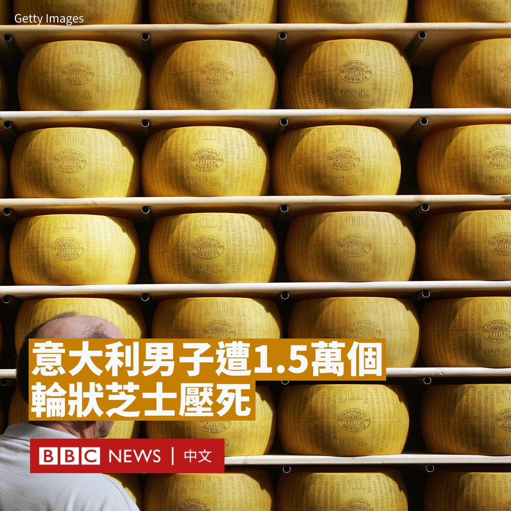
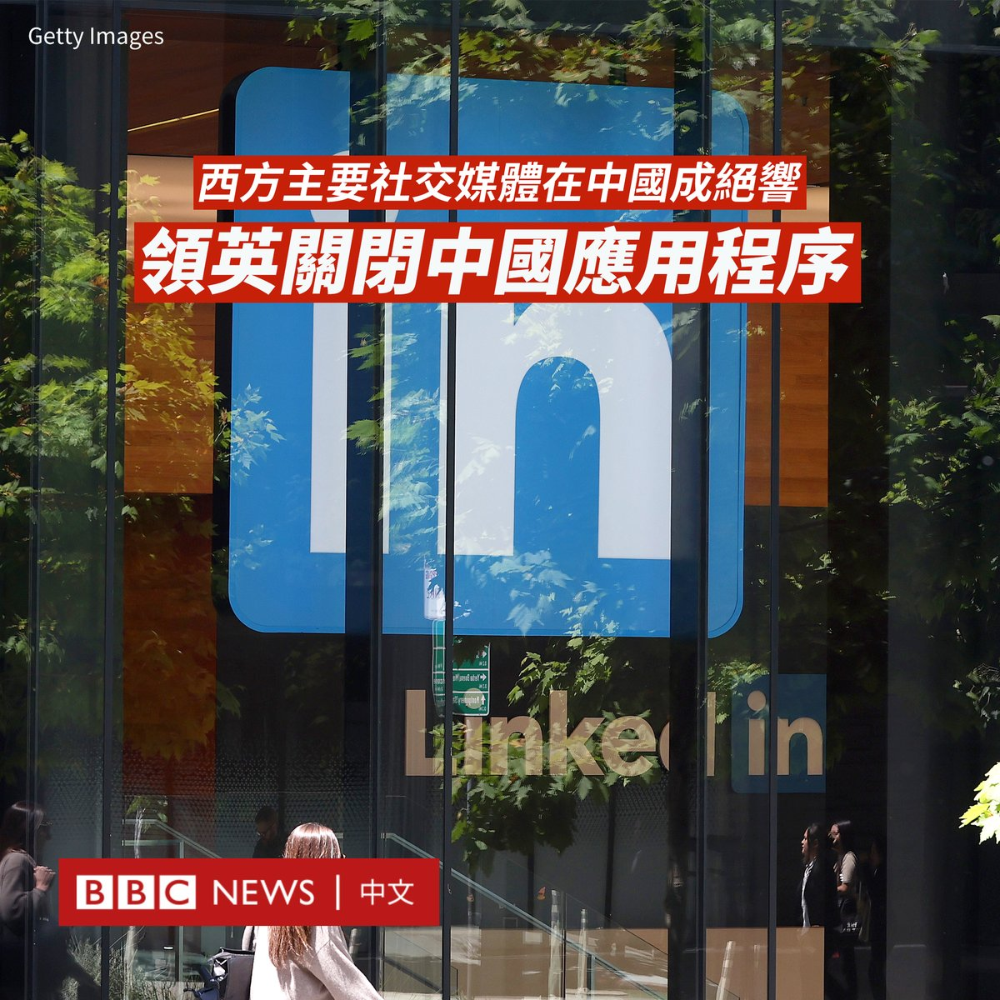
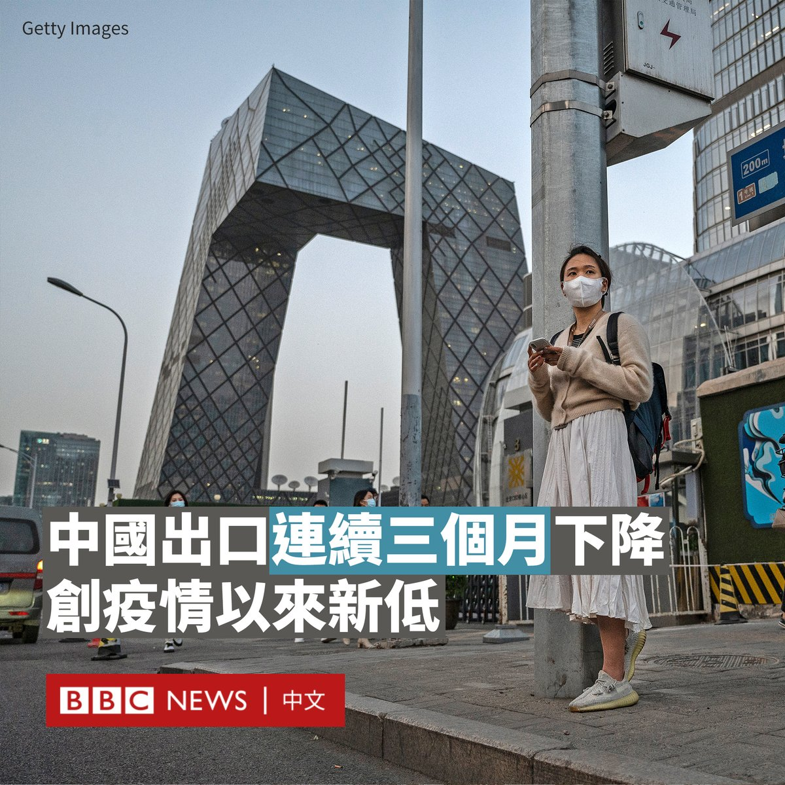
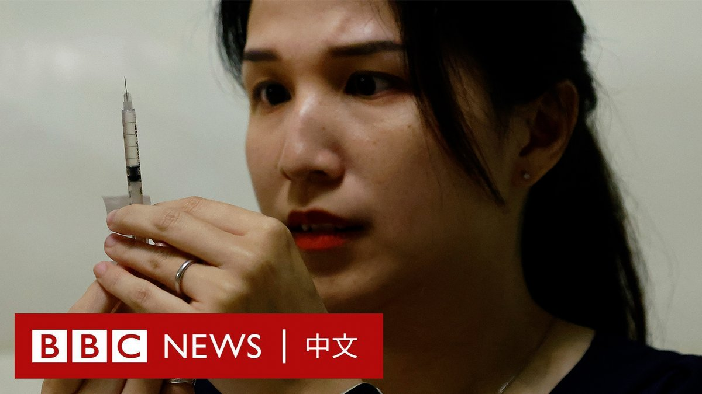

D英国广播公司BBC 北京时间 2023-08-09T19:53:12Z 1689243427861581824 意大利北部一家芝士（奶酪）工厂的老板被1.5万个轮状硬质芝士压死，救援人员花了12小时才找到他的遗体。

据消防员称，74岁的贾科莫·基亚帕里尼（Giacomo Chiapparini）上周日在位于意大利北部伦巴第大区罗马诺（Romano di Lombardia）的芝士仓库中，突然其中一个货架断裂并坍塌，引发了多米诺效应，导致仓内万余个芝士倒塌。

这些芝士每个重约40公斤，直接把基亚帕里尼“埋没”。

据报导，其中一些芝士从约10米高坠落。一位当地居民告诉意大利媒体，坍塌的声音“像雷声一样”。

据估计，这次事故造成的经济损失达到了700万欧元。

基亚帕里尼的邻居跟意大利媒体表示，他是个“慷慨大方”的人。他们还说，他几十年前失去了一个孩子。

这个位于伦巴第地区的仓库在米兰以东约50公里，里面存放着总共2.5万个格拉娜·帕达诺芝士（Grana Padano）。这是意大利一种经过精磨的特硬质芝士，类似帕马森芝士（Parmesan）。   D英国广播公司BBC 北京时间 2023-08-09T17:57:24Z 1689214286197878784 “真正重要的一点是政府能否让私营部门重塑信心，家庭能够外出，多花钱而不是多存款。商界开始投资，这在目前还没有实现。”康奈尔大学经济学教授普拉萨德（Eswar Prasad）说。https://t.co/dsxJGfKB9p   D英国广播公司BBC 北京时间 2023-08-09T10:35:49Z 1689103158411444224 【最新消息】中国北京市政府表示，有33人在7月29日至8月2日台风“杜苏芮”引发的暴雨和洪灾中死亡，其中包括五名救援人员，还有18人失踪。

这是中国首都十多年来面临的最严重洪灾。2012年，北京有79人因一场暴雨而遇难。

与北京相邻的河北省宣布至少有10人在洪灾中丧生，18人失踪。东北吉林省的舒兰市有14人死亡，1人失踪，其中包括该市一名副市长。   D英国广播公司BBC 北京时间 2023-08-09T16:23:44Z 1689190715761610752 正在台湾访问的日本前首相、执政党自民党副总裁麻生太郎周二（8月8日）与台湾总统蔡英文会面，并在台北一个论坛发表演讲。

据台湾中央社报导，麻生太郎借用日本知名漫画《海贼王》主角路飞（又译：鲁夫）作比喻，表示未来希望日本和台湾继续加强合作。

麻生太郎指，路飞一次都没有背叛过朋友，也没有在朋友危难时见死不救，与周遭人士维持良好的人际关系。他希望台湾跟日本之间的关系，也能够持续发展下去。

麻生太郎还提及对于台海爆发战争的担忧，他称，需要有“强大的威慑能力”才能避免战争，而最关键是要让对手充分了解自身有“不惜动武维护台海稳定安全的明确意志”。

他还表示，日本、美国和其他国家需要表现出坚定决心，在台湾受到攻击时出手保卫台湾。

蔡英文表示，日本是台湾的重要合作伙伴，过去几年双方伙伴关系持续深化，去年双边贸易总额创下历史新高，今年双方互访人数也可能创新高。

麻生太郎的言论引发北京的抨击。中国驻日本大使馆周三（8月9日）指责其“干涉中国内政，破坏台海稳定”，并表示已经向日本提出严正交涉。

“如果日方一些人执意把中国内政事务同日本的安全保障捆绑在一起，将再次把日本带入歧途。”中国驻日本大使馆写道。

麻生太郎是自民党元老之一。过去除担任日本首相外，还曾担任过日本的副首相及财务大臣。他被视为在对中国关系及二战历史上持强硬立场。

麻生太郎此访自1972年日本与台湾断交以来，现任自民党最高级别官员访问台湾。他此行还包括前往五指山公墓，吊唁前总统李登辉，以及与副总统赖清德会面。   D英国广播公司BBC 北京时间 2023-08-09T13:58:04Z 1689154054491082752 微软旗下社交平台领英（LinkedIn）周三（8月9日）停止在中国的业务，放弃了耕耘近十年的中文平台，这也标志着西方主要社交媒体离开了中国市场。

目前，在中国境内输入领英的域名，将会直接跳转到一个为企业客户提供服务的页面，而手机上的“领英职场”则显示“无法加载数据”。

作为全球最大的职业社交网站，领英是少数在中国成功运营社交媒体平台的美国科技公司之一。2014年，领英推出了中文版网站。

在受到严格监管和审查的中国的互联网上，领英在2021年进一步推出本土化的求职平台“领英职场”，理由是在中国的经营环境“更具挑战性”，要求也更严格。

与国际版相比，“领英职场”的用户只能在上面进行搜索，而不能像国际版用户那样发贴或分享文章。

除了监管压力，领英还面临着脉脉、BOSS直聘等中国本土品牌的激烈竞争。创办本土化平台的决定似乎并未挽回领英在中国的危机。

今年5月9日，领英发布公告，宣布“领英职场”将于8月9日起正式停止服务，用户的个人账号数据将被删除。   D英国广播公司BBC 北京时间 2023-08-09T11:55:31Z 1689123216344977408 中国海关总署周二（8月8日）公布数据显示，中国7月出口同比下降14.5%，这是该国出口连续三个月下降，跌幅超出预期。

该数字是中国自2020年3月以来面临的最大降幅。彼时新冠疫情在全球扩散，导致全球供应链混乱。

官方数据还显示，进口下降12.4%，亦是连续五个月下降。实现贸易顺差806亿美元。

这意味着，尽管北京采取多项措施希望重振增长，但经济反弹仍然疲软，这可能由国外对中国制造产品的需求下降、国内需求下降共同导致。

今年6月，中国出口同比下降12.4%，进口下降6.8%，贸易顺差706.2亿美元。5月，出口同比下降7.5%，进口同比下降4.5%。

今年3月，中国出口意外急增14.8%，扭转了五个月来持续下滑的趋势，进口同比降幅大幅收窄至1.4%。

中国贸易数据在去年7月仍相当靓丽，出口同比增长18.0%，进口额同比增2.3%，但自8月开始增速显著放缓，10月出口转为下降。   D英国广播公司BBC 北京时间 2023-08-09T10:10:27Z 1689096774303256576 “为自己的未来买个保险，怕年纪越来越大，可能不好生或者生不出来。”

在为期两周的冻卵过程中，33岁的“薇薇安”每天都要给自己注射荷尔蒙药物。

在台湾，单身女性可以冷冻卵子，但仅在异性婚姻中使用卵子才是合法的。虽然大约需8至12万新台币，但仍吸引了一些担忧自己年龄日益增长的单身女性参与。 https://t.co/IOxNZgLhfy   