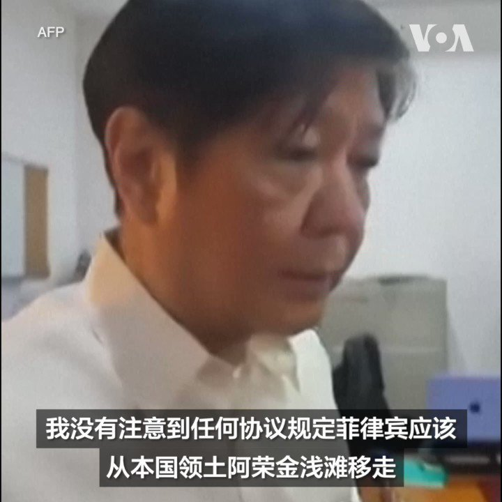
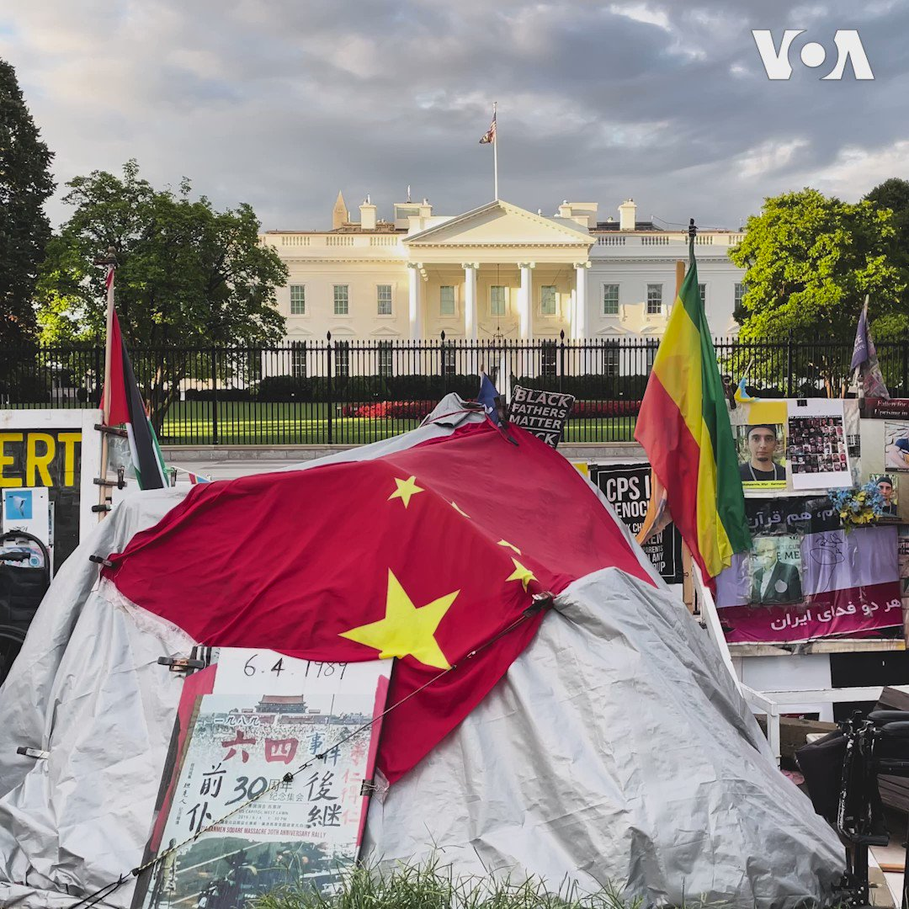
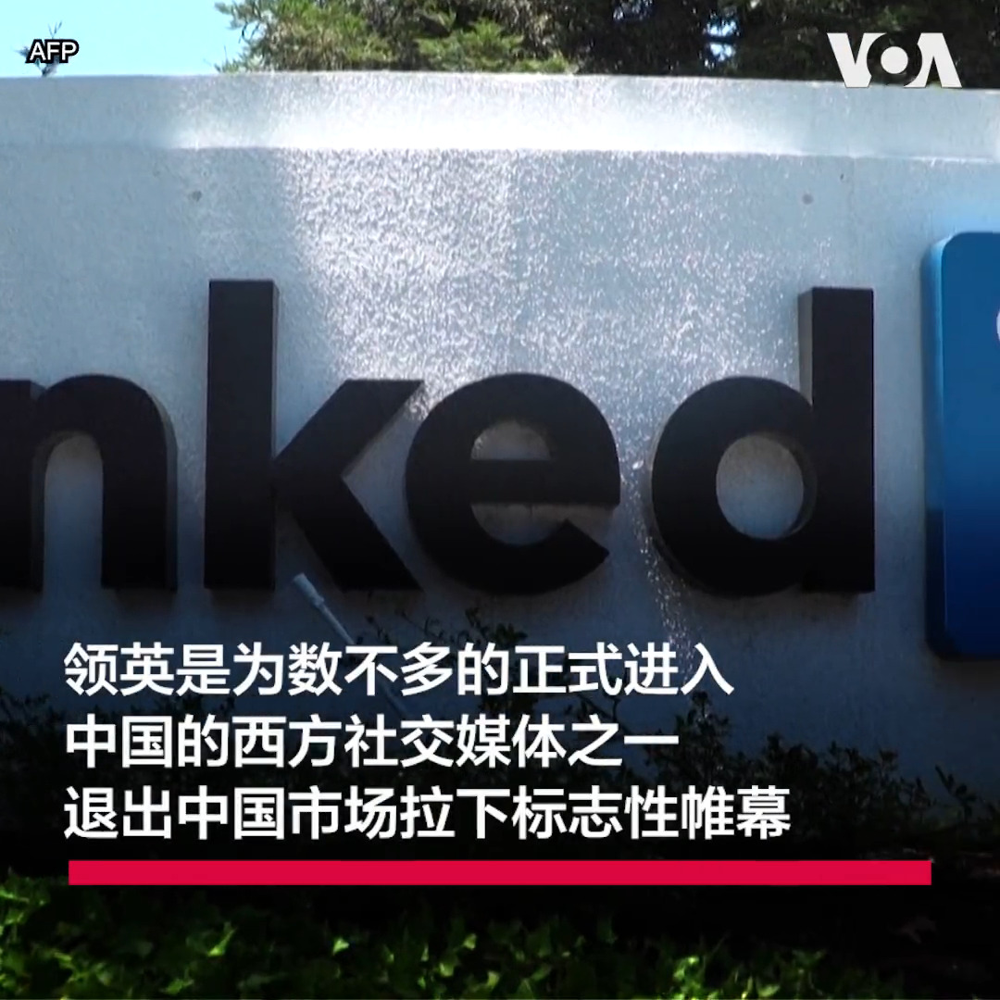
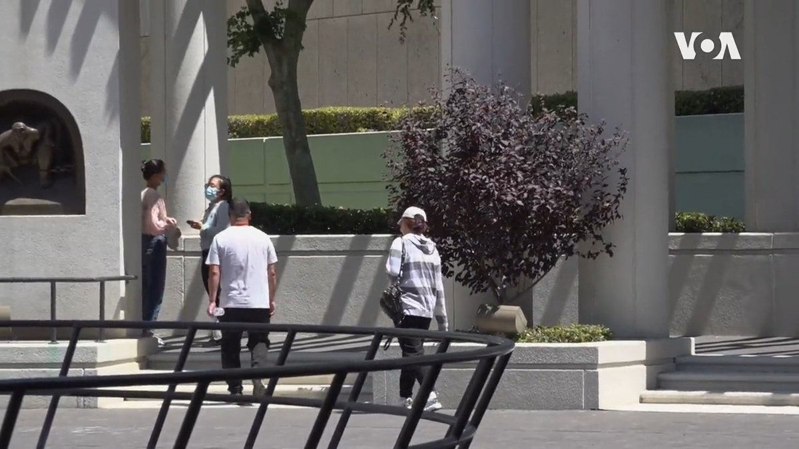
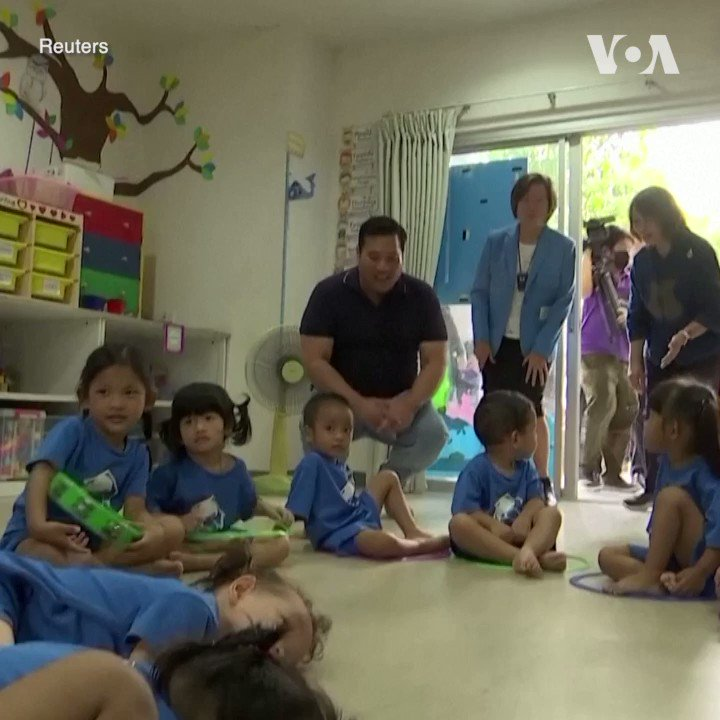
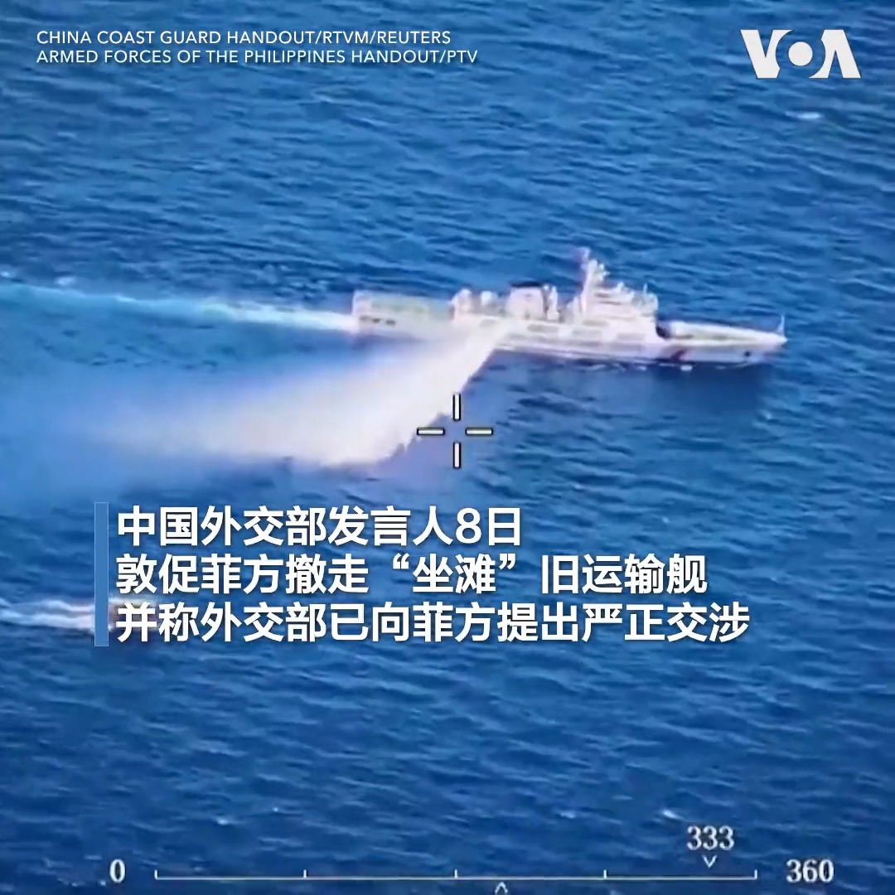

美国之音中文网 北京时间 2023-08-09T21:59:05Z 1689275106722213888 法国东部一度假屋发生火灾，已找到九具尸体 https://t.co/gvBfiOr6E9   美国之音中文网 北京时间 2023-08-09T22:17:15Z 1689279681235738626 菲律宾总统费尔迪南德·小马科斯8月9日说，菲律宾和中国之间没有签署任何协议，要求菲方从本国领土移走本国船只。一天前，中国外交部发言人说，菲律宾政府多次承诺拖走“非法‘坐滩’的军舰，但迄未实施”。 https://t.co/PXQK30NrQ3   美国之音中文网 北京时间 2023-08-09T18:01:14Z 1689215252616126464 与中国关系紧张之际 拜登称即将访问越南推动双边关系升级 https://t.co/LGWvmUMB9r   美国之音中文网 北京时间 2023-08-09T19:36:01Z 1689239104913870848 中国报道—金哲：河北涿州水灾反映的当今中国政治。报道全文：https://t.co/fc9gp7sGjm https://t.co/kMiLNEYRKR   美国之音中文网 北京时间 2023-08-09T19:42:03Z 1689240622685888513 以家人要挟威胁异议人士封口 中共跨国镇压肆无忌惮 https://t.co/Yur75sFHGE   美国之音中文网 北京时间 2023-08-09T18:15:03Z 1689218727425064960 台湾副总统即将赴美之际 台国防部称解放军本周二度大规模扰台 https://t.co/9y9WyAHhDD   美国之音中文网 北京时间 2023-08-09T14:36:35Z 1689163747443834880 中国产蜂巢式网路模组藏安全隐患 美国会议员要求联邦通信委员会检视风险 https://t.co/YQ7JCv60WA   美国之音中文网 北京时间 2023-08-09T14:50:33Z 1689167263818289152 马尼拉誓言加强南中国海巡逻 五角大楼重申予以支持 https://t.co/5oSFhZRv5T   美国之音中文网 北京时间 2023-08-09T15:05:32Z 1689171035458093056 五角大楼称放心与日本分享敏感军事情报 https://t.co/n5BWllA8yT   美国之音中文网 北京时间 2023-08-09T15:20:03Z 1689174688294113280 白宫据信周三宣布对中国技术投资限制 媒体曝禁令范围缩减 https://t.co/HhjtDS8Kku   美国之音中文网 北京时间 2023-08-09T16:17:32Z 1689189155623014400 若平壤使用核武 韩国军方称将凭借压倒性的反制力量终结其政权 https://t.co/iwxD6gHtzg   美国之音中文网 北京时间 2023-08-09T09:12:32Z 1689082199575080960 全球平均气温7月创下新高 https://t.co/yKzEH2wDDz   美国之音中文网 北京时间 2023-08-09T07:15:36Z 1689052770626936835 前国务次卿克拉奇历史性访台三年后将再赴台：展现美国对台湾民主的持续支持 https://t.co/AtAIVMqPct   美国之音中文网 北京时间 2023-08-09T07:30:04Z 1689056410993401859 美国“新冠”住院人数再次上升，但远不及以前的峰值 https://t.co/kYSJMTayTI   美国之音中文网 北京时间 2023-08-09T08:30:17Z 1689071565567135744 #美中对标 成都“小奥运”光辉闭幕，对比中国政府豪砸银子办大运，美国政府对办大型体育赛事就“省钱”多了。本期视频对比极简与极奢版运动会。https://t.co/YwghuG82r5 https://t.co/fUXgRnNMQ2   美国之音中文网 北京时间 2023-08-09T10:24:04Z 1689100200554733568 法庭手记：被控向中国出卖情报的美国海军士官赵文恒的保释申请被法官拒绝 https://t.co/Ur6ZHfhpDq   美国之音中文网 北京时间 2023-08-09T05:02:34Z 1689019292111806464 尼日尔军方领导人拒绝谈判恢复总统职位 https://t.co/MI2SaxCbBW   美国之音中文网 北京时间 2023-08-09T06:25:03Z 1689040049034174464 “我现在听到的习语录远多于之前任何一次来华，”一美企高管对彭博社说。疫情后重返中国的外商和经济学家近日告诉彭博社，之前还能约饭聊天的中国政圈人士如今或礼貌拒绝邀约，或对“通缩”等违禁话题三缄其口，茶余饭后的大实话被“党话”代替。这是否是新版《反间谍法》的威力？ https://t.co/372Am5RPe4   美国之音中文网 北京时间 2023-08-09T06:30:00Z 1689041294847352832 美国两名海军士兵被控向中共提供敏感军事机密，包括基地雷达系统蓝图、作战计划以及战舰机械操作手册。独立时评人马聚告诉美国之音，中共窃取美海军战舰操作手册实在荒唐，有些共谍只是为了交项目、骗经费，也间接证明解放军水平太低，对自己的军事技术没有信心。完整节目：https://t.co/sDsZ0apRZy https://t.co/MxrNGLkWSJ   美国之音中文网 北京时间 2023-08-09T07:00:01Z 1689048848524877835 美国总统拜登预计将出台行政令，限制涉及敏感技术的对华投资。中国会如何反制？美中关系是否会出现新的波澜？中国留学生在伦敦涂鸦社会主义核心价值观的标语，引爆争议。是街头艺术，还是政治宣传？是言论自由，还是“威权主义价值观入侵”？请收看8月9号的【时事大家谈】并留言。 https://t.co/Rpy8JkjL6I   美国之音中文网 北京时间 2023-08-09T07:15:34Z 1689052763546959872 某欧洲国家与私人军火商达成协议，购买二手“豹1”坦克送给乌克兰 https://t.co/05RS0OUj6I   美国之音中文网 北京时间 2023-08-09T07:30:00Z 1689056394811674627 白宫前被称为“白宫和平守望哨”的抗议小棚迄今已存在42年，风雨无阻。小棚上挂着各种涉及人权和世界和平的标语，最近则出现了一面中国国旗以及纪念六四的标语牌。这是参与这个和平示威活动的活动人士科迪·安德森提议的——“我们希望中国的事情变得更好，但是中国没有变得更好，而是更糟。” https://t.co/6AhWJ2bS4C   美国之音中文网 北京时间 2023-08-09T08:15:32Z 1689067855374163970 美国制裁挡住了先进芯片的生产，却恐挡不住中国向全球倾销低端芯片？ https://t.co/9CCxgFck8B   美国之音中文网 北京时间 2023-08-09T08:15:34Z 1689067862777110529 中国律师在老挝被拘留凸显逃离中国的风险 https://t.co/XsFnERna0M   美国之音中文网 北京时间 2023-08-09T08:30:00Z 1689071495765540864 中国报道--江真报道。领英正式退出中国，西方社交媒体在中国终成绝响。评论认为，是中国钳制言论的结果。报道：https://t.co/Kebjgi8vMm https://t.co/4RArQ91Y5H   美国之音中文网 北京时间 2023-08-09T08:42:06Z 1689074539743895552 被控向中共泄露情报的美国海军士官赵文恒8日在洛杉矶法院出席拘留听证。赵请求在候审期间获准保释，但法官以存在潜逃风险以及对社区或潜在证人构成威胁为由予以驳回。赵身着便装出庭，腰上和手上戴有铁链。他对相关指控不认罪。赵的父母、妻子和表妹出席了听证会。此案定于9月26日开庭审理。 https://t.co/SKaTxTSPJr   美国之音中文网 北京时间 2023-08-09T09:27:03Z 1689085850922242049 分析：虽未脱钩，但西方和中国渐行渐远 https://t.co/ljgDxGnJRV   美国之音中文网 北京时间 2023-08-09T03:54:11Z 1689002085008732160 泰国国王玛哈·哇集拉隆功的次子瓦差勒宋·维瓦查拉翁塞最近返回泰国，这是他27年来首次回国。瓦差勒宋8月8日参观了一家由皇室资助的儿童保育中心。他是哇集拉隆功国王和他的第二任妻子余娃提达所生。泰国国王长女帕差拉吉帝雅帕公主自去年12月以来一直处于昏迷状态。 https://t.co/kLt2VHAikX   美国之音中文网 北京时间 2023-08-09T04:49:03Z 1689015892972384256 美最高法院暂时恢复拜登政府对“幽灵枪”的限制 https://t.co/qe9bqBwE5M   美国之音中文网 北京时间 2023-08-09T06:00:00Z 1689033745247215618 中共高调宣传隐蔽战线，美台共谍案接连曝光。台湾中央大学兼任副教授曾建元表示，中共过去曾用隐蔽战线打败国民党，但现在中共形象太差，台湾民主制度已对中共渗透形成抗体，只用金钱收买没有信念随时会被背叛，想藉此构建敌后作战指挥系统全面颠覆台湾是不可能的。https://t.co/sDsZ0aqpP6 https://t.co/q0QVYyJVw9   美国之音中文网 北京时间 2023-08-09T06:13:50Z 1689037229430030337 #揭谎频道  《环球时报》称美国高价向台湾出售过时武器，让美国军火商赚个盆满钵满。但实际上，美国多年来一直向台湾出售先进装备，价格方面则与对外军售系统的其他客户一视同仁。https://t.co/cO5Bzw5DhE   美国之音中文网 北京时间 2023-08-09T06:15:33Z 1689037659866533889 印度反对派发动反对莫迪政府的不信任动议 https://t.co/AXIcnWdc3m   美国之音中文网 北京时间 2023-08-09T06:15:35Z 1689037667210862594 台湾芯片巨头台积电在德国设立其欧洲首厂 https://t.co/56gOv3oBsV   美国之音中文网 北京时间 2023-08-09T00:48:34Z 1688955371459850240 中国经济疲软拖累亚洲多国货币贬值，中国经济恶性循环令人担忧 https://t.co/F3Gb1zlhCf   美国之音中文网 北京时间 2023-08-09T01:22:35Z 1688963932487094280 中国海警船最近在南中国海争议海域以水炮攻击一艘菲律宾补给船，事件导致地区紧张局势升温。中国海警8月8日公布的视频显示，中国海警船向一艘菲律宾船只喷水，此举是对菲律宾方面的“警告”。菲律宾总统一天前表示，将继续维护在南中国海的主权和领土完整。 https://t.co/sYDmUo0kGA   美国之音中文网 北京时间 2023-08-09T04:03:04Z 1689004318127521794 美国科技团体支持TikTok挑战蒙大拿州禁令 https://t.co/SpJewluba5   美国之音中文网 北京时间 2023-08-09T04:16:03Z 1689007584332877829 家人证实拆墙运动发起人乔鑫鑫现囚湖南衡阳 活动人士吁国际关注 https://t.co/nWgaKIhjVS   美国之音中文网 北京时间 2023-08-09T00:00:03Z 1688943162906304512 印度政府下达禁令：军用无人机厂商不得使用中国造零部件 https://t.co/LbUTrNYUK8   美国之音中文网 北京时间 2023-08-09T01:03:04Z 1688959022144323584 又一位海外香港活动人士的家人遭到港警国安处的调查及恐吓 https://t.co/B8P78ZKwAh   美国之音中文网 北京时间 2023-08-09T01:32:04Z 1688966317255393280 中俄舰队逼近阿拉斯加，美国海军出动四艘驱逐舰强势回应 https://t.co/o99daSQ5Ak   美国之音中文网 北京时间 2023-08-09T01:32:06Z 1688966325006413824 水利专家: 人为导致涿州洪灾，习近平治理再添败笔 https://t.co/rGw9BET6hl   美国之音中文网 北京时间 2023-08-09T00:15:27Z 1688947039265075201 “没什么心情，就是想死的心都有了。”洪水过后，涿州农民卢先生饲养的羊从1500只剩下20多只。过去四年里，卢先生凭借银行贷款和亲友赞助筹集了1千万元人民币建起了这座饲养场。他对路透社说，饲养场在洪水中全毁了。 https://t.co/YVmfKRz7nL   