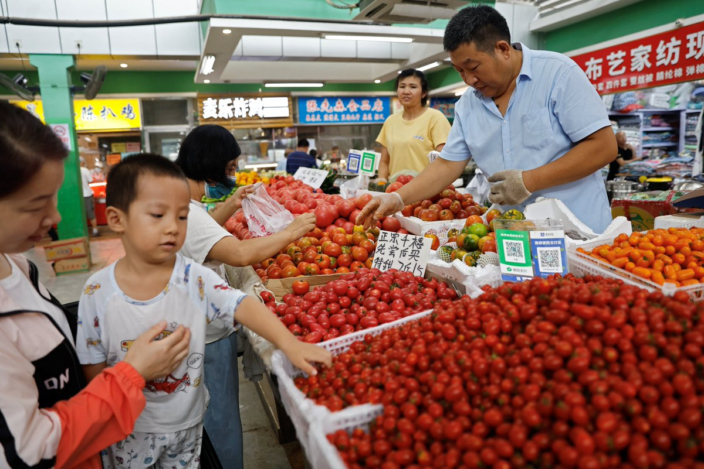
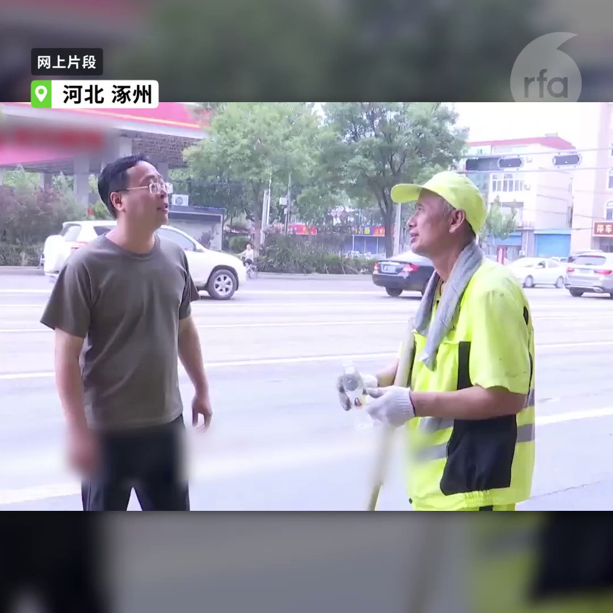
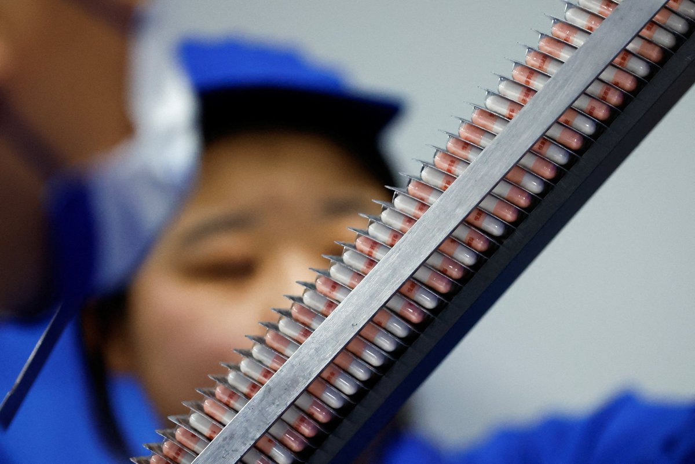
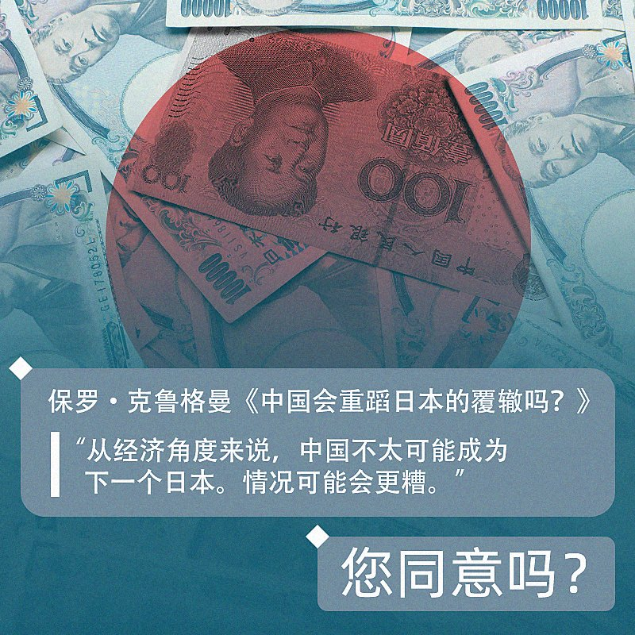
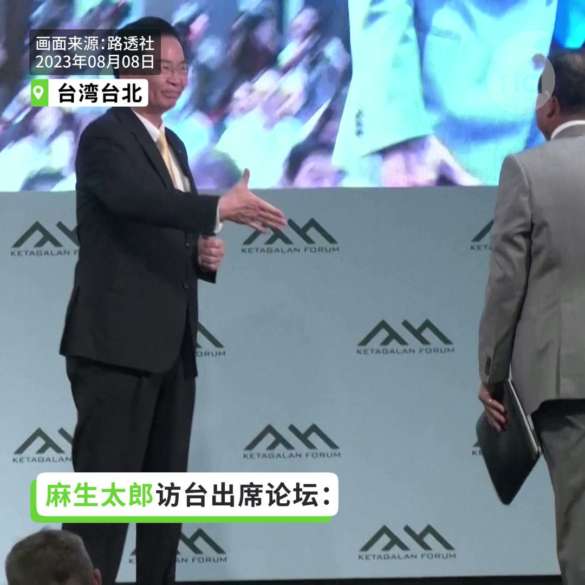
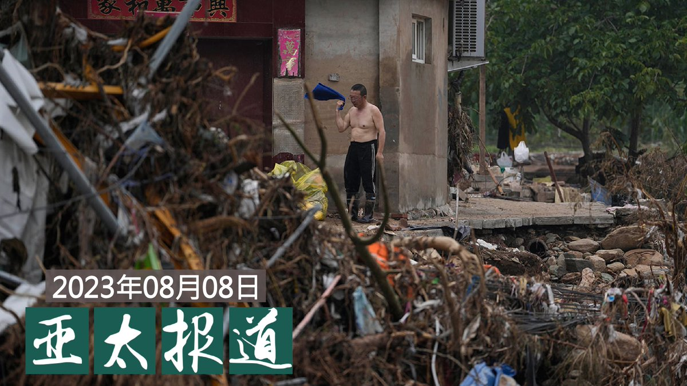

自由亚洲电台 北京时间 2023-08-09T22:19:35Z 1689280265489702912 专栏 | #民主沙龙：中国人讲中国事 （2023-08-08） https://t.co/nT0Eq4MO0b   自由亚洲电台 北京时间 2023-08-09T23:09:26Z 1689292812397744128 中国政府近期责令境内应用程式（App）主办者在明年三月底前向电信部门提交备案申请，并要求从事新闻、出版、教育、影视、宗教等APP互联网信息服务的主办者在履行备案手续时向其住地当局提交主管部门审核同意及承诺书。 https://t.co/JWDx001pt0   自由亚洲电台 北京时间 2023-08-09T23:10:34Z 1689293096306249728 中国房企龙头 #碧桂园 传出未能支付两笔美元债券利息，中国房企深陷债务危机。有分析指，#中国房地产 面临尴尬处境，虽然他们想以拖待变，但是恒大拖了两年也没变好，政府又不能任其破产。此外，还有百家房企也有不同程度债务问题。 https://t.co/ACH9iGLkq8   自由亚洲电台 北京时间 2023-08-09T23:09:58Z 1689292947915767808 港警等香港纪律部队代表在加拿大参与世界警察运动会期间遇上当地港人组织示威，事件继续发酵。港澳办、中联办和港府高层谴责示威，更把示威人士标签为"反中乱港份子"。 https://t.co/yswytmlb6W   自由亚洲电台 北京时间 2023-08-09T23:38:52Z 1689300218335150081 中国被指在东南亚国家跨境执法，并把异议人士扣押遣送回国，引起国际社会关注。曾发起“ #拆墙运动”，并号召有志之士拆除中共网络围墙的异议人士 #乔鑫鑫 在老挝被捕后，证实已被送回湖南衡阳囚禁。 https://t.co/ymFb7i86Kf   自由亚洲电台 北京时间 2023-08-09T16:55:57Z 1689198822642376704 【中国7月CPI同比下降0.3% PPI降4.4%】
【市场忧通缩风险】
中国国家统计局周三公布7月 #消费者物价指数（CPI）与去年同期相较下降0.3%，是自2021年2月以来再度陷入负成长。市场议论 #通缩风险 恐影响投资与生产，令失业率上升及出现 #经济衰退。
https://t.co/ryDqOmnxSa https://t.co/Y92sAgvwe6   自由亚洲电台 北京时间 2023-08-09T18:24:06Z 1689221004533645314 【华北水灾｜涿州水退领导才现身“指挥”】
【居民怒斥：水大的时候不来】
#华北水灾 已十日，近日 #涿州 城区部分洪水退去，河北省委书记 #倪岳峰 和涿州市委书记 #蔡炜华 才去已清理好的地区，被居民斥为“摆拍”。 https://t.co/eq9JxGctPX   自由亚洲电台 北京时间 2023-08-09T19:29:28Z 1689237455713513472 RT @RFA_Chinese: 【#万润南（上）：习近平是坏皇帝 邓小平是好皇帝｜观点】
https://t.co/sDzbXxgyRu
旅居巴黎的原 #四通 创始人万润南，是1980年代最有影响力的中国企业家。他说，邓小平是个悲剧人物。89年血腥屠杀是邓政治生命中的污点，但…   自由亚洲电台 北京时间 2023-08-09T19:30:11Z 1689237635737288704 RT @RFA_Chinese: 一群中国留学生把中国"社会主义核心价值观"内容的二十四个字刷在伦敦红砖巷（Brick Lane）的事件，引爆海内外舆论，也引来很多持不同看法的人进行“二次创作”。当地政府周一已经在墙上刷上白漆，然而不久后又被进行"三次创作"。… https:/…   自由亚洲电台 北京时间 2023-08-09T19:31:44Z 1689238025526484992 RT @RFA_Chinese: #伦敦涂鸦墙事件 引发全球热议，然而相关话题却在中国网络被禁，反共的"二次创作"图片也被屏蔽。 《环球时报》前主编胡锡进发文想息事宁人，然而爱国网红及海外艺术家的批评仍然此起彼落。https://t.co/IgXUdA4QJp   自由亚洲电台 北京时间 2023-08-09T17:26:17Z 1689206456476909568 【#运动式反腐 引发医疗界海啸】
【波及跨国企业】
中国近期在全国范围展开的 #医药反腐 运动触发医药界海啸，同时波及在华数以千计的跨国公司。武汉一从事医药销售的外企销售部门负责人接受本台采访时说，医院已经拒绝医药企业代表入内，在华 #外资药企 业务已近乎停顿。
详细报道：https://t.co/MmPrWDOIcG   自由亚洲电台 北京时间 2023-08-09T07:06:01Z 1689050359283466240 RT @RFA_Chinese: 中国会像日本那样“失去XX年”吗？或者，已进入这一进程？诺奖经济学者保罗·克鲁格曼最近在《纽约时报》发文表示不以为然。… https://t.co/9ovZtI9NdP   自由亚洲电台 北京时间 2023-08-09T07:05:26Z 1689050212055044097 RT @RFA_Chinese: 【日前首相麻生吁各国有迎战准备】
【愿台新总统能决心护台】… https://t.co/U9VtHw6516   自由亚洲电台 北京时间 2023-08-09T07:28:26Z 1689056001981399040 【#亚太报道（2023-8-8）】 欢迎收听和订阅播客【亚太报道】 https://t.co/MjLNSvVeAE 

南疆150名维族人遭拘押/#伦敦涂鸦墙 话题在中国被禁/#洪灾 损失惨重 #习近平 在哪儿？/防境外势力 #美国泰德广州年会 被取缔/ #中国 以云端技术在 #澳洲 设警站 https://t.co/COAonmfc6D   自由亚洲电台 北京时间 2023-08-09T09:29:25Z 1689086446144032769 RT @RFA_Chinese: 【#万润南（上）：习近平是坏皇帝 邓小平是好皇帝｜观点】
https://t.co/sDzbXxgyRu
旅居巴黎的原 #四通 创始人万润南，是1980年代最有影响力的中国企业家。他说，邓小平是个悲剧人物。89年血腥屠杀是邓政治生命中的污点，但…   自由亚洲电台 北京时间 2023-08-09T01:31:58Z 1688966293779582977 #事实查核｜美国德州将在11月举办独立公投？https://t.co/jTL6FRZXnW   自由亚洲电台 北京时间 2023-08-09T07:05:47Z 1689050300420673537 RT @RFA_Chinese: 【河北东北洪灾“人祸”持续】
【霸州泄洪引发民怨爆警民冲突】

华北东北一带水灾持续超过一星期，多地“人祸”持续。其中河北霸州泄洪引发民怨，连日示威包围市政府大楼，向当地官员讨说法，但被现场维稳的警察喷射辣椒水袭击，有人头部流血。… https…   自由亚洲电台 北京时间 2023-08-09T07:25:42Z 1689055313004036097 一群中国留学生把中国"社会主义核心价值观"内容的二十四个字刷在伦敦红砖巷（Brick Lane）的事件，引爆海内外舆论，也引来很多持不同看法的人进行“二次创作”。当地政府周一已经在墙上刷上白漆，然而不久后又被进行"三次创作"。
有当地市民告诉媒体说，在伦敦看到"社会主义核心价值观”让自己感到受到创伤，因为在小学或中学必须要记住这些词语，甚至被罚写，这些词语就像洗脑代码一样。有支持者则认为，这是在“用社会主义的构建方式来反殖民西方的虚假自由”。
对此，您持什么观点？   自由亚洲电台 北京时间 2023-08-09T09:29:30Z 1689086470496071680 RT @RFA_Chinese: 【#亚太报道（2023-8-8）】 欢迎收听和订阅播客【亚太报道】 https://t.co/MjLNSvVeAE 

南疆150名维族人遭拘押/#伦敦涂鸦墙 话题在中国被禁/#洪灾 损失惨重 #习近平 在哪儿？/防境外势力 #美国泰德广州年会…   自由亚洲电台 北京时间 2023-08-09T02:32:18Z 1688981477445472262 近日，极端天气导致的洪灾肆虐中国华北、东北地区，老百姓生命财产损失惨重。但据中国官方报道，只有中国国务院副总理张国清几次出现在救灾一线，并在8月7日"受习近平总书记委派"前往河北灾区视察，引发信任危机。 https://t.co/vHXJrBz7fv   自由亚洲电台 北京时间 2023-08-09T05:25:55Z 1689025168042037248 与女权主义有关的好莱坞电影《#芭比》在北美上映以来，很快成为观影热点，并在全球突破了10亿票房，同时也在中国意外获得高度关注。https://t.co/0VWHuSGJ0V   自由亚洲电台 北京时间 2023-08-09T03:10:41Z 1688991135283499008 据中国官媒央视报道，中国水利部周二（8月8日）对外表示，受降雨和上游来水影响，中国从北到南，目前有黑龙江省嫩江支流库勒河、牡丹江支流铁岭河，陕西渭河支流漆水河、汉江上游酉水河，重庆綦江支流通惠河等11条河流发生超警戒线以上的 #洪水 。 https://t.co/es39gGo3U6   自由亚洲电台 北京时间 2023-08-09T04:00:31Z 1689003676273397760 #伦敦涂鸦墙事件 引发全球热议，然而相关话题却在中国网络被禁，反共的"二次创作"图片也被屏蔽。 《环球时报》前主编胡锡进发文想息事宁人，然而爱国网红及海外艺术家的批评仍然此起彼落。https://t.co/IgXUdA4QJp   自由亚洲电台 北京时间 2023-08-09T02:08:55Z 1688975592811843584 据中国财经媒体“财新网”报道，中国大型房地产公司 #碧桂园 近日传出被政府催缴14亿元的土地出让金。 https://t.co/fr4uMW3AmG   自由亚洲电台 北京时间 2023-08-09T00:17:23Z 1688947521983557632 据中国财经媒体“第一财经”网报道，北京大学医学部主任、中国工程院院士乔杰周二（8月8日）在2023医药创新和科技前沿论坛上表示，中国2023年新出生人口可能只有700万到800万多。他还指出，中国新生儿数量近五年内下滑约40%，2022年全国出生人口只有956万人。 https://t.co/FFLOObWZEw   