谁将十万横扫三江 北京时间 2023-08-09T19:24:56Z 1689236315181899776 他说啥了 https://t.co/MvpaHoVzok 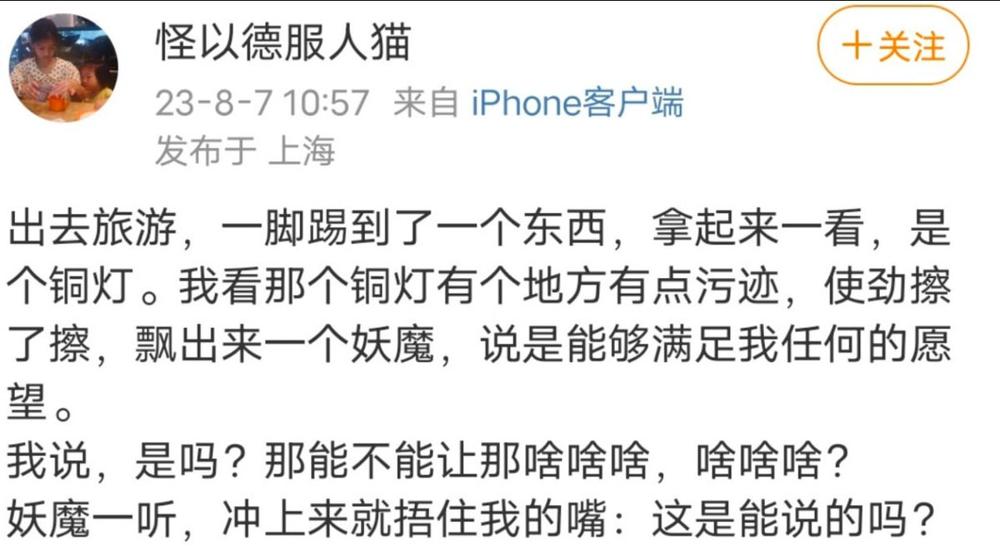  谁将十万横扫三江 北京时间 2023-08-09T20:09:58Z 1689247647088156672 阜阳刑警因放涉嫌情侣间强奸案当事人被诉滥权

安徽省阜阳市公安局颍州分局刑事侦查大队五中队四级警长洪俊，因在办案过程中释放了一对情侣间涉嫌强奸的当事人而被阜南县人民检察院以滥用职权罪起诉。洪俊本人认为，该起诉完全脱离办案时的具体情况，与客观事实不符。
8月8日，洪俊参加了庭前会议，在庭前会议上得知，法检拟对本案不公开审理。据洪俊介绍，其辩护人北京华象律师事务所刘校逢律师当时明确表示反对，刘校逢律师认为本案不属于刑事诉讼法规定的不公开审理的案件，应当依法公开审理。

据了解，检察院认为作为刑警队一中队中队长的洪俊，对于派出所在工作中发现并移送的丁奥涉嫌奸淫幼女的案件线索，仅对当事人进行了口头询问，即让双方家长分别将二人带离公安机关。丁奥从2020年2月开始，先后在阜阳等地实施了强奸、组织、强迫卖淫等多起犯罪，洪俊作为国家机关工作人员，滥用职权，致使国家和人民利益遭受重大损失，情节特别严重。

但是洪俊本人反映：

2020年1月10日，文峰路派出所向我当时所在的刑警一队移交一起警情：报案人为靳某某，控告丁奥对其实施殴打行为。但是文峰路派出所接处警认为本案涉嫌强奸行为，于是将靳某某及其父亲、丁奥一同带至刑警队。强奸案系重案，此类警情刑警队一向谨慎处理，接到该警情后，我将当事人双方分开到两个房间，在中队其他民警及辅警的配合下分别对两人进行了询问审查。

经审查，靳某某报案时已满14岁，丁奥为16岁。二人系男女朋友，且恋爱关系已维持相当长一段时间。关于两人第一次发生性关系的时间，靳某某表述不详，二人所述不一致且无法确认二人首次发生性关系的具体时间。在对丁奥进行询问时，丁奥称其不知道第一次与靳某某发生性关系时靳某某的具体年龄。而当被问及第一次发生关系的细节时，靳某某未控诉丁奥对其实施暴力行为，言语中体现两人系自愿发生性关系。

此外，我从三合一接处警平台调取了当时靳某某的报警录音，靳某某在报警时只是控告丁奥对其实施殴打行为，并未提及其它内容。针对该控告内容，经询问靳某某本人得知其身体并无明显伤痕，由中队女性队员对靳某某进行身体检查也未发现有明显伤痕。同时靳某某也未能提出相关证人证言或其他能够证明丁奥对其实施强奸行为的证据。

经过处警，我未发现该警情中有构成强奸犯罪的初步证据。在询问过程中，靳某某的父亲作为法定代理人在旁倾听，因靳某某的身份（KTV陪酒女）以及她对在场的父亲的惧怕，回答问题时言语闪烁支支吾吾，后其父亲急忙将其带离中队，故中队未对靳某某形成纸质询问笔录。在报案人离开后，被控告人丁奥被留队审查是否有违法犯罪行为，一直审查至当天晚上，确认没有证据证明其存在违法犯罪行为才让其离开中队。

对于派出所在工作中发现并移送的靳某某被强奸一事发生在其2020年报警被殴打之前，事发当时靳某某并未报警，也没有任何证据能够核实该事是否发生以及具体时间。靳某某2020年报警是因为其与丁奥发生了争执及厮打行为，其陪酒女的身份、与丁奥的男女朋友关系、身体无明显伤痕以及没有任何证据可以证明靳某某陈述的情形，加之当时靳某某父亲急忙将其带离中队，这些因素直接导致我对报案内容产生怀疑并据此作出判断。

后来本人得知，在我询问靳某某时她闪烁其词回答的原因，除了惧怕父亲之外，还有一个原因是在靳某某报案之前，丁奥、宁庆庆等人就已经着手实施犯罪。而靳某某不但明知丁奥的所为而且参与到丁奥的违法犯罪活动中去，属于“大嫂”的地位，其对丁奥实施组织卖淫的行为提供帮助并帮助丁奥带小姐陪酒。

但其在报案时，并未对丁奥、宁庆庆涉嫌其他犯罪的事实进行检举、揭发。因此当时我本人既不明知丁奥、宁庆庆等人正在实施犯罪，也无法预想到丁奥等人后续会继续实施犯罪行为。我在当时未受理是在审查报案内容并综合各方证据后作出的判断，绝不具有放纵丁奥实施犯罪行为的故意，且后续丁奥的犯罪行为跟我的行为之间也不存在刑法上的因果关系。

2021年颍州区人民检察院到中队调查该警情相关情况，我如实向检察官进行了陈述。我另向分管局领导、大队领导及组织如实汇报了该情况，并且在教育整顿期间我也如实填写并报告，未能及时对文峰派出所移交的警情规范处置。颍州分局根据安徽省政法队伍教育整顿期间适用“自查从宽、被查从严”政策实施办法，坚持依规依纪依法，综合考虑事实性质、情节轻重、后果影响、思想态度等因素，注重政治效果、纪法效果和社会效果相统一，对我作出了责令做出书面检查处理的结果，我也意识到了自己的错误并做出了深刻检讨。

我自2011年工作至今，一直在基层执法岗位，从事刑事侦查工作。工作兢兢业业，时常以单位为家，任劳任怨，得到了领导和同事们的一致认可，从未有过违法违纪前科。在本次处理靳某某涉嫌被强奸警情时，因工作能力问题，确有疏漏之处，但是主观上并没有放纵犯罪、故意实施犯罪的想法。

我作为一名人民警察，承担着执法打击违法犯罪的行为职责，我对党忠诚，对警察职业有着深深的认同感，非常珍惜我的工作。过去十多年我一直以问心无愧来要求自己，我也认为我在工作中也确实能够对得起我身上的警服。

这次执法上的疏漏，阜阳市人民检察院将我认定为滥用职权罪对我个人和家庭影响都太过严重。我将最宝贵的青春年华都奉献给了公安事业，我无怨无悔。但我的孩子人生还没展开，也许他以后可以代替我成为一名更加优秀的人民警察，也许他有自己的职业追求，但我希望他是一个坦荡的人，不用背负着父亲是一名犯罪分子的压力生活。

这件事对我的生活打击很大，也冲击着我过去十多年的职业荣誉感。我恳请司法机关和各位领导，能给予我帮助，给我一个公平公正的处理。

公安局：涉案民警表现优秀

2023年5月31日，阜阳市公安局颍州分局为洪俊出具证明：

关于洪俊同志的现实表现情况

洪俊，男，汉族，1987年09月30日出生……，中共党员，三级警督。2011年8月1日参加公安工作，2011年8月至2021年10月在颍州分局刑事侦查大队一中队工作，2021年10月至2022年9月在颍州分局王店派出所工作，2022年9月通过市局遴选至阜阳市公安局工作。

该同志在颍州分局工作期间爱岗敬业，扎实工作，勤于钻研，积极进取，适应岗位能力强。……办理涉及重大刑事命案 10 余起，破获了一批有影响力的系列犯罪案件，逐渐成为分局刑事侦查工作中的骨干力量。

……在颍州分局工作期间，先后荣获个人三等功1次，先进个人2次。

律师：该案非法定不公开审理情形

据洪俊本人了解，其案为阜阳市人民检察院新设立的第九检察部成立后立案办理的案件。。

据阜阳市人民检察院网站介绍，第九检察部（负责司法工作人员职务犯罪案件办理））具体的工作内容是：负责对法律规定由市人民检察院办理的司法工作人员利用职权实施的非法拘禁、刑讯逼供、非法搜查等侵犯公民权利、损害司法公正的犯罪，以及按照刑事诉讼法规定需要由人民检察院直接受理的其他重大犯罪案件的侦查。

据洪俊介绍，律师在该案庭前会时被公诉人及法官告知，该案拟不公开审理，理由是涉及个人隐私但是刘校逢律师当时就明确表示坚决反对。

刘校逢律师认为，本案不属于《刑事诉讼法》明文规定的不公开审理的案件，应当依法公开审理。

刘校逢律师认为，公开审理是我国刑事司法制度中必须坚持的一项原则，只有将案件的审判置于公众的监督之下，才有助于实现对审判权的制约。在判断某一具体案件是否属于涉及个人隐私的案件时，需要首先考察个人隐私的属性。因为当事人涉及的个人隐私范围很广，如果不根据立法目的和立法原意对个人隐私进行合理解释，则大量刑事案件都会由于涉及个人信息而成为不公开审理的理由，势必会对审判公开原则造成冲击。在刑事诉讼过程中，对证人、鉴定人、被害人的人身安全采取保护措施，不等于就要对案件不公开审理。对案件是否公开审理，应当符合刑事诉讼法的规定。滥用职权罪案件并不属于法定不公开审理的范畴，因此应当依法公开开庭审理。

据洪俊介绍，刘校逢律师将为其作无罪辩护，他认为：洪俊在2022年1月10日审查材料时无法意识到丁奥等人正在实施犯罪，主观上不具有放纵犯罪的故意；对丁奥后续继续实施犯罪所造成的损害后果也不具有预见可能性。

刘校逢认为，洪俊当时的行为不构成滥用职权罪

据洪俊介绍，在昨天的庭前会议中，律师提出了调取证据申请、调取讯问录音录像申请、证人出庭作证申请、笔迹鉴定申请等多项申请，公诉人在昨天的庭前会议中说，有其中一份讯问录音录像已经找到，但还没有拿到，等拿到后移送法院。

今天下午，刘校逢律师再次前往法院，向法院递交了《要求依法公开审理法律意见书》和《延期审理申请书》。

刘校逢认为，认为庭前会议有这么多的事项需要在开庭之前处理，明天开庭过于仓促。且检察院至今尚未向法院移送辩护人申请调取的讯问录音录像等证据材料，即使在今天下午下班前检察院移送到法院，辩护人也需要必要的准备时间。

刘校逢希望法院能本着实事求是、客观公正的原则，对本案延期审理。 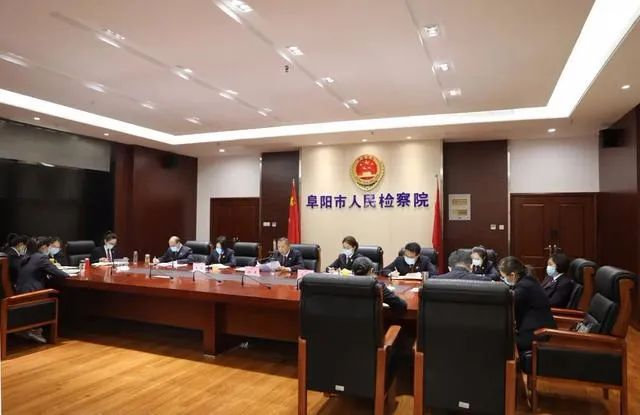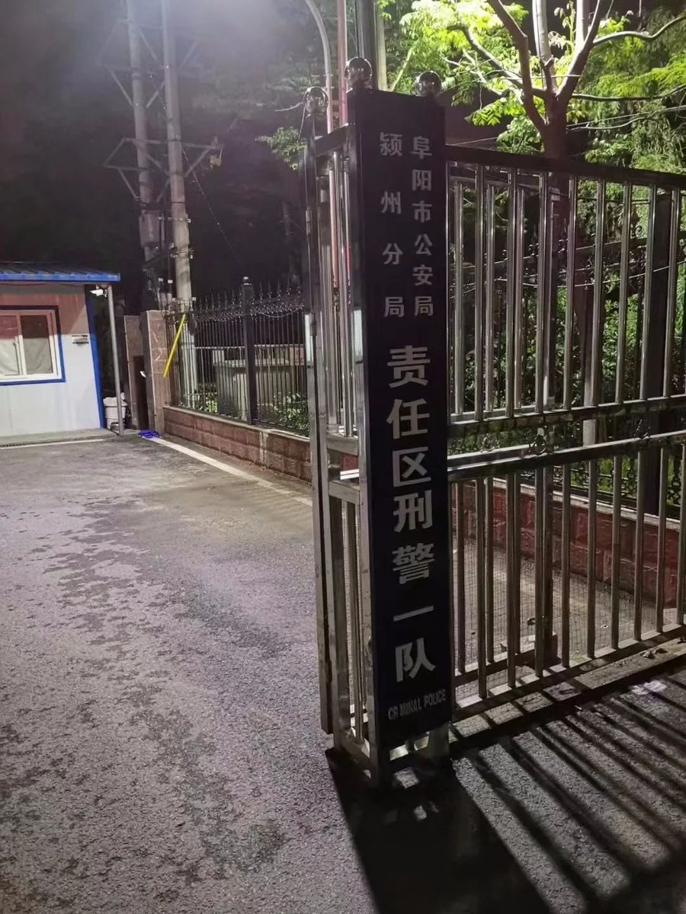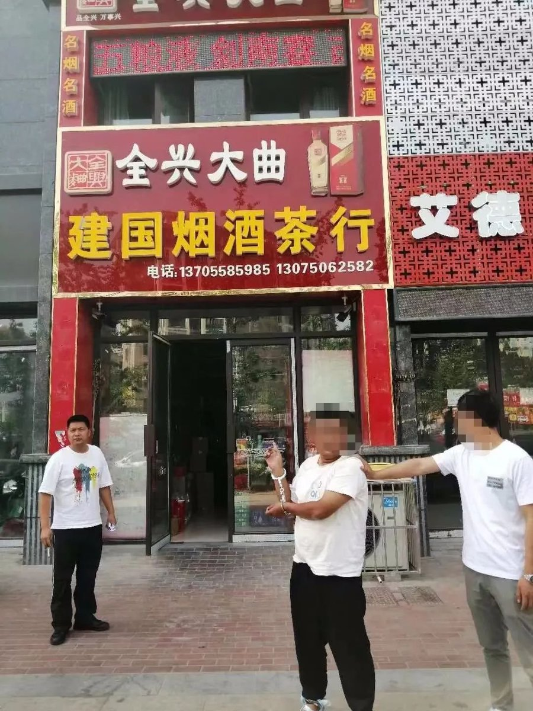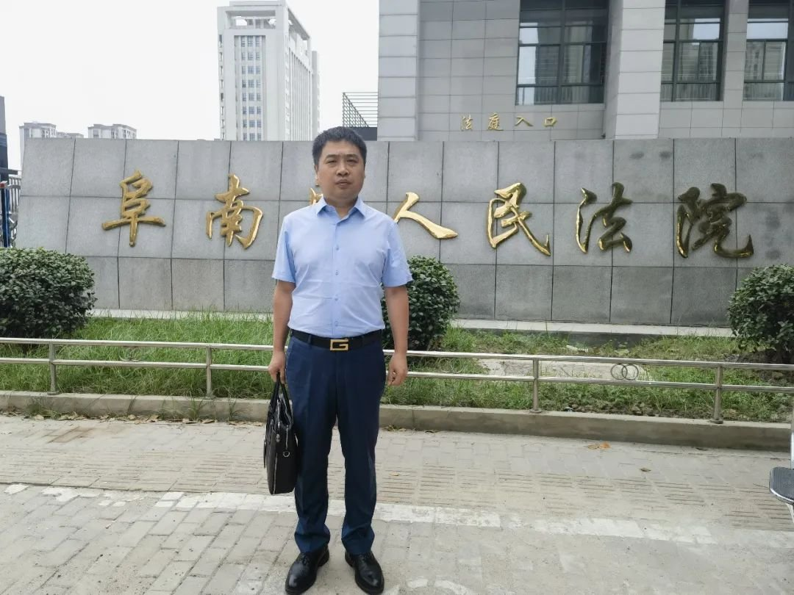  谁将十万横扫三江 北京时间 2023-08-09T12:31:18Z 1689132222224515072 RT @haveafreeheart: 今天首页看到好几位码农向国务院投诉工信部那个要求备案的新规了，一位是@KidyLee ，另一位是@tualatrix 。… https://t.co/Ftv7mEAG8Q 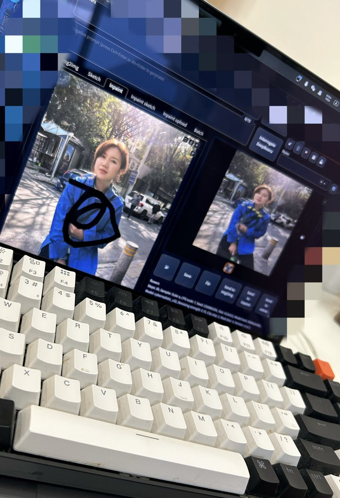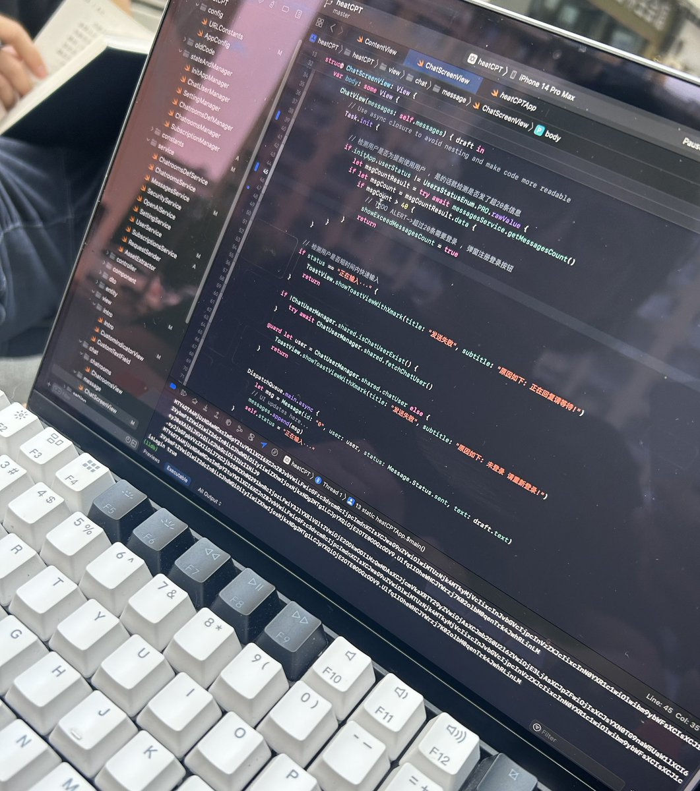  谁将十万横扫三江 北京时间 2023-08-09T14:27:24Z 1689161435677642752 RT @whyyoutouzhele: 网友投稿
8月9日有网友发现，小米手机不能安装或更新最新版 Telegram 安装包了，网友测试官网下的包，最新版 MIUI 系统无法安装 ，无绕过按钮，断网还能装 https://t.co/gJF2xpje5v   谁将十万横扫三江 北京时间 2023-08-09T14:31:38Z 1689162501471326208 四川雅安雨城区鱼鳞坝涨水致至少7人遇难 https://t.co/K355g359D1   谁将十万横扫三江 北京时间 2023-08-09T13:31:31Z 1689147374478995456 公立医院有多腐败？
1.招人、提拔主任副主任、调换工作岗位，因为有的科室收入好、有的差，从中受贿;
2.购买医疗器械、设备、耗材吃回扣;
3.吃药品回扣，特别是中成药回扣;
4.医院基建受贿，现在病人增长了7-8倍，医院建筑也大增，巨资扩建，很多招标都是和你玩的;
5.部分业务转包第三方吃回扣(干股)，如食堂餐馆、洗衣房、消毒供应室、安保、保洁等;
6.购入大型医疗设备故意借口缺钱，引入第三方投资、租赁、入股，玩金融，领导从中吃猫腻;
7.有了权力，作风腐败，管不了下半身，接受性贿赂;
8.借口考察、学习、培训，用公款旅游，公款办私事。
9.随便的将医院的房子给某些人住或经营，用水、电比常人用空气还随便。

这是一场运动反腐退赔赃款能解决的吗？在这种体制下，被抓腐败的反而是尊重市场规律的医生和领导，合法享受的才是国家的蛀虫 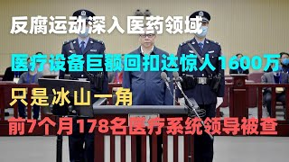  谁将十万横扫三江 北京时间 2023-08-09T13:32:22Z 1689147588866641920 RT @whyyoutouzhele: 8月9日，山西省高院门口，发生民众聚集，目前原因不明 https://t.co/cKLjkZK9yS 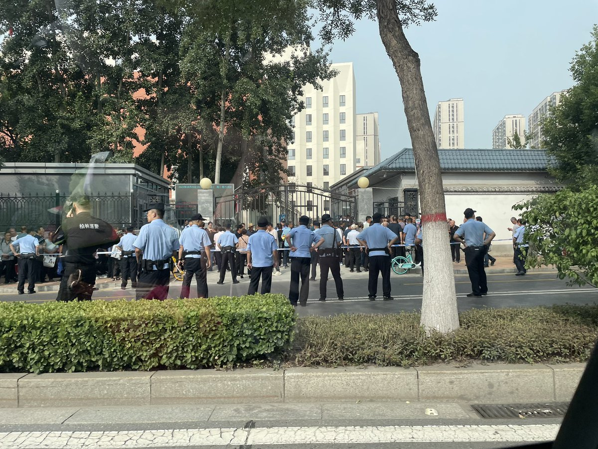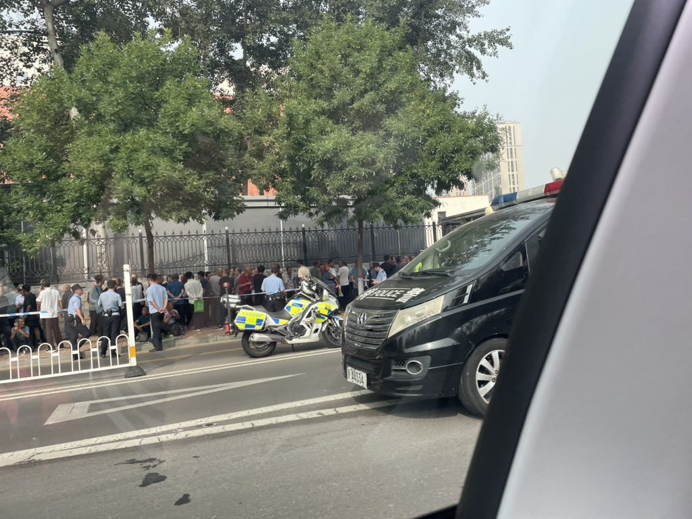  谁将十万横扫三江 北京时间 2023-08-09T11:17:48Z 1689113723963904000 六十二岁大叔打零工日赚三百五被拖欠工资，本该退休的年龄帮子女还房贷车贷，一生跑大半个中国，大叔的旅途 https://t.co/IDLUid5zAX 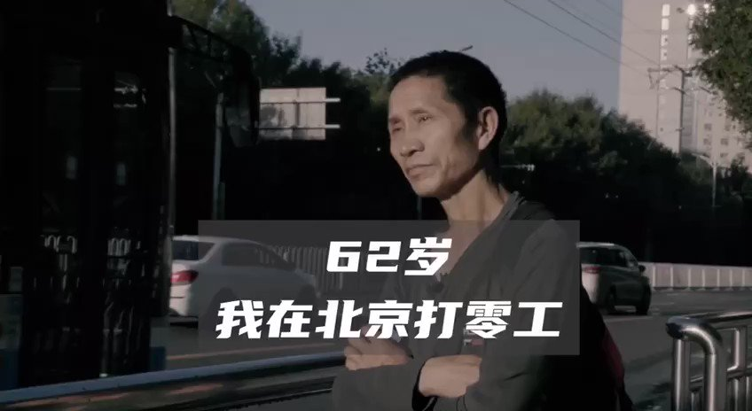  谁将十万横扫三江 北京时间 2023-08-09T11:33:32Z 1689117683336560640 RT @AXH1gX6IPsFVt3K: 9日北京市关于洪灾召开新闻发布会，公布遇难人数仅为33人 https://t.co/BKVLtkTuOj 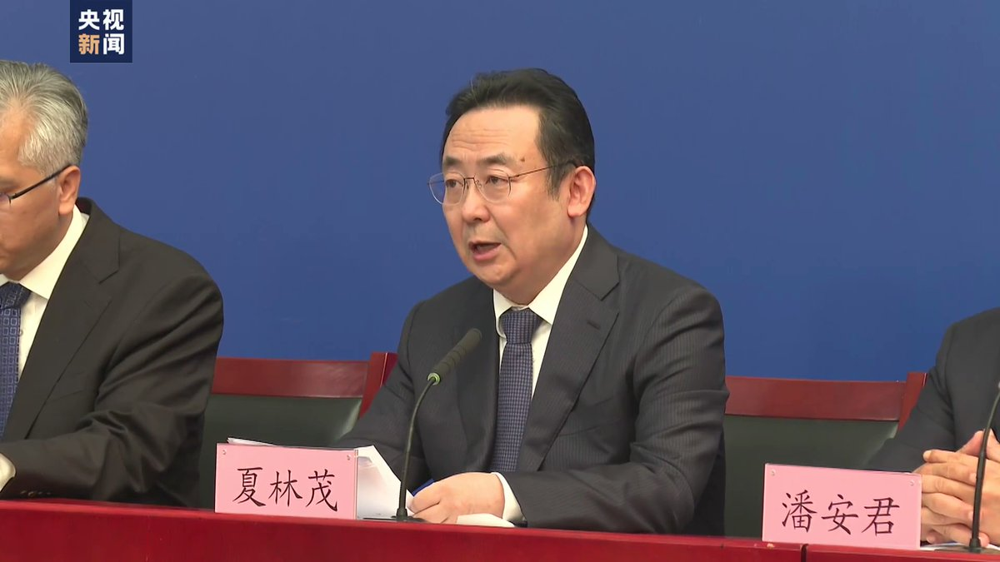  谁将十万横扫三江 北京时间 2023-08-09T11:34:14Z 1689117859648331776 灾后的河北涿州 https://t.co/15ia5nSZIq 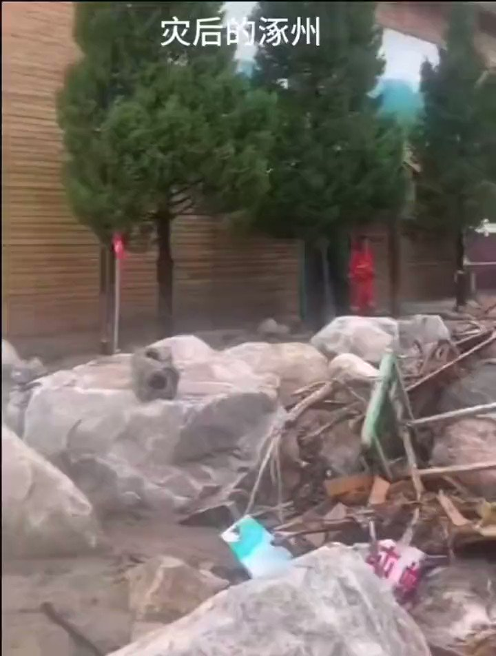  谁将十万横扫三江 北京时间 2023-08-09T11:59:19Z 1689124170163195904 有了解内情的吗？透明计算张尧学 https://t.co/8h87iiBoo9 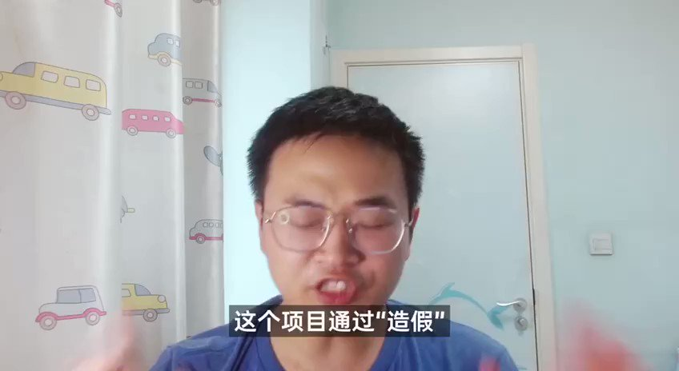  谁将十万横扫三江 北京时间 2023-08-09T12:19:16Z 1689129193484021760 2008年美国次贷危机时，奥巴马提议美国人买股票，炒股赔钱抵扣个税，巴菲特应声下场撑台面。
 2023年美国债务失控时、信用评级下调，又是巴菲特下场救市，大量买入短期美国美债。
同样是2023年的现在，中国政府也提出活跃资本市场（意思也是叫大家买股票），应声下场的是一个胡主编。
巴菲特是专业投资者，盈亏自负，自判形势；
胡某某是专业大忽悠，为赚流量，自甘工具。
中国的机构一直都在，并没有想象中那么傻或者坏，就像拿回扣的医生，大部分也在治病救人。没有正常的游戏规则，必然是浑水一滩。
美国上市公司用天量分红和回购回报股民
中国上市公司用天量融资和减持收割股民
这是两者的本质区别   谁将十万横扫三江 北京时间 2023-08-09T02:01:00Z 1688973598835478529 让孩子帮忙拍照的过程中，意外发现自己的孩子非常有摄影师天分 https://t.co/LIUdH5chJU 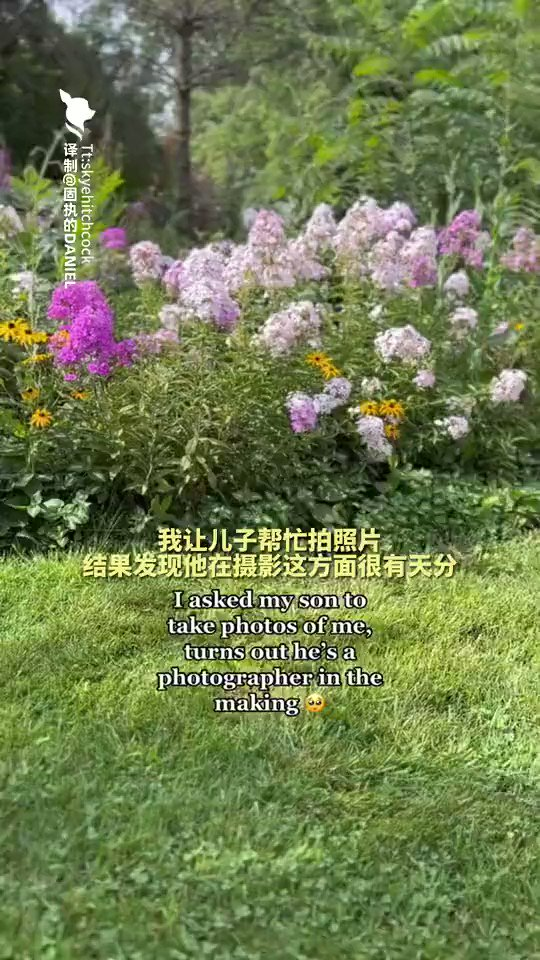  谁将十万横扫三江 北京时间 2023-08-09T02:05:00Z 1688974605468528640 原来大多数的盲人，看到的并不是一片漆黑。戴上这些特制的眼镜，感受不同视障人士眼里的世界 https://t.co/rp1GlgLUkD 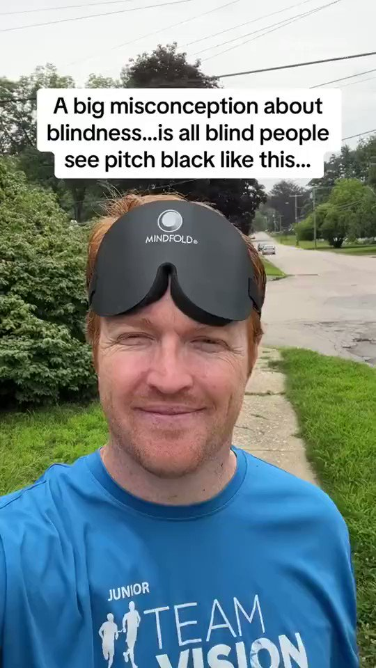  