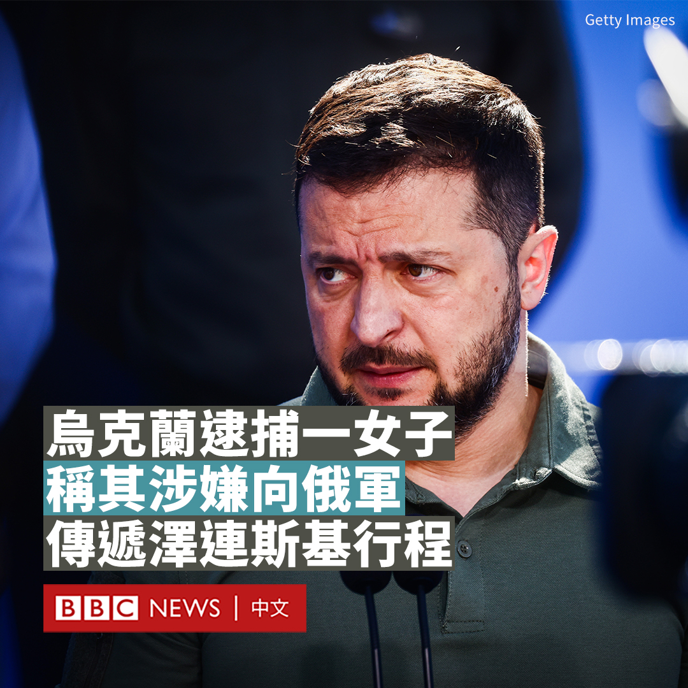
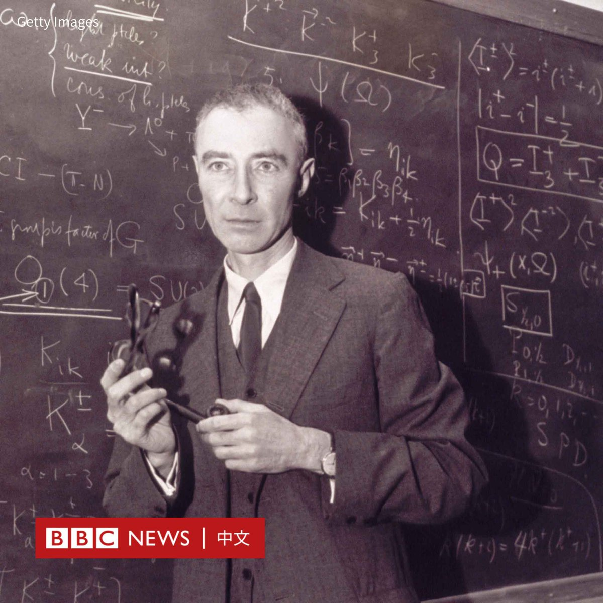

D英国广播公司BBC 北京时间 2023-08-08T13:19:13Z 1688781891384868864 乌克兰安全部门表示，一名女子因涉嫌协助俄罗斯袭击乌克兰总统泽连斯基（Volodymyr Zelensky）而被捕。

该机构指控，在泽连斯基6月访问遭受洪水袭击的南部城市尼古拉耶夫之前，她曾试图收集情报，获知泽连斯基的行程，而俄罗斯寻求利用这些信息来策划一场“大规模的空袭”。

乌克兰经常指责一些当地亲俄的居民向俄罗斯军队通风报信。俄罗斯没有对此次抓捕行动发表评论。

泽连斯基证实，他已被告知该女子被捕一事，称乌克兰国家安全局负责人已向他通报了“打击内奸”的进展。

乌克兰国家安全局在一份声明中表示，这名女子在试图向俄罗斯人传递情报时被“当场”抓获。

该机构还发布了一张嫌疑人与蒙面的国家安全局警察在餐厅的照片，但模糊了该女子和警察的脸。

泽连斯基于6月访问了尼古拉耶夫，查看了卡霍夫卡大坝决堤造成的破坏，并于7月在俄罗斯猛烈炮击后再次到访。

安全部门表示，他们在访问前就得知了这一阴谋，并采取了额外的安全措施。

据报导，该嫌疑人试图向俄方提供有关电子作战系统和弹药仓库位置的信息，俄罗斯军方可能会将其作为袭击目标。

安全部门称，该嫌犯住在泽连斯基7月到访的一个叫奥恰科夫的小镇，当时她在一个军事基地的商店里工作。她在该地区驾车拍摄了乌克兰军事设施的照片和影片。预计她将面临未经授权传播武器和部队行动信息的指控。

如果罪名成立，她可能会被判处12年监禁。   D英国广播公司BBC 北京时间 2023-08-08T11:06:09Z 1688748405382844417 被称为“原子弹之父”的已故美国科学家罗伯特·奥本海默（Robert Oppenheimer），近日因克里斯托弗·诺兰（Christopher Nolan）执导的好莱坞大热的电影，使他的生平事迹在全球又引起关注。

核武器是世界上最危险的武器。一颗原子弹足以摧毁一座城市，而与原子弹的开发、制造和使用有最密切联系的科学家便是奥本海默。他是美国理论物理学家，也是曼哈顿计划（Manhattan Project）的重要人物，该计划最终研发出历史上第一个原子弹。

但是，在美国对日本广岛和长崎投下原子弹之后，奥本海默对数十万人死亡和更多受害者多次表达遗憾和懊悔。

在广岛长崎原爆两个月之后，奥本海默就辞职了，1947至1952年之间，他担任美国原子能委员会顾问，期间他游说国际对军备进行管制，并运用影响力宣扬控制核武器和核不扩散运动。

在原子弹首次试爆成功的多年之后，奥本海默回忆表示，观看试爆让他想起印度《薄伽梵歌》（Bhagavad Gita）的一句话：“我现在成了死神，世界的毁灭者。”

讲述原子弹研制过程的电影《奥本海默》在全球大卖，在香港及台湾都十分受欢迎，据报道也将于8月下旬进入中国大陆院线，但在遭原子弹袭击的日本则没有上映的计划。

相关报导：https://t.co/xSSjHaDf4W   D英国广播公司BBC 北京时间 2023-08-08T09:20:43Z 1688721870076653568 美国和中国正在晶片行业互相实施限制措施。一块晶片可能只有你指甲盖那么大，为什么美中两国要为这么小的东西大动干戈呢？ https://t.co/nkFw6R5F4L   