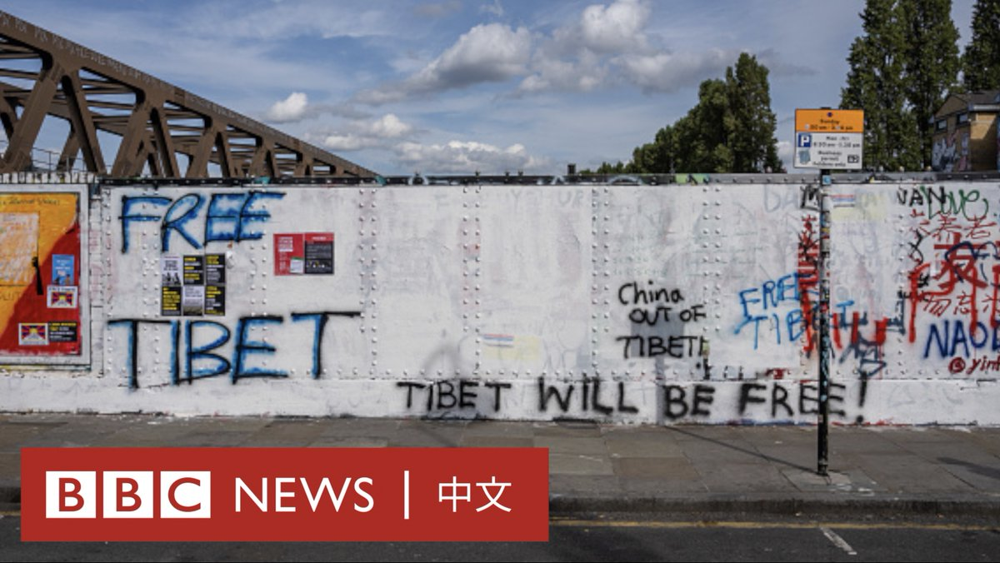
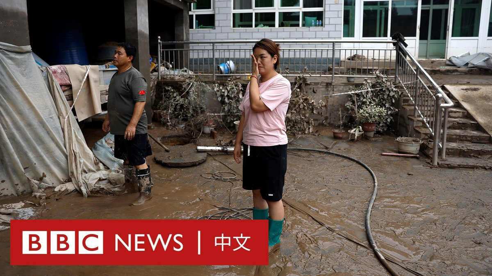
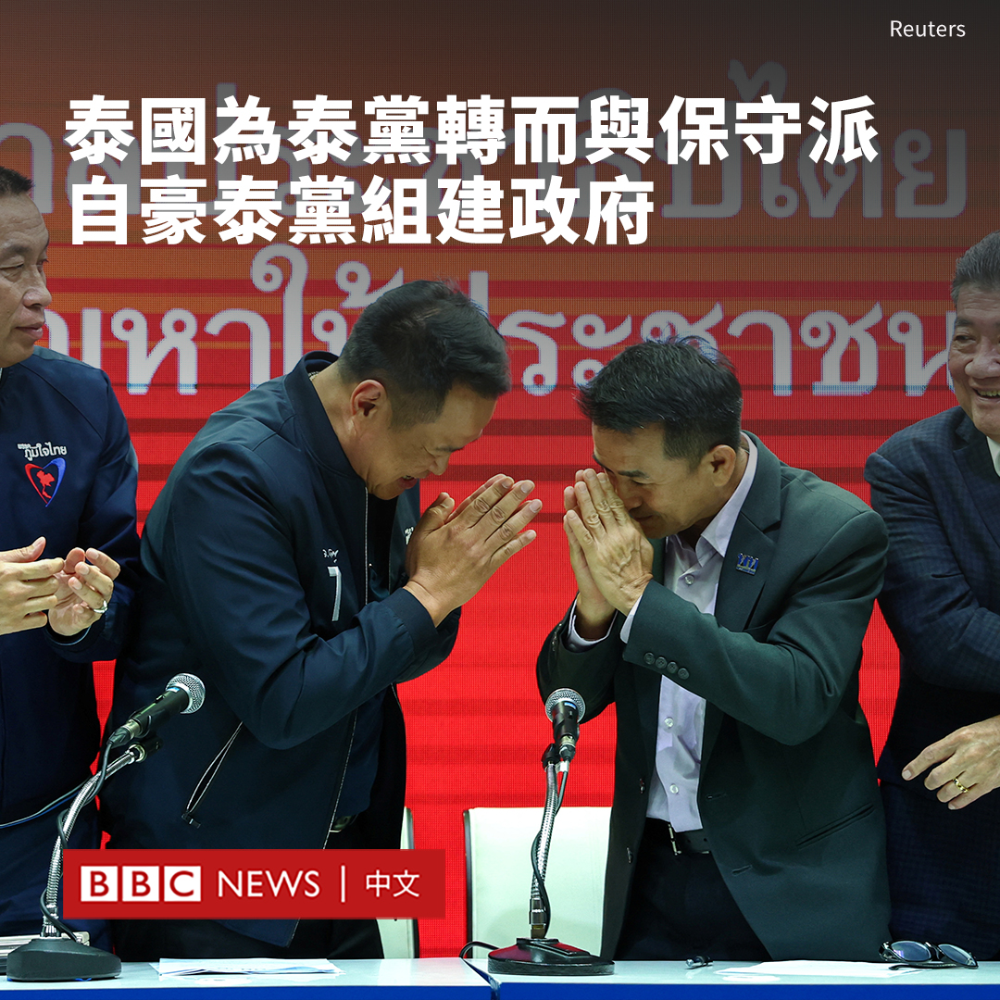

D英国广播公司BBC 北京时间 2023-08-08T21:22:38Z 1688903545259708416 在伦敦东区红砖巷（Brick Lane）的一堵涂鸦墙被几名中国留学生喷涂上中国的“社会主义核心价值观”红色标语而引发争议，并招致很多反对者也前往涂鸦后，当地区议会已清除了墙面上所有涂鸦。 https://t.co/YTHv9UVxxz   D英国广播公司BBC 北京时间 2023-08-08T23:27:17Z 1688934913834405889 华纳兄弟（Warner Bros.）称，电影《芭比》（Barbie）在上映仅17天就突破了十亿美元的票房，而格蕾塔·葛韦格（Greta Gerwig）更成为首位以独立导演身份达到这一里程碑的女性。

华纳兄弟在周日（8月6日）的一份声明中表示，该电影周末的全球票房将达到10.3亿美元。

华纳兄弟形容这是一个“分水岭时刻”。

华纳美国国内发行总裁杰夫·戈德斯坦（Jeff Goldstein）表示：“除了葛韦格，没有人能够将这位跨时代的偶像和她的世界以这样一个有趣、感性和娱乐的故事展现出来......简直让整个世界都变成了粉红色。”

他说，在新冠疫情和流媒体竞争使电影行业受到冲击后，电影院内排队的人龙和“二刷”观众“证明电影回来了”。

曾经也有其他女性导演的电影也突破了十亿美元票房大关，但都是与他人合作完成的。例如，动画片《冰雪奇缘》及其续集的票房收入超过14亿美元，由詹妮弗·李（Jennifer Lee）和克里斯·巴克（Chris Buck）共同执导。

以粉色为主题的电影《芭比》受到了影评人的赞赏，并激发了许多人在各地电影院的娃娃盒里自拍的热潮。

奇幻爱情喜剧片《芭比》（Barbie）则讲述了芭比娃娃与好友肯一起前往真实世界展开大冒险，寻找身份认同的故事，由玛格·罗比（Margot Robbie）和瑞恩·高斯林（Ryan Gosling）主演。

目前，《芭比》在美国的票房成绩为4.59亿美元，国际市场上达到了5.72亿美元。   D英国广播公司BBC 北京时间 2023-08-08T18:25:09Z 1688858880800112640 菲律宾发声明指责中国海警船于南海仁爱礁（菲律宾称阿云津礁）附近海域向其船只发射水炮，其后公布现场影片并表示已传召中国驻菲律宾大使。

中国方面则表示仁爱礁属其领土，中国海警“现场操作专业、克制，无可非议”，也发布影片以佐证说法。 https://t.co/An593wEwWV   D英国广播公司BBC 北京时间 2023-08-08T19:27:04Z 1688874464946294784 “我们的困难从现在才开始，接下来是最苦的时候。”

涿州是中国华北近期洪灾受灾最严重的地方之一。灾情高峰时，全市有超过六分之一居民被疏散。

当洪水退去，许多人返回家中发现房屋与家具因洪水而损坏，一些居民经营的店铺也损失惨重。 https://t.co/2r6ty0lXme   D英国广播公司BBC 北京时间 2023-08-08T20:32:22Z 1688890894802415616 巴基斯坦信德省一起火车出轨事故造成至少30人死亡，事故原因尚不清楚。BBC记者聆听几位幸存者的求生记忆。https://t.co/zYYZq6Yg0O   D英国广播公司BBC 北京时间 2023-08-08T16:00:50Z 1688822562317565953 在泰国新总理持续“难产”之际，泰国为泰党于周一（8月7日）宣布与保守派自豪泰党结盟，并表示欢迎其他政党加入，寻求组建联合政府。

这标志着为泰党与在今年5月大选中得票最多的进步派盟友远进党分道扬镳，转而与保守派政党合作。

远进党曾是泰国大选的赢家，但由于泰国总理需由参、众两院共同选出，而参议院议员由反对远进党的军方任命，该党党魁皮塔·林家伦拉（Pita Limjaroenrat）在7月的投票中未能成为总理，而且被议会表决剥夺参选资格。

得票第二多的为泰党于周一宣布与保守派自豪泰党结盟，并表示欢迎其他政党加入，寻求组建联合政府。

为泰党党魁春楠（Chonlanan Srikaew）与自豪泰党党魁兼泰国副总理阿努廷（Anuthin Chanwirakun）一同举行记者会。

排除远进党是自豪泰党提出的合作要求之一。自豪泰党反对远进党的标志性政策，即改革冒犯君主罪。泰国严厉的冒犯君主罪规定，任何人诽谤、侮辱或威胁国王、王后、王储或摄政王，最高可判处15年有期徒刑。

为泰党脱离了前进党组建的“八党联盟”后，选择与保守派合作。为泰党党魁春楠说：“我们要感谢自豪泰党接受邀请，以便我们打破政治僵局。”

为泰党补充指，60岁的地产大亨斯雷塔（Srettha Thavisin）仍然是该党的总理候选人，他是泰国最大房地产开发商之一Sansiri公司的共同创始人。

今年5月，皮塔率领远进党在众议院选举中大获全胜，赢得最多席位，标志着对泰国自2014年以来保守派军事统治的逆转。

8月2日，为泰党与其他小党派组成的联盟决定不与远进党联合组阁。这意味着众议院第一大党远进党将不会上台执政，而是成为在野党。   D英国广播公司BBC 北京时间 2023-08-08T13:19:13Z 1688781891384868864 乌克兰安全部门表示，一名女子因涉嫌协助俄罗斯袭击乌克兰总统泽连斯基（Volodymyr Zelensky）而被捕。

该机构指控，在泽连斯基6月访问遭受洪水袭击的南部城市尼古拉耶夫之前，她曾试图收集情报，获知泽连斯基的行程，而俄罗斯寻求利用这些信息来策划一场“大规模的空袭”。

乌克兰经常指责一些当地亲俄的居民向俄罗斯军队通风报信。俄罗斯没有对此次抓捕行动发表评论。

泽连斯基证实，他已被告知该女子被捕一事，称乌克兰国家安全局负责人已向他通报了“打击内奸”的进展。

乌克兰国家安全局在一份声明中表示，这名女子在试图向俄罗斯人传递情报时被“当场”抓获。

该机构还发布了一张嫌疑人与蒙面的国家安全局警察在餐厅的照片，但模糊了该女子和警察的脸。

泽连斯基于6月访问了尼古拉耶夫，查看了卡霍夫卡大坝决堤造成的破坏，并于7月在俄罗斯猛烈炮击后再次到访。

安全部门表示，他们在访问前就得知了这一阴谋，并采取了额外的安全措施。

据报导，该嫌疑人试图向俄方提供有关电子作战系统和弹药仓库位置的信息，俄罗斯军方可能会将其作为袭击目标。

安全部门称，该嫌犯住在泽连斯基7月到访的一个叫奥恰科夫的小镇，当时她在一个军事基地的商店里工作。她在该地区驾车拍摄了乌克兰军事设施的照片和影片。预计她将面临未经授权传播武器和部队行动信息的指控。

如果罪名成立，她可能会被判处12年监禁。   D英国广播公司BBC 北京时间 2023-08-08T11:06:09Z 1688748405382844417 被称为“原子弹之父”的已故美国科学家罗伯特·奥本海默（Robert Oppenheimer），近日因克里斯托弗·诺兰（Christopher Nolan）执导的好莱坞大热的电影，使他的生平事迹在全球又引起关注。

核武器是世界上最危险的武器。一颗原子弹足以摧毁一座城市，而与原子弹的开发、制造和使用有最密切联系的科学家便是奥本海默。他是美国理论物理学家，也是曼哈顿计划（Manhattan Project）的重要人物，该计划最终研发出历史上第一个原子弹。

但是，在美国对日本广岛和长崎投下原子弹之后，奥本海默对数十万人死亡和更多受害者多次表达遗憾和懊悔。

在广岛长崎原爆两个月之后，奥本海默就辞职了，1947至1952年之间，他担任美国原子能委员会顾问，期间他游说国际对军备进行管制，并运用影响力宣扬控制核武器和核不扩散运动。

在原子弹首次试爆成功的多年之后，奥本海默回忆表示，观看试爆让他想起印度《薄伽梵歌》（Bhagavad Gita）的一句话：“我现在成了死神，世界的毁灭者。”

讲述原子弹研制过程的电影《奥本海默》在全球大卖，在香港及台湾都十分受欢迎，据报道也将于8月下旬进入中国大陆院线，但在遭原子弹袭击的日本则没有上映的计划。

相关报导：https://t.co/xSSjHaDf4W   D英国广播公司BBC 北京时间 2023-08-08T09:20:43Z 1688721870076653568 美国和中国正在晶片行业互相实施限制措施。一块晶片可能只有你指甲盖那么大，为什么美中两国要为这么小的东西大动干戈呢？ https://t.co/nkFw6R5F4L   