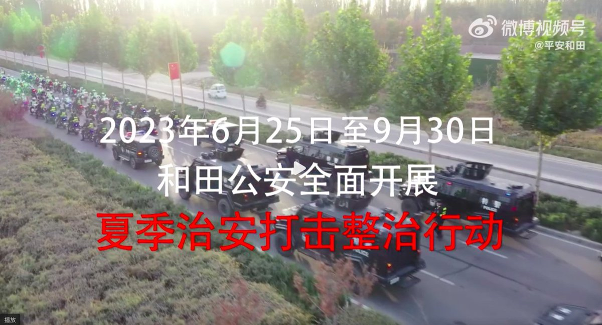
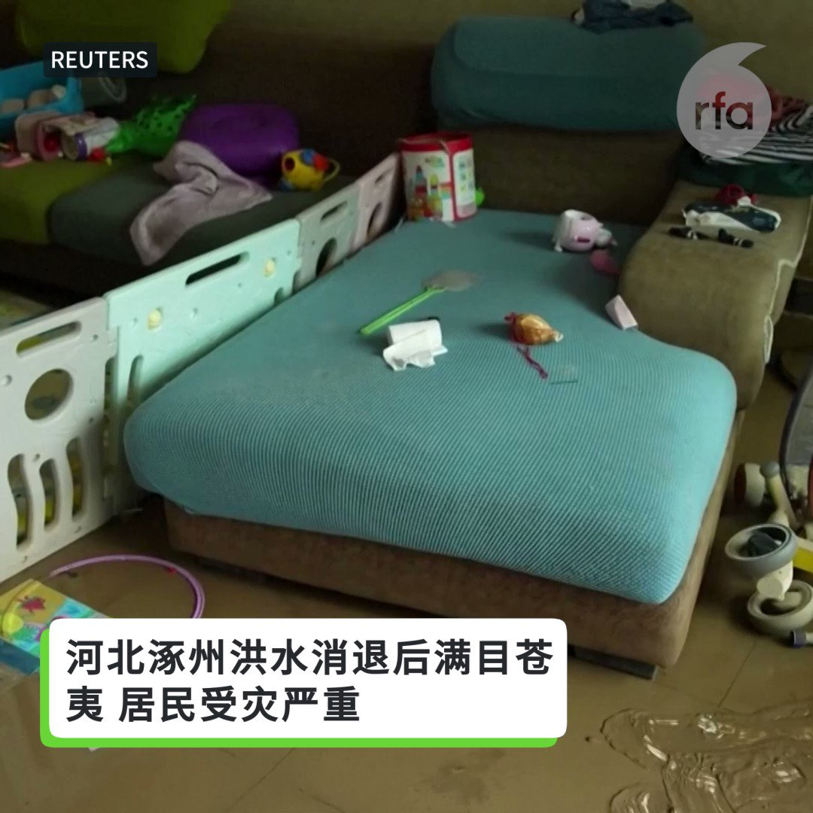
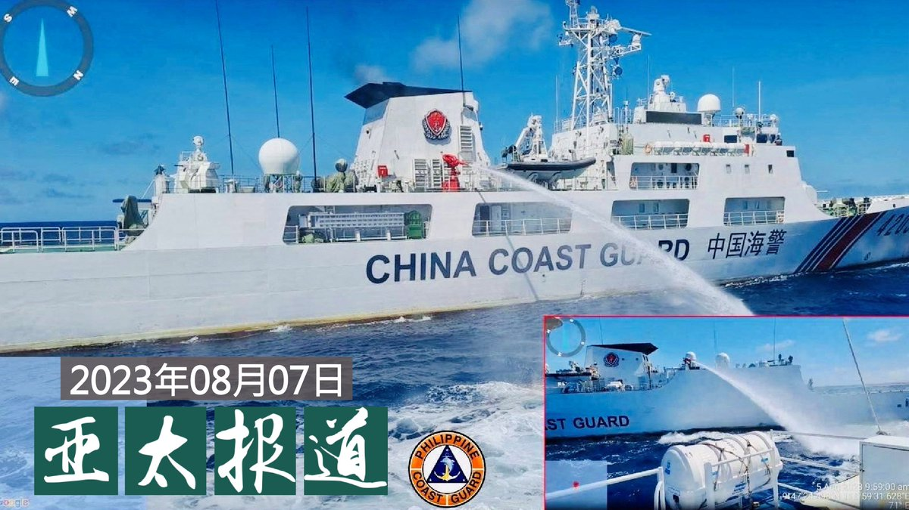
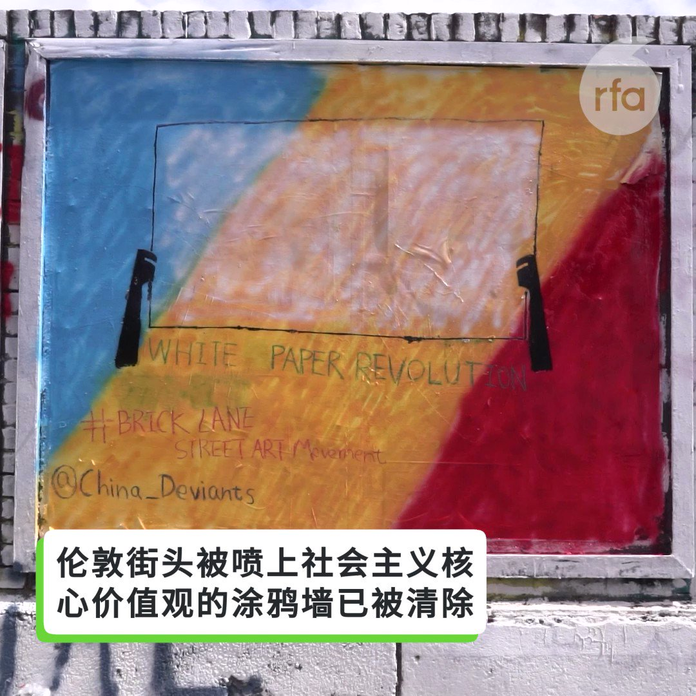

自由亚洲电台 北京时间 2023-08-08T19:36:18Z 1688876788506923008 【日前首相麻生吁各国有迎战准备】
【愿台新总统能决心护台】
日本前首相、自民党副总裁麻生太郎8日在台北出席"凯达格兰论坛"表示，日本正面对二战后，最严峻和复杂的安全问题，他不点名提到日本的邻国，正在快速进行武器发展。从乌克兰战争看到，同样以武力单方面改变现状的情况，有可能在东亚地区发生。
麻生太郎表示，台海不应该发生战争，因此台湾要有足以在必要时阻止战争发生、具威慑的防卫能力和意志，以维持台湾的和平繁荣。他希望，台湾明年的新总统当选人，能有决心保护台湾，对抗外部压力。

#麻生太郎
#台海危机
#台湾
#总统   自由亚洲电台 北京时间 2023-08-08T14:26:35Z 1688798845910781952 【河北东北洪灾“人祸”持续】
【霸州泄洪引发民怨爆警民冲突】

华北东北一带水灾持续超过一星期，多地“人祸”持续。其中河北霸州泄洪引发民怨，连日示威包围市政府大楼，向当地官员讨说法，但被现场维稳的警察喷射辣椒水袭击，有人头部流血。

有民众冲入政府大楼大堂指责官员“为向习近平表忠心”、“为保地势低洼的雄安”，无视百万群众安全。

早前河北启用7处蓄滞洪区分洪，包括位于廊坊霸州的东淀蓄滞洪区于8月1日启用，霸州有民众控诉泄洪令当地大面积被淹，数万人家园被毁，但《央视》的报道却指是降雨导致“积水”。

霸州数百名民众在8月4日开始到市政府大楼抗议，他们高举“还我家园，明明是泄洪原因，却说降雨所致”的横幅，并一度与在场警察爆发冲突。

#华北水灾
#泄洪保雄安
#霸洲示威
#警民冲突   自由亚洲电台 北京时间 2023-08-08T15:18:56Z 1688812019989069824 【南疆“严打” 150名维吾尔族遭拘押】 
【两千多人送学习班】 
新疆 #和田地区 警方的夏季“#严打”行动，官方公告主要针对非法聚会、恶意造谣、散播谣言,诽谤等九类违法犯罪行为。据海外维吾尔维权组织披露，在此行动前，官方已拘捕近150名 #维吾尔 族人，最小的13岁。另有两千多人被强制性接受教育。当地警方对本台查询三缄其口。https://t.co/yNYcNIBifP   自由亚洲电台 北京时间 2023-08-08T07:30:01Z 1688694012042268679 评论 | #余杰：日本和韩国会加入中国版的"#大东亚共荣圈"吗？
 https://t.co/p8vjAcnj31   自由亚洲电台 北京时间 2023-08-08T13:07:13Z 1688778872249110528 RT @RFA_Chinese: 伦敦街头有一段很有名的红砖涂鸦墙，上面有一些很有才气的街头艺术家的涂鸦画作。日前，一些中国留学生先清除别人的涂鸦作品再，用红色喷漆写下“富强、民主、文明、和谐、自由、平等、公正、法治、爱国、敬业、诚信、友善”24个代表“社会主义核心价值观”的大…   自由亚洲电台 北京时间 2023-08-08T13:08:36Z 1688779219348664321 RT @RFA_Chinese: 【三大官媒高调赞习近平指挥抗洪】
【涿州限制发布灾情消息】
上周六，人民日报、央视及新华社突然打破沉默，发表歌颂 #习近平 指挥北京 #抗洪 救灾，但未提重灾区河北… https://t.co/GdvqzupoSR   自由亚洲电台 北京时间 2023-08-08T13:08:58Z 1688779310037921792 RT @RFA_Chinese: 【英国涂鸦墙被中国社会主义核心价值观覆盖】
【后有人“补笔”质疑中国无自由】

“富强、民主……”中国社会主义核心价值观 被涂鸦在墙上，乍看之下或以为这里是中国，其实这里是英国伦敦红砖巷（Brick Lane）。… https://t.co/d…   自由亚洲电台 北京时间 2023-08-08T09:36:54Z 1688725944939286530 RT @RFA_Chinese: 【#万润南（上）：习近平是坏皇帝 邓小平是好皇帝｜观点】
https://t.co/sDzbXxgyRu
旅居巴黎的原 #四通 创始人万润南，是1980年代最有影响力的中国企业家。他说，邓小平是个悲剧人物。89年血腥屠杀是邓政治生命中的污点，但…   自由亚洲电台 北京时间 2023-08-08T09:39:47Z 1688726667013873664 RT @RFA_Chinese: 【#亚太报道（2023-8-7）】
欢迎收听和订阅播客【亚太报道】 https://t.co/MjLNSvVMqc

#伦敦涂鸦墙事件 主角声称被 #网暴 / #中方水炮袭击菲律宾船舰 招致谴责 / 官媒高调赞扬 #习近平指挥抗洪 / 中纪委严…   自由亚洲电台 北京时间 2023-08-08T04:52:28Z 1688654361432674306 7月下旬台风“杜苏芮”的到来，引发了破纪录的持续时间异常长的降雨，北京西南部城市涿州首当其冲，遭遇了数十年来最严重的风暴袭击。随着周末洪水开始下降，当地居民表示，他们的挑战才刚刚开始。 https://t.co/9rnbmuf1o1   自由亚洲电台 北京时间 2023-08-08T04:58:46Z 1688655948364312576 中菲 #仁爱礁 摩擦后，美国国务院在声明中表示，中方此举违反国际法，威胁地区和平与稳定，呼吁中方遵守南海仲裁案裁决。此外，美方还对菲律宾合法海洋活动表示支持，并说中方对菲方海警的武装攻击将触发《#美菲共同防御条约》。
与此同时，英国、澳大利亚、加拿大和日本等国也对这一摩擦表达了关切。   自由亚洲电台 北京时间 2023-08-08T04:59:53Z 1688656227809841152 本台7日早上联系到本名“王汉铮”的“#一鹊”。他爽快答应当面接受采访，然而当记者到达英国皇家艺术学院后，#王汉铮 却没有现身，在电话中表示，目前“事情很多”，现阶段不想接受采访。他向本台透露，在国内的家人没有受到来自政府的压力，却遭受“网暴”攻击，被网民电话滋扰。

  https://t.co/fiKazYM9vk   自由亚洲电台 北京时间 2023-08-08T06:00:01Z 1688671362020499456 评论 | #何清涟 @HeQinglian： 经济 #全球化：美中双引擎正分道扬镳
 https://t.co/4xV7OYVMTf   自由亚洲电台 北京时间 2023-08-08T06:29:06Z 1688678682427006976 RT @RFA_Chinese: 本台7日早上联系到本名“王汉铮”的“#一鹊”。他爽快答应当面接受采访，然而当记者到达英国皇家艺术学院后，#王汉铮 却没有现身，在电话中表示，目前“事情很多”，现阶段不想接受采访。他向本台透露，在国内的家人没有受到来自政府的压力，却遭受“网暴”攻…   自由亚洲电台 北京时间 2023-08-08T06:30:01Z 1688678912681979908 评论 | 王丹 @wangdan1989：#河北洪灾 反映出的四个问题
 https://t.co/pTZAGa5pEs   自由亚洲电台 北京时间 2023-08-08T07:00:09Z 1688686495178412039 【#亚太报道（2023-8-7）】
欢迎收听和订阅播客【亚太报道】 https://t.co/MjLNSvVMqc

#伦敦涂鸦墙事件 主角声称被 #网暴 / #中方水炮袭击菲律宾船舰 招致谴责 / 官媒高调赞扬 #习近平指挥抗洪 / 中纪委严打 #医疗腐败 / 律师 #卢思位 被老挝当局调查 https://t.co/tyjUR9suaQ   自由亚洲电台 北京时间 2023-08-08T08:00:01Z 1688701562993221637 评论 | #胡平：今年的 #拜习会 还有戏吗？
 https://t.co/om5V0DyhCl   自由亚洲电台 北京时间 2023-08-08T08:12:19Z 1688704658385358848 日前，河北 #涿州水灾 的救援现场视频被民众质疑为摆拍。有受访者向本台表示，这一现象使他想起了中国当局在 #大跃进 中的行为。

 https://t.co/3LgWDMFbFg   自由亚洲电台 北京时间 2023-08-08T08:54:12Z 1688715195378434048 中国会像日本那样“失去XX年”吗？或者，已进入这一进程？诺奖经济学者保罗·克鲁格曼最近在《纽约时报》发文表示不以为然。

“如果中国正走向经济放缓，一个有趣的问题是，它能否复制日本的社会凝聚力——在不造成大规模痛苦或社会不稳定的情况下管理较低增长的能力。我绝对不是中国问题专家，但是，有任何迹象表明中国，特别是在一个不稳定的专制政权下，有能力做到这一点吗？请注意，中国的青年失业率已经比日本高得多。”

您认为 #中国 能向 #日本 学些什么？   自由亚洲电台 北京时间 2023-08-08T04:39:39Z 1688651138483236864 《华盛顿邮报》6日援引美国官方数据指出，今年前5个月，#美国从中国的进口 年减24%；墨西哥已成为美国最大贸易伙伴，同时墨西哥、越南、泰国正逐渐取代中国作为 #全球制造业中心 的主导地位。
  https://t.co/zxLFkE0RGe   自由亚洲电台 北京时间 2023-08-08T04:57:24Z 1688655605333110786 https://t.co/tZqc3SOPsd   自由亚洲电台 北京时间 2023-08-08T05:30:01Z 1688663811648270336 专栏 | #夜话中南海：#秦刚 如果进秦城只会是因为 #习近平 对他的爱之深变成了恨之切
 https://t.co/6HYc6EHK2l   自由亚洲电台 北京时间 2023-08-08T06:04:03Z 1688672375569534977 伦敦街头有一段很有名的红砖涂鸦墙，上面有一些很有才气的街头艺术家的涂鸦画作。日前，一些中国留学生先清除别人的涂鸦作品再，用红色喷漆写下“富强、民主、文明、和谐、自由、平等、公正、法治、爱国、敬业、诚信、友善”24个代表“社会主义核心价值观”的大字。

不过，本台记者8月7日再访伦敦红砖巷，发现墙上出现各种各样争取民主、自由和反共标语号，原本小粉红的24个大字已被盖过。   自由亚洲电台 北京时间 2023-08-08T02:48:02Z 1688623046574354433 去年从香港监狱获释的前香港网路电台主持人 #杰斯(原名 #尹耀升)和曾经合作主持节目的拍档 #桑普 再度合作。两人于加拿大首度举办对谈会，与加拿大港人分析香港情势和港人要面对的挑战。两人强调，全球港人要拒绝遗忘、坚持抗争，终能迎来一个重生的香港。

 https://t.co/Q9WjgCrhHf   自由亚洲电台 北京时间 2023-08-08T03:04:44Z 1688627252618211330 #北京红十字会 为 #水灾募捐 遭嘲讽
林生亮：“官方一再声明的潜台词是要相信官方。从民众的角度理解就是越不能相信他们。如果公开透明就没有 #郭美美事件，如果高效运转就没有人祸大于天灾，请把贪官的钱用于3救灾。”

 https://t.co/OGCcNE7TJZ   自由亚洲电台 北京时间 2023-08-08T04:00:01Z 1688641163853705223 中国官方表示，欢迎欧盟外交与安全政策高级代表博雷利今秋率团访华并举行战略对话，为中欧领导人会晤做好政治准备。
 https://t.co/3DK29vMfhB   自由亚洲电台 北京时间 2023-08-08T01:05:32Z 1688597252770861056 财经评论人利世民表示，虽然中国官媒这次没有就事件表态，但值得留意几年前"#别让李嘉诚跑"的文章，是某程度上代表官方声音，这次网上对李嘉诚的批评，可能也是同样情况。

 https://t.co/GL1W9GlWPq   自由亚洲电台 北京时间 2023-08-08T01:47:02Z 1688607698705854464 上海医疗系统人士张宁7日告诉本台：“今天医药股都暴跌，大公司都跌5%。要严打过去20年，2003年开始算起，医院有电脑记录是从2003年开始，上下游一起打。整个一条利益链，不仅是纯买药。从早上开始，驻医院的医疗代表开始给医生、院长买咖啡，从早到晚，医生要吃饭、喝酒的” https://t.co/srxYfnsRWl   自由亚洲电台 北京时间 2023-08-08T01:59:04Z 1688610727458754560 美国人权组织"对华援助协会"透露，在老挝被捕的中国维权律师 #卢思位 正接受调查。据了解，无论卢思位有没有违反老挝法律，最终都很可能被遣返回中国。卢思位的家属则促请老挝当局将调查和审讯过程对外公开。
https://t.co/1VNQZUSK2n   自由亚洲电台 北京时间 2023-08-08T02:01:15Z 1688611273297244166 美国人权组织"对华援助协会"透露，在老挝被捕的中国维权律师 #卢思位 正接受调查。据了解，无论卢思位有没有违反老挝法律，最终都很可能被遣返回中国。卢思位的家属则促请老挝当局将调查和审讯过程对外公开。   自由亚洲电台 北京时间 2023-08-08T00:15:52Z 1688584755254833152 #赖清德 后援会近日在澳大利亚多地成立分会。民进党籍立委邱议莹、该党前秘书长罗文嘉以及现任中执委许菡芸等亲自前往布里斯班、悉尼以及墨尔本等地，出席当地"信赖之友会"的活动。他们指出, 明年大选除了攸关台湾民主政治的存续, 还将牵动印太区域甚至全球的安全稳定。

 https://t.co/EOKBcGgvKJ   