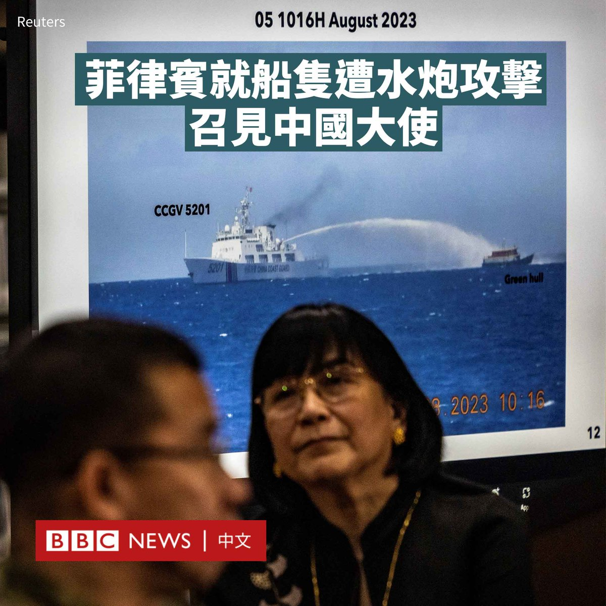
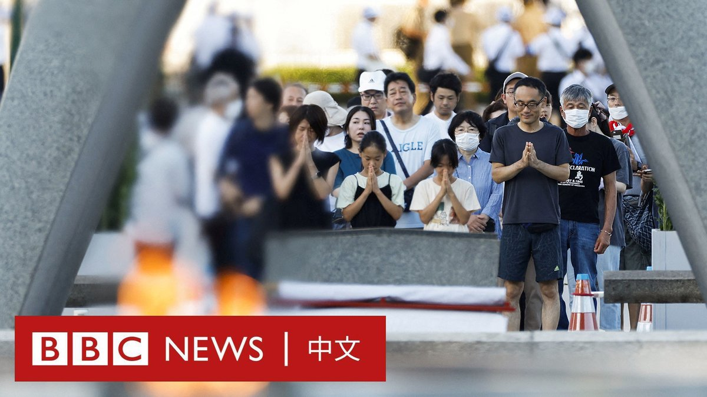
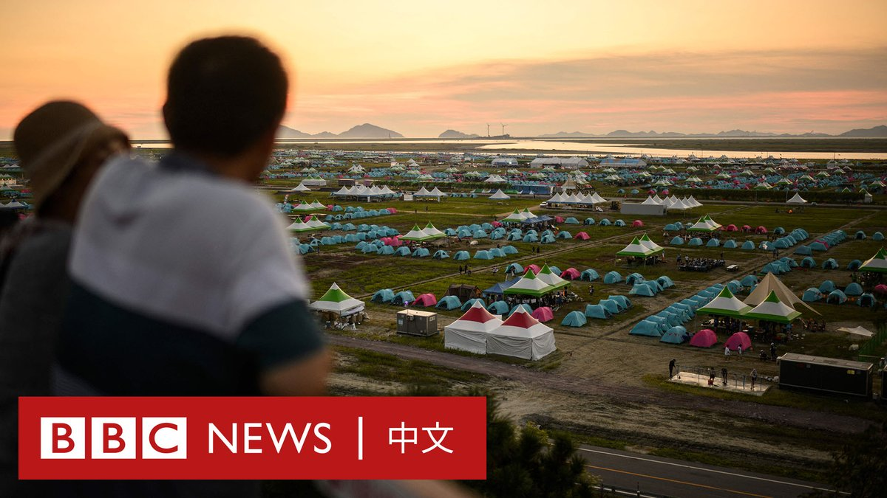
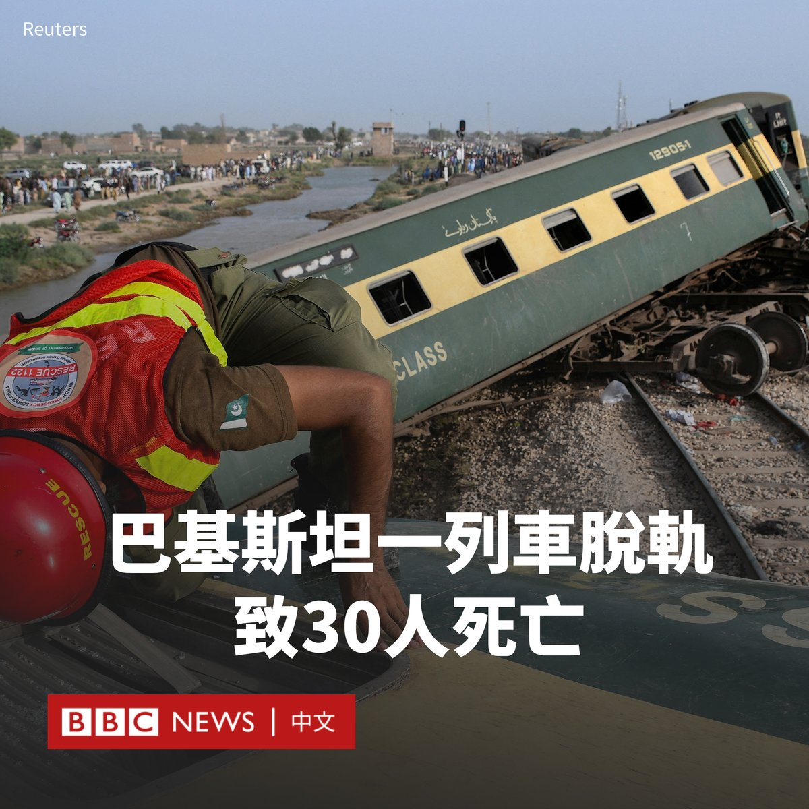
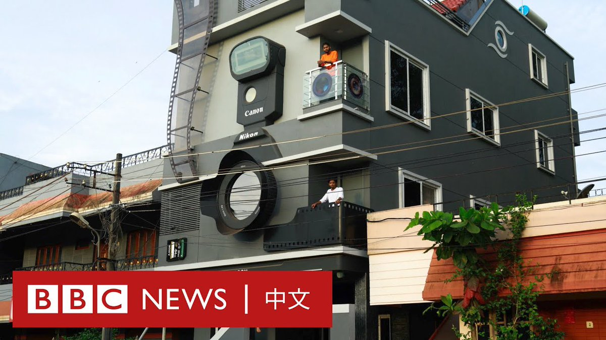
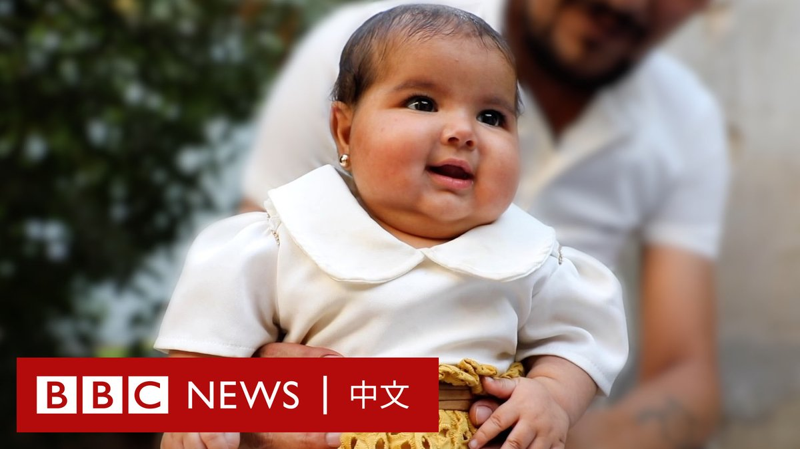

D英国广播公司BBC 北京时间 2023-08-07T22:53:48Z 1688564102208315392 在中国海警船在南中国海争议地区向菲律宾船只发射水炮并进行阻拦后，菲律宾总统小马科斯（Ferdinand Marcos）周一（8月7日）表示已召见中国驻菲律宾大使黄溪连。

小马科斯跟记者说：“我们的外交部长今天召见黄大使，并提出口头照会，其中包括有关所发生事件的照片和影片，我们正在等待他们的答覆。”

这起事件发生在周六（8月5日），当时菲律宾海岸防卫队正在护送数艘补给船，为驻扎在第二托马斯礁（中国称仁爱礁）上的菲律宾士兵运送物资。

菲律宾军方和海岸防卫队指控中国海警在补给任务中进行拦截并发射水炮，指中国的行为“非法”。

华盛顿也谴责北京的“危险行动”，指责中国对“南中国海现状的一再威胁直接危及地区和平与稳定”。

美国国务院在一份声明中说，美国重申对菲律宾公共船只、飞机和武装部队的任何攻击，包括其在南中国海的海岸警卫队，都会招致美国根据美菲共同防御条约的回应。

中国外交部周一回应称，1999年，菲律宾派一艘军舰在仁爱礁非法“坐滩”，菲方多次承诺将拖走该军舰，但尚未履行承诺。8月5日，菲律宾派船企图向非法“坐滩”军舰运送用于大规模维修加固的建筑物资，这侵犯了中方主权。

“中国海警船依法予以拦阻，并采取了警示性执法措施，现场操作专业、克制，无可非议。”中国外交部在一份声明中称。

长期以来，中国对南中国海的绝大部分海域提出主权声索，但越南、菲律宾、马来西亚、文莱等国均提出质疑。

海牙国际仲裁法院曾于2016年作出裁决，称中国不享有“九段线”的历史性权力，中方不承认有关裁决。   D英国广播公司BBC 北京时间 2023-08-07T19:00:48Z 1688505467386175488 周日（8月6日）是二战美军在广岛投下原子弹78周年，约五万人参加了日本广岛和平纪念公园的户外仪式。

今年的纪念活动临近之际，与该段历史相关的《奥本海默》在世界多地院线上映，但暂未在日本放映。而另一部火爆的电影《芭比》则因官方账号对于一个有核爆场景的表情包的回复在日本引发愤怒。 https://t.co/Da4mWSirQI   D英国广播公司BBC 北京时间 2023-08-07T21:15:24Z 1688539340253900800 周一（8月7日），世界童军运动组织宣布在韩国举办的第25届世界童军大露营因台风“卡努”来袭提前结束活动。此次童军大露营活动一波三折，在开营不久就遭遇极端炎热的天气，致使数百名的童军中暑。 https://t.co/AkT4A4K7eW   D英国广播公司BBC 北京时间 2023-08-07T16:41:47Z 1688470481161347072 美国社交媒体名人塞纳特（Kai Cenat）周五（8月4日）在纽约市一个公园举行赠送PS5游戏机的活动，引发参与者与警方的混战。警方最终以涉嫌煽动骚乱和非法集会等罪名将塞纳特拘捕。 https://t.co/LPaEd0L8JN   D英国广播公司BBC 北京时间 2023-08-07T20:12:32Z 1688523517250187264 《爱尔兰光明报》坚信新冠疫苗背后有不可告人的阴谋，一位否认儿子死于疫苗的母亲被该报主编指控参与“规模庞大的诈骗”。https://t.co/WFddzO67xq   D英国广播公司BBC 北京时间 2023-08-07T17:51:14Z 1688487957794312192 Meta老板扎克伯格（Mark Zuckerberg）表示，他已经提议在8月26日与马斯克（Elon Musk）进行“笼斗”，但对比赛能如期进行并不抱有太大期望。

他在Meta新推出的社交平台Threads上发帖说：“我今天准备好了，当他第一次提出挑战时，我已提议8月26日进行，但他还没有确认。”

今年6月，两名科技大亨约定将进行一场“笼斗”。马斯克曾表示希望在美国拉斯维加斯的八角笼封闭擂台进行。

此前，马斯克在前身为推特（Twitter）的社交平台“X”上发帖声称自己为了备战，整天都在训练。

马斯克则回应称： “确切日期仍然有变”，因为他刚对颈部和上背部做了核磁共振成像。

“可能需要在决斗前进行手术。这周将会知道。”他写道。

近几个月来，这两位社交媒体巨头一直在相互挑衅，马斯克还声称他们的拳赛将X上进行直播，并会将比赛的所有收益将捐给退伍军人慈善机构。

当一位X用户问到比赛的目的时，马斯克回答说：“这是一种文明的战争形式，男人喜欢战争。”

扎克伯格也回应了比赛将在X上进行直播的建议，他发帖说：“难道我们不应该使用一个更可靠的平台来实际为慈善事业筹集资金吗？”

两人的“约架”引起了社交媒体用户的广泛关注。即将52岁的马斯克此前表示，他要使出“海象”绝技，压在对手身上让对方动弹不得。

与此同时，现年39岁的扎克伯格已经开始练习综合格斗（MMA），并于最近在一场柔术赛事中获胜。   D英国广播公司BBC 北京时间 2023-08-07T12:23:19Z 1688405436037533696 巴基斯坦警方发言人证实，该国南部一列火车脱轨已造成至少30人死亡、100人受伤。

这班从卡拉奇开往阿伯塔巴德的哈扎拉快车（Hazara Express），在途经讷瓦布沙阿的撒哈拉站时，在车站附近侧翻。

一些乘客从翻倒的车厢里艰难爬出。受伤乘客被转移到附近医院。救援队试图将被困的人们从变形的残骸中救出。

一名幸存乘客告诉BBC乌尔都语，他看到许多妇女和儿童躺在地上。

铁路部长萨阿德·拉菲克（Saad Rafiq）表示，初步调查显示火车当时以正常速度行驶，他们正在试图确定导致脱轨的原因。他补充说，这可能是机械故障或破坏的结果。当局否认当时铁轨被洪水淹没。

卡拉奇铁路发言人表示，至少有八节车厢脱轨。

他表示，军队和准军事部队以及救援人员前往现场营救被困在火车车厢内的乘客。   D英国广播公司BBC 北京时间 2023-08-07T13:51:54Z 1688427727723106304 住进相机里是什么感觉？📷

在印度南部的卡纳塔克邦，一名对相机充满热情的男子建造了一座酷似相机的房子。甚至，他的三个儿子的名字也来自相机品牌。 https://t.co/SiCuEWcNqq   D英国广播公司BBC 北京时间 2023-08-07T09:32:20Z 1688362406454673408 阿芙拉被称为 “奇迹宝宝”。在2023年2月叙利亚西北部发生大地震后，她在一栋倒塌的建筑物下出生的画面广为流传。当时，她的脐带还与妈妈相连，但母亲已经去世。

如今，这个六个月大的女婴已被她的舅舅和舅妈收养，他们向BBC讲述了对阿芙拉未来的期望。 https://t.co/8oMQCWkLxH   