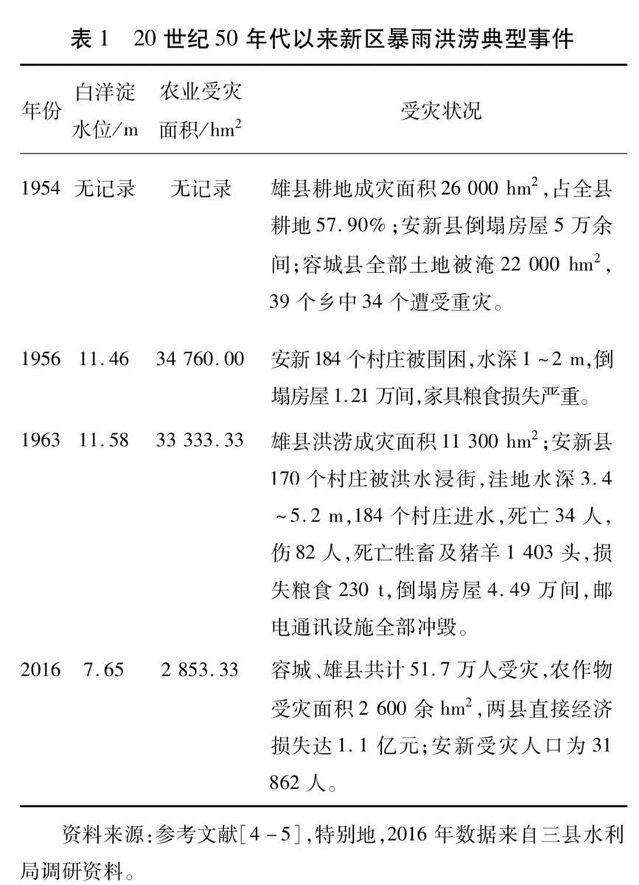
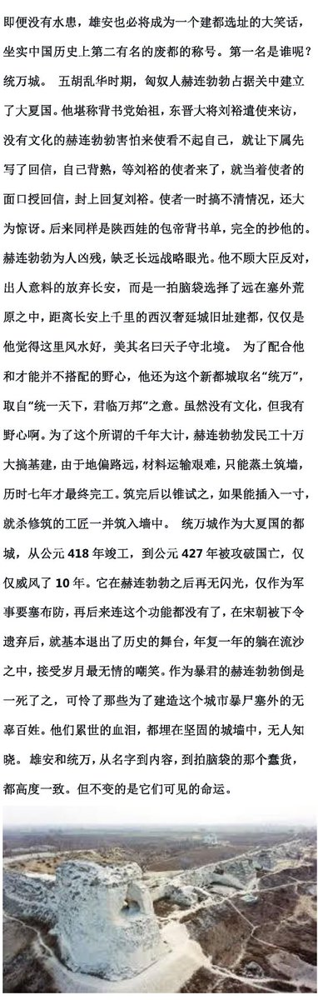
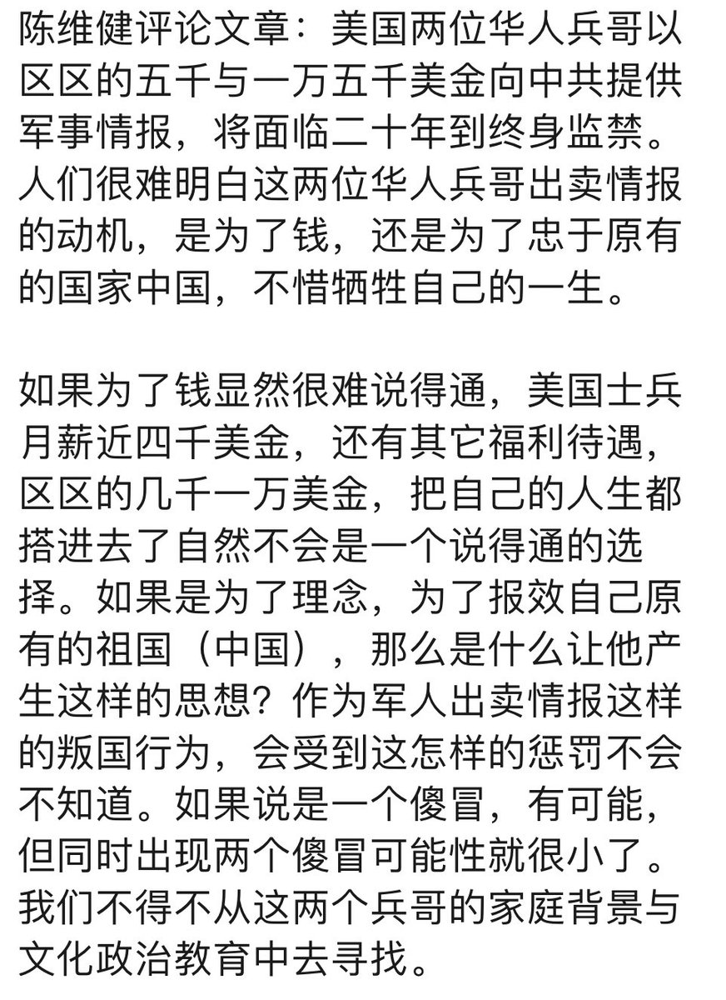
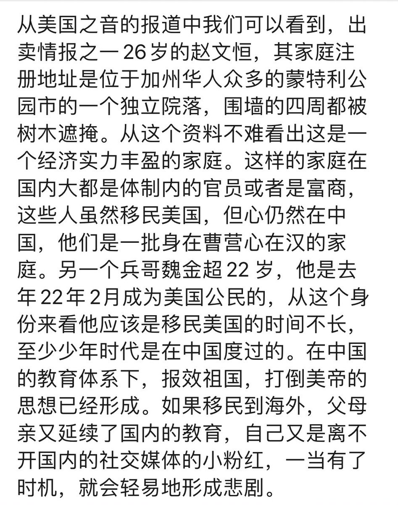

Petrichor 北京时间 2023-08-07T23:45:08Z 1688577021163569152 中国经济从来就不是经济。这样的政治氛围，谁敢投资、如何经商？极权与资本从来是不能共存的，资本主义要求政府与资本家分权，而极权统治者不会同意，否则就不是独裁者了。一旦资本做大，独裁者一天就会锤毁一个行业。所以，独裁统治必然要消灭私有制，要得是溥天之下，莫非王土，率土之滨，莫非王臣。 https://t.co/1BWuwzlRuI   Petrichor 北京时间 2023-08-07T11:46:18Z 1688396118176972800 马也不喜欢的颜色组合。 https://t.co/idKF3CNHVw   Petrichor 北京时间 2023-08-07T11:44:50Z 1688395750592466944 若要所在国不排华，华人必须忠诚自己的国家，不当外国代理人，坚持普世价值，对于那些为了蝇头小利用“侨领”头衔做起外国代理人，要划清界线、予以斗争，坚决抵制他们的活动。 https://t.co/bE18RapF3a   Petrichor 北京时间 2023-08-07T11:57:15Z 1688398875780952064 雄安新区暴雨洪涝的历史记录。空间上，偏涝年份，区域内滨临河湖、地势低洼地段容易被淹没，约占全区面积的20%~30%，而特大洪涝年份，除了容城县地势较高之处，雄安新区约80%面积被淹没。雄安副都注定烂尾。 https://t.co/YYNbZ8yaVp   Petrichor 北京时间 2023-08-07T10:05:14Z 1688370683779166208 北京西山被洪水过过的车变啥样了？ https://t.co/nLnqvfLwgL   Petrichor 北京时间 2023-08-07T04:30:33Z 1688286460636491776 二位华人美国兵出卖军事情报，对所有的中国移民家庭敲响了警钟，移民海外的华人，如果爱孩子就应该教育他们忠于所在的国家，当然这并不是说不可以爱以前的祖国，但爱不可以出卖新加入的国家为前提。专家分析，哪些父母组织同乡会商会的做外国代理人的子女，尤其危险。父母对孩子言传身教，错不知错。 https://t.co/5CJlrfqTHh   Petrichor 北京时间 2023-08-07T01:47:14Z 1688245359078780928 中国官方报道：“涿州市受災人數133913人，0死亡，0失聯”。洪水退去，才现尸体。 https://t.co/VLOyIxr8ok   