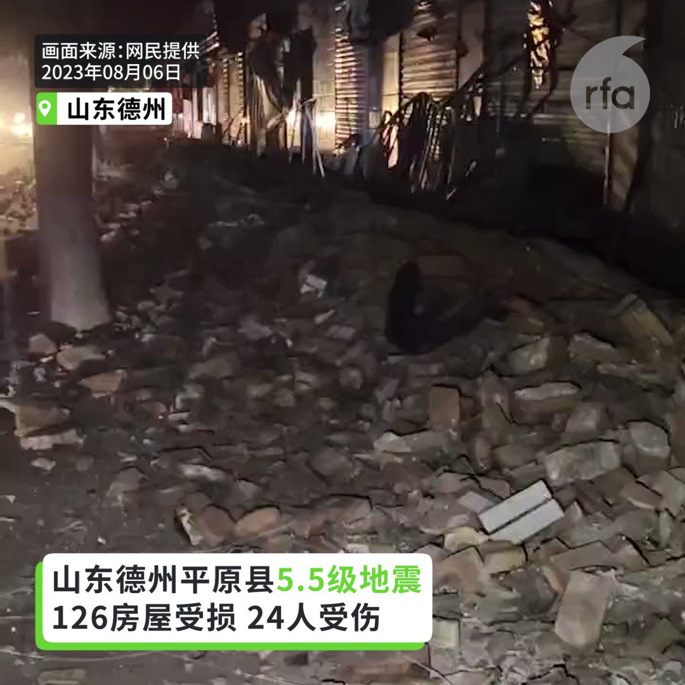
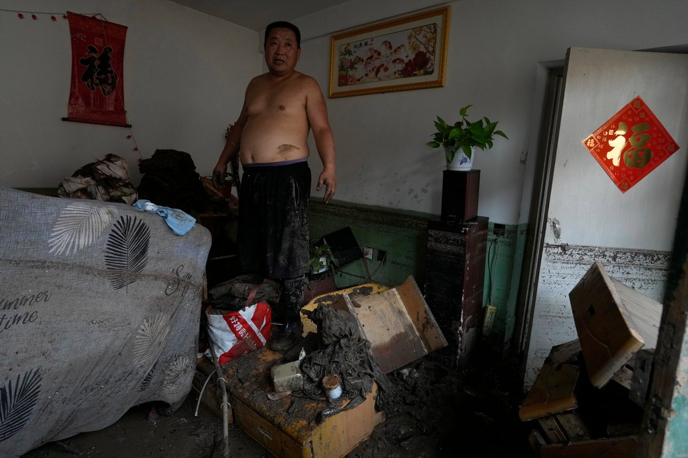

自由亚洲电台 北京时间 2023-08-07T16:05:07Z 1688461251444387840 【三大官媒高调赞习近平指挥抗洪】
【涿州不准发疫情消息】
上周六，人民日报、央视及新华社突然打破沉默，发表歌颂 #习近平 指挥北京 #抗洪 救灾，但未提重灾区河北 #涿州。涿州市委宣传部要求下属单位和企业职工，不擅自发布涉灾情、汛期信息，不擅自接受外省记者采访。宣传部还说，发现部分救援人员在救援过程中，将救援过程及周边影像“恶意对外直播”。
https://t.co/PC5EGLA0JC   自由亚洲电台 北京时间 2023-08-07T14:17:10Z 1688434084648034304 【山东德州发生5.5地震】
【老师急带学生马路避难 保安请示上级才敢开门】
#山东 #德州 市平原县6日凌晨2点半，发生规模5.5 #地震，震源深度10公里，目前估计126处房屋倒塌，数十人受伤。华北多处有感。震央在德州市平原县王打卦镇王打卦村，许多村民房屋倒塌。 https://t.co/NHeKnDea8t   自由亚洲电台 北京时间 2023-08-07T09:53:34Z 1688367750341615617 RT @RFA_Chinese: 北京及河北省遭遇特大洪水，涿州受灾最重，部分地区水深9米，民众质疑当局为保雄安而泄洪所致。 中共河北省委书记倪岳峰强调，河北要“坚决当好首都护城河”。他还表示，雄安新区建设是“千年大计、国家大事”，安全不容有失。
网上骂声一片，百姓苦啊，做韭菜…   自由亚洲电台 北京时间 2023-08-07T10:19:52Z 1688374366902636544 专栏 | #周末茶馆：中国异议人士孩子受迫害　#人道中国 向联合国递交报告
 https://t.co/M15zAV8oFl   自由亚洲电台 北京时间 2023-08-07T10:20:52Z 1688374620167278592 专栏 | #解读新疆：日本 #维吾尔 族女性赢得国会席位；又有两家中国公司商品被禁
 https://t.co/UcN0ffyz6Q   自由亚洲电台 北京时间 2023-08-07T06:43:53Z 1688320012728307712 据中国民间权益组织“民生观察”发布的消息，8月5日早上，河北省霸州市东杨庄村民前往市政府抗议当局故意泄洪，却在现场遭到手持警用盾牌的众多“黑衣人”殴打，双方发生激烈冲突。 https://t.co/WoMnLuD0lp   自由亚洲电台 北京时间 2023-08-07T06:44:26Z 1688320151643643904 台湾执政党民进党的大选参选人、副总统赖清德本周日表示，2024年大选不仅是民主与极权间的选择，更是在敌人与朋友间的选择，台湾不应走回“一中老路”。 https://t.co/Hgbe4VCtE3   自由亚洲电台 北京时间 2023-08-07T03:28:19Z 1688270797050179584 RT @RFA_Chinese: 【#涿州 水位高达六米以上】
【民间救援队伍热心接力 仍难让群众脱困】
北京河北等地 #洪水 袭击。在重灾区涿州，水淹深达6米。有人批评政府 #泄洪 却未及时救人。中国国家防总副总指挥李国英日前强调要确保 #北京、#雄安… https://t.…   自由亚洲电台 北京时间 2023-08-07T05:49:53Z 1688306424613425152 RT @RFA_Chinese: 【#洪水 过后】
8月4日 北京郊区门头沟南辛房村（美联社图片） https://t.co/FDOGzVRX6V   自由亚洲电台 北京时间 2023-08-07T03:26:59Z 1688270461417734144 RT @RFA_Chinese: 【反对老挝政府遣返 #卢思位】
8月2日下午，在美国华盛顿老挝驻美大使馆前，中国民主党，国际人权律师组织、异议人士等联合发起要求释放卢思位律师的活动：反对老挝政府遣返卢思位，抗议中共跨国镇压，要求释放卢思位与家人团聚。 https://t.co…   自由亚洲电台 北京时间 2023-08-07T03:27:07Z 1688270495983001600 RT @RFA_Chinese: 美国8月1日将2家中国企业列入“维吾尔强迫劳动预防法实体清单”，它们是骆驼集团有限公司和晨光生物科技集团有限公司。该禁令将于周三生效。… https://t.co/KGjY8dvX4G   自由亚洲电台 北京时间 2023-08-07T03:27:32Z 1688270599636799489 RT @RFA_Chinese: 亿万富商段伟红消失5年后，在中国重新露面。
据“屏南乡村振兴研究院”与“中国长期照护”微信公众号文章，6月底至7月初，段伟红在福建屏南县参加了乡村振兴研讨会。5月12日，她参观了江苏省南京市的一家养老院。
段伟红曾被称为温家宝家族财富的“白手套…   自由亚洲电台 北京时间 2023-08-07T03:27:40Z 1688270636353748992 RT @RFA_Chinese: 《北京市实施〈中华人民共和国反恐怖主义法〉办法》表决通过，2024年起，无人机要实名登记，不接受安检可拒绝进站搭乘地铁，租车、寄快递等将查验身份……您赞成这些随时查验身份的管理办法吗？ https://t.co/kBpMHdnZX4   自由亚洲电台 北京时间 2023-08-07T03:27:59Z 1688270713206005761 RT @RFA_Chinese: 据半岛电视台报道，7月31日，巴拿马移民局移民局副局长玛丽亚·伊莎贝尔·萨拉维亚 (Maria Isabel Saravia) 向记者表示，自1月份以来，已有超过 248,901 人冒着生命危险穿越了哥伦比亚和巴拿马之间长达265公里的危险地带…   自由亚洲电台 北京时间 2023-08-07T03:28:26Z 1688270829383987201 RT @RFA_Chinese: 【官媒表示：#河北洪水 可能要一个月才能退】
【外地人员去涿州救灾要先获批准】 https://t.co/i9OS0dLPPo   自由亚洲电台 北京时间 2023-08-07T03:28:30Z 1688270845905432576 RT @RFA_Chinese: #中国女足 1：6 不敌英格兰，史上首次世界杯小组出局后，女足一姐 #王霜 在赛后接受采访时的言论引发热议。
“我一直有个问题，为什么我们比欧洲的那些球队练得都更苦，付出的更多，但始终没有拿到想要的成绩？”
“出线了又能怎么样呢？所以这也并不是…   自由亚洲电台 北京时间 2023-08-07T03:28:48Z 1688270919343702016 RT @RFA_Chinese: 据台媒报道，美国华联会主席林建新8月2日被发现在法拉盛公寓死亡，报道称，据警方初步判定，林建新疑用床单上吊自杀，但3日据部分林建新关系密切者均表示，从他平日及死前一段时间的表现中，难以看出有自杀动机。 https://t.co/pOXHAzj6…   自由亚洲电台 北京时间 2023-08-07T03:28:58Z 1688270959793352704 RT @RFA_Chinese: 【“没想到这么狼籍！”】
60岁北京居民高先生讲诉自己在洪水中失去了一切。台风给北京带来了140年来最严重的降雨和洪水，已造成至少20人死亡，数千人流离失所，并淹没了北京和其他几个城市 https://t.co/sPheT1gfYP   自由亚洲电台 北京时间 2023-08-07T01:00:39Z 1688233634707423232 中国水利部8月6日发布汛情通报，将针对内蒙古、吉林、黑龙江等东北地区省份的洪水防御应急响应由IV级提升至Ⅲ级。 https://t.co/5W9zYuhEtE   自由亚洲电台 北京时间 2023-08-07T01:01:03Z 1688233735974690817 菲律宾军方本周日发布声明，谴责中国海警在南海主权争议水域以水炮袭击菲律宾军用补给船只。中国海警局当天也作出回应，表示此举是“依法实施”的“必要管控”。 https://t.co/mJXIIQRCYp   自由亚洲电台 北京时间 2023-08-07T01:02:54Z 1688234203219984384 RT @RFA_Chinese: 【北京 #河北 持续 #暴雨 红色预警】
【多地山洪暴发汽车被冲走】
#北京 市31日发布洪水 #红色预警，#房山 区大石河流域漫水河断面出现红色预警标准洪水，升级发布洪水红色预警。
7月31日，门头沟因暴雨向永定河泄洪，周边主干道路全部临时管…   自由亚洲电台 北京时间 2023-08-07T01:05:28Z 1688234848748494848 RT @RFA_Chinese: 【大东亚朝贡圈 ｜ “#动物庄园”动画剧场】
“无论头发染黄、鼻修再尖，也变不成西方人。我们要知道，自己的根在什么地方”。龙家大讲特 讲“#亚洲是亚洲人的亚洲”，想搞个“大东亚朝贡圈”。它的东北亚邻居能吃这一套吗？
#大东亚共荣圈  #魂脉 #…   