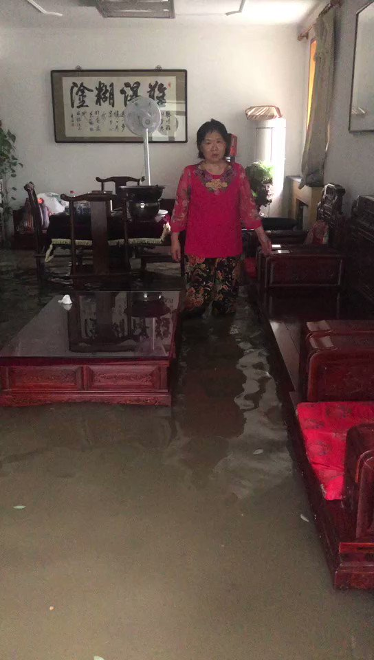

Petrichor 北京时间 2023-08-06T03:44:18Z 1687912432969134081 美国没有泄洪之说，诸如牺牲弗吉尼亚以保首都华盛顿的安全。中国却可随意炸堤分洪，并在极短的时间内使涿州的水位上升到10米高度。二百斤从来不会现身灾区，像江泽民和胡锦涛那样出现在灾区的镜头从来沒有。世界上最怕死的大国领袖，但他在事情有些进展时说自己是：“亲自部署，亲自指挥”。   Petrichor 北京时间 2023-08-06T00:26:16Z 1687862595011895296 “难得糊涂”的横幅，很迎接。当你家变成游泳池，呢还“糊涂”吗？清醒了？ https://t.co/rT5gzHzpor   