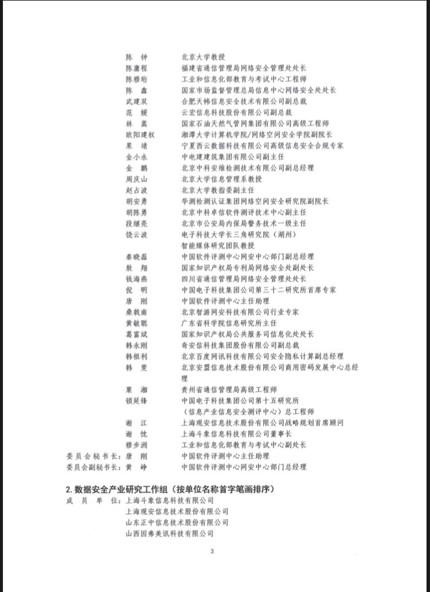

拆墙运动公号 北京时间 2023-08-06T21:52:49Z 1688186367417688065 【#2259专案组 互联网防火墙第065号嫌犯 #唐刚】 
性别：男，1981年10月18日出生
籍贯：四川省中江县
证件：
从业人员证书：
手机号、支付宝：13581842497
学历：北京航空航天大学硕士研究生。
职务：网络安全研究所副所长、
中国软件评测中心主任助理，
北京赛迪网络安全测评工程技术中心有限公司总经理，
高级工程师，
公司地址：北京市海淀区万寿路27号院8号楼1201室
电子邮箱：wangle@ccidgroup.com

  擅长网络加密和监控控制          

 详细资料见：#BanGFW拆墙运动建墙罪犯录（#ban_greatwall）https://t.co/OKCqhSyld7拆墙运动 #BanGFW #反人类罪   