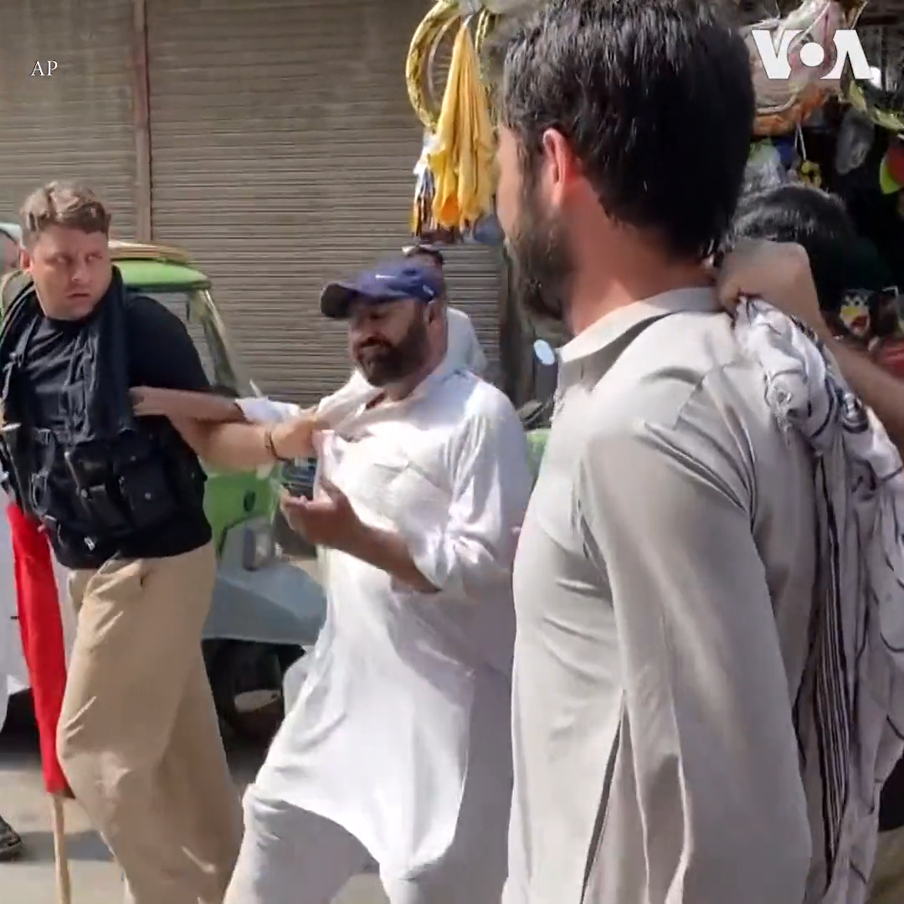

美国之音中文网 北京时间 2023-08-06T00:02:06Z 1687856516215275520 巴基斯坦警方5日逮捕在白沙瓦参加抗议的前总理伊姆兰·汗的支持者。法庭5日判决伊姆兰·汗三年监禁。伊姆兰·汗被指控任职期间非法出售国有礼品。他的正义运动党谴责了这个判决并表示要提出上诉。警方说他们已经从伊姆兰·汗在拉合尔的家中将他逮捕并带到首都伊斯兰堡。 https://t.co/Be3uPG2uig   