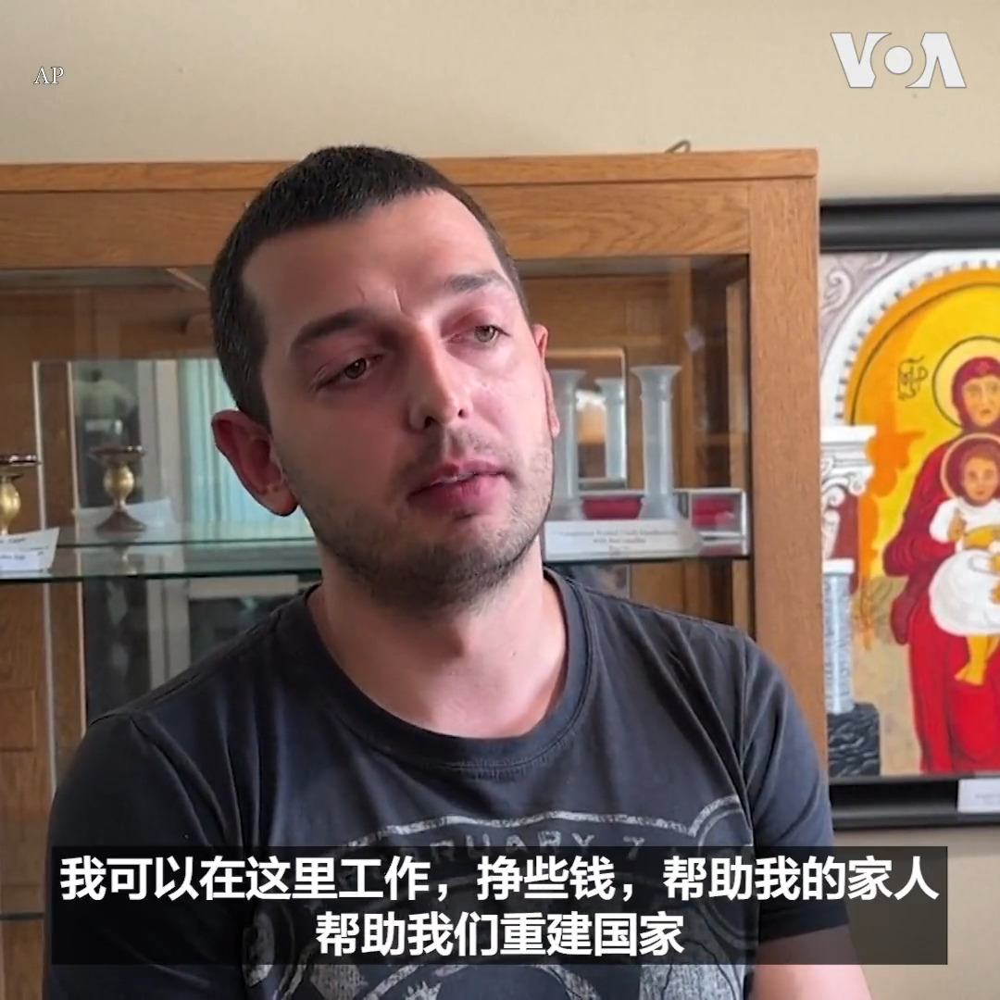
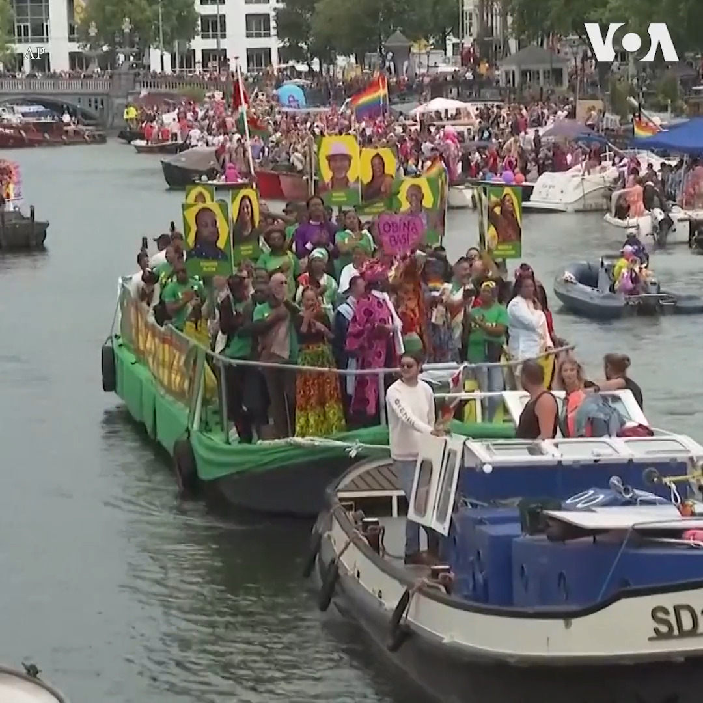

美国之音中文网 北京时间 2023-08-06T20:43:06Z 1688168821855543297 由于低失业率等原因，美国北达科他州石油业一直难以吸引足够的外州劳工到这里工作， 现在他们把目光转向了新的劳工来源--乌克兰难民。 北达科他州石油委员会创建的Bakken GROW通过拜登政府的一个项目为雇主招募乌克兰工人。这个项目给予合格申请者“人道主义假释”，他们可以在美国生活和工作两年。 https://t.co/RCyn0NT32G   美国之音中文网 北京时间 2023-08-06T21:02:32Z 1688173713747857409 美国首都华盛顿东南区5日晚发生街头枪击，造成3人死亡，两人受伤住院。华盛顿市代理警察局长史密斯呼吁社区民众提供相关信息。 https://t.co/sVB9rTpcak   美国之音中文网 北京时间 2023-08-06T16:33:33Z 1688106019279491072 分析：中国对俄乌战争的态度在严峻的现实中出现转变 https://t.co/u7m4GxTXDy   美国之音中文网 北京时间 2023-08-06T18:01:03Z 1688128039786577920 连日暴雨侵袭东北地区 中国提高了洪水防御应急响应级别 https://t.co/DiENUwcH5j   美国之音中文网 北京时间 2023-08-06T12:55:02Z 1688051030054121473 山东省发生5.5级浅层地震 21人受伤、126座房屋倒塌 https://t.co/ud0FMizPix   美国之音中文网 北京时间 2023-08-06T10:52:03Z 1688020077688532992 菲律宾指责中国海岸警卫队向其船只发射水炮 https://t.co/OfKDbssCzk   美国之音中文网 北京时间 2023-08-06T10:23:07Z 1688012798335369216 #美中对标  中国热点对标美国论据，用一杯咖啡的时间聊聊中国热点的美国冷思考。为了成功举办成都大运会，中国举国之力，豪掷千金。相较之下，美国1984年洛杉矶奥运会，完全依靠民间资本，成为现代首次盈利的奥运会。哪种模式对纳税人更负责？本期视频为你介绍民主国家对大型活动的态度。 https://t.co/LPLDJ6urGl   美国之音中文网 北京时间 2023-08-06T07:54:03Z 1687975285319446528 法国防长：尼日尔政变削弱非洲的反恐作战 https://t.co/da18j0V5bH   美国之音中文网 北京时间 2023-08-06T04:44:02Z 1687927466537705472 尼日尔军政府寻求瓦格纳集团帮助对抗外部军事威胁 https://t.co/drFKsrrPNL   美国之音中文网 北京时间 2023-08-06T03:15:03Z 1687905069847715840 俄罗斯油轮在克里米亚大桥附近遭到无人机攻击 https://t.co/3nr1oWOeye   美国之音中文网 北京时间 2023-08-06T01:14:02Z 1687874616898039808 过度依赖煤炭和极端气候可能影响中国减碳计划 https://t.co/4ikNQpAjPE   美国之音中文网 北京时间 2023-08-06T01:20:07Z 1687876149437763586 荷兰首都阿姆斯特丹5日天气有些阴霾，不过运河上数十艘色彩鲜艳的船只给这个城市带来了热闹的气氛。这是为期六天的阿姆斯特丹傲娇节 Pride Amsterdam 最受欢迎的运河游行，今年吸引了来自各 LGBTQIA+团体和其他组织的80多艘船只参加。 https://t.co/siuRaM08Ps   美国之音中文网 北京时间 2023-08-06T00:02:06Z 1687856516215275520 巴基斯坦警方5日逮捕在白沙瓦参加抗议的前总理伊姆兰·汗的支持者。法庭5日判决伊姆兰·汗三年监禁。伊姆兰·汗被指控任职期间非法出售国有礼品。他的正义运动党谴责了这个判决并表示要提出上诉。警方说他们已经从伊姆兰·汗在拉合尔的家中将他逮捕并带到首都伊斯兰堡。 https://t.co/Be3uPG2uig   