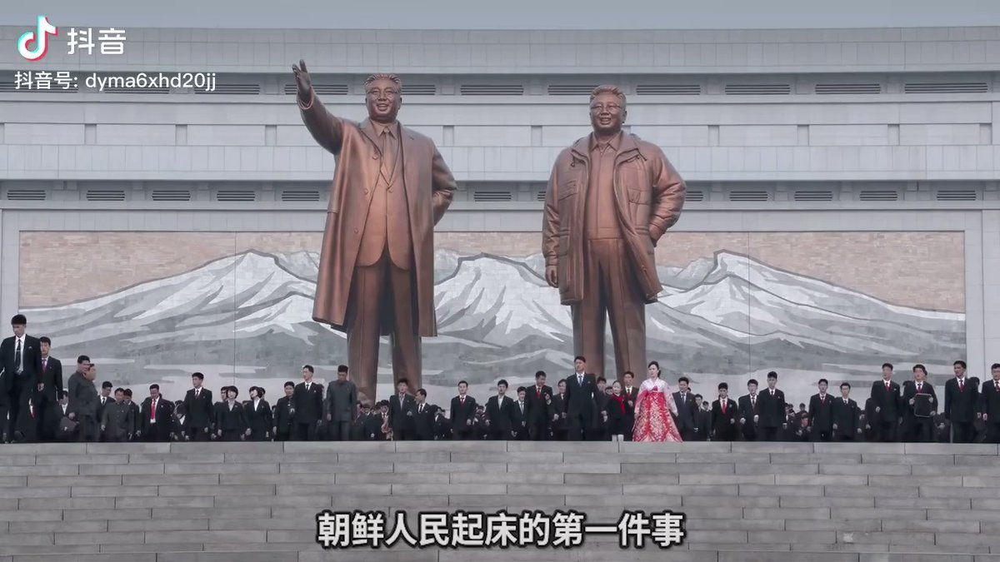
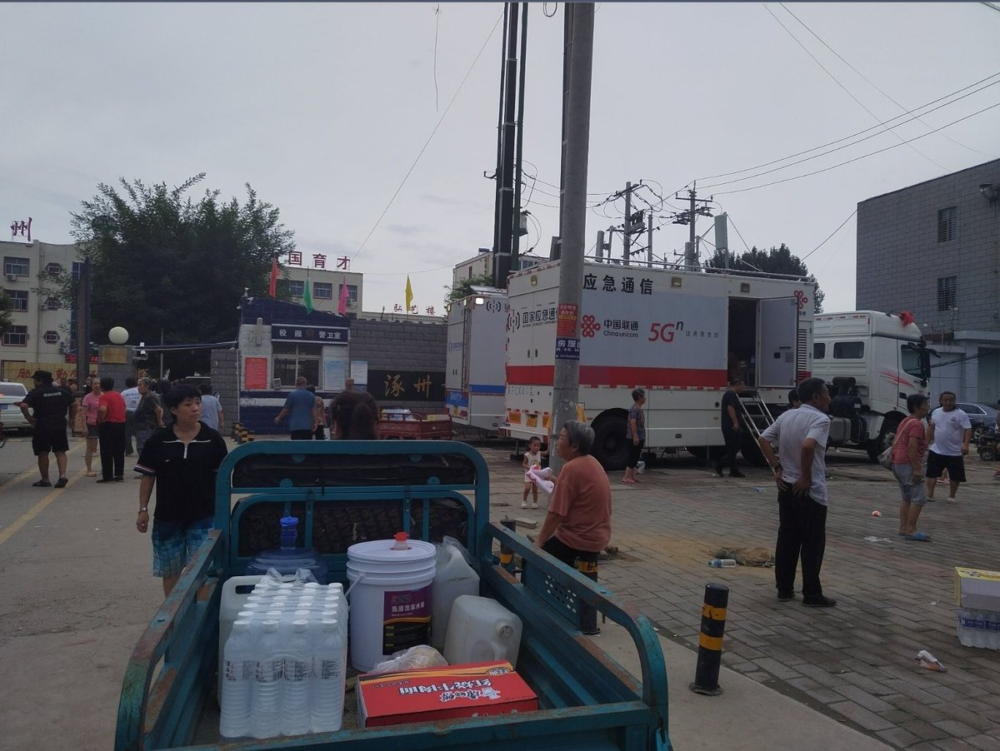
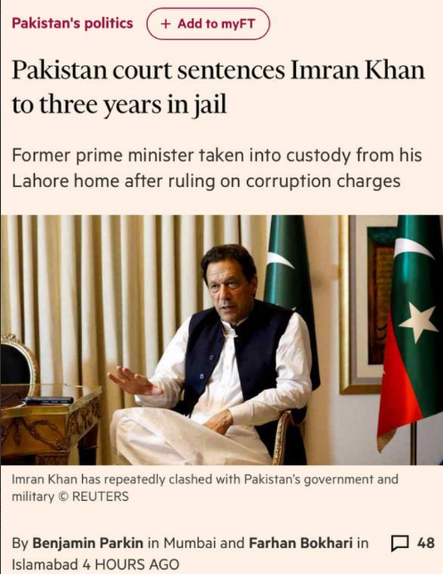

谁将十万横扫三江 北京时间 2023-08-06T09:41:32Z 1688002332368461824 RT @lilaoshizuikeai: @boiledwater 谢谢你~其实看到你这样说对我来说就足够啦
并不需要具体去做什么关心
其实这大半年无论是看了那么多其他人的，或者是自己亲身经历的，心态已经磨练的很平和了，因此心理健康也不用担心
更不用打钱啥的，推特过几天就发广告…   谁将十万横扫三江 北京时间 2023-08-06T07:02:07Z 1687962213078986752 “想一想开心的事”
“”想不出来 https://t.co/GxXpPhgQFP   谁将十万横扫三江 北京时间 2023-08-06T08:57:55Z 1687991356751491073 RT @whyyoutouzhele: 涿州网友投稿
8月5日，涿州市第三中学作为临时安置点的一些情况，都是附近受灾难的人。 https://t.co/P3YxZMZCx0   谁将十万横扫三江 北京时间 2023-08-06T05:33:23Z 1687939884600946688 RT @whyyoutouzhele: 网传平原县现场受灾情况
沿街建筑物外立面倒塌 https://t.co/PJO6M47kFL   谁将十万横扫三江 北京时间 2023-08-06T00:26:22Z 1687862620303577089 8月5日哈尔滨双城区，上面的领导要关闸门老百姓不让，双方对峙。这个小水闸关了就更容易蓄水引发洪涝了，村民不准关闸，现场来了武警特警。 https://t.co/FwkTvI0PXW   谁将十万横扫三江 北京时间 2023-08-06T00:14:36Z 1687859660064169984 巴基斯坦法院因腐败指控判处反对派领导人伊姆兰·汗三年监禁，并威胁要在今年晚些时候举行的全国选举前将该国受欢迎的前总理从政坛中除名。

周六，伊斯兰堡下级法院判决后不久，一支警察在拉合尔的家中逮捕了Khan，并将他送进监狱，该法院认定他犯有从2018年至2022年任职期间收到的礼物中非法获利的罪行。

这是不到三个月的时间里巴基斯坦当局第二次逮捕Khan，Khan不仅多次与总理Shehbaz Sharif的政府，而且与该国强大的军队发生口头冲突。

Khan的巴基斯坦Tehreek-e-Insaf党谴责定罪和逮捕是出于政治动机的企图阻止他参加预计在10月或11月举行的巴基斯坦大选。

他们声称，Khan之所以成为目标，是因为他批评军队，军队从幕后控制了该国的大部分政治。

PTI表示，该决定是“匆忙达成的，将[汗]排除在[选举]之外”。它补充说，Khan面临一系列其他案件，从贪污到恐怖主义指控，他已对伊斯兰堡高等法院和最高法院的判决提出上诉。

分析人员表示，针对汗的最新行动可能会使巴基斯坦在选举前的政治紧张局势升级。   谁将十万横扫三江 北京时间 2023-08-06T00:20:39Z 1687861181745422336 8月5日哈尔滨双城区，上面的领导要关闸门老百姓不让，双方对峙。这个小水闸关了就更容易蓄水引发洪涝了，村民不准关闸，现场来了武警特警。 https://t.co/ZL4C29bgpk   