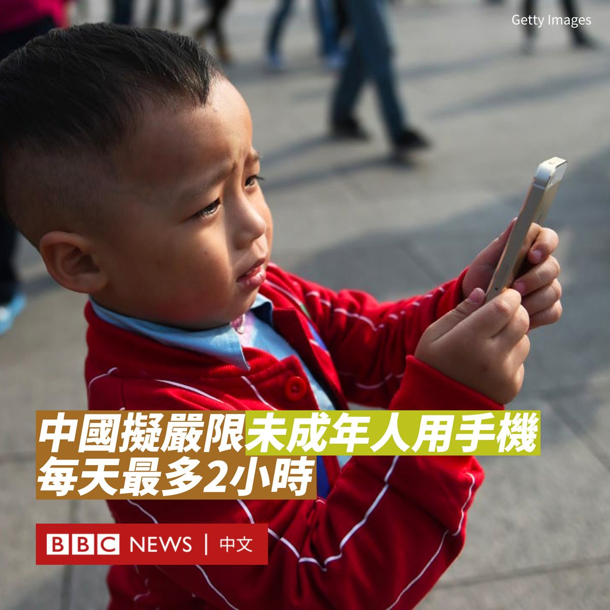

D英国广播公司BBC 北京时间 2023-08-05T14:19:57Z 1687710012184145920 1980年代，巴西有数以千计的座头鲸因人们为获取鲸脂遭到杀戮，使得它们的数量锐减。如今，在实行保护四十年后，鲸鱼观察者发现这些海洋巨兽重新开始繁殖。 https://t.co/wgvzx2pmps   D英国广播公司BBC 北京时间 2023-08-05T01:45:22Z 1687520114428776449 继2019年中国在短视频平台上线“青少年防沉迷系统”后，中国政府近日再计划推出新规，进一步扩大对未成年人玩手机的限制。

中国国家网信办周三（8月2日）表示，为切实强化未成年人网络保护，减少网络沉迷和不良信息影响，计划全面升级“青少年模式”为“未成年人模式”，使其覆盖范围由应用程序本身扩大至移动智能终端、应用商店。

这一限制也意味着针对未成年人防沉迷的限制将不仅限于网络游戏和短视频平台，还包括社交媒体、购物等其他应用程序。

在这一模式下，8岁以下用户每天使用智能手机的时间不得超过40分钟，8至16岁用户每天使用时间不得超过1小时，16至18岁用户每天使用时间不得超过2小时。家长拥有权力对限制进行“豁免”。

如果未成年人连续使用智能手机30分钟，设备还会发出警报，提示该休息了。

此外，每天22:00至6:00，未成年人将被禁止访问应用程序。

当局称，工具类、教育类和应急类的程序将除外。

该项目的意见反馈截止日期为2023年9月2日。不过，此消息一出，腾讯、阿里巴巴和哔哩哔哩等科技公司股价应声下跌。

中国近年持续打击青少年网络成瘾问题。2021年，当局针对网络游戏伸出重拳，规定未成年人每周玩游戏时间最多为3小时，并且只能在周末和节假日进行。一些官方媒体将网络游戏称为“精神鸦片”。   