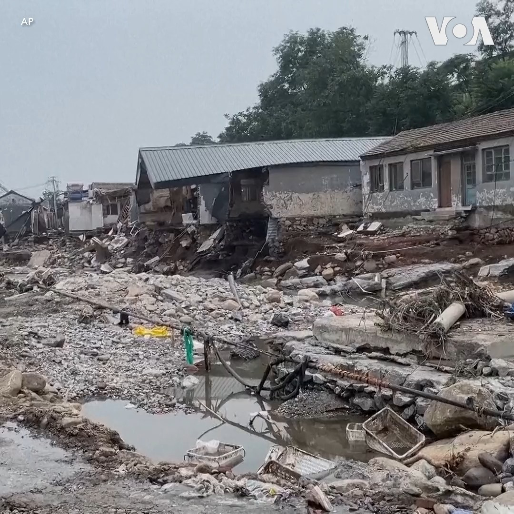
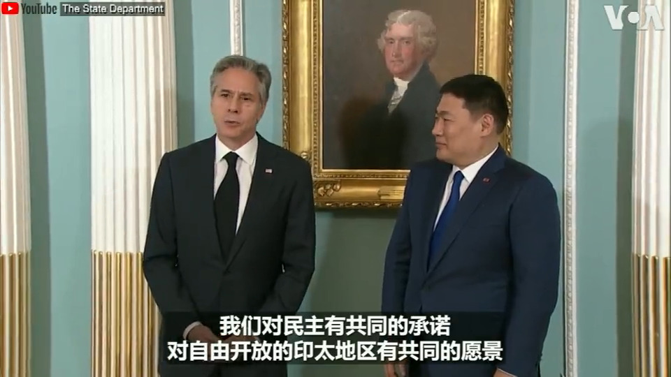

美国之音中文网 北京时间 2023-08-05T11:00:02Z 1687659701742477312 从段伟红的调查结局看，是否可以认为刑罚不会及于卷入北京上层政治斗争的女性？美国《当代中国评论》国际季刊主编荣伟先生说，简单说，不能说她们没有刑罚就没有惩罚。他们的生存境地是否能跟原来一样也是一种惩罚。#时事大家谈完整版：https://t.co/3gBzxzP6tb https://t.co/mfI1RlzhXY   美国之音中文网 北京时间 2023-08-05T12:17:02Z 1687679077912825856 对抗中国渗透 美参议院跨党派小组支持加强与太平洋岛国合作 https://t.co/AIxGwUP8JQ   美国之音中文网 北京时间 2023-08-05T07:00:01Z 1687599298106605573 中国经济近来曝出一连串糟糕数据，多个部门密集出台各种文件，是否回天乏术？长期研究中国经济的著名学者许成钢教授认为，这是制度的问题“露了馅儿”，曾让中国经济快速发展的机制一一丧失了，中国经济增速将长期放缓，如同70年代后的苏联。8/5上午9点敬请收看《#纵深视角》专访许成钢。 https://t.co/tZVZTKWySL   美国之音中文网 北京时间 2023-08-05T07:13:43Z 1687602747036626945 在立陶宛与台湾深化关系的背景下，台湾向两家立陶宛高科技公司注资，加强双方在半导体和激光产业上的合作，美国之音记者最近走访了这两家公司，下面跟随美国之音的镜头，一起去看看。 https://t.co/zYoepFdWAg   美国之音中文网 北京时间 2023-08-05T08:30:00Z 1687621944370413569 北京是否能建成东京那样的地下水网系统防水灾？德国国土规划工程博士王维洛博士说：除非把永定河边高尔夫球场都毁了。中国水淹区受中共控制，让水往哪流就往哪流。莱茵河沿岸也有这样的地区，但洪水来时是首淹区，它是所谓的蓄洪区，而不是百姓居住区。#时事大家谈完整版：https://t.co/3gBzxzP6tb https://t.co/fs2CIZ3fde   美国之音中文网 北京时间 2023-08-05T09:00:01Z 1687629496067964929 一键解锁#美国热搜 榜：1、事实查核：涿州“贱民”保卫鬼城雄安 2、火政府刁难民间救援队 3、红十字会募捐遭网民嘲讽 4、政府公众号承认泄洪保雄安 5、习近平你在哪里？我们对着洪水喊 https://t.co/ijy9JUOE4S   美国之音中文网 北京时间 2023-08-05T10:00:01Z 1687644594941444096 如何看亿万富豪段伟红消失六年后又重现？政论作家陈破空先生说：消失的直接原因是因孙政才的事。她也是中南海的白手套，涉及温家宝、贾庆林和习近平。沈栋到处说可能有用，另外一个原因是中国现在渴求外资外商。她的消失与重现都是中共黑暗一盘棋。#时事大家谈完整版：https://t.co/3gBzxzOyDD https://t.co/4ympeScSvP   美国之音中文网 北京时间 2023-08-05T10:08:02Z 1687646616432574464 中国或在全球多地建设海军基地，30年内能与美国平起平坐？ https://t.co/mwfU7RPwb2   美国之音中文网 北京时间 2023-08-05T10:24:51Z 1687650846354341889 一份研究报告预测了未来2-5年最有可能建成中国海外海军基地的八个地点，主要分布在“一带一路”沿线上位于南亚和非洲的中低收入国家。美国南方司令部司令劳拉‧理查森认为，中国正通过“一带一路”在全球大兴基础设施建设，并有可能将这些投资变为军民两用，从而给美国构成威胁。https://t.co/4JW3CykJBJ https://t.co/Sjpy7ggHLG   美国之音中文网 北京时间 2023-08-05T04:46:31Z 1687565701689556994 #揭谎频道 ：中国利用野火碳排放数据洗白污染大户形象 文字报道：https://t.co/jy6T7ByEML https://t.co/V4RKYN2F8J   美国之音中文网 北京时间 2023-08-05T05:25:33Z 1687575526003838976 分析人士：中国在非洲的军事影响力随着俄罗斯的减弱而增强 https://t.co/dEKFQQ3Gkp   美国之音中文网 北京时间 2023-08-05T05:40:04Z 1687579180211519490 香港保安局长称过去20年多次社运涉外部势力 学者指企图改写历史 https://t.co/Ck3FA8iGFo   美国之音中文网 北京时间 2023-08-05T06:39:33Z 1687594146171891716 美国会议员力推对华金融投资限制，两华尔街巨头被调查 https://t.co/HDGqQB1PbG   美国之音中文网 北京时间 2023-08-05T06:54:02Z 1687597793261826051 拜登首次以“总统提取权”军援台湾,专家：暗示美台更紧密的军事关系 https://t.co/FYx0cgajny   美国之音中文网 北京时间 2023-08-05T06:54:04Z 1687597801218420740 官员要河北做好北京“护城河”引众怒，微博跟进删除相关讨论 https://t.co/i5kbWBsbqw   美国之音中文网 北京时间 2023-08-05T07:08:03Z 1687601321791369218 立陶宛vs中国：立陶宛议员：立陶宛赢了 https://t.co/nSYrkkoagF   美国之音中文网 北京时间 2023-08-05T07:50:42Z 1687612051785498627 “我们万幸活下来了，那些没活下来的，家里人该有多痛苦！”“失联的邻居才是让人感触最深的地方。”暴雨洪灾过后，北京门头沟区南辛房村的少许村民返回家园清理住宅，他们回忆起暴雨洪水来袭的那一刻，仍感惊恐与无助。此次暴雨至少造成京郊和河北周边20人死亡，南辛房村是受灾最严重的地区之一。 https://t.co/joRAjRRHmw   美国之音中文网 北京时间 2023-08-05T07:56:05Z 1687613406134607872 美军高级将领：中国推进拉美，已入美国“红区” https://t.co/Ct6CTLPNqM   美国之音中文网 北京时间 2023-08-05T08:24:03Z 1687620445472993285 中方是否对巴基斯坦债务问题负有责任？ https://t.co/Do4aEznNrO   美国之音中文网 北京时间 2023-08-05T08:24:05Z 1687620453060460546 乌克兰反攻稳步推进 https://t.co/BMccCjvMW8   美国之音中文网 北京时间 2023-08-05T08:53:03Z 1687627742718869504 美国欲在各领域冷落俄罗斯，但北极是例外 https://t.co/oYe8yvJq7Q   美国之音中文网 北京时间 2023-08-05T09:23:04Z 1687635299114061824 尼日尔谈判陷入僵局，西非军事首领制定干预计划 https://t.co/MtEphwrB7v   美国之音中文网 北京时间 2023-08-05T04:43:05Z 1687564836228710401 中国澜沧江大坝在干旱期可能会恶化东南亚经济 https://t.co/754UDvium4   美国之音中文网 北京时间 2023-08-05T05:11:00Z 1687571862165843971 2023年迄今，中国领导人习近平仅在3月出访俄罗斯两天。他在北京接待的外国元首或官员数量，也较疫情前的同期下滑。习近平窝在家是因中国国内事务焦灼？还是另有原因？外界已在猜测习是否会出席接下来的新德里G20峰会和旧金山APEC峰会。中国元首不出国，会否影响北京外交力度？欢迎分享您的看法。 https://t.co/7XdzObge3X   美国之音中文网 北京时间 2023-08-05T05:55:03Z 1687582949951279104 中国自动驾驶车对美国国家安全有隐忧？ https://t.co/z12TVPL6Im   美国之音中文网 北京时间 2023-08-05T03:11:04Z 1687541679874834432 消息人士：拜登政府预计下周公布对中国技术投资的限制措施 https://t.co/uwHAbfTpQo   美国之音中文网 北京时间 2023-08-05T03:40:02Z 1687548973077381125 英国更新《海外经营风险指南》 指香港政治自由及权利大减 https://t.co/sxJHCQa1IN   美国之音中文网 北京时间 2023-08-05T04:03:24Z 1687554851486457856 美国费城警方4日和一条闯入95号高速公路的狗狗展开追逐。当时正值早上交通高峰，这条狗狗在车道中灵活地奔跑着，一度造成交通停止。当地电视台报道说，狗狗被一辆大卡车撞倒，但它似乎并未受伤，并爬起来继续跑。最后警方终于在高速公路边缘地带将它抓到并送到动物中心。 https://t.co/pcpuO9uOpr   美国之音中文网 北京时间 2023-08-05T04:12:03Z 1687557028255064064 6月份美国新增18.7万就业岗位；失业率降至3.5% https://t.co/u8pY1HA3sD   美国之音中文网 北京时间 2023-08-05T00:31:34Z 1687501539999666177 中国廉价电商在美国急速扩张受到关注，关键法律漏洞即将被堵上 https://t.co/m2yhx7x8k6   美国之音中文网 北京时间 2023-08-05T01:02:04Z 1687509216888864768 日本前首相麻生太郎下周访台 会晤蔡英文总统等台湾高层官员 https://t.co/K0kTZo2rtm   美国之音中文网 北京时间 2023-08-05T01:15:33Z 1687512612542824448 维吾尔诗人的回忆录揭示中国对维吾尔人的虐待 https://t.co/O6U7X2glLm   美国之音中文网 北京时间 2023-08-05T01:29:26Z 1687516102480318467 乌克兰官员8月4日说，乌军无人机向俄罗斯黑海港口城市新罗西斯克发动攻击，并损坏了一艘俄罗斯军舰。这是自乌俄战争爆发以来，俄罗斯的货运港口首次成为打击目标。除了货柜码头外，新罗西斯克港还设有一座俄罗斯海军基地和一艘造船厂。 https://t.co/qmc4hCZlmf   美国之音中文网 北京时间 2023-08-05T01:42:32Z 1687519401309024256 五名律师公开挑战“寻衅滋事罪”，呼吁全国人大将其废除 https://t.co/8Ax7PAHFiy   美国之音中文网 北京时间 2023-08-05T02:09:29Z 1687526181896364032 “美国与蒙古对民主有共同的承诺，对自由开放的印太地区有共同的愿景，”美国国务卿布林肯周五在美国国务院欢迎蒙古国总理奥云额尔登时说。布林肯随后与蒙古外长及运输部长签署《开放天空》民航协议。在蒙古总理本周访问华府期间，美蒙承诺将深化经济、防务及开采稀土矿产方面的合作。 https://t.co/KqlpHkwowq   美国之音中文网 北京时间 2023-08-05T00:09:40Z 1687496030625918978 俄罗斯法庭4日以极端主义罪名判处被监禁的反对派领导人阿列克谢·纳瓦尔尼(Alexey Navalny)19年监禁;  纳瓦尔尼此前已被分别判处两年半和9年监禁，正在服刑。 https://t.co/dtiSnxmfbj   美国之音中文网 北京时间 2023-08-05T00:19:33Z 1687498517299044352 向中共泄露情报的美海军水手何许人也？ https://t.co/zvijf8RGph   