自由亚洲电台 北京时间 2023-08-05T22:21:39Z 1687831234355814400 RT @RFA_Chinese: 最近，中共中央政治局召开会议，对中国当前房地产市场做出最新定位——中国房地产市场供求关系发生重大变化，提出适时调整优化房地产政策。住建部迅速响应，要求各地落实降低首付，“认房不认贷”等政策。
您认为，如果未来中国房地产刺激政策继续升级，松绑过去…   自由亚洲电台 北京时间 2023-08-05T22:22:04Z 1687831339318358016 RT @RFA_Chinese: 【官媒表示：#河北洪水 可能要一个月才能退】
【外地人员去涿州救灾要先获批准】 https://t.co/i9OS0dLPPo 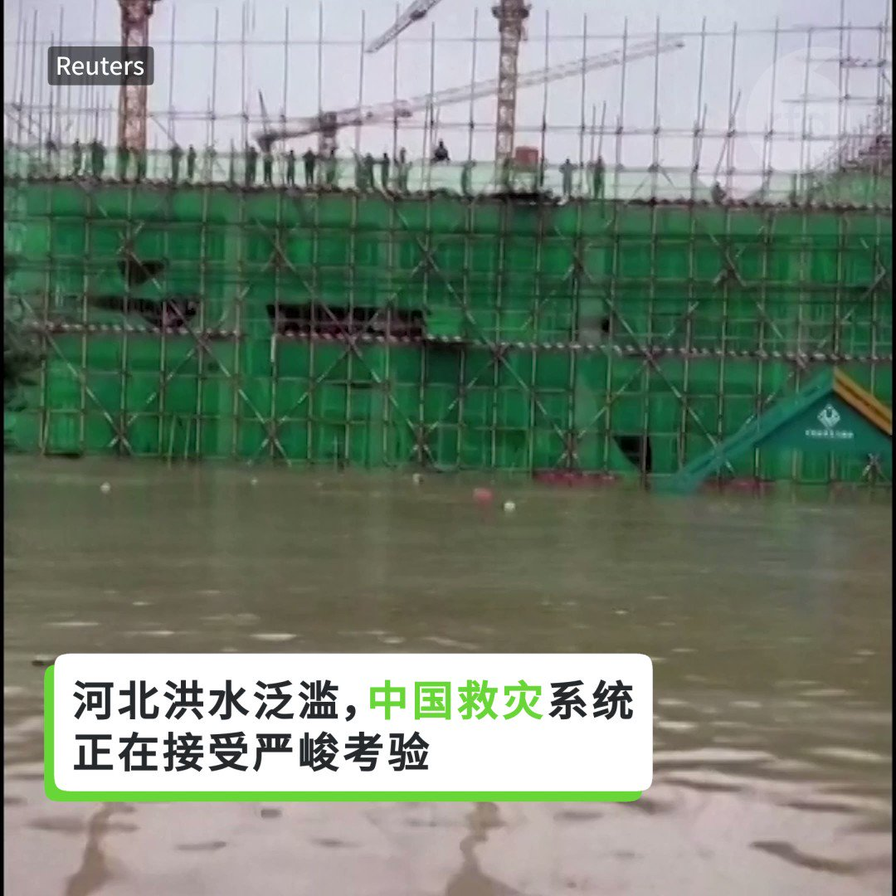  自由亚洲电台 北京时间 2023-08-05T22:22:23Z 1687831418901020672 RT @RFA_Chinese: 【反对老挝政府遣返 #卢思位】
8月2日下午，在美国华盛顿老挝驻美大使馆前，中国民主党，国际人权律师组织、异议人士等联合发起要求释放卢思位律师的活动：反对老挝政府遣返卢思位，抗议中共跨国镇压，要求释放卢思位与家人团聚。 https://t.co…   自由亚洲电台 北京时间 2023-08-05T22:22:44Z 1687831505756651520 RT @RFA_Chinese: 美国8月1日将2家中国企业列入“维吾尔强迫劳动预防法实体清单”，它们是骆驼集团有限公司和晨光生物科技集团有限公司。该禁令将于周三生效。… https://t.co/KGjY8dvX4G 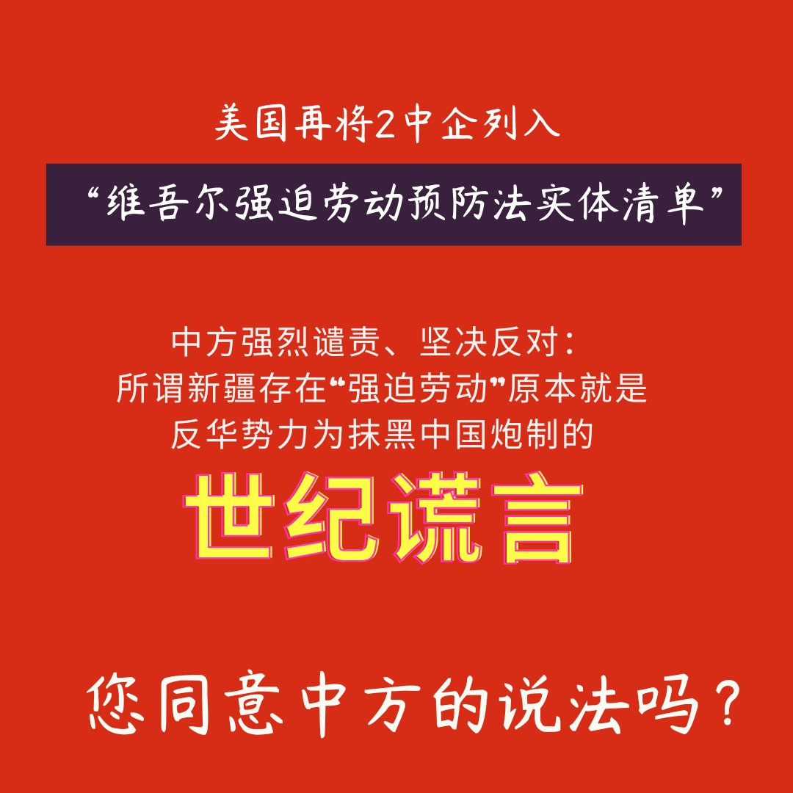  自由亚洲电台 北京时间 2023-08-05T22:24:09Z 1687831863140716544 RT @RFA_Chinese: 北京及河北省遭遇特大洪水，涿州受灾最重，部分地区水深9米，民众质疑当局为保雄安而泄洪所致。 中共河北省委书记倪岳峰强调，河北要“坚决当好首都护城河”。他还表示，雄安新区建设是“千年大计、国家大事”，安全不容有失。
网上骂声一片，百姓苦啊，做韭菜…   自由亚洲电台 北京时间 2023-08-05T13:12:48Z 1687693112947113984 RT @RFA_Chinese: 据台媒报道，美国华联会主席林建新8月2日被发现在法拉盛公寓死亡，报道称，据警方初步判定，林建新疑用床单上吊自杀，但3日据部分林建新关系密切者均表示，从他平日及死前一段时间的表现中，难以看出有自杀动机。 https://t.co/pOXHAzj6…   自由亚洲电台 北京时间 2023-08-05T11:49:28Z 1687672138914746368 RT @RFA_Chinese: 北京及河北省遭遇特大洪水，涿州受灾最重，部分地区水深9米，民众质疑当局为保雄安而泄洪所致。 中共河北省委书记倪岳峰强调，河北要“坚决当好首都护城河”。他还表示，雄安新区建设是“千年大计、国家大事”，安全不容有失。
网上骂声一片，百姓苦啊，做韭菜…   自由亚洲电台 北京时间 2023-08-05T04:24:47Z 1687560232933728256 【#洪水 过后】
8月4日 北京郊区门头沟南辛房村（美联社图片） https://t.co/FDOGzVRX6V 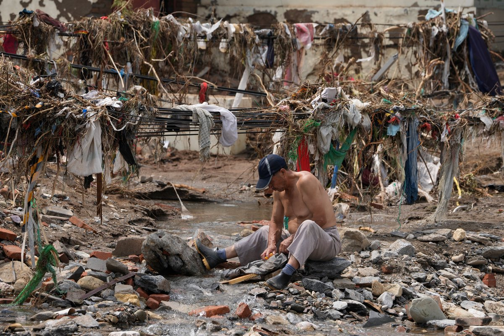  自由亚洲电台 北京时间 2023-08-05T05:30:15Z 1687576707652304896 【#美国海军间谍案 助理司法部长誓言将用一切工具应对 #中国威胁】
现年22岁的魏金超（Jinchao "Patrick" Wei 音译）。他在驻扎于圣地亚哥海军基地的美国“埃塞克斯号”（U.S.S. Essex）两栖攻击舰上任机械师助理。他被控收受贿赂，向一名中国情报官员提供了海军设施的军事演习计划、操作命令和电力系统的照片和视频。

26岁的海军士官赵文恒（Wenheng Zhao音译）。他驻扎在洛杉矶附近的怀尼米港军事基地。他被指控在中国情报官员的指示下，收集和传输敏感的国防信息，从事间谍活动及违反出口管制法。 据称，他已经传输或试图传输 50 多份手册和其他文件，其中包含有关海军两栖攻击舰的技术和机械数据。
详见
https://t.co/eOgXOhINgM 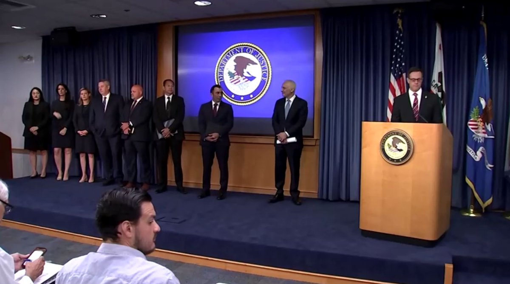  自由亚洲电台 北京时间 2023-08-05T06:30:01Z 1687591748556701698 专栏 | #夜话中南海：类比 #杨晶，#秦刚 被“轻饶”的可能性有多大？
 https://t.co/L0uwxxm07h   自由亚洲电台 北京时间 2023-08-05T07:00:08Z 1687599326649036801 【#亚太报道（2023-8-4）】
欢迎收听和订阅播客【亚太报道】 https://t.co/MjLNSvVMqc

为 #保北京 雄安 官员纷纷表态 / 泄洪损失惨重 #北戴河会议 照开？ / #郑州 响应新政加码 #救楼市 / 中国推“#降准”促两亿散户回头 / 台湾艺人 #李立群 杭州看病花费被“辟谣” https://t.co/ClPpNkcYJ7 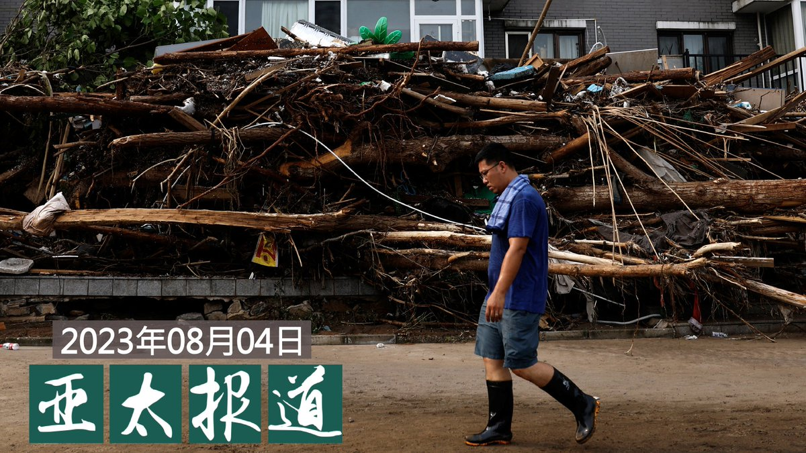  自由亚洲电台 北京时间 2023-08-05T05:01:56Z 1687569582775746560 中国多地今夏高温创纪录，宠物主人严防狗狗中暑。 https://t.co/acsfXdrMR5 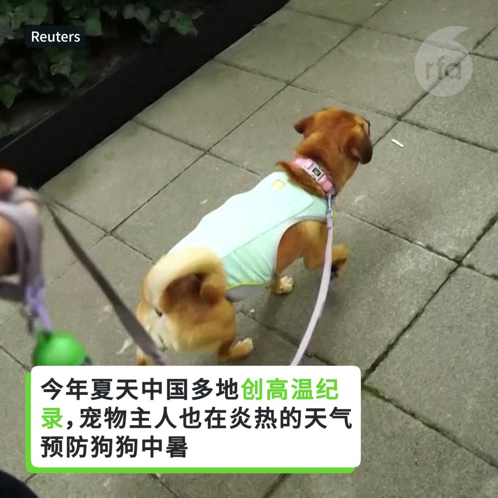  自由亚洲电台 北京时间 2023-08-05T05:19:49Z 1687574084408983554 #郑州 打头阵落实"#认房不认贷"政策， #救市15条 把底牌全部打光，能激活楼市吗？ https://t.co/Tc6oEV2Q0g   自由亚洲电台 北京时间 2023-08-05T05:24:00Z 1687575134758944768 美国总统 #拜登 预计将于下周初发布期待已久的行政令，以限制在敏感技术领域对中国的投资。白宫发言人拒绝对此置评。
据路透社报道，该命令的目标是阻止美国资本和专业技术被用来支持 #中国军事现代化 并威胁美国的国家安全。
该行政令预计将针对美国私募股权、风险投资和在中国半导体、量子计算及人工智能领域的合资企业投资。行政令所涉及的大多数投资都需要通知政府。消息人士称，一些交易将被禁止。
“它填补了我们现行制度的空白，”前美国商务部官员科德尔·赫尔（Cordell Hull）说，“这将有助于填补资金和技术方面的缺口，并使政府能够了解这些资本流动。”
消息人士称，预计这些规定不会立即生效，政府将就其提议征求意见。政府已经与利益相关者举行了会议，并与盟国进行了磋商。 美国财政部长耶伦最近访华期间也提到了这一点。她将潜在的限制描述为“高度有针对性、明确的指向对我们有具体国家安全担忧的几个领域”。
两名消息人士称，预计周一将举行简报会，周二将宣布这一消息。 但这个计划之前已经推迟过很多次，并且可能会再次推迟。
消息人士告诉路透社，受到限制的投资预计将遵循美国商务部去年 10 月份发布的针对中国的出口管制规定的范围。 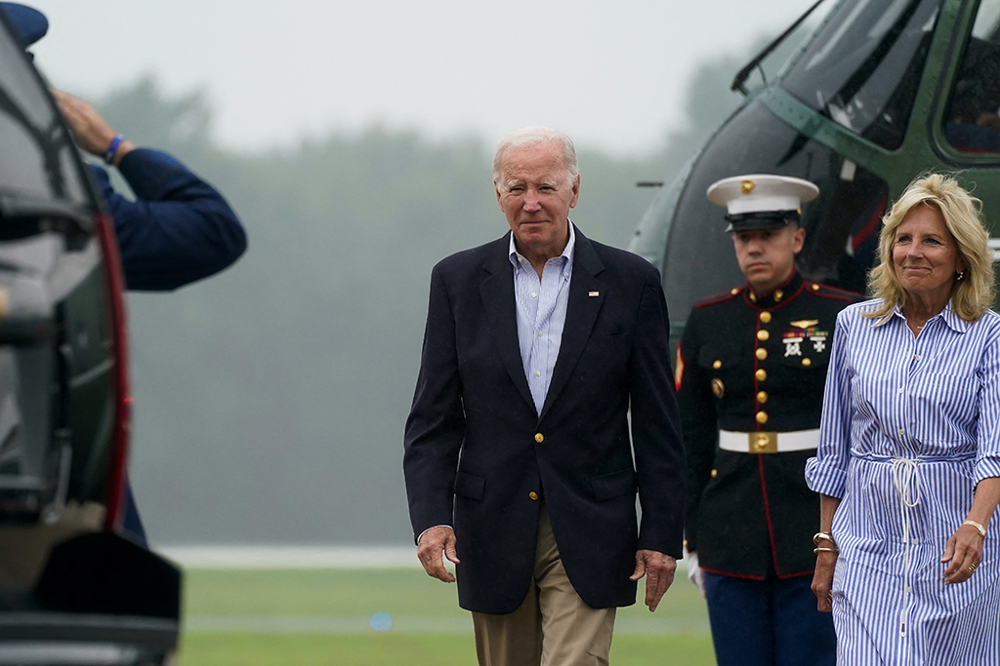  自由亚洲电台 北京时间 2023-08-05T06:00:01Z 1687584197815451654 中国宣布，将从本周六（8月5日）开始取消对 #澳大利亚大麦 征收的长达三年的 #关税。#澳大利亚 则表示将撤销在世界贸易组织（WTO）对中国提起的相关诉讼，并进一步呼吁中国解除对葡萄酒等所有剩余产品的贸易限制。

 https://t.co/PVqIeUPRPd   自由亚洲电台 北京时间 2023-08-05T02:47:41Z 1687535797652893697 在英港人组织打算本周六（5日）举办以“#羊村”儿童绘本为主题的教育活动，却被香港前特首 #梁振英 攻击。协办活动的英国地区港人组织去信所在地区国会议员和区议会主席并向警方通报事件。事件更上升到英国外交部层面。

 https://t.co/Hr6LoLWcUs   自由亚洲电台 北京时间 2023-08-05T03:05:13Z 1687540208110350336 【“没想到这么狼籍！”】
60岁北京居民高先生讲诉自己在洪水中失去了一切。台风给北京带来了140年来最严重的降雨和洪水，已造成至少20人死亡，数千人流离失所，并淹没了北京和其他几个城市 https://t.co/sPheT1gfYP   自由亚洲电台 北京时间 2023-08-05T03:19:49Z 1687543882370924544 旅美中国人权律师吴绍平说，在本次开闸 #泄洪 淹没河北力 #保北京、雄安新区中，他没有看到任何法律的正当性及处理自然灾害的合理性。根据中国的立法惯例，在制定1997年《#中华人民共和国防洪法》时就已经缺少科学论证及民意听取，遑论保护分洪区人民的人身及财产安全。 https://t.co/3BFJ46LAUc   自由亚洲电台 北京时间 2023-08-05T03:58:58Z 1687553737701867520 中国为救下半年经济疲于奔命，在继拉抬房市、救消费之后，又将手伸到积弱不振的 #股市。
中国媒体称，证券业迎来"降准"3个点的"利多"，预计释放资金逾人民币300亿，然而，此举能唤回2亿散户的心吗？

 https://t.co/thFYgBpR0T   自由亚洲电台 北京时间 2023-08-05T04:05:27Z 1687555366811217920 【#洪水 过后】
8月4日 北京郊区门头沟南辛房村 https://t.co/cbMdlZ3tsv 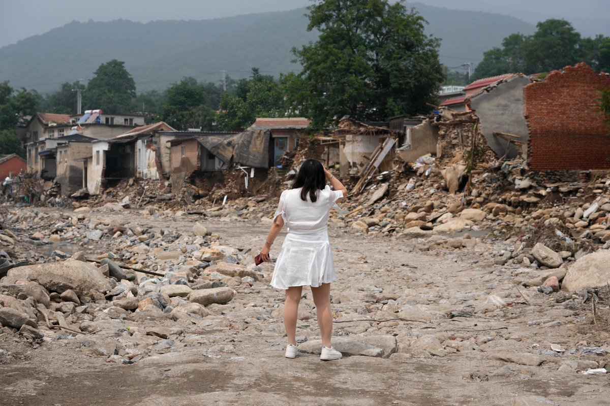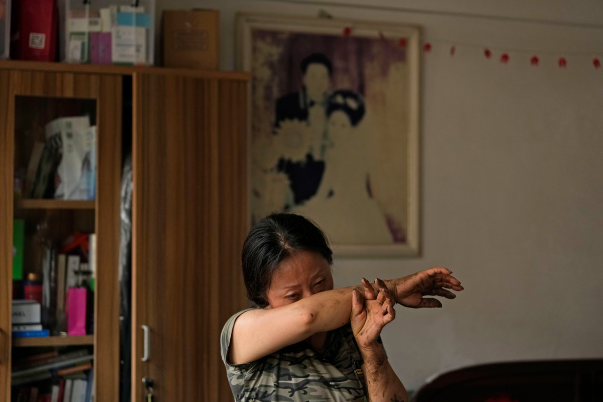  自由亚洲电台 北京时间 2023-08-05T00:42:55Z 1687504397994196992 网传台湾演员 #李立群 在杭州住院花费二十万元人民币，引发中国网民热议。官方辟谣表示，"李某某"只花了约两万元人民币。李立群在疫情期间就因牵涉两岸的话题经常被挑战"爱国度"。分析指，李可能"被造谣"，但即便两万也耗费不赀，突显平民 #看病难。

 https://t.co/Uke6BRcOik   自由亚洲电台 北京时间 2023-08-05T01:34:30Z 1687517378966614017 失去自由超过五年的民间组织"#中国人权观察"创始人 #徐秦 至今仍未受审。据了解，该案已先后十次延期审理。有法律界人士估计，法院的决定是迫于无奈，但却进一步侵害了徐秦的人权。

 https://t.co/Z2nUHfFLjl   自由亚洲电台 北京时间 2023-08-05T01:45:14Z 1687520082367598592 据台媒报道，美国华联会主席林建新8月2日被发现在法拉盛公寓死亡，报道称，据警方初步判定，林建新疑用床单上吊自杀，但3日据部分林建新关系密切者均表示，从他平日及死前一段时间的表现中，难以看出有自杀动机。 https://t.co/pOXHAzj6lj 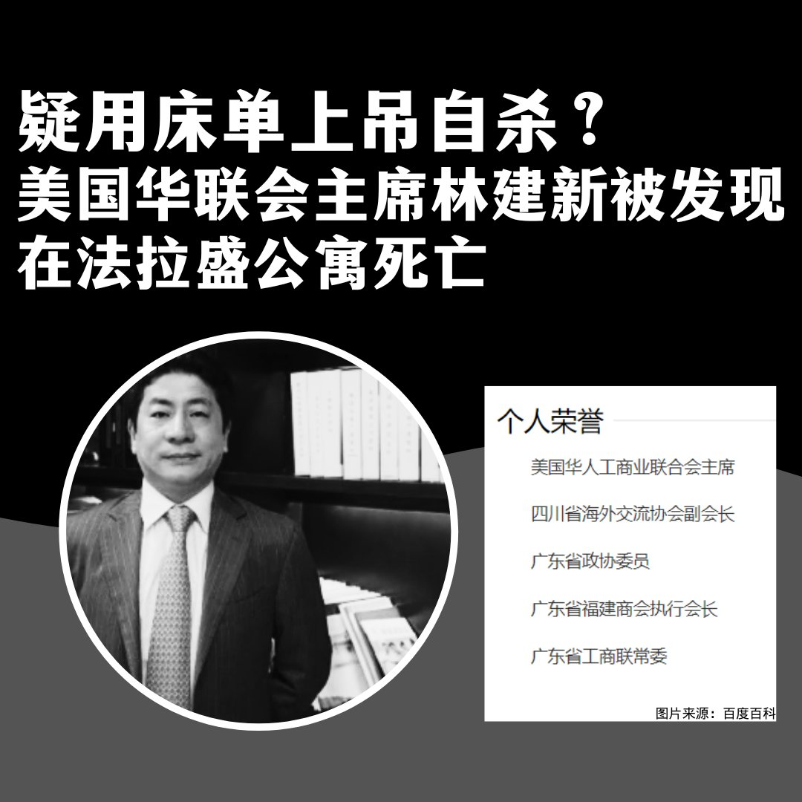  自由亚洲电台 北京时间 2023-08-05T02:01:44Z 1687524235110203393 【火箭军大清洗 主因畏战情绪？】
【泄密案调查 意外发现军官在“为自己留后路”】
https://t.co/RFNQc7Bdj1
前解放军海军司令部中校参谋 #姚诚，时政评论家 #陈破空 在 #亚洲很想聊 节目中解析，为何 #习近平想攻台，最依赖的 #火箭军，却有严重的 #畏战 情绪？为何出现 #泄密 传闻？ https://t.co/IRDm5jAvIM 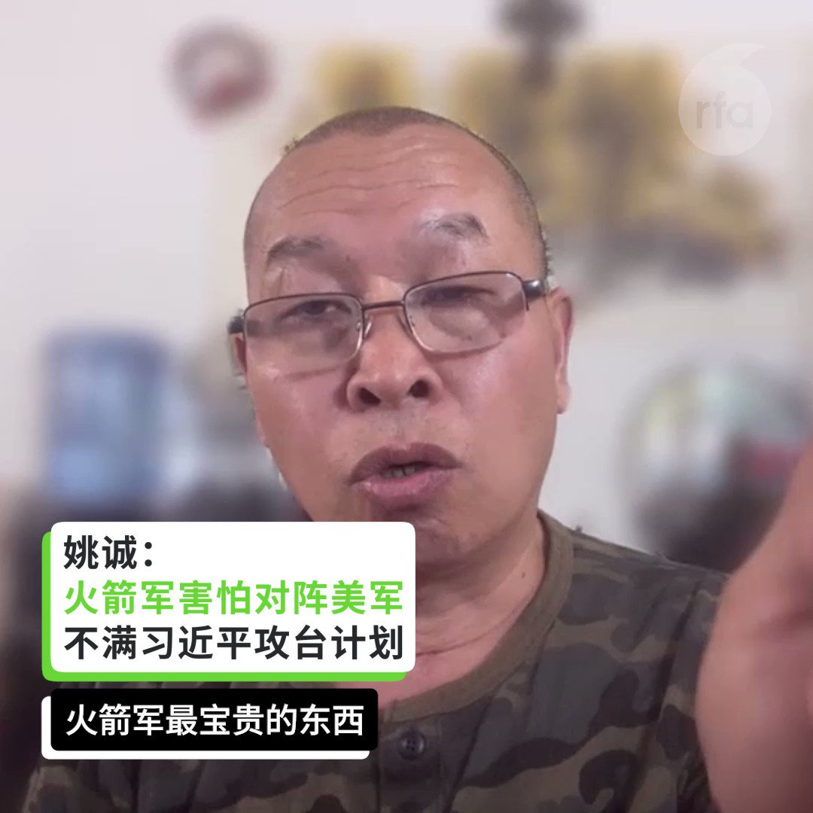  