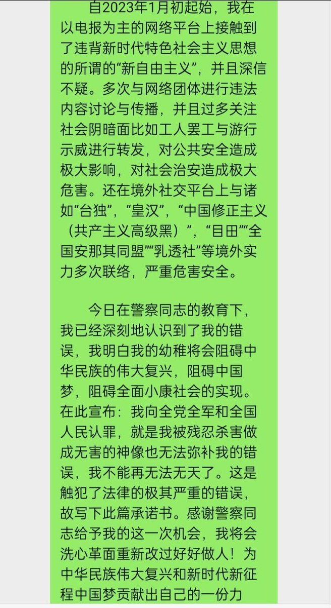
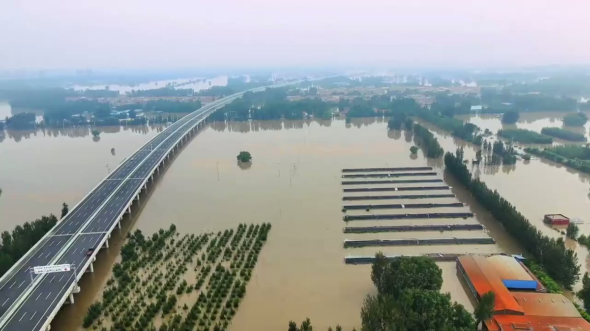
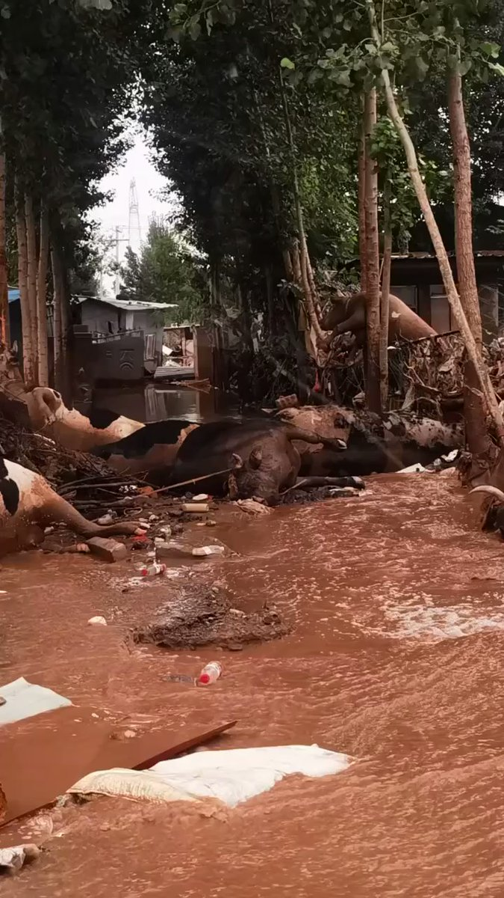
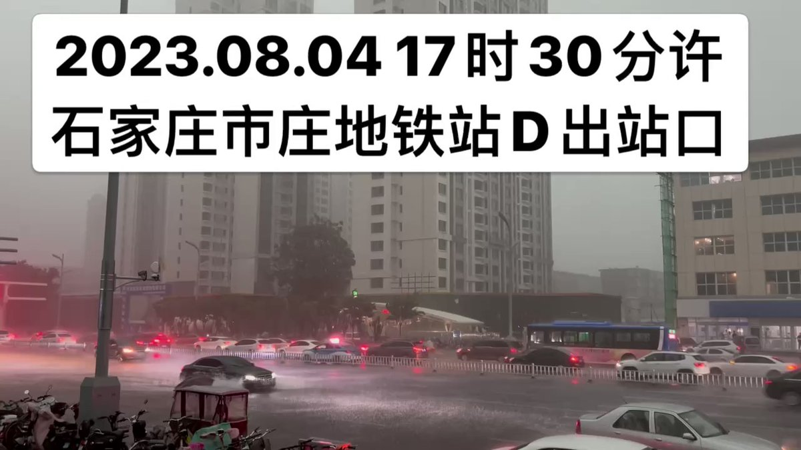
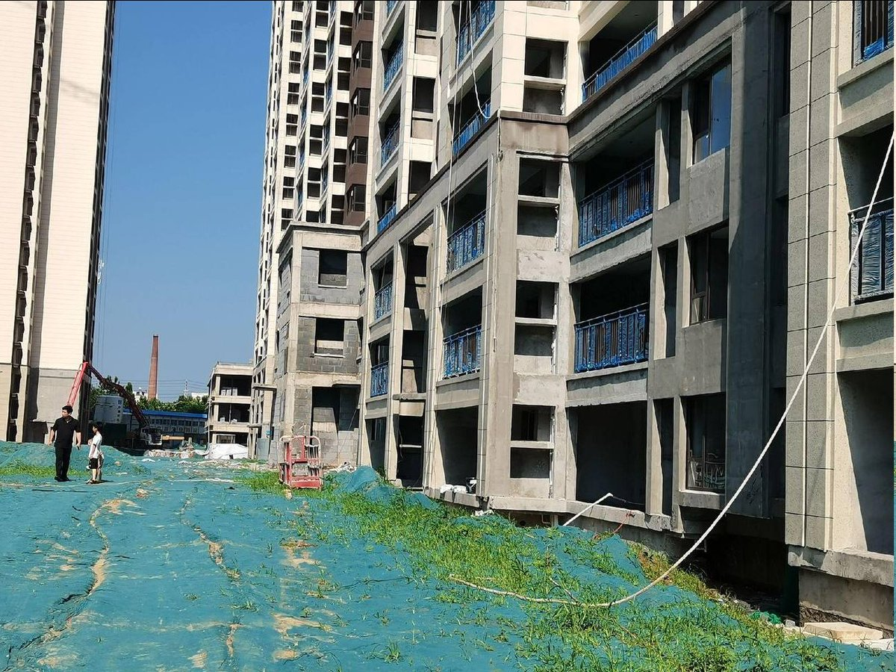

谁将十万横扫三江 北京时间 2023-08-05T10:03:09Z 1687645385765134336 8月4日，中植系维权现场，又要大面积维稳了 https://t.co/rqKNzbVJ7r   谁将十万横扫三江 北京时间 2023-08-05T06:23:42Z 1687590161104941062 RT @whyyoutouzhele: https://t.co/MN5LJ4XBDo   谁将十万横扫三江 北京时间 2023-08-05T06:23:47Z 1687590181724139523 网友投稿：他因在电报群发言被老家（河南南阳）警察微信、电话联系，网上执法，要求其删除言论，退群，写保证书 https://t.co/XW0XRRw3Iz   谁将十万横扫三江 北京时间 2023-08-05T06:54:41Z 1687597955073851392 RT @chuushindou: 最顶尖的阶层也一样没有安全感。林彪可以坠机，赵紫阳可以软禁到死，胡锦涛可以当着全世界媒体的面被架出会场，秦刚可以莫名其妙地消失……查一查改革开放以来历年的中国首富，有多少个现在在坐牢？毛泽东、习近平内心的恐惧与焦虑，更加不是一般人能想象的。中国…   谁将十万横扫三江 北京时间 2023-08-05T07:05:08Z 1687600585330307075 黑衣女子揪住女局长头发痛骂引围观

8月4日坐标：河北保定定州街头。一黑衣女子揪住白衣女子的头发当街痛骂，坐地上的白衣女子可是个副局长在她周边还撒落一地百元大钞 https://t.co/61UBfUIhZr   谁将十万横扫三江 北京时间 2023-08-05T07:22:57Z 1687605069557182468 把泄洪说成是下雨，半个霸州市跟文安县成了汪洋大海，老百姓奋斗了几十年的基业瞬间倾家荡产！ 泄洪淹没了上万人的家园，47个村庄都不止，就被那么轻轻松松的说成降雨 https://t.co/NwRTBY8tIA   谁将十万横扫三江 北京时间 2023-08-05T07:28:38Z 1687606500313939969 拍摄于8月3日——4日的霸州 https://t.co/RHgQ7UZY74   谁将十万横扫三江 北京时间 2023-08-05T06:16:23Z 1687588317016272899 前天去了涿州，昨晚撤回，整理了一些现场看到的信息，记在这里：

1.涿州受灾最严重的地区之一，是西边的几个镇子，刁窝镇、豆庄镇、义和庄镇和码头镇。这几个镇处于三条河流汇集处，又是平原，人口密集，水一来，损失相当惨重，很多水位都有三四米高，能完全淹没一层平房。据一位气象局的人说，他们测算，这次涿州最深的积水是9米。

2.我主要了解的是刁窝镇的情况，比较不幸的是他们的居民安置点静雅中学被淹了，所以有上千人被困，缺少食物，昨日人群被转移。但另外刁窝还有医院，里面有孕妇，老人，小孩49人，昨天下午打电话里联系时院长说，还没有得到解救，因为水太大了，救援队过不去。据救援队说，他们昨天在刁窝发现，有人已经被困四天，当时还未被救。

3.从救援队的角度来说，首先进入涿州的一道坎就是邀请函，在我所在的一个群里，至今还有救援队在等邀请函进入涿州。一位救援队员告诉我，在刁窝这种地方，水流特别急，如果船只马力低于三十匹，无法进入，会有侧翻的危险，确实也有救援队卡在了发送机这件事上面。另外也听说，这次救援队救援过程中，有翻船，船刮烂更是常见，因为在水里可能遇见集装箱的金属结构，房顶，铁丝，木头渣，这些都可能把船刮烂。昨天还有四个救援人员被困了好几个小时，最后是救援队员去救救援队员。

4.从物资捐赠的角度来说，我有跟随一家公益机构去一个镇子捐东西，其实有些东西是洪灾区是不需要的，最典型的就是桶装方便面，因为没有热水，根本吃不了。现在他们比较需要的是充电宝、被子，自热饭也挺好。因为有很多人离开家，转移到聚集点，还有很多救援队，他们都需要充电宝这些。在救援群里看到，汽油也特别抢手，因为船需要油，同时修船、修车的师傅也特别需要。

5.我跟的这家公益机构，他们捐物资需要发放到民众手里，但这个镇子的镇长不想麻烦，想直接接收，但这不符合做公益的工作方式，也过不了公益机构的审计，因此没捐成，所以最后换了一个地儿。

6.涿州全城停水已经三到四天，昨天太饿了，逛了一下，几乎所有的饭店都已歇业，最后是在味多美才买到了吃的，估计是别的地方运过去的面包。对于未受灾的地区来说，停水可能是个大问题。在我去的第一天，因为没办法洗澡，去药店买酒精棉片，发现几乎全部售空了。以及我感觉，还是有挺多市民离开涿州，去外地避难。现在买出涿州的高铁票很难，几乎都是售空，在高铁站我听隔壁一个三口之家说，他们要去北京住，这样就可以在酒店洗澡了。

7.一位救援队员告诉我，现在应该要关注灾后的消杀问题，他们看到的污水，里面是粪便，动物尸体，垃圾，集装箱粉末的海洋，按时间来算，也到了要消杀的时间。

8.和一位涿州市民聊天时他说，根据他的记忆，涿州对洪水其实是蛮陌生的。上一次洪水是北京2012年的7.21，在上一次就是1996还是1997年，再上一次是1967年。至于今年为何如此，在此就不谈了。

9.救援群里显示，现在已经有一些救援队离开了涿州，有的直接去黑龙江救援了。但根据昨天公布的消息说，上游至少还有3到4亿立方米的水要过境涿州，之后的情况就不了解，希望能看到更多报道。https://t.co/zfPj271lTL   谁将十万横扫三江 北京时间 2023-08-05T02:24:00Z 1687529835399434240 8月3日，哈尔滨五常市部分区域受灾，大量稻田被淹 https://t.co/gLMT71Gtax   谁将十万横扫三江 北京时间 2023-08-05T02:30:00Z 1687531347592765440 保定涞水县，罕见的洪水、泥石流冲毁了通道，村民说伤亡较大，有学校一片狼藉 https://t.co/2e2w8QWph9   谁将十万横扫三江 北京时间 2023-08-05T02:31:00Z 1687531597149474817 8月4日石家庄，一场雨没下多久就积水 https://t.co/G1Bbklkegl   谁将十万横扫三江 北京时间 2023-08-05T02:04:00Z 1687524802519842816 7月31日门头沟洪水监控快进，十分钟洪水就淹没道路 https://t.co/54SF9svOv3   谁将十万横扫三江 北京时间 2023-08-05T02:16:00Z 1687527822079012864 8月4日河南长葛，康桥悦溪堂烂尾楼维权 https://t.co/Hbqo1SU5gF   