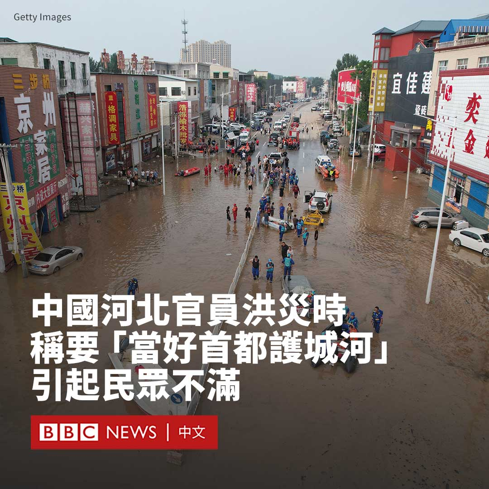
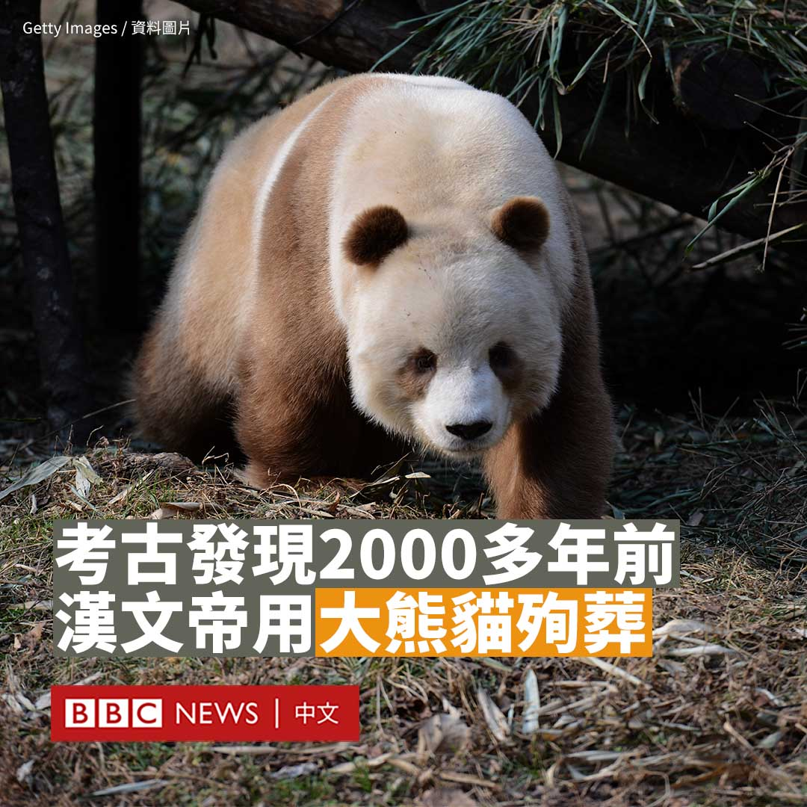

D英国广播公司BBC 北京时间 2023-08-04T16:26:53Z 1687379566036451328 中国华北地区近日遭遇暴雨引发的洪涝灾害。中共河北省委书记强调要河北“坚决当好首都护城河”，引起民众不满。

据官方的河北广播电视台周三（8月2日）报道，河北省委书记倪岳峰在保定市和雄安新区检查防汛抢险救灾工作时说，要“有序启用蓄滞洪区，减轻北京防洪压力，坚决当好首都护城河”。

他还表示，雄安新区建设是“千年大计、国家大事”，安全不容有失。

此番言论引发民众批评。许多网民指责官员为了政治上献媚表忠，不顾百姓苦难。

“河北人民的生命财产在他眼里是什么？”一名网友评论道。

“你到底是河北的官，还是北京的官？不过也是，权力只对它的来源负责。”另一名网友留言道。

在高涨的批评声中，一些官方媒体删除了这篇报道。

由于近日河北小城涿州成为此轮洪灾受灾最严重的地区，该市部分地区水深甚至达9米，一直有民众质疑这主要是泄洪导致的。

据河北省应急管理厅，为保障行洪安全，缓解京津防汛压力，河北启用了七处蓄滞洪区，其中两处位于涿州。

据报道，这些蓄滞洪区分减洪水18亿立方米。至今河北一共转移近123万人，其中蓄滞洪区转移近86万人。

拥有70万人口的涿州位于北京和雄安新区之间。雄安新区是中国领导人习近平在2017年提出的一个国家级新区，以疏解北京的非首都功能。当局将其称为“千年大计”。

中国国家防汛抗旱总指挥部副总指挥、水利部部长李国英在周二（8月1日）也曾表态，要确保首都北京、大兴机场、雄安新区和已启用蓄滞洪区人员绝对安全。   D英国广播公司BBC 北京时间 2023-08-04T17:54:06Z 1687401518000218112 熊猫被誉为中国的“国宝”。一项新发现显示，古代中国人也对这种动物喜爱有加，甚至连皇帝也使用其殉葬。

据中国官方媒体报道，考古人员近日在汉文帝的陵墓中发现了大熊猫骨骼，证明这位2000多年前的汉朝皇帝曾使用熊猫殉葬。

据报道，中国古人有用战马、狗甚至猴子陪葬的先例，但用大熊猫陪葬很罕见。此次发现大熊猫骸骨的地方位于汉文帝霸陵附近的外藏坑。

《三秦都市报》引述陕西省考古研究院研究员胡松梅的话称，动物殉葬坑内出土的这具大熊猫骨骼非常完整：“它头向帝陵，尾向西边。”

“这应该是秦岭北坡的大熊猫。”她分析道。

大熊猫主要分为两个亚种——四川大熊猫和秦岭大熊猫。秦岭大熊猫头骨较小而头圆，胸部及腹部毛色多为深棕色。

汉文帝的霸陵位于今天陕西省西安市的东郊。考古专家分析，中国史书《史记》中记载有“渭川千亩竹”，可以佐证当时西安附近的环境适合大熊猫生长。

据报道，1975年考古人员在汉文帝母亲薄太后的陵墓中，也曾发现过大熊猫头骨和犀牛的骨骸。

汉文帝逝世于公元前157年，被视为是一代明君。在中国古代，以动物骨骼陪葬是权力和地位的一种体现。   D英国广播公司BBC 北京时间 2023-08-04T15:11:12Z 1687360522780393472 美国官员周四（8月3日）表示，两名美国海军水兵因涉嫌向中国提供军事情报而被捕。https://t.co/2QLxLzDC0m   D英国广播公司BBC 北京时间 2023-08-04T13:28:58Z 1687334791035908096 韩国京畿道城南市发生无差别随机行凶事件，造成14人受伤。

据韩国媒体报道，该事件周四（8月3日）傍晚发生在一个地铁站附近。

一名嫌疑人先开车在人行道上撞伤五人，然后下车进入一家繁忙的购物中心，持凶器刺伤至少九人。

一名20多岁的男子在现场被逮捕，但动机尚不清楚。

韩联社报道称，14名伤者中，有12人重伤，两人轻伤。

据报道，这名嫌犯身穿黑色连帽卫衣并佩戴墨镜，驾驶一辆白色小轿车。在撞人后，他挥舞着一把刀走进购物中心。

韩国总统尹锡悦称，该行凶案是针对无辜市民的“恐怖袭击”，要求政府通过预先投入警力、配备强力有效的压制工具进行防范。   D英国广播公司BBC 北京时间 2023-08-04T11:28:01Z 1687304357057077248 在中国，选择未婚生育的女性曾面临重重挑战，她们无法领取休产假期间的生育津贴，其子女也很难获得医疗保险和教育等社会福利，这让很多人不得不选择堕胎。

但是，一场社会变革正在发生。法规的完善和社会观念的转变让社会对她们更加包容。 https://t.co/gSjMiMrO2w   D英国广播公司BBC 北京时间 2023-08-04T09:02:12Z 1687267659992424448 塑料污染能对海洋生态造成巨大冲击，许多的塑料废弃物来自人类日常生活中使用的瓶罐、杯子或容器等，最后被冲到河川与水道内。

在阿姆斯特丹，一群科学家发明了一套“泡泡屏障”系统以帮助拦截运河中的塑料废弃物。 https://t.co/OGyEgMTaAn   D英国广播公司BBC 北京时间 2023-08-04T00:13:53Z 1687134702262697985 一年前，时任美国众议院议长佩洛西（Nancy Pelosi）不顾北京警告高调访问台湾，并与总统蔡英文见面。这次旋风式访问引发了舆论激辩，批评者质疑她加剧了台海关系紧张，甚至有引发战争的风险。

佩洛西在此访一周年之际接受BBC中文专访，称北京当时的举动是“懦弱之举”，她在旅行途中并没有害怕。

她还回忆了自己在1991年的北京之行，当时她来到天安门广场展示抗议“六四”镇压的横幅。她称，时至今日不幸的是“习近平主席使情况变得更糟糕”。   