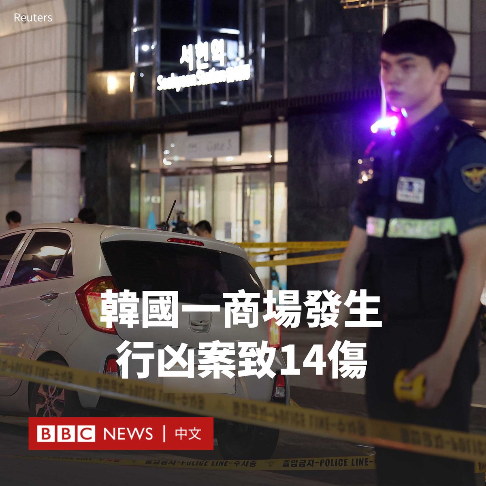
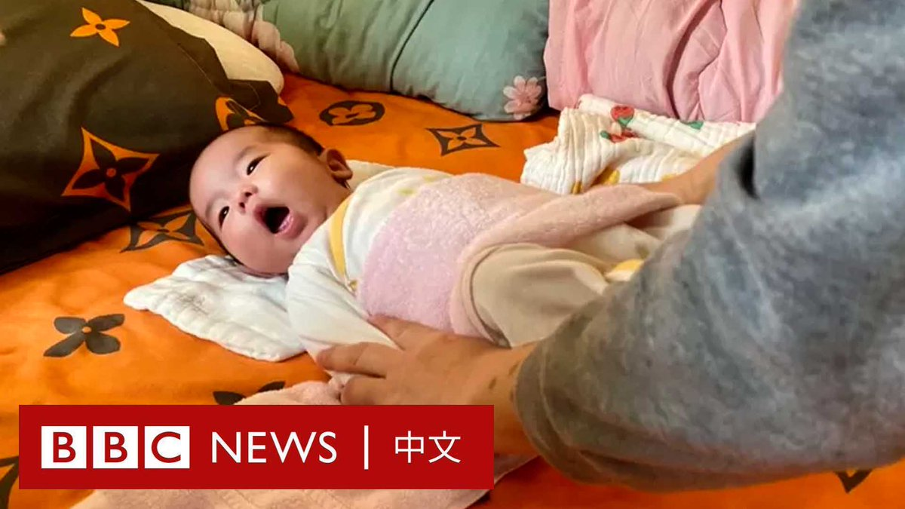
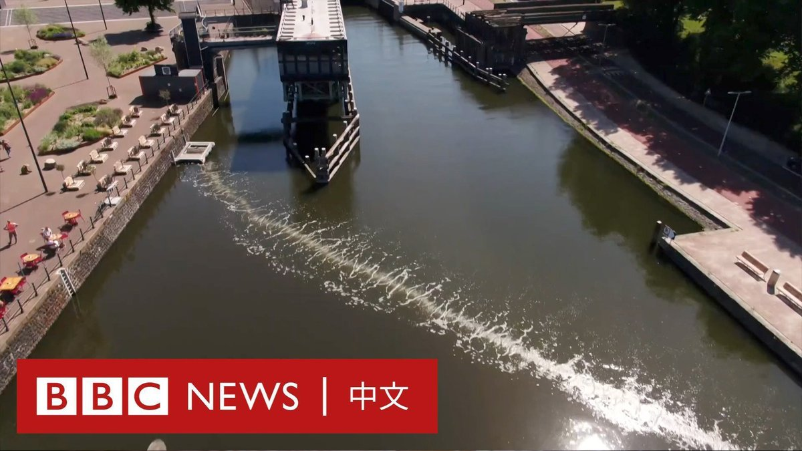

D英国广播公司BBC 北京时间 2023-08-04T13:28:58Z 1687334791035908096 韩国京畿道城南市发生无差别随机行凶事件，造成14人受伤。

据韩国媒体报道，该事件周四（8月3日）傍晚发生在一个地铁站附近。

一名嫌疑人先开车在人行道上撞伤五人，然后下车进入一家繁忙的购物中心，持凶器刺伤至少九人。

一名20多岁的男子在现场被逮捕，但动机尚不清楚。

韩联社报道称，14名伤者中，有12人重伤，两人轻伤。

据报道，这名嫌犯身穿黑色连帽卫衣并佩戴墨镜，驾驶一辆白色小轿车。在撞人后，他挥舞着一把刀走进购物中心。

韩国总统尹锡悦称，该行凶案是针对无辜市民的“恐怖袭击”，要求政府通过预先投入警力、配备强力有效的压制工具进行防范。   D英国广播公司BBC 北京时间 2023-08-04T11:28:01Z 1687304357057077248 在中国，选择未婚生育的女性曾面临重重挑战，她们无法领取休产假期间的生育津贴，其子女也很难获得医疗保险和教育等社会福利，这让很多人不得不选择堕胎。

但是，一场社会变革正在发生。法规的完善和社会观念的转变让社会对她们更加包容。 https://t.co/gSjMiMrO2w   D英国广播公司BBC 北京时间 2023-08-04T09:02:12Z 1687267659992424448 塑料污染能对海洋生态造成巨大冲击，许多的塑料废弃物来自人类日常生活中使用的瓶罐、杯子或容器等，最后被冲到河川与水道内。

在阿姆斯特丹，一群科学家发明了一套“泡泡屏障”系统以帮助拦截运河中的塑料废弃物。 https://t.co/OGyEgMTaAn   D英国广播公司BBC 北京时间 2023-08-04T00:13:53Z 1687134702262697985 一年前，时任美国众议院议长佩洛西（Nancy Pelosi）不顾北京警告高调访问台湾，并与总统蔡英文见面。这次旋风式访问引发了舆论激辩，批评者质疑她加剧了台海关系紧张，甚至有引发战争的风险。

佩洛西在此访一周年之际接受BBC中文专访，称北京当时的举动是“懦弱之举”，她在旅行途中并没有害怕。

她还回忆了自己在1991年的北京之行，当时她来到天安门广场展示抗议“六四”镇压的横幅。她称，时至今日不幸的是“习近平主席使情况变得更糟糕”。   