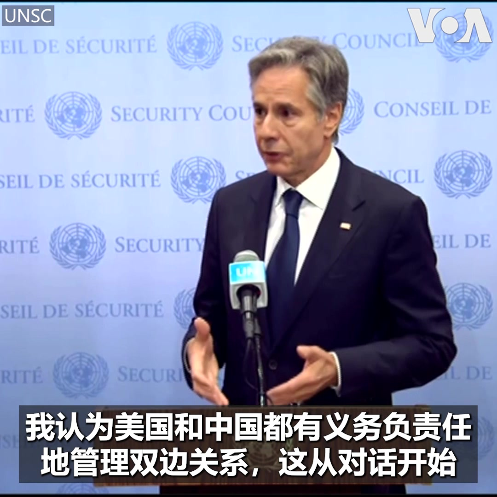
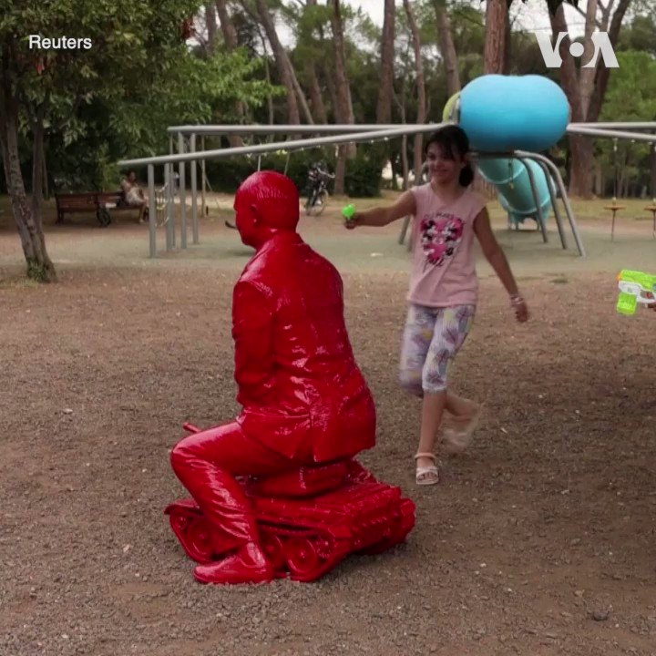
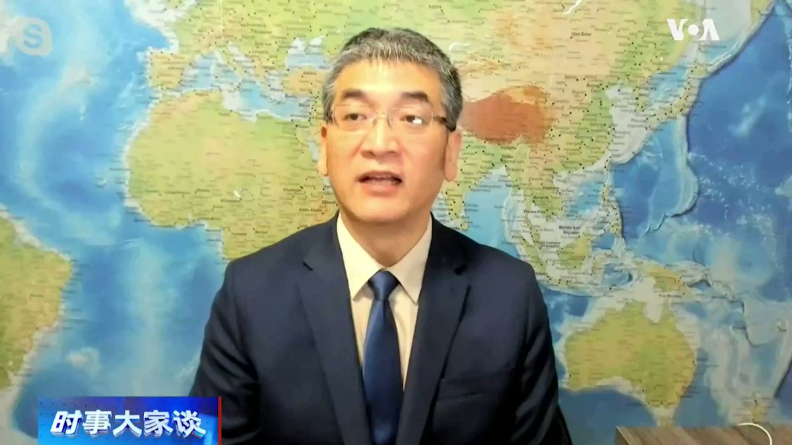
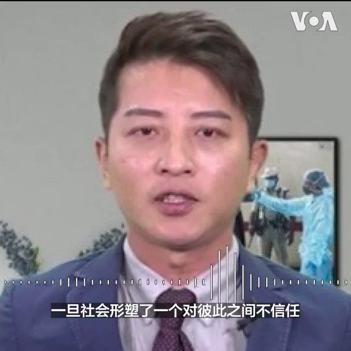

美国之音中文网 北京时间 2023-08-04T08:21:51Z 1687257504093442048 美国前总统特朗普8月3日到华盛顿联邦地区法院出庭应讯，面对试图推翻2020年总统大选结果等四项刑事指控，他全部宣称无罪。法官将本案下次聆讯时间定在8月28日。美国之音记者黄耀毅 @voayyh 发自法院现场报道。详细报道：https://t.co/QomkKkrQxr https://t.co/tzDhoU4Pxd   美国之音中文网 北京时间 2023-08-04T08:28:03Z 1687259064508788736 乌克兰在沙特主持的和平谈判中寻求全球支持 https://t.co/Gj7mVa3V4F   美国之音中文网 北京时间 2023-08-04T08:28:05Z 1687259072805097480 美国可能武装霍尔木兹海峡的商船，阻止伊朗扣留 https://t.co/Ty912SyV7N   美国之音中文网 北京时间 2023-08-04T08:58:03Z 1687266613740097536 联邦法官命令记者透露机密消息来源 https://t.co/ZDvQup61AQ   美国之音中文网 北京时间 2023-08-04T09:32:04Z 1687275173379223552 报道乌军对俄反攻的记者受伤事件接连发生 https://t.co/aeP7UlVYyC   美国之音中文网 北京时间 2023-08-04T04:32:31Z 1687199791720038400 中国官媒报道，中共中央办公厅主任蔡奇3日在北戴河看望受邀前来暑期休假的57位科技专家，这被媒体视为中共即将召开北戴河会议的明显信号。正值水淹华北之际，面临内忧外患的中共将商议哪些话题？火箭军？秦刚？经济？美中科技战？欢迎分享您的看法。https://t.co/zedWLmgCfg https://t.co/T0uQsUCOsh   美国之音中文网 北京时间 2023-08-04T04:34:04Z 1687200181857693696 尼日尔政变支持者抗议制裁，邻国考虑干预 https://t.co/kEZr1oL2Kg   美国之音中文网 北京时间 2023-08-04T04:48:23Z 1687203785053978624 #现场直击 美国前总统特朗普8月3日在华盛顿联邦法院出庭，面对试图推翻2020年大选结果的指控。在特朗普出庭的联邦法院外面，聚集了大批抗议者和特朗普的支持者。美国之音记者黄耀毅发自现场的报道。 https://t.co/pIs5Z30ue9   美国之音中文网 北京时间 2023-08-04T05:01:00Z 1687206958175043585 唯一一个加入“一带一路”的G7国家意大利有意退出该倡议。观察人士秦鹏先生认为，中国虽发声劝阻，但也不敢过度声张，怕产生示范效应。他认为，从“一带一路”的初衷、模式、后续能力以及外部环境来看，它注定会是习近平的又一个烂尾工程。时事大家谈完整版：https://t.co/E3qRgfQgCG https://t.co/berbIHRoXT   美国之音中文网 北京时间 2023-08-04T05:04:32Z 1687207850341453828 两名美国海军士兵因与中国有关的国家安全指控被捕 https://t.co/3baHgrMDU6   美国之音中文网 北京时间 2023-08-04T05:50:34Z 1687219431221723137 希腊将雅典卫城每日游客人数限制在两万人以内 https://t.co/vHdLKw9QdK   美国之音中文网 北京时间 2023-08-04T03:06:33Z 1687178158729207808 “香港议会选举”望100万人参与 职能细节未明 筹委人选有争议 https://t.co/oP6JtEFrWe   美国之音中文网 北京时间 2023-08-04T03:22:42Z 1687182219511558144 数十万涿州民众受水灾之际，河北省委书记倪岳峰强调河北要“坚决当好首都‘护城河’”，引发众怒，连胡锡进也发帖称“不应有为了保谁而牺牲谁的思想”。甚至有涿州民众称，倪是为保习近平的雄安新区而牺牲涿州泄洪。继齐齐哈尔官员后，又一地方官员被民众怒称“冷血”，您怎么看？https://t.co/PSBgjFfYZq https://t.co/V84zxzK5gO   美国之音中文网 北京时间 2023-08-04T03:33:16Z 1687184881699147777 美国自八月开始担任联合国安理会轮值主席。美国国务卿布林肯周四在安理会发表讲话时表示，他已邀请中国外交部长王毅访问美国。与此同时，中国外交部表示，愿意和美国维持沟通渠道。 https://t.co/bYxEk47vh6   美国之音中文网 北京时间 2023-08-04T03:47:39Z 1687188499483570177 一座俄罗斯总统普京的雕像8月3日出现在罗马的一个公园。这座雕像由法国艺术家詹姆斯·克洛米纳制作，雕像造型是身上涂满红色油漆的普京坐在一辆坦克上。雕像的出现令很多当地居民，尤其是儿童感到好奇。克洛米说，雕像是为了表现普京发动战争的行为幼稚并且危险。 https://t.co/GlUt8o5QfJ   美国之音中文网 北京时间 2023-08-04T04:04:49Z 1687192821856444416 据《华尔街日报》报道，中国大量散户撤离股市，对A股市场影响巨大。时评人郑旭光先生认为，中国股市一开始就是为了解决国有企业的机制转换和经营困难而设立的，是一个政治目的性很强的赌场，散户撤离这个赌场是件好事。时事大家谈完整版：https://t.co/E3qRgfQgCG https://t.co/6Csl3k5hMc   美国之音中文网 北京时间 2023-08-04T00:26:32Z 1687137888113496064 瓦格纳雇佣军进入白俄对周边构成威胁，北约东翼国家加强戒备 https://t.co/CXLJMRLHsi   美国之音中文网 北京时间 2023-08-04T00:32:00Z 1687139263874310163 中国国家安全部近日注册微信公众号，并发文敦促中国公众参与“反间谍”斗争。分析人士表示，中国这种让“儿子揭发老子”的做法是回到文革时代，将对百姓生活造成恐慌，目的是让中共从中加强社会控制以稳定政权，培养民间仇外意识，这跟中共当局十多年前提倡的“和谐社会”背道而驰。https://t.co/FzbBOjOfz5 https://t.co/LNc02RtlQE   美国之音中文网 北京时间 2023-08-04T00:57:04Z 1687145573328318464 中国拟严限未成年人使用手机时间 科技公司股票闻声大跌 https://t.co/LEI1yFvfzv   美国之音中文网 北京时间 2023-08-04T01:11:03Z 1687149090692628480 香港白色恐怖下年轻人心灰意冷，登记选民暴跌过半 https://t.co/EZiFER83Aq   美国之音中文网 北京时间 2023-08-04T01:11:05Z 1687149098171047936 哪管洪水滔天民生凋敝，习近平照旧率高官赴北戴河避暑 https://t.co/x1elISrPzC   美国之音中文网 北京时间 2023-08-04T01:32:36Z 1687154513684152331 美国前总统特朗普周四下午4点在华盛顿联邦地区法院出庭，面对试图推翻2020年大选结果的指控。特别检察官本周向该法院递交起诉书，对特朗普提出四项指控，包括串谋欺诈美国，阻碍法定程序以及串谋剥夺选民公平选举的权利。预计特朗普将提出无罪抗辩。您怎么看特朗普面临的指控？https://t.co/iVYsCfJk2z https://t.co/vENRXLe6HN   美国之音中文网 北京时间 2023-08-04T02:09:02Z 1687163682835607552 中国加大抗洪“正能量”宣传，公众质疑官方疏散不力 https://t.co/Xc68cxxVCX   