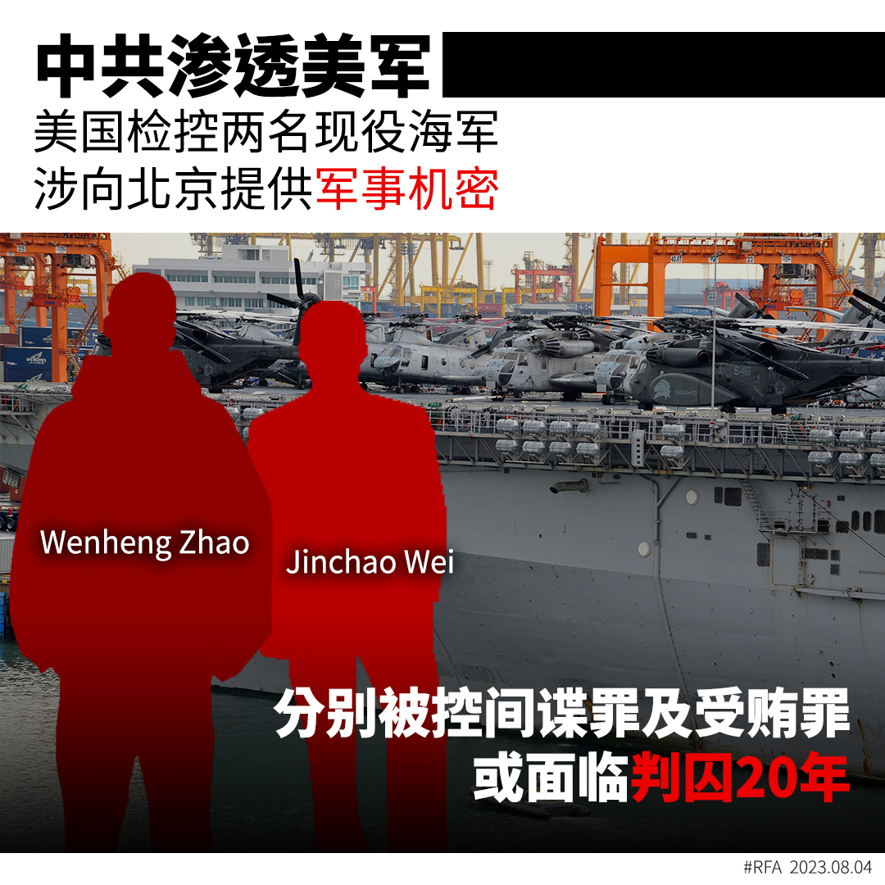
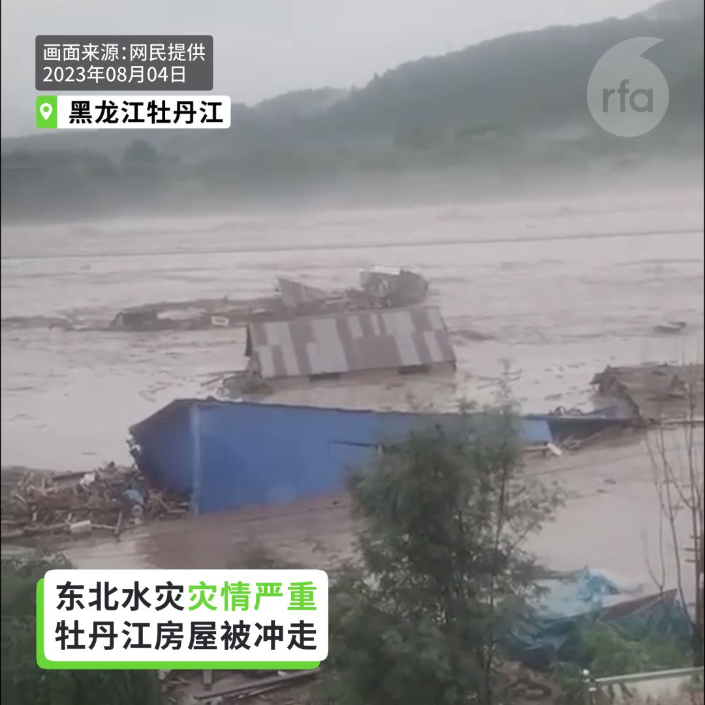
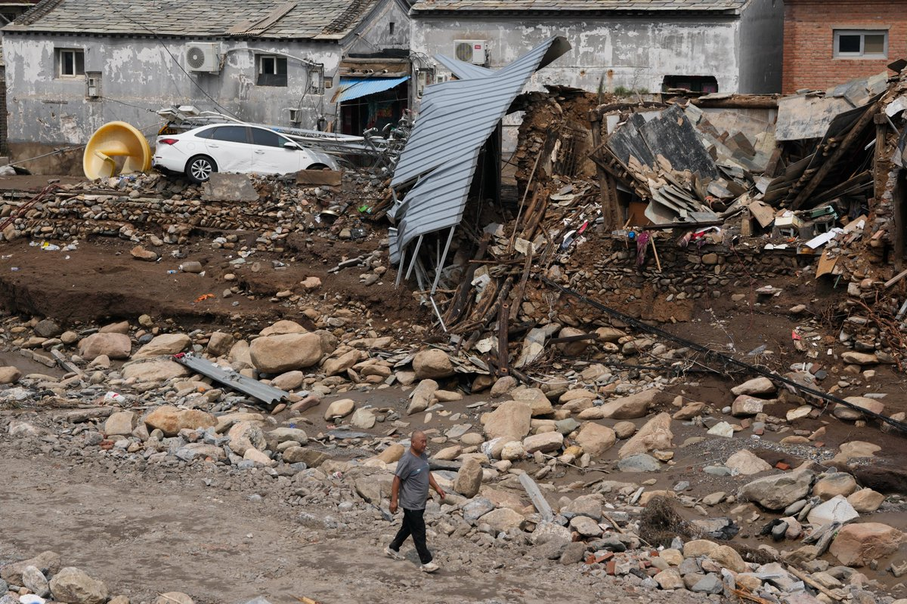
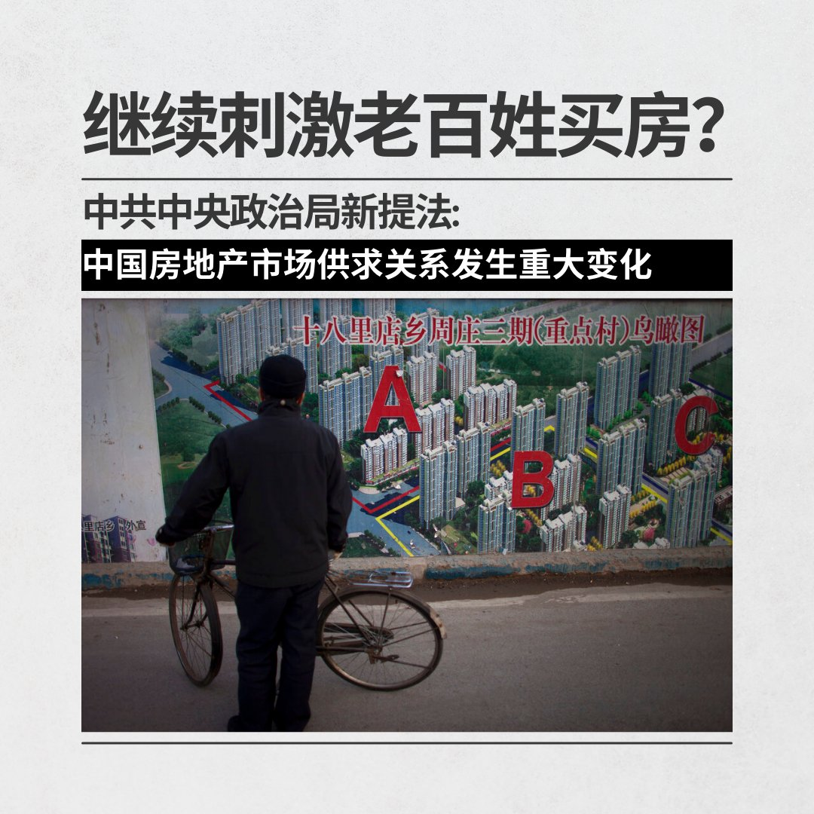
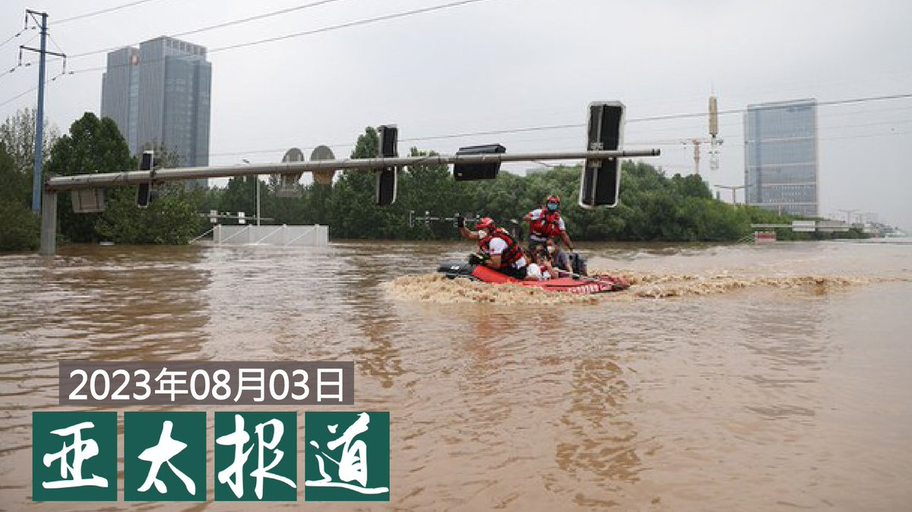

自由亚洲电台 北京时间 2023-08-04T18:26:49Z 1687409748688408576 【美国检控两名现役海军】
【涉向北京提供军事机密】
美国当局近日拘捕两名 #现役海军士兵，他们被控向 #北京 提供敏感军事机密，包括美国军舰武器数据、冲绳美军基地雷达系统蓝图、军事演习的作战计划、甚至把整份战舰机械操作手册原原本本交给 #中国情报 单位。两人分别被控间谍罪及受贿罪，如果罪名成立，将分别面临判囚20年至无期徒刑，及最高判处入狱20年。
根据周四公布的两份联邦起诉书，22 岁的Jinchao Wei，（又名 Patrick Wei）和26岁的Wenheng Zhao（又名Thomas Zhao）被控向中国提供机密。但两人分别被控 #间谍 罪，和受贿罪。   自由亚洲电台 北京时间 2023-08-04T20:08:30Z 1687435339638726656 【黑龙江汛情告急】
【#牡丹江 #尚志 #五常 等地大水漫漶】
8月4日，#黑龙江 省多条河流汛情严峻。牡丹江 市东京城林业局尔站经营所生活区，洪水卷走房屋。五常的大河桥被冲断。哈牡高速路上桥梁冲塌，车子掉进河流。 https://t.co/gmrGxUOVTL   自由亚洲电台 北京时间 2023-08-04T17:26:30Z 1687394569384812544 【水灾爆发 #保北京 成头等大事】
【官员纷作政治表态】
中国华北地区洪灾已持续一周。水利专家说，北京 #门头沟 和 #房山 位于燕山山脉交汇处，是北京洪水的一个重要源头。但高官齐称“保北京”是一种 #政治表态。#涿州 官方周四发公告接受社会捐赠，网民则发出寻找市长和书记的“#寻人启示”。
https://t.co/WK5kGxvWNK   自由亚洲电台 北京时间 2023-08-04T10:04:14Z 1687283270008840192 脱钩成真？
今年第一季度旅游公司组办 #外国游客 人数为52，000，而2019第一季度这个数字达到370万人次。https://t.co/JmFXeMpNI0   自由亚洲电台 北京时间 2023-08-04T06:30:01Z 1687229362951913474 评论 | #陈破空：#火箭军 的故事很中国，还敢打台湾吗？
 https://t.co/Cui9UtQw0E   自由亚洲电台 北京时间 2023-08-04T06:56:56Z 1687236134206689283 最近，中共中央政治局召开会议，对中国当前房地产市场做出最新定位——中国房地产市场供求关系发生重大变化，提出适时调整优化房地产政策。住建部迅速响应，要求各地落实降低首付，“认房不认贷”等政策。
您认为，如果未来中国房地产刺激政策继续升级，松绑过去的限制政策，老百姓还会买房吗？ https://t.co/OfZLFL9Mxu   自由亚洲电台 北京时间 2023-08-04T07:00:07Z 1687236933767024645 【#亚太报道（2023-8-3）】
欢迎收听和订阅播客【亚太报道】 https://t.co/MjLNSvVMqc

#泄洪 淹 #涿州 以保 #北京 和 #雄安 / 涿州受灾人数达五分之一 / #黑龙江建方舱 为民愤“泄洪”？ / #火箭军 高层被清洗 中美激烈交锋 / 中国“#大国外交”走入“死胡同” https://t.co/o3HkjxDow4   自由亚洲电台 北京时间 2023-08-04T07:30:00Z 1687244457505345537 专栏 | #中国透视：七十年轮回：#韩战 幽灵牵轴心
 https://t.co/fDKuCfjWZB   自由亚洲电台 北京时间 2023-08-04T08:18:24Z 1687256634676903936 RT @RFA_Chinese: 【征集受访者：为什么你不敢花钱？】
7月31日，中国国家发改委出台《#关于恢复和扩大消费的措施》。这20条措施能让您家扩大消费吗？如果政府直接发钱给您，您愿意更多消费，还是把钱存起来？
就这些问题，如果您愿意接受采访，分享高见，请发电邮 fan…   自由亚洲电台 北京时间 2023-08-04T08:58:40Z 1687266768572821505 美国加州中部城市里德利（Reedley)当局破获一个非法实验室，里面充满 #冠状病毒、#艾滋病毒 和疟疾原虫等知名病原体，疑似与 #中国 有关。

 https://t.co/WFx5ODaQnj   自由亚洲电台 北京时间 2023-08-04T08:59:59Z 1687267101814231040 RT @RFA_Chinese: #中国女足 1：6 不敌英格兰，史上首次世界杯小组出局后，女足一姐 #王霜 在赛后接受采访时的言论引发热议。
“我一直有个问题，为什么我们比欧洲的那些球队练得都更苦，付出的更多，但始终没有拿到想要的成绩？”
“出线了又能怎么样呢？所以这也并不是…   自由亚洲电台 北京时间 2023-08-04T04:22:48Z 1687197347456192512 中国当局接连推出各种"#救市"措施，试图挽救当前的经济颓势。不过，《华尔街日报》8月1日发文称，官方的口头支持远远不够，而是需要采取更加强有力的措施。那么采取怎样的手段才能使中国的经济真正复苏？北京是不想做还是做不到呢？本台记者凯迪 @KittyWang5 报道。

 https://t.co/PPqkp1CDzY   自由亚洲电台 北京时间 2023-08-04T05:09:38Z 1687209133391618048 2022年美国投资移民签证EB-5申请人当中，仍以中国人居多，根据美国国务院的数据，去年批准的10,885个EB-5签证当中，有6,125个名额批给了中国申请人。

 https://t.co/sQY7djmmjl   自由亚洲电台 北京时间 2023-08-04T05:13:03Z 1687209990283743235 #中国社会科学院 近十年来不断出版有关 #中国共产党意识形态 和中西方对立的重大课题项目书籍。前《南方都市报》主编 程益中@ChengYizhong 近期对这样的图书进行了系统的研读，并从中发现了中国政治近年来出现转向的痕迹和原因。 本台记者王允 @Jeff23Wang 专访程益中。
https://t.co/TefMdcquGe   自由亚洲电台 北京时间 2023-08-04T05:23:46Z 1687212690429587456 #中国女足 1：6 不敌英格兰，史上首次世界杯小组出局后，女足一姐 #王霜 在赛后接受采访时的言论引发热议。
“我一直有个问题，为什么我们比欧洲的那些球队练得都更苦，付出的更多，但始终没有拿到想要的成绩？”
“出线了又能怎么样呢？所以这也并不是一件坏事吧。让大家看到我们跟英超和美国的差距。”
舆论哗然，体坛周报的名记 #梁熙明 在个人社交媒体炮轰王霜：“任何国家级运动队代表，敢于说出线了又怎么样，就这点认知和精神状态，就配一个彻底封杀。”

【谁能回答王霜的灵魂拷问？你同意梁熙明的办法吗？】   自由亚洲电台 北京时间 2023-08-04T05:30:01Z 1687214262446686209 #事实查核｜美国若拒发邀请函给 #李家超，违反 #APEC 规则？
 https://t.co/PVmw7B0iP0   自由亚洲电台 北京时间 2023-08-04T06:00:02Z 1687221817142857728 评论 | #魏京生：#水利 和 #水灾
 https://t.co/iFjjVfdeWL   自由亚洲电台 北京时间 2023-08-04T02:34:08Z 1687170000472473600 随着中国外交部长的紧急更迭，外界聚焦中国的外交努力。虽然中共在十八大以来奉行“#大国外交 ”政策，但实际效果却与期望背道而驰。近日有分析指出，中共不仅被国际多个重要联盟排除在外，美国也被激起了对中共的“不合作外交”的不满。

 https://t.co/vCuKiYfHFL   自由亚洲电台 北京时间 2023-08-04T03:05:13Z 1687177819833651203 专栏 | #军事无禁区：#习近平 #整风运动－看 #火箭军 大清洗
 https://t.co/xdMXGRo1Hq   自由亚洲电台 北京时间 2023-08-04T03:22:50Z 1687182253275910145 中国国家安全部7月31日开通官方微信公众号，首篇文章就是《反间防谍需要全社会动员！》，号召全民举报间谍，举报有功者有赏。台媒报道称，这一规定“让外籍记者背脊发凉”。您如何看待此事？ https://t.co/RPOXPICV9s   自由亚洲电台 北京时间 2023-08-04T03:56:43Z 1687190781386543104 在 #洛杉矶中国领事馆 外，一批来自中国的异议人士8月1日举行抗议集会。集会者呼吁中国实现 #军队国家化 和 #政治民主化，同时声援在老挝被捕的人权律师 #卢思位，并对 #齐齐哈尔 坍塌事件中的遇难者表示哀悼。

 https://t.co/lTimqADtIC   自由亚洲电台 北京时间 2023-08-04T00:42:38Z 1687141940972961792 【官媒表示：#河北洪水 可能要一个月才能退】
【外地人员去涿州救灾要先获批准】 https://t.co/i9OS0dLPPo   自由亚洲电台 北京时间 2023-08-04T01:17:07Z 1687150618740416512 现任陆军航空特战指挥部601旅谢姓中校，在今年七月初，外泄去年及今年601旅实兵演习的资料给谢姓商人。
谢姓商人疑似提供小额资金给谢姓中校，要求谢某刺探营区事务，还以“最快2025年，还是什么时候，等中共武力解放台湾，保证让你的妻小平安转移”，说服他交付 #汉光演习 资料 https://t.co/0aSmCfJf7q   自由亚洲电台 北京时间 2023-08-04T01:39:29Z 1687156245759922176 习近平在7月31日升任 #王厚斌 为 #火箭军  司令员、#徐西盛晋升火箭军政治委员。前中国海军中校姚诚3日在录制 #亚洲很想聊 节目上直指：“王厚斌去火箭军不是去整顿，他是调整火箭军的作战计划和兵力布署。习近平现在迫切需要把火箭军的战斗力尽快恢复起来，要打 #台湾。”

 https://t.co/KYdOmqTdRT   自由亚洲电台 北京时间 2023-08-04T02:01:07Z 1687161689245163520 #美日韩 三国领导人即将在8月18日美国总统度假胜地戴维营举行峰会。有消息称，三国首脑将讨论开通热线的方案，目的是通过领导人之间定期沟通，在安保和经济领域展现团结一致，强化威慑力，以牵制 #朝鲜核威胁 和 #中国 的霸权行为。

 https://t.co/OrlJivC07F   自由亚洲电台 北京时间 2023-08-04T00:09:21Z 1687133562070614017 因为颠覆国家政权罪成被判处有期徒刑八年的中国异议人士郭飞雄已从看守所被移送监狱服刑。由于郭飞雄不满狱方的安排，家属担心他会再度绝食。

 https://t.co/QPqEhIMt7E   