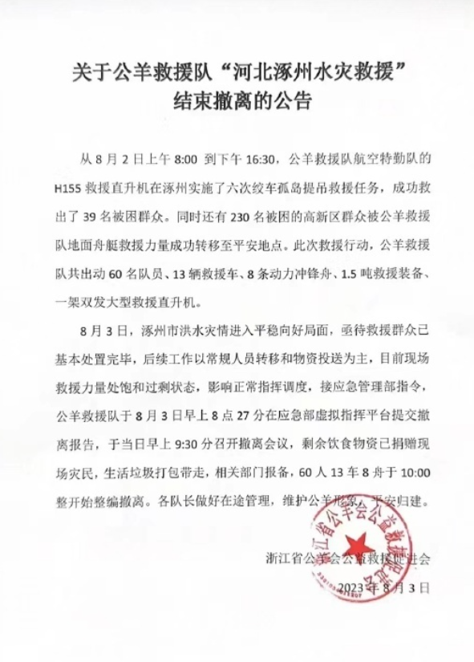
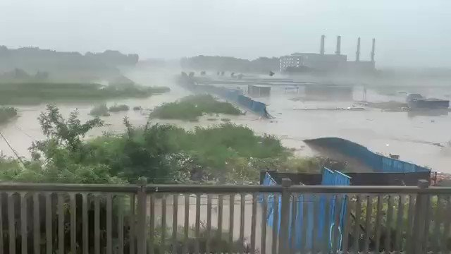

谁将十万横扫三江 北京时间 2023-08-04T08:10:06Z 1687254546979151872 RT @whyyoutouzhele: 8月3日，浙江公羊救援队率先以“救援力量饱和”为由撤出救援。 https://t.co/cEfZ7eOlB7   谁将十万横扫三江 北京时间 2023-08-04T08:10:19Z 1687254603296104448 RT @whyyoutouzhele: 此前2日，媒体报道称，涿州政府曾以“因过去救灾中夸大灾情的情况常见，需邀请函作为保证”为由，要求民间救援队需要属地，当地，以及求救的村庄，街道开具“邀请函”之后才能开展救援。
甚至发生派工作人员涉水回灾区取“应急管理局公章”的奇葩行为。…   谁将十万横扫三江 北京时间 2023-08-04T08:23:50Z 1687258002926305284 涿州被泄洪合集，不是天灾，是人祸 https://t.co/EUsswZwiGH   谁将十万横扫三江 北京时间 2023-08-04T08:38:40Z 1687261738432155648 💧 https://t.co/BzwfDJNATB   谁将十万横扫三江 北京时间 2023-08-04T08:58:18Z 1687266675937492992 RT @boiledwater: 要不要一起讲下关于水灾的记忆。

因为只提水灾这个词语太抽象。但具体到每个人身上都是生离死别的故事。

我阿姨是安徽人。她说小时候发大水，把一切都冲走了。灾后哥姐和她都感染了很重的病，爸妈考虑到哥姐好了是个劳力，而她是个累赘，就把她丢在教堂门口…   谁将十万横扫三江 北京时间 2023-08-04T09:01:43Z 1687267536306688000 真好意思宣传 https://t.co/F0xHxjMp72   