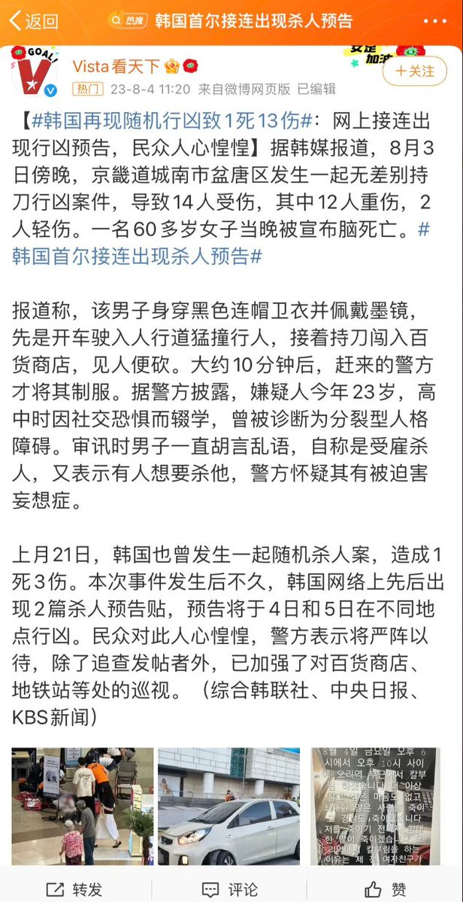
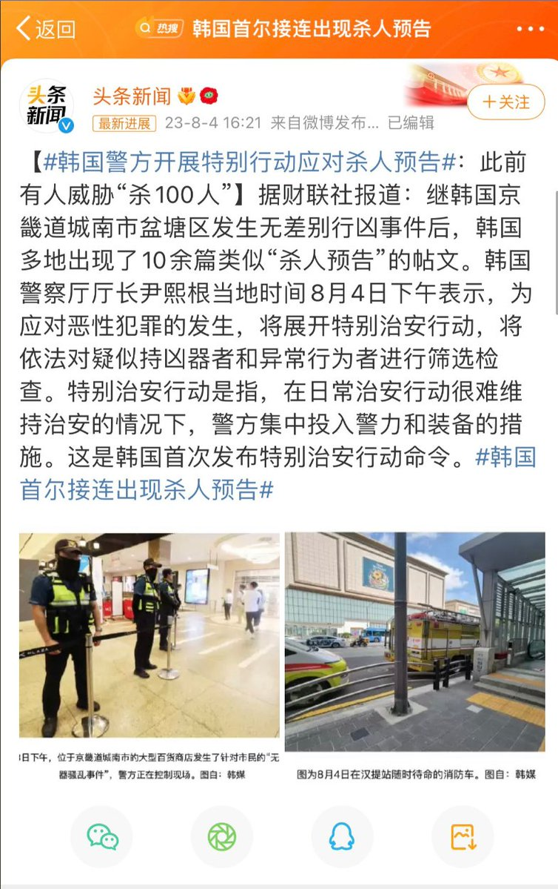
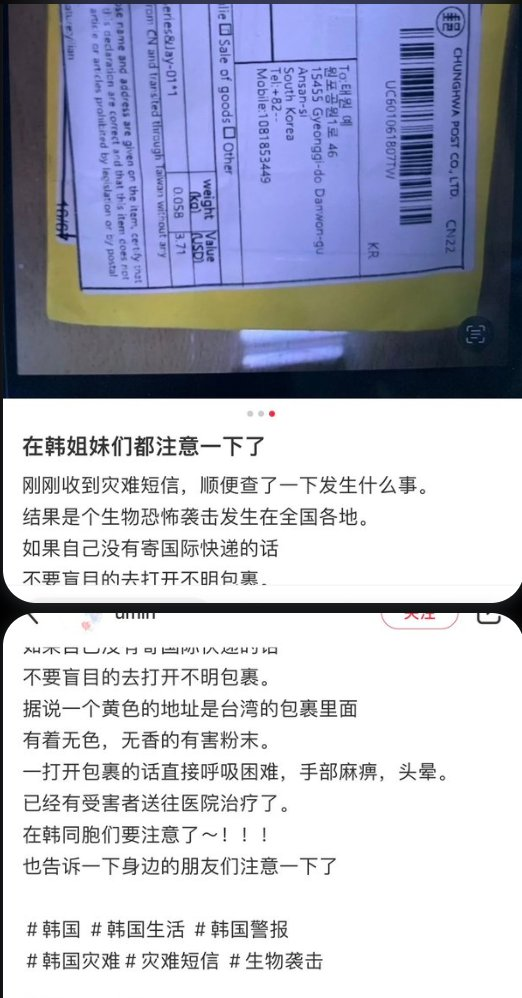
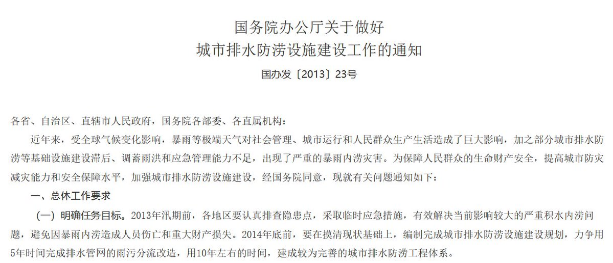
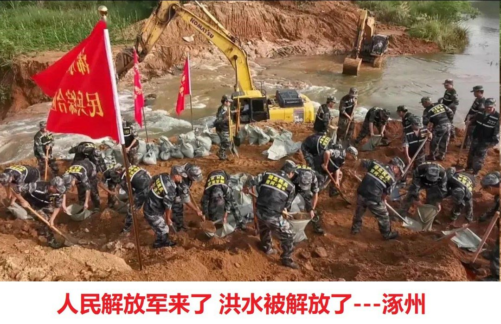
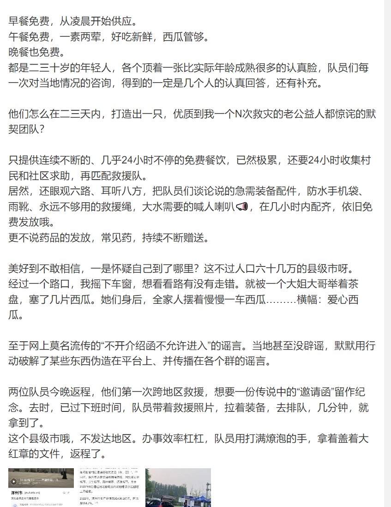

谁将十万横扫三江 北京时间 2023-08-04T22:36:34Z 1687472602166751232 RT @whyyoutouzhele: 目前，国内开始大肆报道韩国出现“杀人预告” https://t.co/fAqONj03Nr   谁将十万横扫三江 北京时间 2023-08-04T20:42:38Z 1687443927484506113 福建泉州印刷厂为了防止工人干不够时间就离开，用锁头把工人锁起来

PS：这就是资本主义的雇佣奴隶，如果企业先进些，会用电子设备完成这点，比如环卫工人的测动仪，物流工人的测码仪，办公室白领的离岗刷脸、上厕所计时器。落后的话，就只能物理给你捆在办公地点，保证剩余价值的产生 https://t.co/Ln9eYp2rpf   谁将十万横扫三江 北京时间 2023-08-04T20:46:03Z 1687444789544054784 现在官方宣称河北死亡、失联多少人了？ https://t.co/xds2b2B8i2   谁将十万横扫三江 北京时间 2023-08-04T20:49:09Z 1687445568887652352 一个豆腐渣工程的楼倒了，人被困在里面了，然后有个消防员拼命救人，最后把自己搭进去了牺牲了。大家都说这个消防员很伟大，但是你有没有想过，其实他根本没必要伟大，如果当时的楼质量和安全足够可靠，那这个事故根本就不需要发生，根本也不需要那么多伟大的人。
有些“伟大”是怎么来的呢?就是有一些人干了昧良心不要脸的事，然后另一部分善良的人过来帮忙擦屁股，还把自己搭上了，然后这些人就成了“伟大的人”。
实际上，我们得明白这种“伟大”背后，到底是谁制造了问题，倒底是谁让这些普通人，一定要成为“伟大的人”，然后不得不去牺牲自己的?   谁将十万横扫三江 北京时间 2023-08-04T21:05:42Z 1687449732409663488 房屋及土地证照齐全，不存在违建的问题!老少三代人的唯一住房。一直到2023年的今天我们没有签过任何补偿协议，也没有获得任何形式的补偿。2019年5月24日不明身份人员趁我们家人只有一位七十多岁的老人在家的时候闯入我家，破拆杖子把独自在家的老人拖出去，强行灭失了所有财物，拆毁房屋，占用土地 https://t.co/2Y9Fv3TepG   谁将十万横扫三江 北京时间 2023-08-04T21:35:09Z 1687457146563407872 RT @whyyoutouzhele: 网友投稿
7月29日5名中国公民自驾入境俄罗斯遇阻，遭遇4个小时反复审查，被注销旅游签证。8月4日，中国驻俄罗斯大使馆发布消息，称已经约见俄罗斯外交部，边防局，安全局等部门提出交涉，明确指出俄方存在野蛮执法，过度执法的行为，严重损害中国公…   谁将十万横扫三江 北京时间 2023-08-04T22:11:51Z 1687466383104450561 RT @whyyoutouzhele: 刚刚，央广网发布消息，7月全国因灾死亡失踪147人，直接经济损失411.8亿。 https://t.co/0fNcsUY2H9   谁将十万横扫三江 北京时间 2023-08-04T19:41:38Z 1687428577070051328 RT @lilaoshizuikeai: 作为阜阳人，真的对涿州感同身受
我们阜阳王家坝每年夏天都要为了保江苏保南京保上海开闸泄洪，泄了多少年，早就泄麻了，现在当地农民早就不种地了，每年临近泄洪的时候象征性插点秧苗赚赚补贴，回家一躺在朋友圈转发几条王家坝精神的文章自我感动一下，…   谁将十万横扫三江 北京时间 2023-08-04T19:59:18Z 1687433022080237568 RT @Winter_Oct: 污蔑托洛茨基/托洛茨基派为反革命分子的常见说辞：
1、托洛茨基早期是孟什维克成员（但他在意识到孟什维克的一系列错误后就退出了孟什维克）
2、列宁曾经对托洛茨基的理论进行过批判（然而反对者们却对后来列宁对他的肯定进行选择性失明）
（1/4）   谁将十万横扫三江 北京时间 2023-08-04T20:01:52Z 1687433668871196672 RT @Acephale01: @tnytng11 现在对托洛茨基最大的污蔑就是“托洛茨基支持市场”，但如果仔细看完托洛茨基那篇32年的《苏联经济的危机》就知他是基于急进集体化失败的问题而提出恢复农村市场，目的在于重新建立起有效的(同时也带有自发性)的市场配置从而恢复农业生产，…   谁将十万横扫三江 北京时间 2023-08-04T20:17:09Z 1687437514154663937 洪水解放军解放涿州 https://t.co/efzpDRMFF0   谁将十万横扫三江 北京时间 2023-08-04T20:22:48Z 1687438937412014080 8月4日早上，牡丹江东京城尔站河洪水泛滥成灾，白茫茫一片，年年修水利工程，就成这样子 https://t.co/rhHcMtFaQ6   谁将十万横扫三江 北京时间 2023-08-04T16:31:28Z 1687380721978286080 RT @whyyoutouzhele: 8月4日，在“中国向苏丹交付人道主义物资”下方
网友们纷纷讽刺
“苏丹在涿州哪个地方？”
“感谢苏丹对涿州人民的帮助” https://t.co/kKSzl3X5WF   谁将十万横扫三江 北京时间 2023-08-04T16:32:23Z 1687380952354566144 捐钱给中国红十字会的什么成分不用我说了吧 https://t.co/0sbEhwMr46   谁将十万横扫三江 北京时间 2023-08-04T16:33:34Z 1687381248015204352 RT @whyyoutouzhele: 【慎点】8月4日，山东泰安新泰发生恶意撞人事件。 https://t.co/ZxK7wOYJ2a   谁将十万横扫三江 北京时间 2023-08-04T16:35:54Z 1687381835855331328 RT @whyyoutouzhele: 另一种声音
有微博网友发帖称，自己前往涿州救援，一切井然有序，现场服务细致指挥精细，免费瓜果提供，午餐两荤一素，不开邀请函不准进是谣言。
“美好的不敢相信” https://t.co/u5aq3Xpw6o   谁将十万横扫三江 北京时间 2023-08-04T16:42:23Z 1687383470027472896 RT @whyyoutouzhele: 一名村民讲述目前涿州的情况：
1.涿州东边和北边的村都淹了
2.不要相信新闻报道，政府什么都没安排，目前主要靠村民自救
3.现在很多人都在大堤上护堤，防止再被人挖开。
4.信号正在被屏蔽 https://t.co/KqZRv1uYcj   谁将十万横扫三江 北京时间 2023-08-04T16:57:31Z 1687387275934711808 RT @torontobigface: 涿州因为倒卖物资问题，产生了冲突。 https://t.co/JLFVZ86PW3   谁将十万横扫三江 北京时间 2023-08-04T08:04:11Z 1687253059251175425 RT @zkl86976526: 很多男性都说，为什么女性不下矿井，不上工地？这其实庸俗地把工作平权理解为男性干什么女性就要干什么。
工作平权本质是在教育、晋升和机会获得上的平等。仅在日本，女性非正式雇佣率2020年达到54.4%，男性只有22.2%。在这种巨大不平等下，把一两…   谁将十万横扫三江 北京时间 2023-08-04T08:09:58Z 1687254512501936129 RT @whyyoutouzhele: 网友投稿
目前，网传消息称，由于当地政府不作为，诋毁外地民间救援队，救援队缺少政府人员对接和当地向导，以及和政府部门相关人员的矛盾，导致各地民间救援队正在退出涿州救援。 https://t.co/PA5uFVLgfh   谁将十万横扫三江 北京时间 2023-08-04T08:10:06Z 1687254546979151872 RT @whyyoutouzhele: 8月3日，浙江公羊救援队率先以“救援力量饱和”为由撤出救援。 https://t.co/cEfZ7eOlB7   谁将十万横扫三江 北京时间 2023-08-04T08:10:19Z 1687254603296104448 RT @whyyoutouzhele: 此前2日，媒体报道称，涿州政府曾以“因过去救灾中夸大灾情的情况常见，需邀请函作为保证”为由，要求民间救援队需要属地，当地，以及求救的村庄，街道开具“邀请函”之后才能开展救援。
甚至发生派工作人员涉水回灾区取“应急管理局公章”的奇葩行为。…   谁将十万横扫三江 北京时间 2023-08-04T08:23:50Z 1687258002926305284 涿州被泄洪合集，不是天灾，是人祸 https://t.co/EUsswZwiGH   谁将十万横扫三江 北京时间 2023-08-04T08:38:40Z 1687261738432155648 💧 https://t.co/BzwfDJNATB   谁将十万横扫三江 北京时间 2023-08-04T08:58:18Z 1687266675937492992 RT @boiledwater: 要不要一起讲下关于水灾的记忆。

因为只提水灾这个词语太抽象。但具体到每个人身上都是生离死别的故事。

我阿姨是安徽人。她说小时候发大水，把一切都冲走了。灾后哥姐和她都感染了很重的病，爸妈考虑到哥姐好了是个劳力，而她是个累赘，就把她丢在教堂门口…   谁将十万横扫三江 北京时间 2023-08-04T09:01:43Z 1687267536306688000 真好意思宣传 https://t.co/F0xHxjMp72   