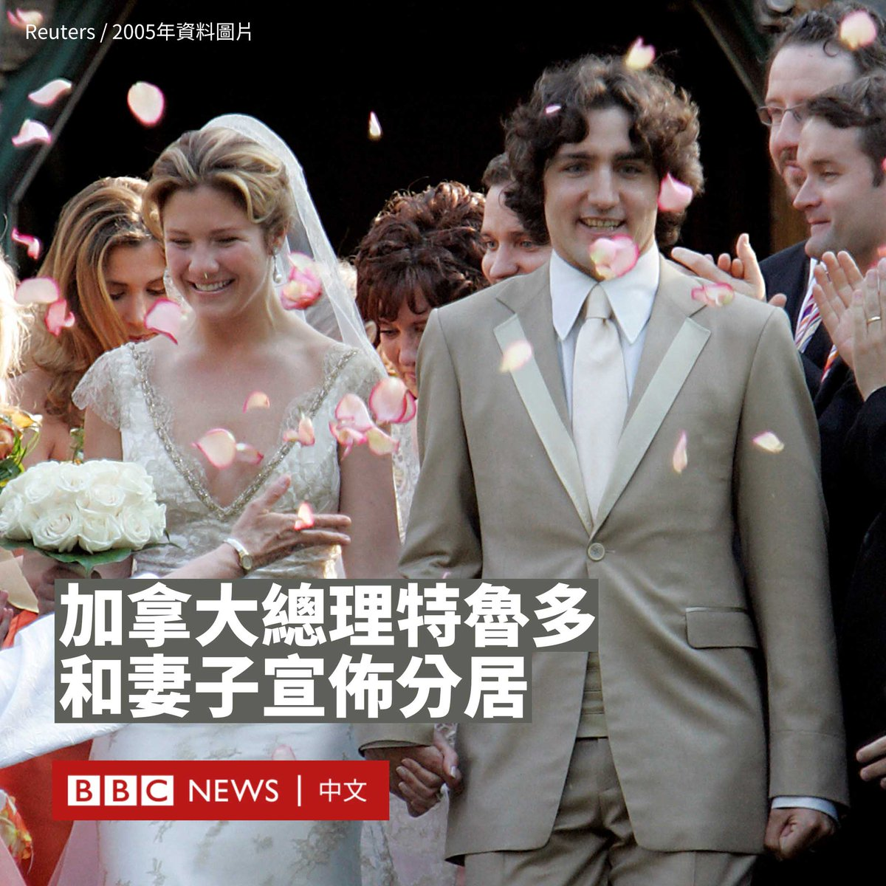
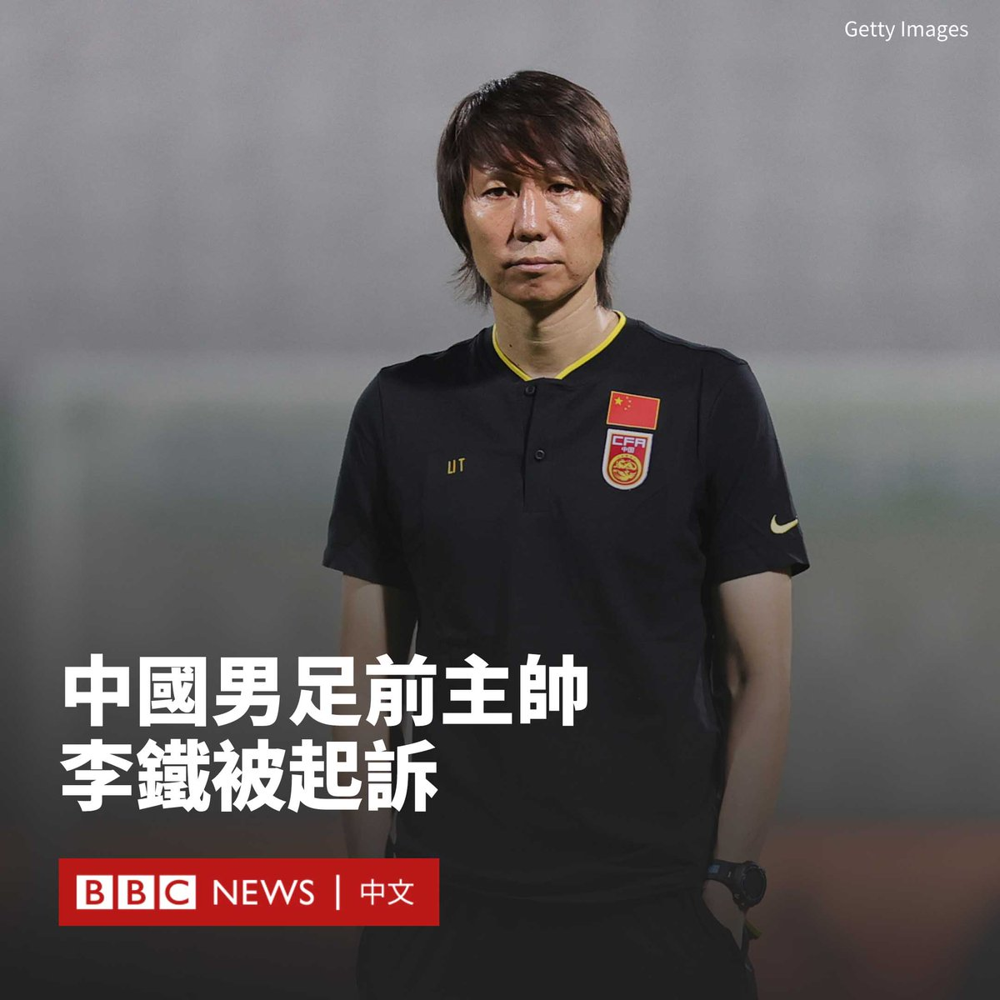
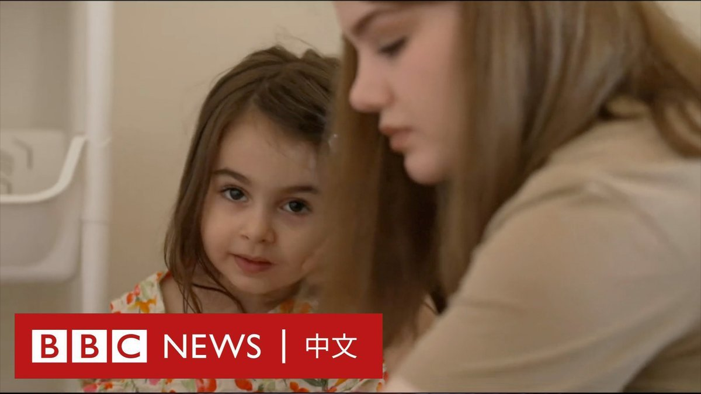

D英国广播公司BBC 北京时间 2023-08-03T13:05:33Z 1686966511645143041 中国华北多地遭暴雨和洪水重创，距离北京60公里的河北小城涿州成为汛情最严重的地方。

BBC驻中国记者麦笛文（Stephen McDonell）来到涿州，这里许多民房的低楼层遭淹没、不少居民被困，救援人员只能通过橡皮艇从淹水的道路进入。

在河边，被洪水冲刷下来的物品堆积如山，包括冰箱等大件物品。 https://t.co/1DlRkzCsJb   D英国广播公司BBC 北京时间 2023-08-03T11:54:21Z 1686948593452851200 加拿大总理特鲁多（Justin Trudeau）和妻子索菲（Sophie Gregoire Trudeau）在结婚18年后宣布分居。两人称，他们在进行了“有意义且艰难的对话”后做出这一决定。

特鲁多和索菲2005年在蒙特利尔结婚，育有三个孩子。这对夫妇在Instagram上发帖称，他们将继续维持“深爱和尊重的亲密家庭”关系。

特鲁多的办公室在一份声明中表示，尽管两人已签署分居协议，但他们仍将一起公开露面。

“他们已经努力确保就分居决定采取了所有合乎法律和道德的措施，并将继续这样做。”声明称，两人下周还将作为一家人度假。

特鲁多和索菲的孩子分别是15岁的泽维尔（Xavier）、14岁的艾拉-格雷斯（Ella-Grace）和9岁的哈德里安（Hadrien）。两人呼吁外界保护孩子的隐私。

特鲁多和索菲童年相识，于2003年开始约会，当时索菲是一位电视名人。她还因从事公益事务而闻名。两人2005年举行婚礼。

2015年特鲁多首次当选总理时，这对夫妇高调出现在《时尚》（Vogue）杂志的版面。索菲回忆，在他们第一次约会后的晚餐结束时，特鲁多说：“我31岁了，我等你31年了”。

但近年来，他们公开出席活动的曝光度减少，尽管他们于5月一起参加了国王查尔斯三世（Charles III）的加冕礼，并于3月在加拿大接待了美国总统拜登（Joe Biden）。

2022年5月，索菲在Instagram上发布了一篇结婚周年纪念文章，谈到了长期关系的挑战，她说：“我们经历了晴天、暴雨以及其间的一切”。

特鲁多也曾谈及他们婚姻中的挑战，他在2014年的自传中写道：“我们的婚姻并不完美，我们经历了艰难的起伏，但索菲仍然是我最好的朋友、伴侣和爱人。”   D英国广播公司BBC 北京时间 2023-08-03T10:15:55Z 1686923821931237376 中国国家男子足球队前主帅李铁被检方以五项罪名提起公诉。他是过去几个月中国当局在足坛掀起的反腐风暴中被查的最知名案例。

据官方媒体星期三（8月2日）报道，李铁涉嫌受贿、行贿、单位行贿、非国家工作人员受贿、对非国家工作人员行贿等罪名。

报道指，湖北省咸宁市人民检察院已就此向咸宁市中级人民法院提起公诉。

2022年11月，中国当局宣布李铁因涉嫌严重违法而接受调查。他成为中国国家男子足球队首位被调查的主教练。

他的“落马”拉开了中国足球界的反腐风暴，有十余名足球高层被查。此外，还有多名涉嫌踢假球、吹黑哨的职业球员和裁判被带走调查。

46岁的李铁在球员时代曾是中国国脚，代表国家队参加过2002年韩日世界杯——也是中国男足至今唯一在世界杯决赛圈的参赛经历，之后曾效力英超球队埃弗顿（Everton）。

退役后李铁曾执教河北华夏和武汉卓尔两家中国俱乐部，并率领球队升上中超联赛。

2020年1月，他被任命为男足主帅，备战2022年卡塔尔世界杯预选赛，但因战绩不佳，且言论争议不断，于2021年底辞职。   D英国广播公司BBC 北京时间 2023-08-03T09:10:32Z 1686907369207595009 三个月前，26岁的席玛（Sima Moradbeygi）带着年仅三岁的女儿跨越边境，步行穿越满布地雷并且被严密守卫的路途逃离伊朗，抵达伊拉克的库尔德斯坦地区。
 
在此前该国大规模反头巾抗议中，席玛被伊朗安全部队以霰弹枪击中；因为害怕遭逮捕而无法好好接受治疗，她决定带着孩子踏上逃亡旅途。 https://t.co/8JDjQ21EWY   