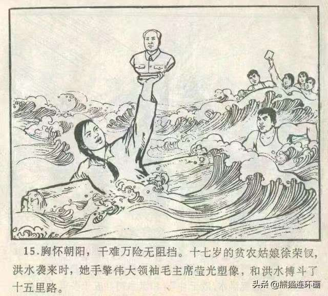
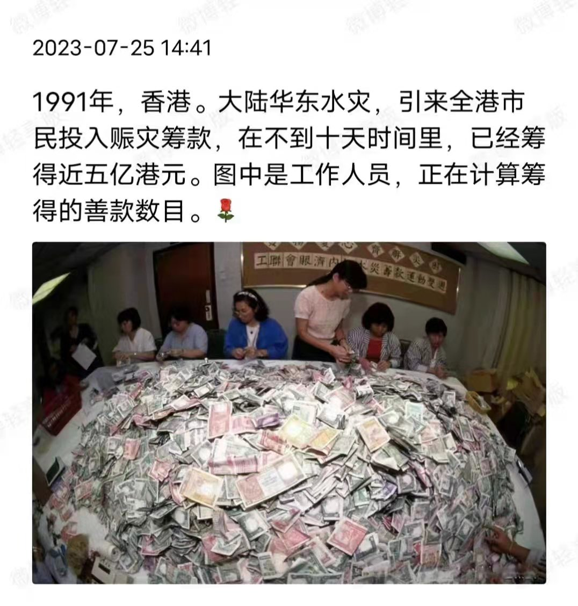
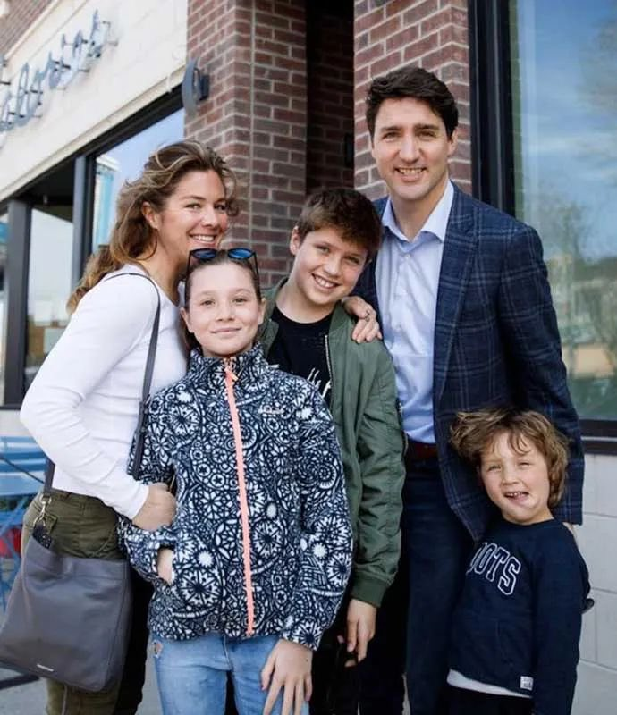

Petrichor 北京时间 2023-08-03T10:07:03Z 1686921590343139328 政通人和，风调雨顺。
天怒人怨，暴风骤雨。 https://t.co/GORPMttXo0   Petrichor 北京时间 2023-08-03T07:39:59Z 1686884582585466880 现在北京及其周边地区大洪水，香港、台湾以及海外侨胞还有人捐款吗？ https://t.co/2gNlmxNQou   Petrichor 北京时间 2023-08-03T09:27:31Z 1686911642687209472 从道路指示灯可以判断河北涿州洪水有多深，水库泄洪，牺牲保定，保北京。 https://t.co/CxWMPZIeeN   Petrichor 北京时间 2023-08-03T02:16:38Z 1686803205508788235 加拿大历史上共有二位在任期间宣布分居的总理，他们是父子俩，父亲叫皮埃尔·特鲁多（Pierre Trudeau）于1979年与妻子玛格丽特（Margaret）分居，两人于1984年离婚。儿子是Justin Trudeau，加拿大现任总理，与索菲于2005年结婚，2023年分手，在18年的婚姻中育有三个孩子。 https://t.co/1BL5h42cM6   