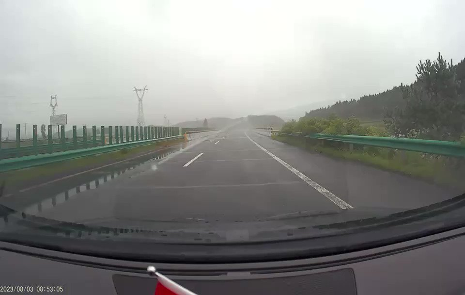
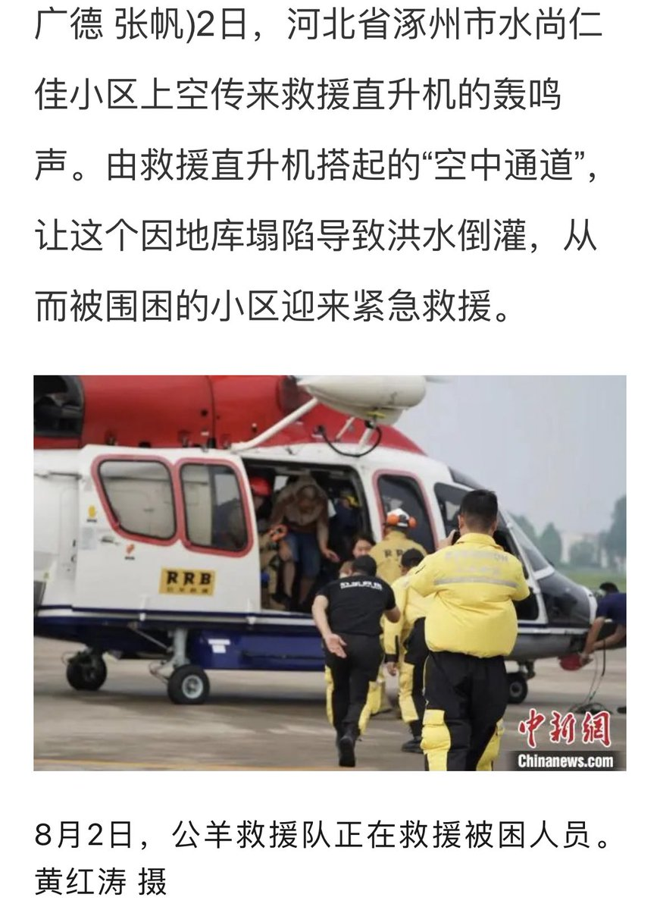

Petrichor 北京时间 2023-08-03T23:32:22Z 1687124255610195968 历史上，白洋淀是北京周围的蓄洪区。但今年涿州作为泄洪区。实际上涿州的海拔比雄安要高，为啥不往白洋淀泄洪？因为水利部不敢，雄安是钦定副都。以前遇到洪水，保首都北京即可，现在还要保皇帝舅舅家的雄安。 https://t.co/mqWhS1mcbz   Petrichor 北京时间 2023-08-03T17:57:58Z 1687040100679479297 灾民、饥民、抢饮用水和食品，是可以预见的。 https://t.co/hgOneZ5gH7   Petrichor 北京时间 2023-08-03T18:02:14Z 1687041175247560704 转发：哈牡高速一段桥梁坍塌，两车坠入河中。8月3日上午，哈牡高速254公里附近路段发生塌陷，导致道路交通中断。目前，交警已到达现场并实施临时管控，哈牡高速亚布力至横道河子路段双向封闭通行。 https://t.co/DBRhjxyMiQ   Petrichor 北京时间 2023-08-03T12:11:23Z 1686952880970878976 摆拍的，穿帮了。直升机在水不深、完全可以步行的地方“救援”。第一张照片中，水只有半个车轮深，第二张照片中水薄薄的一层。 https://t.co/4iJLWDRWVK   Petrichor 北京时间 2023-08-03T10:07:03Z 1686921590343139328 政通人和，风调雨顺。
天怒人怨，暴风骤雨。 https://t.co/GORPMttXo0   Petrichor 北京时间 2023-08-03T07:39:59Z 1686884582585466880 现在北京及其周边地区大洪水，香港、台湾以及海外侨胞还有人捐款吗？ https://t.co/2gNlmxNQou   Petrichor 北京时间 2023-08-03T09:27:31Z 1686911642687209472 从道路指示灯可以判断河北涿州洪水有多深，水库泄洪，牺牲保定，保北京。 https://t.co/CxWMPZIeeN   Petrichor 北京时间 2023-08-03T02:16:38Z 1686803205508788235 加拿大历史上共有二位在任期间宣布分居的总理，他们是父子俩，父亲叫皮埃尔·特鲁多（Pierre Trudeau）于1979年与妻子玛格丽特（Margaret）分居，两人于1984年离婚。儿子是Justin Trudeau，加拿大现任总理，与索菲于2005年结婚，2023年分手，在18年的婚姻中育有三个孩子。 https://t.co/1BL5h42cM6   