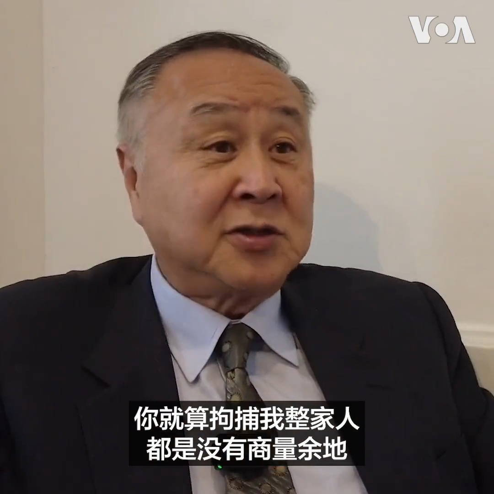
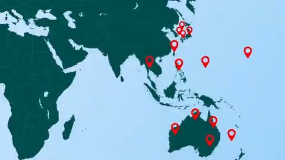
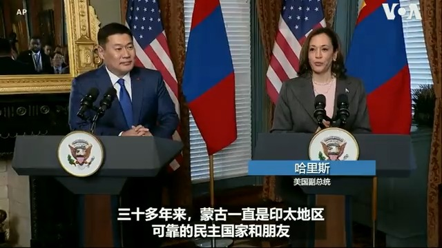
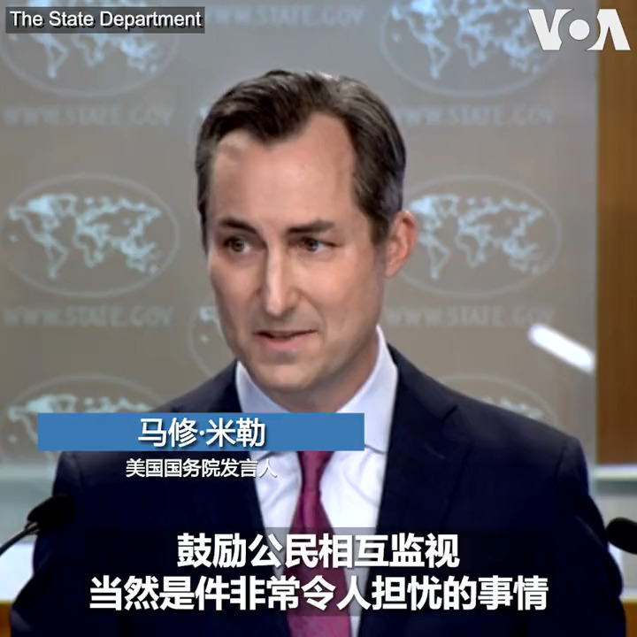
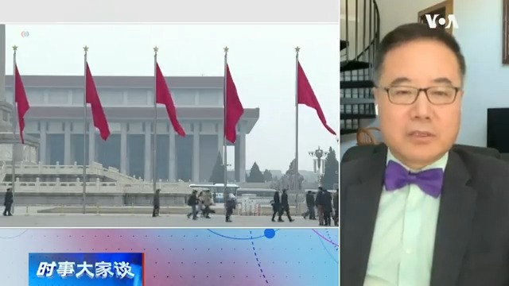
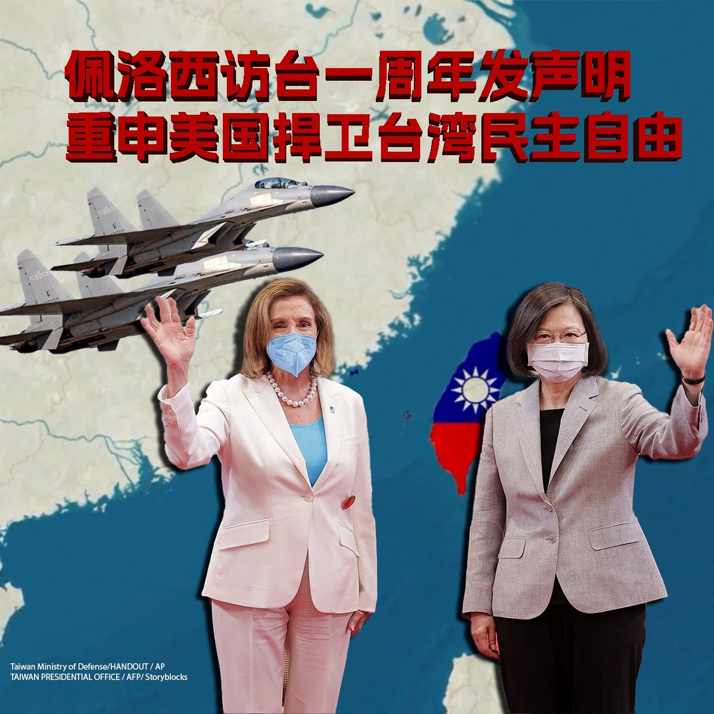
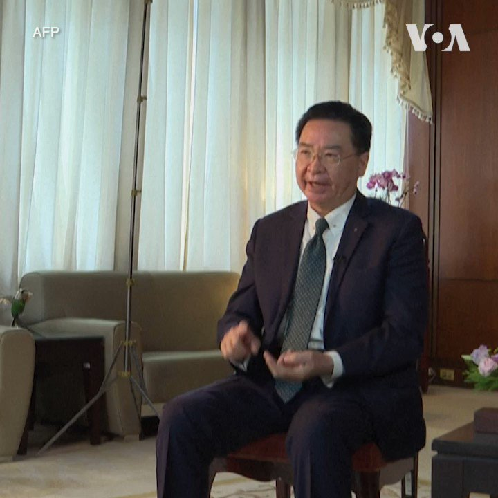

美国之音中文网 北京时间 2023-08-03T07:00:00Z 1686874519133454343 美国前总统特朗普将在华盛顿特区联邦法院出庭应诉，他被刑事起诉试图推翻2020大选结果。如何解读事件影响？此外，《华尔街日报》称中国2亿散户大军已撤离股市，是否是信心崩溃的迹象？首个加入“一带一路”的G7国家意大利有意退出，北京既丢“面子”又丢“里子”？请留言参与8/3时事大家谈。 https://t.co/SycXsc7Pdg   美国之音中文网 北京时间 2023-08-03T07:23:30Z 1686880430832975879 “对共产党就是没有商量余地，”香港自由民主活动家、在海外组织“香港议会”而被香港警方悬红通辑的袁弓夷表示，即使香港警方用家人向他施压也不会改变他的工作，他不会屈服。7月底，袁弓夷的子女以及儿媳被香港国安处人员带走问话。他儿媳是新民党立法会议员容海恩，袁弓夷劝其儿媳应退出立法会。 https://t.co/KjT047oAKF   美国之音中文网 北京时间 2023-08-03T07:48:13Z 1686886650893533189 #揭谎频道：中国官媒批评加拿大处理山火不力，并赞扬中国在控制林火方面经验很足，在环保方面是个负责任、有担当的大国。但这种洗白并不奏效。虽然中国野火碳排放并不多，但北京却是全世界最大的二氧化碳排放国。报道：https://t.co/z0yXnNl3Ll https://t.co/WNoo990Dwo   美国之音中文网 北京时间 2023-08-03T07:55:03Z 1686888370725945345 特朗普将在两项联邦刑事起诉中面临两类陪审团候选人 https://t.co/I1MdxngqkG   美国之音中文网 北京时间 2023-08-03T08:09:34Z 1686892023742410752 德桑蒂斯与共和党内竞争对手共同寻求撤销中国永久正常贸易地位 https://t.co/tvpMx5jEPa   美国之音中文网 北京时间 2023-08-03T08:16:58Z 1686893888672579584 美国和中国近期几乎同时段在印太区域集结盟友开展一系列军事演习，节奏密集，规模空前。美国之音梳理了2023年7月以来有代表性的多次演习。军事专家认为，美国持续扩大印太军演的数量和复杂性，旨在增强互操作性和威慑中国武攻台湾。报道内容：https://t.co/9BpD41r5yR https://t.co/fjDXl8q1LV   美国之音中文网 北京时间 2023-08-03T09:00:00Z 1686904718520614912 一键解锁#美国热搜 榜
1、习近平治，以百姓为刍狗
2、火箭军清洗只是起点
3、习近平要给民众发钱了？
4、习近平冷漠面对北京水灾灾民
5、蔡英文发推慰问大陆灾民
6、小粉红称水灾是财运、国运
7、伪装抗洪
8、键盘杠精 https://t.co/Cmiris0Ey9   美国之音中文网 北京时间 2023-08-03T09:09:33Z 1686907119122120708 《华尔街日报》：币安虽然被禁但在中国单月交易量达900亿美元 https://t.co/yUw882VJuH   美国之音中文网 北京时间 2023-08-03T09:09:35Z 1686907128425086976 俄罗斯袭击靠近罗马尼亚的乌克兰河港，损坏运往非洲和中国等地的粮食 https://t.co/kEshlOtqP6   美国之音中文网 北京时间 2023-08-03T09:23:36Z 1686910656279445506 美国与蒙古签署《开放天空协议》，两国间将开通直航。美国副总统哈里斯与蒙古总理奥云额尔登8月2号在白宫一同宣布，两国也将在包括经济、太空、文化等更紧密交流。仅与中国及俄罗斯接壤，且贸易极大部分仰赖中国的蒙古，也将在美国协助下，解决运输和物流的挑战，促进旅游、贸易、商业和投资。 https://t.co/QtBj6LuBb7   美国之音中文网 北京时间 2023-08-03T09:25:04Z 1686911024489005061 逾千美军士兵结束任务 撤离美墨边境 https://t.co/SEPjeEXXli   美国之音中文网 北京时间 2023-08-03T03:22:05Z 1686819677027385345 国会挺台法案《美台21世纪贸易倡议首批协定实施法》已送交拜登总统 https://t.co/28wNYsJdk1   美国之音中文网 北京时间 2023-08-03T04:21:03Z 1686834518106492928 加拿大总理贾斯汀·特鲁多和妻子宣布分居 https://t.co/iUx6Yp7oRg   美国之音中文网 北京时间 2023-08-03T04:25:35Z 1686835658575446018 英国女子达格玛·特纳 Dagmar Turner 三年前在伦敦的国王学院医院做脑部肿瘤切除手术时演奏小提琴的一幕令人称奇。三年后她与为她做手术的医生在伦敦的亨特博物馆的活动上相聚，回顾当年这次备受瞩目的手术。当时医生们为了维护特纳的演奏能力，在手术过程中将她唤醒并让她演奏小提琴。 https://t.co/gbmXpBY7l0   美国之音中文网 北京时间 2023-08-03T04:34:02Z 1686837786819821568 匹兹堡犹太教堂枪手将被判处死刑 https://t.co/fQcqkaXYcd   美国之音中文网 北京时间 2023-08-03T04:51:06Z 1686842079555747842 多位共和党众议员敦促拜登政府打击中共侵犯人权行为，反对解除与新疆有关的制裁 https://t.co/UXBuoCJ3zI   美国之音中文网 北京时间 2023-08-03T05:34:45Z 1686853064362475520 中国国安部8月1日在微信上发文鼓励全民动员反间谍，美国国务院发言人米勒在8月2日的例行记者会上就此回答记者提问时表示，“鼓励公民相互监视当然是件非常令人担忧的事情”。米勒说，美国政府继续密切关注7月1日开始实施的新修订的《反间谍法》的落实情况。https://t.co/3ABDnUhbAW https://t.co/QeTS7WkHMd   美国之音中文网 北京时间 2023-08-03T05:36:02Z 1686853388548571136 胜选的泰国进步党被排除在组阁联盟之外 https://t.co/nwF6VlPxgn   美国之音中文网 北京时间 2023-08-03T06:00:01Z 1686859424344793088 北京市通过《实施“反恐法”办法》，租车、租民宿、买汽油和寄快递等都要查身份，乘搭地铁要接受安检。法律学者虞平说，中国的控制行为已经达到了草木皆兵的地步，把所有的人都当作政权的敌人。完整版：https://t.co/gkHPnIXG6m https://t.co/x1lhTE6EEt   美国之音中文网 北京时间 2023-08-03T02:34:42Z 1686807755246440449 8月2日是美国众议院荣休议长佩洛西对台历史性访问一周年。佩洛西发表声明：“北京持续对台湾的进犯是懦弱的，不能以沉默处之。”去年北京在佩洛西访问后，对台湾发起长达一周的环台军演。一年后，中共对台海空侵扰不断，各界对台海爆发战争的担忧不曾稍减。您怎么看这一年来的台海局势？ https://t.co/ypkRbEeVq0   美国之音中文网 北京时间 2023-08-03T03:22:07Z 1686819684627468288 众议院监督委员会就中国涉嫌卷入黑客袭击美国政府电邮系统事件启动调查 https://t.co/nmyp8IVVzk   美国之音中文网 北京时间 2023-08-03T01:11:33Z 1686786830006616064 台湾强化后备战力 女性退役军人将投入战训 https://t.co/HecqJSEIWv   美国之音中文网 北京时间 2023-08-03T01:26:34Z 1686790607124238336 美国众议院荣休议长佩洛西发表声明纪念历史性访台一周年 https://t.co/1GR6QmDETx   美国之音中文网 北京时间 2023-08-03T01:26:36Z 1686790615013691392 确保战时通讯安全，台湾与卢森堡卫星公司签署合作协议 https://t.co/QFl7r5whPH   美国之音中文网 北京时间 2023-08-03T01:41:04Z 1686794255405400064 印度军舰停靠巴布亚新几内亚，美印澳日将在南太平洋进行联合军演 https://t.co/MIe1QOJihL   美国之音中文网 北京时间 2023-08-03T02:03:53Z 1686799999471067136 台湾外交部长吴钊燮8月2日说，台海两岸一旦发生武装冲突，将给全球产业链带来灾难性后果。他在当天接受法新社专访时还表示，台湾正在密切关注中国的政经形势，以避免成为中国领导人为摆脱困境而寻找的替罪羊。 https://t.co/exwGT0WYmf   美国之音中文网 北京时间 2023-08-03T00:10:03Z 1686771351229784064 中国隐形战机J-20将进入量产，目前数量可能已经超过美F-22 https://t.co/s1GVZLhT9O   美国之音中文网 北京时间 2023-08-03T00:24:03Z 1686774874365456384 为救卢思位前中国法官与老挝警察打斗 逾60国际组织促当局放人 https://t.co/7jpyyiZaGF   