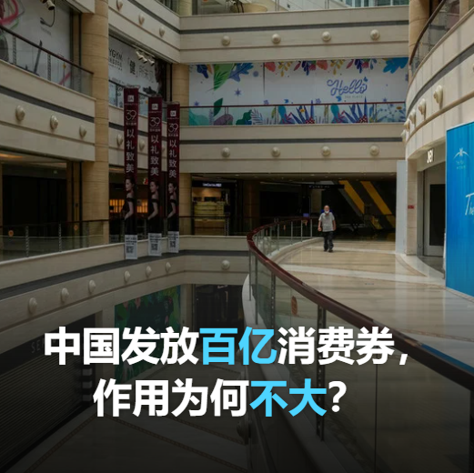

自由亚洲电台 北京时间 2023-08-03T05:27:08Z 1686851147326181377 中国商务部统计，疫情发生以来，28个省份170多个地市统筹地方政府和社会资金，累计发放消费券达190多亿元。但财新网近日报道，多省份审计后发现各地在疫情期间发放的消费券核销率低，另有地区超范围或超标准发放消费券，县级消费券资金量小且分散、拉动消费效果不佳。
您分析，在中国发放消费券，为何没有明显提振消费？   自由亚洲电台 北京时间 2023-08-03T02:32:23Z 1686807172674633729 中国国家男子足球队前主教练 #李铁 涉嫌受贿、行贿等五项罪，近日被提起公诉。中国政府正雷厉风行调查 #男足假球案，李铁是首位落马的高层。 https://t.co/LKayEl2u76   自由亚洲电台 北京时间 2023-08-03T02:58:49Z 1686813821879619584 #袁弓夷 说：“香港的自由比我的个人财富、自由，或我家人的自由和安全更重要。我会说，香港的未来比我个人和家庭更重要。我知道我正在冒险，但我们必须付出代价。你看到很多国家都要付出代价，这也是我们应当付出的代价。” https://t.co/Q6SQJSjJT5   自由亚洲电台 北京时间 2023-08-03T04:14:29Z 1686832862962778114 彭博社报道称这一行动是世界上对互联网使用最严厉的限制。
移动智能终端每日晚间10时至次日6时禁止向未成年人提供服务，16岁至18岁未成年人使用移动设备，包括智能手机等，不得超过两小时，8至16岁的儿童可以使用一小时，而八岁以下的儿童则只能使用八分钟。
 https://t.co/iTuEG2xUYP   自由亚洲电台 北京时间 2023-08-03T01:48:11Z 1686796046956195840 房山居民刘女士告诉本台：“昨天，一个亲戚在门头沟附近山区，连房子都淹没了。人，政府报死11个人，不可能，我估计都死了。平房全淹了。我们这里小清河桥坍塌，还有永定桥也塌方了，那车呼呼的往河里掉，不死人？你信吗？我们这儿的交通全断了，出不去门。”
#北京暴雨  https://t.co/MkwPJzJZy6   自由亚洲电台 北京时间 2023-08-03T00:00:20Z 1686768904423768064 近年来，中国当局不断加强对宗教事务的管控。有评论认为，将从九月一日起实施的《#宗教活动场所管理办法》，势必在意识形态上对宗教活动进行钳制，也意味宗教场所必须听命于中国当局，才能保有生存空间。

 https://t.co/7LWVkB4iOP   