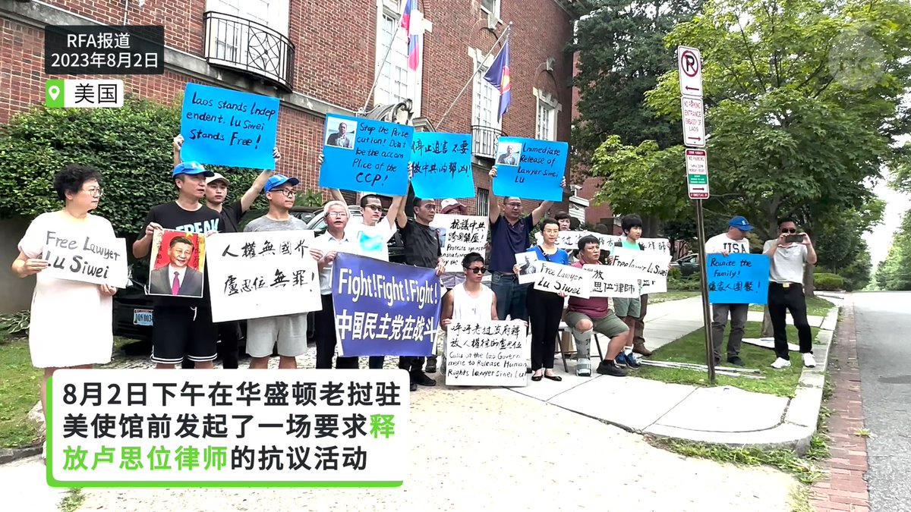
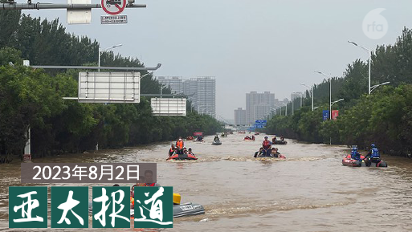
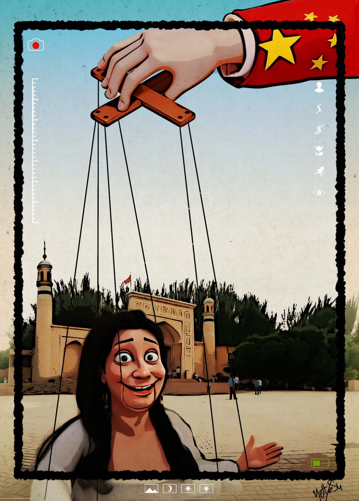
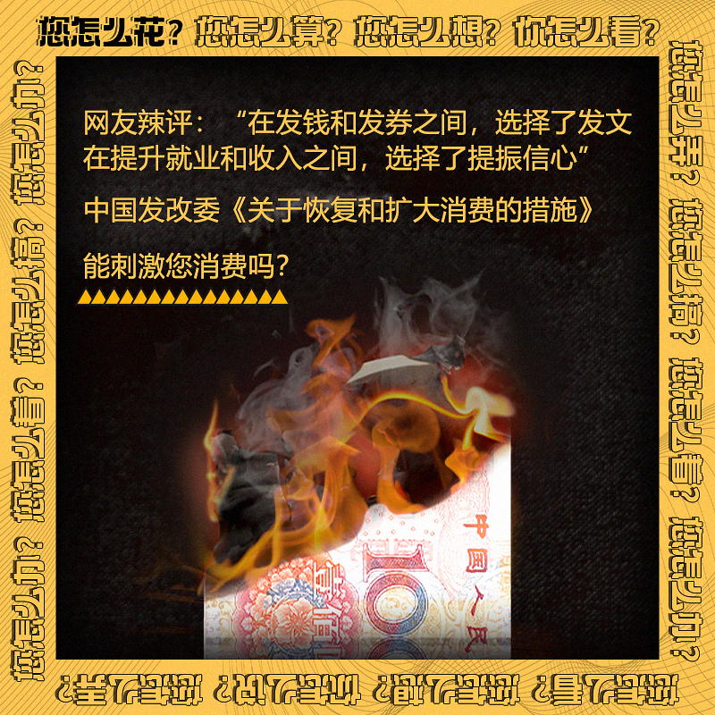

自由亚洲电台 北京时间 2023-08-03T12:50:49Z 1686962803801047040 英国金融时报周三引述两位知情人士的话说，美国拜登政府打算要求美国国会作为美国对乌克兰军援的补充预算案的一部分，向 #台湾 提供 #军援资金，以便在北京对台军事威胁和恫吓下，加快对台湾提供武器的速度。

 https://t.co/dpZuftXyxQ   自由亚洲电台 北京时间 2023-08-03T12:59:52Z 1686965084059303936 RT @RFA_Chinese: 【反对老挝政府遣返 #卢思位】
8月2日下午，在美国华盛顿老挝驻美大使馆前，中国民主党，国际人权律师组织、异议人士等联合发起要求释放卢思位律师的活动：反对老挝政府遣返卢思位，抗议中共跨国镇压，要求释放卢思位与家人团聚。 https://t.co…   自由亚洲电台 北京时间 2023-08-03T13:29:42Z 1686972590064361473 中国 #央视 驻纽约记者 #徐德智 自从2019年开始转站联合国，专注联合国支柱性议题，以及数字平台发展。

徐德智在接受 #联合国 新闻部专访时表示，今年3月以来，他在中文网络上见证了四波针对联合国的 #虚假信息 传播。 https://t.co/Bd9VWCd8NK   自由亚洲电台 北京时间 2023-08-03T13:43:53Z 1686976159483854848 RT @RFA_Chinese: 【征集受访者：为什么你不敢花钱？】
7月31日，中国国家发改委出台《#关于恢复和扩大消费的措施》。这20条措施能让您家扩大消费吗？如果政府直接发钱给您，您愿意更多消费，还是把钱存起来？
就这些问题，如果您愿意接受采访，分享高见，请发电邮 fan…   自由亚洲电台 北京时间 2023-08-03T13:45:03Z 1686976454574182400 RT @RFA_Chinese: 中国商务部统计，疫情发生以来，28个省份170多个地市统筹地方政府和社会资金，累计发放消费券达190多亿元。但财新网近日报道，多省份审计后发现各地在疫情期间发放的消费券核销率低，另有地区超范围或超标准发放消费券，县级消费券资金量小且分散、拉动消…   自由亚洲电台 北京时间 2023-08-03T10:05:47Z 1686921271010054144 【反对老挝政府遣返 #卢思位】
8月2日下午，在美国华盛顿老挝驻美大使馆前，中国民主党，国际人权律师组织、异议人士等联合发起要求释放卢思位律师的活动：反对老挝政府遣返卢思位，抗议中共跨国镇压，要求释放卢思位与家人团聚。 https://t.co/EuExnCTnnV   自由亚洲电台 北京时间 2023-08-03T07:00:07Z 1686874547864436736 【#亚太报道（2023-8-2）】
欢迎收听和订阅播客【亚太报道】 https://t.co/MjLNSvVMqc

民众质疑 #京津冀洪水 死亡人数/#赖清德 将过境纽约和旧金山/中共动员全民“#反间防谍”/“三大危机”困扰 “#救市”文件频发/ #宗教场所管理办法 将实施 拥护中共是前提 https://t.co/dZCv6z3oA1   自由亚洲电台 北京时间 2023-08-03T07:01:51Z 1686874984914817024 RT @RFA_Chinese: 【征集受访者：为什么你不敢花钱？】
7月31日，中国国家发改委出台《#关于恢复和扩大消费的措施》。这20条措施能让您家扩大消费吗？如果政府直接发钱给您，您愿意更多消费，还是把钱存起来？
就这些问题，如果您愿意接受采访，分享高见，请发电邮 fan…   自由亚洲电台 北京时间 2023-08-03T07:26:17Z 1686881131269062656 【Yettesu 漫画：波特金假人操控】

中国官方强烈否认 #新疆 地区 #维吾尔 族人在受虐，如再教育营的非法拘禁、强制迁移、宗教迫害和强迫劳动等。同时利用 #少数民族网红 进行大量美化宣传，其中年轻女性居多。他们的视频用美丽的风景，快乐的民族舞蹈和烹饪，掩盖了紧张局势和严格的安保措施。 https://t.co/Q2cP4PCuDa   自由亚洲电台 北京时间 2023-08-03T01:16:17Z 1686788018047508480 美国政府周二发布禁令，禁止两家涉及 #新疆强迫劳役 的中国公司的产品进入美国市场。中国外交部周三对此作出回应，说这是反华势力炮制的世纪谎言。
本台记者王允 @Jeff23Wang 报道。
 https://t.co/ScyJCN1Wx2   自由亚洲电台 北京时间 2023-08-03T03:28:16Z 1686821235706224640 #事实查核｜美国媒体造假谎报 #游泳世锦赛 排名？
 https://t.co/WYSFsbQyRw   自由亚洲电台 北京时间 2023-08-03T04:36:48Z 1686838482419974145 【征集受访者：为什么你不敢花钱？】
7月31日，中国国家发改委出台《#关于恢复和扩大消费的措施》。这20条措施能让您家扩大消费吗？如果政府直接发钱给您，您愿意更多消费，还是把钱存起来？
就这些问题，如果您愿意接受采访，分享高见，请发电邮 fankui@rfa.org， 或联系记者王允 @Jeff23Wang https://t.co/JQ6EmEpmTa   自由亚洲电台 北京时间 2023-08-03T05:26:48Z 1686851065524662272 美国8月1日将2家中国企业列入“维吾尔强迫劳动预防法实体清单”，它们是骆驼集团有限公司和晨光生物科技集团有限公司。该禁令将于周三生效。
中国商务部新闻发言人2日回应称，新疆根本不存在所谓“强迫劳动”。美方编造、炒作子虚乌有的谎言，肆意对中国企业实施制裁，是借“人权”之名，行单边霸凌之实，破坏新疆繁荣稳定。
中国外交部周三在一份声明中表示：所谓新疆存在“强迫劳动”原本就是反华势力为抹黑中国炮制的世纪谎言。
您同意中方的说法吗？   自由亚洲电台 北京时间 2023-08-03T05:27:08Z 1686851147326181377 中国商务部统计，疫情发生以来，28个省份170多个地市统筹地方政府和社会资金，累计发放消费券达190多亿元。但财新网近日报道，多省份审计后发现各地在疫情期间发放的消费券核销率低，另有地区超范围或超标准发放消费券，县级消费券资金量小且分散、拉动消费效果不佳。
您分析，在中国发放消费券，为何没有明显提振消费？   自由亚洲电台 北京时间 2023-08-03T02:32:23Z 1686807172674633729 中国国家男子足球队前主教练 #李铁 涉嫌受贿、行贿等五项罪，近日被提起公诉。中国政府正雷厉风行调查 #男足假球案，李铁是首位落马的高层。 https://t.co/LKayEl2u76   自由亚洲电台 北京时间 2023-08-03T02:58:49Z 1686813821879619584 #袁弓夷 说：“香港的自由比我的个人财富、自由，或我家人的自由和安全更重要。我会说，香港的未来比我个人和家庭更重要。我知道我正在冒险，但我们必须付出代价。你看到很多国家都要付出代价，这也是我们应当付出的代价。” https://t.co/Q6SQJSjJT5   自由亚洲电台 北京时间 2023-08-03T04:14:29Z 1686832862962778114 彭博社报道称这一行动是世界上对互联网使用最严厉的限制。
移动智能终端每日晚间10时至次日6时禁止向未成年人提供服务，16岁至18岁未成年人使用移动设备，包括智能手机等，不得超过两小时，8至16岁的儿童可以使用一小时，而八岁以下的儿童则只能使用八分钟。
 https://t.co/iTuEG2xUYP   自由亚洲电台 北京时间 2023-08-03T01:48:11Z 1686796046956195840 房山居民刘女士告诉本台：“昨天，一个亲戚在门头沟附近山区，连房子都淹没了。人，政府报死11个人，不可能，我估计都死了。平房全淹了。我们这里小清河桥坍塌，还有永定桥也塌方了，那车呼呼的往河里掉，不死人？你信吗？我们这儿的交通全断了，出不去门。”
#北京暴雨  https://t.co/MkwPJzJZy6   自由亚洲电台 北京时间 2023-08-03T00:00:20Z 1686768904423768064 近年来，中国当局不断加强对宗教事务的管控。有评论认为，将从九月一日起实施的《#宗教活动场所管理办法》，势必在意识形态上对宗教活动进行钳制，也意味宗教场所必须听命于中国当局，才能保有生存空间。

 https://t.co/7LWVkB4iOP   