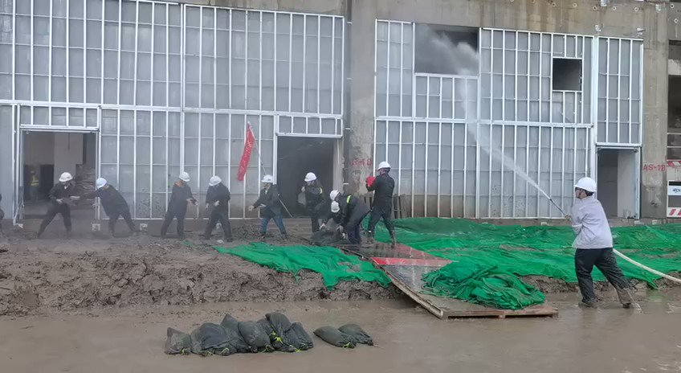

谁将十万横扫三江 北京时间 2023-08-03T07:52:58Z 1686887846815334401 RT @22HomoPoliticus: 向奋斗在第一线的抗洪抢险救灾党员冲锋队致敬🫡 https://t.co/ZRFZdpCEP3   谁将十万横扫三江 北京时间 2023-08-03T07:53:32Z 1686887989379842048 明码标价不愿意可以不坐，在原地等你家政府派人接你 https://t.co/q9ciFndzza   谁将十万横扫三江 北京时间 2023-08-03T07:56:50Z 1686888819839434756 在东北花钱买编制，也不看看政府亏空成什么了 https://t.co/PTtW0fDfeA   谁将十万横扫三江 北京时间 2023-08-03T08:00:18Z 1686889692095283206 北京能死二百人早炸锅了......看看就好，不必相信 https://t.co/25E85Hfwu4   谁将十万横扫三江 北京时间 2023-08-03T08:05:43Z 1686891056473014274 RT @boiledwater: 我刚才在想停水停电这么多天，涿州医院里的病人怎么办？

然后就搜到了昨天晚上的这条信息。

打了半天码怕给他们带来麻烦；打到电话那又反应过来这是条求救信息。万一能帮上呢？

回头再删吧唉。 https://t.co/de0LxZWbUN   谁将十万横扫三江 北京时间 2023-08-03T08:06:13Z 1686891183023554560 RT @boiledwater: 今天晚上，ip河北：

我现在就陪着数万人困在这里，周边大大小小小区好几个，停水停电，物资短缺。在这之前我们听都没听说泄洪转移的事。

你有多久没听见有人发自内心喊救命了？

我今天听够够的了。 https://t.co/3JLn01AoK8   谁将十万横扫三江 北京时间 2023-08-03T08:06:22Z 1686891219912359938 RT @boiledwater: 南方周末：【涿州书厂老板称未收到泄洪通知】

“一小时内2500万就没了”。

仓库管理员是周边村民，后来本想游到仓库去尽量挽回，结果自己家也受灾了。“没有人通知我们泄洪，或者今天的水很大，你们需要提前预防，把书怎么（归置）。”唐月告诉南方周末…   谁将十万横扫三江 北京时间 2023-08-03T08:06:28Z 1686891245979959298 RT @boiledwater: 微博上很多询问涿州市民“收没收到泄洪通知”的提问，亲历者绝大多数说没有收到，个别村子1小时前收到根本来不及，且无撤离地点和措施。

沉重的刷下来，看到这条，我突然笑的好大声。

你们说，祖国的政府是如何做到让人望尘莫及的纯天然、无杂质的黑色幽默…   谁将十万横扫三江 北京时间 2023-08-03T08:11:38Z 1686892546860122124 中国养老院，人均一室0.125厅独卫 https://t.co/hygxVOdF9j   谁将十万横扫三江 北京时间 2023-08-03T08:11:47Z 1686892583086424070 RT @boiledwater: 建议推上的岁静不要轻易评价正在杀人的“天灾”。

平日里绝口不提大象就算了。个人喜好么，能忍。

突然主动沾这个话题，还要精准避开“人祸”的柔软身段，真的比墙内的岁静难看。

他们看不见真相，你不一样。   谁将十万横扫三江 北京时间 2023-08-03T09:15:04Z 1686908508787355648 RT @RFA_Chinese: 房山居民刘女士告诉本台：“昨天，一个亲戚在门头沟附近山区，连房子都淹没了。人，政府报死11个人，不可能，我估计都死了。平房全淹了。我们这里小清河桥坍塌，还有永定桥也塌方了，那车呼呼的往河里掉，不死人？你信吗？我们这儿的交通全断了，出不去门。”…   谁将十万横扫三江 北京时间 2023-08-03T09:17:18Z 1686909072149544961 RT @renquan8964: 中國河北高碑店、涿州、保定目前洪水滔天，中共正在大力封鎖消息，有的救援團隊直播災區的實況，遭到封號。 https://t.co/HqmNwtKGbu   