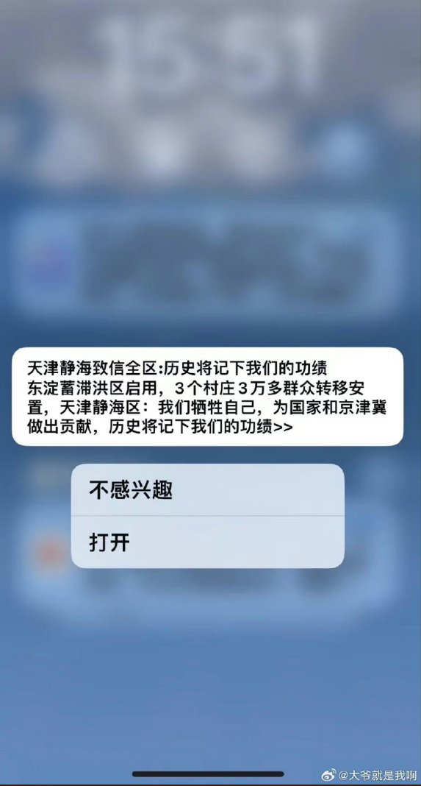
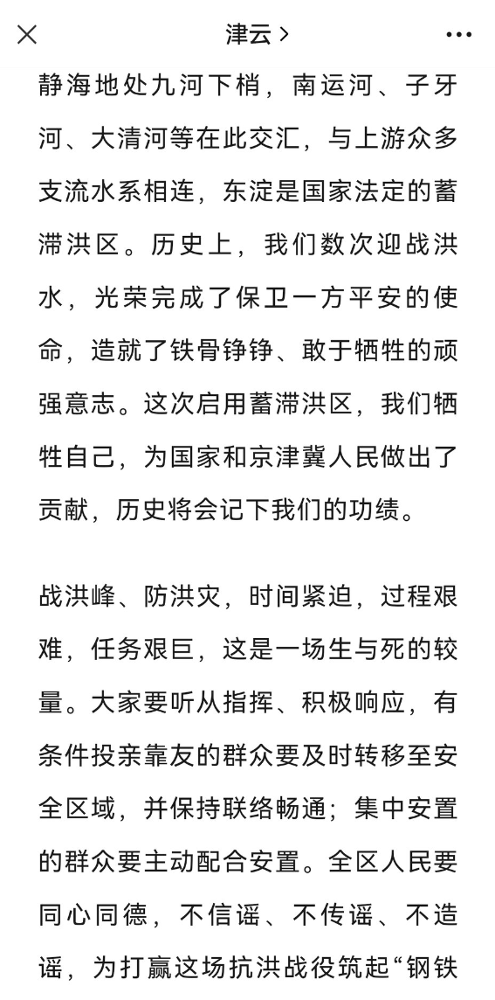
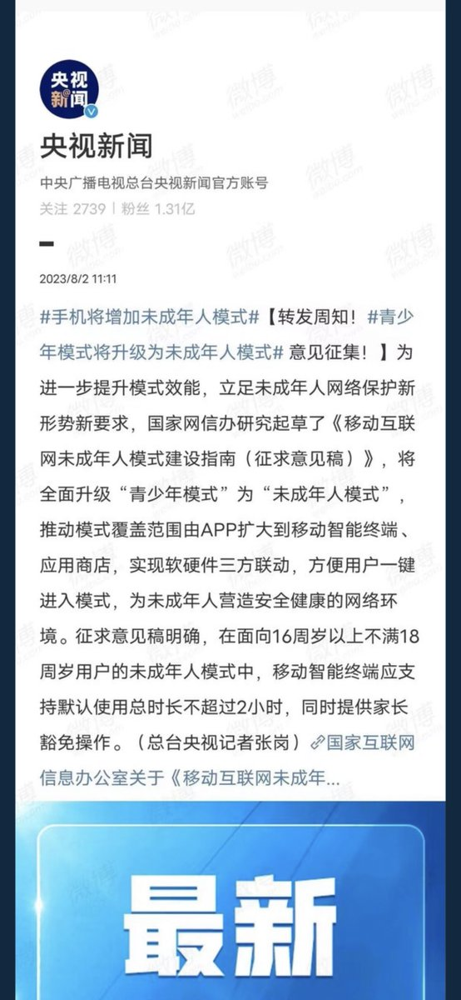
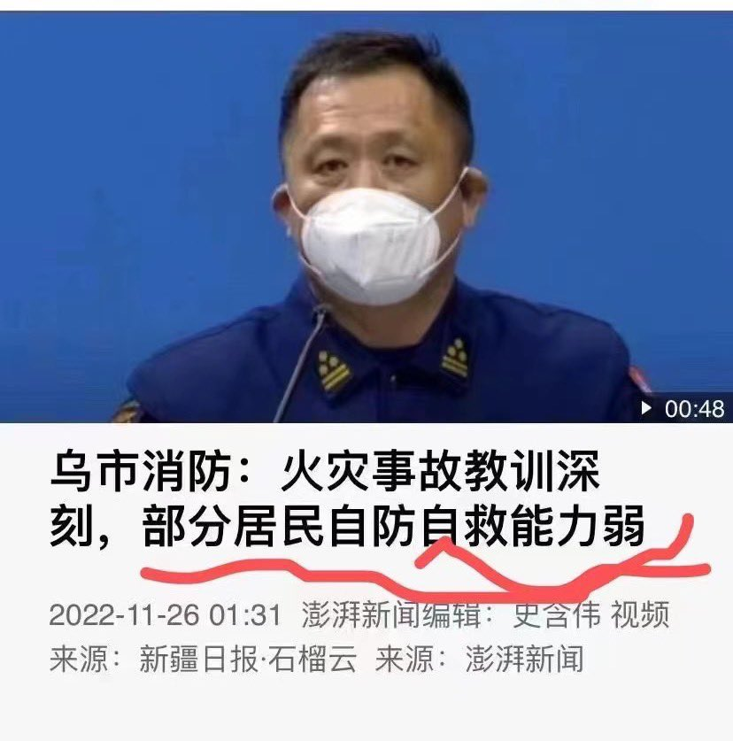
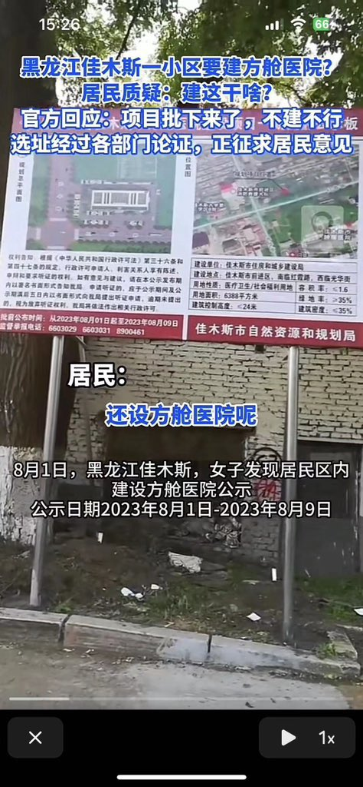

A李老师不是你老师 北京时间 2023-08-02T22:52:32Z 1686751841772584961 网友投稿
8月2日，有天津网友收到天津泄洪的短信
“历史会记下我们的功绩” https://t.co/dEOSHtic3C   A李老师不是你老师 北京时间 2023-08-02T21:34:57Z 1686732318159859712 另有网友补充称，昨晚的白沟大拥堵原因是在民众撤离阶段，高速收费站依然守卡收费导致。
8月2日，当地高速管理部门回应称，因为没有收到高速免费通知。 https://t.co/0zUILtU49O   A李老师不是你老师 北京时间 2023-08-02T22:00:05Z 1686738644776742912 【慎点】网友投稿
8月2日傍晚 ，江苏省徐州市泉山区苏堤路与湖北路T字交叉路口发生重大交通事故，现场死伤人数尚不明确，伤者大多是下班晚高峰行人，其中有不少妇女儿童。
视频中有以为女士头部流血严重，生命垂危。从现有视频分析肇事车辆应该是绿色迷你，该车不知何故驶向安全岛等待红绿灯的行人。
目前还没有官方通报和相关监控视频流出，无法判断事故原因。
事发路段位于市区主要干道又接近旅游区，发生如此严重车祸，为近年罕见。   A李老师不是你老师 北京时间 2023-08-02T18:40:36Z 1686688442900774912 8月2日，国家网信办起草意见稿
今后手机将面向16岁以上18岁以下用户增加未成年人模式，智能终端默认使用时间为每天不超过2小时。 https://t.co/8yvQG7qGR4   A李老师不是你老师 北京时间 2023-08-02T19:08:10Z 1686695381474660353 为了两片没有人的空地，要淹掉上百万人的家园。
仅仅只是因为那是面子和他心爱的玩具。 https://t.co/m6ozqtt61V   A李老师不是你老师 北京时间 2023-08-02T17:02:03Z 1686663641473384448 网友投稿
路是通的，他们不跑 2.0 https://t.co/hQlIe4D9M8   A李老师不是你老师 北京时间 2023-08-02T17:51:19Z 1686676038091259904 网友投稿
8月1日，有佳木斯女子发现居民区内建设方舱医院的公示
当地政府称，项目批下来了，不建不行。 https://t.co/1NwQfSBRHV   A李老师不是你老师 北京时间 2023-08-02T06:19:26Z 1686501919974469632 网友投稿
8月1日，是赵立坚发表“拭目以待”重要讲话一周年纪念日。
从“拭目以待”到全民大评论运动。
这一年中国似乎没有改变，又似乎改变了很多。 https://t.co/9fiWdBALbm   A李老师不是你老师 北京时间 2023-08-02T05:59:09Z 1686496818568310784 8月2日凌晨，河北白沟因泄洪紧急疏散，上演深夜大逃亡，车辆在马路上排起长龙。
根据视频中称，目前周围村落已经沦陷，数万人正在往高碑店聚集避难。 https://t.co/5dfkRraDtI   A李老师不是你老师 北京时间 2023-08-02T01:35:07Z 1686430373083742208 8月1日晚，国家主席习近平就巴基斯坦自杀式炸弹袭击向巴基斯坦总统致慰问电。 https://t.co/cnLgfAbtBK   A李老师不是你老师 北京时间 2023-08-02T01:47:24Z 1686433462293581824 RT @formichenews: Memo per i politici italiani. Così la #Germania mette in guardia dall’#intelligence cinese.

✍️ @LauraHarth

https://t.co…   