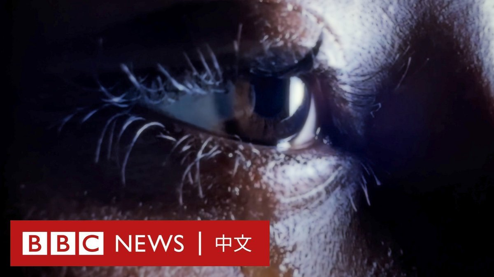
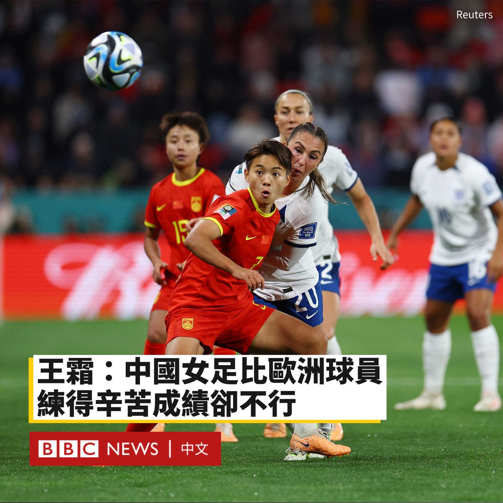
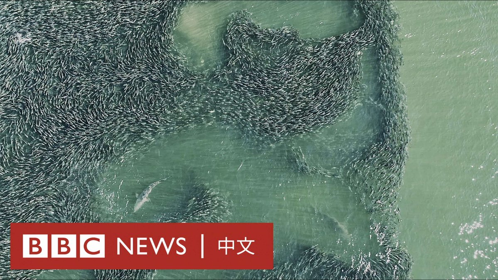

D英国广播公司BBC 北京时间 2023-08-02T16:34:15Z 1686656645928292352 1951年，一位名叫亨丽埃塔·拉克斯（Henrietta Lacks）的非裔美国妇女的宫颈细胞在她不知情的情况下被采集，此后被无限复制。时至今日，拉克斯的家人与一家生物技术公司达成和解。

拉克斯的细胞使医学取得巨大的进步，该细胞系仍在世界各地的研究机构中使用，许多人不知道的是它最初是在未经同意的情况下采集的。

拉克斯的家人从未得到任何赔偿，多年来一直在为“被盗用”的细胞讨回公道。

周一（7月31日），拉克斯的家人与总部位于马萨诸塞州的科技公司赛默飞世尔（Thermo Fisher）达成和解，但细节尚未公布。

1951年，时年31岁的拉克斯是一名来自马里兰州巴尔的摩市的母亲，她出现了腹部疼痛和异常出血的症状。约翰斯·霍普金斯医院（Johns Hopkins Hospital）的妇科医生对她进行检查，发现她患有子宫颈癌。

医生在没有通知她或征得她同意的情况下，便从她身上提取了癌细胞并送到实验室进行医学研究。

虽然几乎所有的细胞培养物在实验室中都很快死亡，但从拉克斯身上提取的细胞却继续繁殖，由此她的细胞成为了人类第一个“永生”细胞系。

后来，该细胞系以拉克斯的姓和名简写命名为“海拉”（HeLa），被送往世界各地的实验室。据世界卫生组织（WHO）称，海拉细胞推动了脊髓灰质炎疫苗的研制，并在艾滋病毒、癌症和不孕症研究方面取得进展。

但是，使这些细胞成为科学奇迹的特性，也使它们具有致命性。在被确诊几个月后，拉克斯死于癌症，年仅31岁。她被埋葬在一个无名坟墓里。

直到几十年后，拉克斯一家才发现她的细胞被现代医学广泛使用。

在与赛默飞世尔的谈判中代表这家人的民权律师本·克兰普（Ben Crump）表示，医生的手术让拉克斯在生命最后的时间感到痛苦。

“对亨丽埃塔·拉克斯的剥削代表了黑人在历史上不幸的共同斗争。”诉状写道。“美国医学实验的历史往往是医学种族主义的历史。”

赛默飞世尔公司多次试图以超过诉讼时效为由驳回此案。但拉克斯家族的律师表示，由于她的细胞仍被复制，因此尚未达到限制。

在周二的记者会上，克兰普表示双方都对和解感到“满意”：“我想不出比给她的家人一定程度的尊重，一定程度的尊严，最重要的是一定程度的正义更好的礼物了。”

2021年，世卫组织总干事谭德塞（Tedros Adhanom Ghebreyesus）向拉克斯的儿子颁发了一个特别奖项，以表彰她改变世界的遗产。   D英国广播公司BBC 北京时间 2023-08-02T17:38:18Z 1686672762180431873 美国前总统特朗普因试图推翻2020年总统选举结果而被刑事起诉，这是特朗普四个月以来，第三度遭到刑事起诉。https://t.co/3qAWAhTmNe   D英国广播公司BBC 北京时间 2023-08-02T14:44:55Z 1686629131080122369 自苏丹正规军与准军事组织“快速支援部队”于四月爆发冲突开始，苏丹国内已有数十位女性指控在冲突中遭到强暴。
 
联合国组织七月份的一份声明指出，性暴力已被当成战争手段，用以使人感到恐惧。 https://t.co/P9Dq3N5s7Z   D英国广播公司BBC 北京时间 2023-08-02T13:36:55Z 1686612019091501056 在女足世界杯负于英格兰队后，中国女足当家球星王霜表示，中国女足的球员们比欧洲球员“都要练得苦”，但却没有取得好成绩。

在周二（8月1日）举行的女足世界杯D组末轮比赛中，英格兰6-1横扫中国队，以小组第一的身份晋级16强。

比赛开场仅四分钟，中国队就率先丢球打乱了阵脚。半场结束，英格兰以3-0领先。下半场比赛，中国队王霜点球破门，扳回一分。但是好景不长，英格兰队此后再入三球，最终以6-1获胜。该结果也让中国队告别本届世界杯，无缘淘汰赛。

28岁的中国“女足一姐”王霜在赛后接受采访时承认，中国队与“英超的队伍、美国这些强队是有自己的差距的”。

她还哽咽地称自己“不是特别好的榜样”，表示希望未来中国的孩子们能踢出更精彩的足球，也希望国内教练们培养出会踢球的孩子们，让她们未来在代表国家队的比赛中“不至于这么狼狈”。

“我敢说，我们比任何一个国家队的运动员练得都要辛苦，付出得还要多，但这就是足球比赛。”她说道。

在社交媒体上，许多网民对王霜的话表示认同，称她“敢于说真话”、“实话太刺耳”。

在此次世界杯上，身在D组的中国女足在此前结束的两场比赛中0-1不敌丹麦、1-0胜海地。若想出线，第三轮击败英格兰队成为关键。   D英国广播公司BBC 北京时间 2023-08-02T11:11:04Z 1686575315550941185 中国杭州动物园的一只马来熊最近成为明星。它用后腿直立的影片在网络上广为流传，许多人猜测它是否是人类扮演。

杭州动物园否认了该说法，称确实是真熊，但好奇的游客们仍然蜂拥而至。 https://t.co/L6AyIbFKlK   D英国广播公司BBC 北京时间 2023-08-02T09:26:15Z 1686548935551434758 鲨鱼离人类有多近？🦈

来自纽约州南安普敦的乔安娜·施泰德尔（Joanna Steidle）几乎每天都在美国大西洋海岸线上空放飞她的无人机。过去五年，她通过自己的“空中之眼”，看到了大量鲨鱼涌入海岸附近。 https://t.co/InD3vtmg2R   