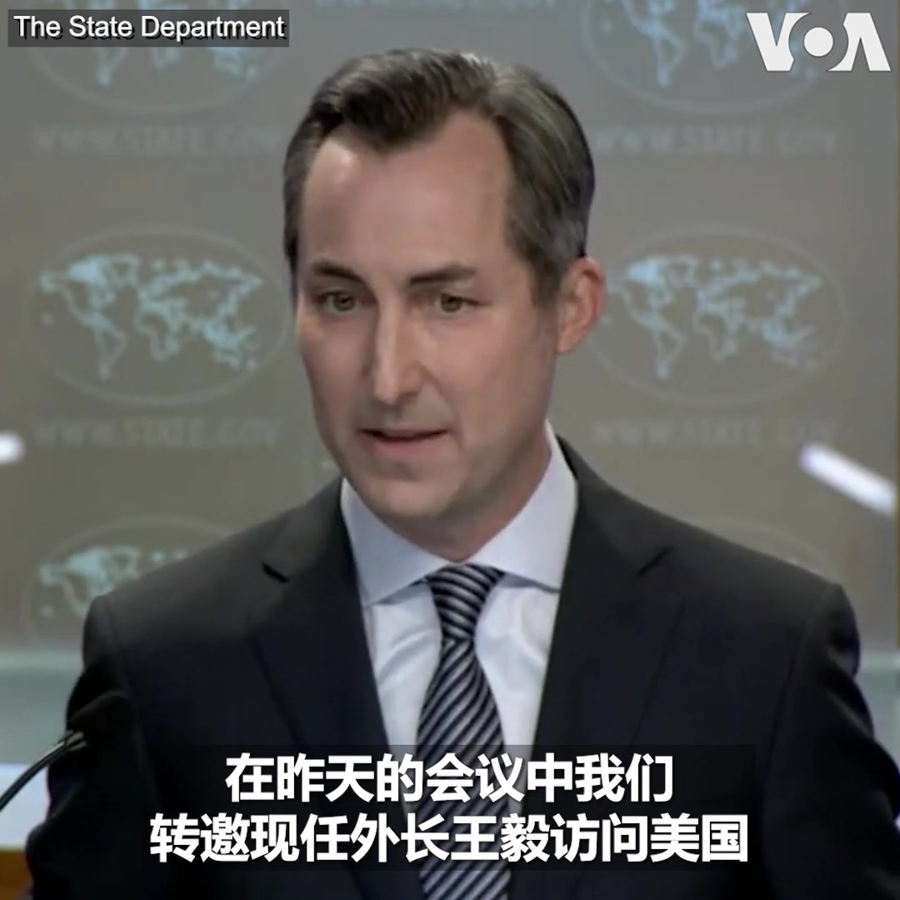
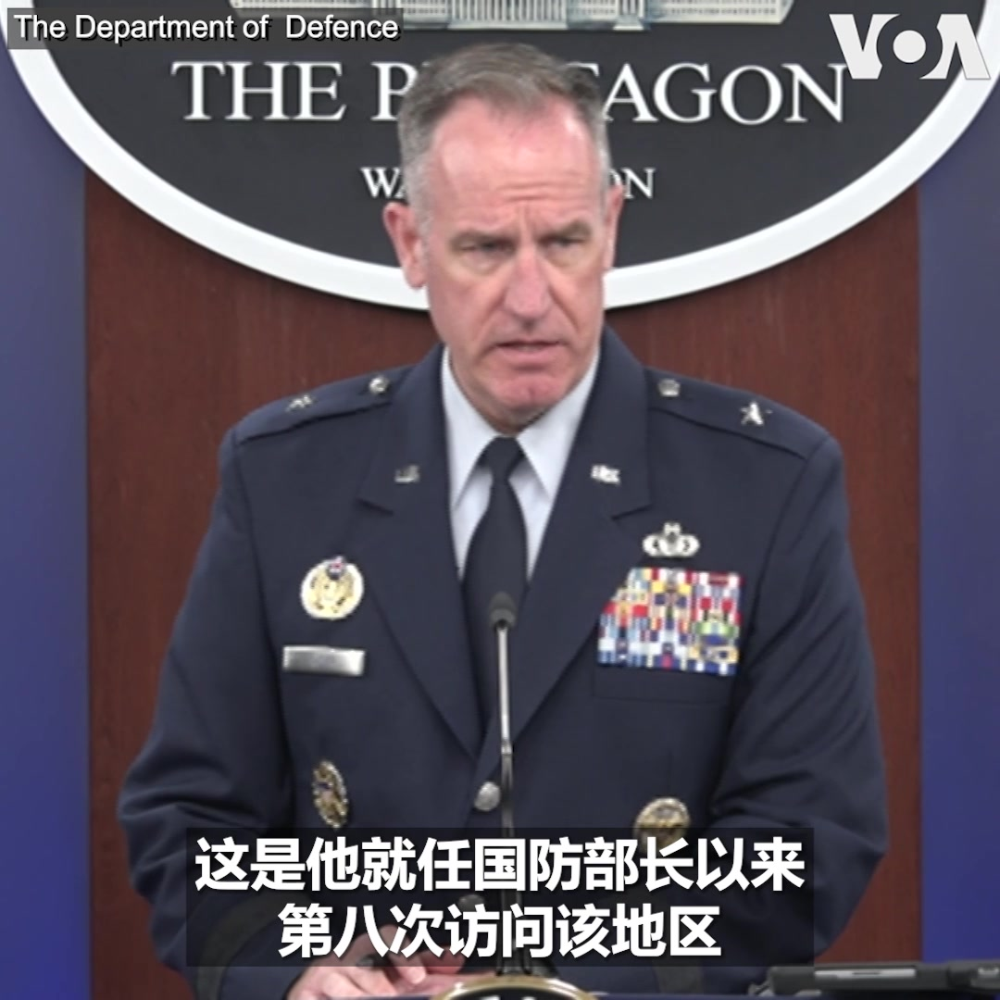
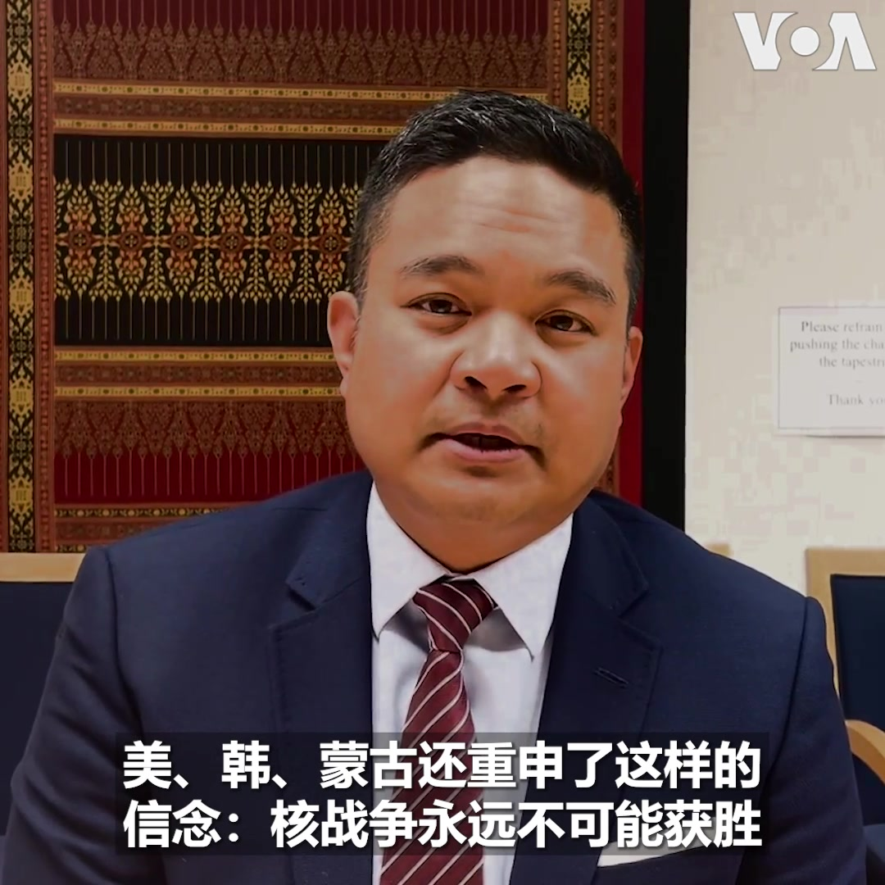
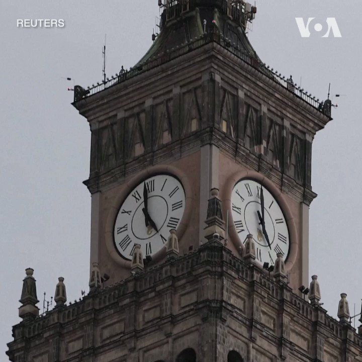

美国之音中文网 北京时间 2023-08-02T09:41:05Z 1686552668209373184 志愿者辛勤清理喜马拉雅山游客留下的大片垃圾 https://t.co/pszs9pE6ns   美国之音中文网 北京时间 2023-08-02T09:56:03Z 1686556437185781760 布林肯主持联合国粮食不安全问题会议 https://t.co/VSiJF7HbUI   美国之音中文网 北京时间 2023-08-02T10:27:08Z 1686564258786783232 国会立法挺台、白宫宣布对台军援,前美军将领：可改善阻遏中国的机会 https://t.co/EkjTevuDwa   美国之音中文网 北京时间 2023-08-02T04:37:35Z 1686476290772336640 美国正式邀请再次被任命为中国外长的王毅访问华盛顿。美国国务院发言人米勒在周二的例行简报会中证实国务院亚太助卿康达在周一和中国外交部北美司司长杨涛举行的会谈中当面提出邀请。报道： https://t.co/odZ7IX4g3m https://t.co/oV7Y33kp2z   美国之音中文网 北京时间 2023-08-02T05:09:04Z 1686484211858112512 蒙古总理五年后首次访问美国 https://t.co/gLhEhLIBo4   美国之音中文网 北京时间 2023-08-02T05:30:00Z 1686489482235682816 火箭军换将背后是否可能涉及美中之间的情报博弈？美国资深媒体人魏碧洲告诉美国之音，美中热战未开打，情报战正酣。完整节目请看8/1【时事大家谈】：https://t.co/FvnyUP4xmj https://t.co/V6TN71iwFe   美国之音中文网 北京时间 2023-08-02T06:08:32Z 1686499179198283779 新疆对比鲜明的现实: 在美国镇压强迫劳动的背景下经济高速增长 https://t.co/ok7Vh3xJFg   美国之音中文网 北京时间 2023-08-02T06:23:02Z 1686502828020465667 五角大楼说，朝鲜就美国兵问题对联合国做出了回应 https://t.co/Cn2SkatwOa   美国之音中文网 北京时间 2023-08-02T06:37:04Z 1686506357460172800 推特上的中国：中国鼓励全民反间谍，专家表示“吓得我脊背发凉” https://t.co/d7NF3ZnLqt   美国之音中文网 北京时间 2023-08-02T06:37:05Z 1686506365148332035 美众院中国特设委员会调查贝莱德和摩根士丹利中国投资的流向 https://t.co/pPO9RGR8Hw   美国之音中文网 北京时间 2023-08-02T06:39:25Z 1686506948890673152 美国国防部长奥斯汀结束任内第八次对印太地区的访问。美国国防部发言人莱德准将8月1日在例行记者会上谈到此行成果时表示，此行深化了美国与巴布亚新几内亚和澳大利亚的防务关系，美国将和两国继续共同推进自由开放的印太地区。 https://t.co/YWnRRLESKy   美国之音中文网 北京时间 2023-08-02T07:00:00Z 1686512130135109632 美国发现中国把恶意代码深藏在美国主要电力、供水和通信网络中，中国黑客全面入侵的意图是什么？“定时炸弹”的威胁有多大？北京通过《反恐法》办法，租车、买汽油和寄快递都要查身份。北京反恐的目标是谁？是草木皆兵还是形势严峻？【时事大家谈】8月2日上午9点讨论，请发表看法或提问。 https://t.co/nBbdVNHKrZ   美国之音中文网 北京时间 2023-08-02T07:39:07Z 1686521976322740224 特朗普因试图推翻2020年总统选举结果而被刑事起诉 https://t.co/VYtKPLJk5N   美国之音中文网 北京时间 2023-08-02T08:39:04Z 1686537060461789186 法国和日本在中国紧张局势中举行军演，但巴黎对北约的作用持谨慎态度 https://t.co/iWN3me9JZ3   美国之音中文网 北京时间 2023-08-02T09:10:02Z 1686544854896254976 惠誉调低美国政府信用评级，理由包括债务增加与政治分歧 https://t.co/a1lMjN2jb7   美国之音中文网 北京时间 2023-08-02T00:54:04Z 1686420039707271168 中国女足1:6负于英格兰，“铿锵玫瑰”凋零澳洲 https://t.co/SCU7rUE4Sa   美国之音中文网 北京时间 2023-08-02T01:08:08Z 1686423581641887744 中国制造业活动持续收缩 青年失业问题火烧眉毛 https://t.co/AsG2RjyTV7   美国之音中文网 北京时间 2023-08-02T02:50:42Z 1686449392671145994 中国国安部1日在其微信公众号上发文，呼吁动员全社会反间防谍。一个月前，中国新修订的《反间谍法》生效，大幅扩充并模糊化对间谍行为的定义，引发寒蝉效应。现在提出全民防谍，会否导致全民皆兵？重演文革时期的冤假错案？吓跑更多中国需要的外资？您怎么看？https://t.co/1pzQxTBQSd https://t.co/ON06kJKfkw   美国之音中文网 北京时间 2023-08-02T04:30:03Z 1686474394917556224 涉强迫维吾尔人劳动，美国又将两中企列入黑名单 https://t.co/m62TQmglmV   美国之音中文网 北京时间 2023-08-02T04:30:05Z 1686474402735828992 美国正式邀请重新任中国外长的王毅访问华盛顿 https://t.co/61ioowKJjl   美国之音中文网 北京时间 2023-08-02T05:00:01Z 1686481937026670592 习近平视察西部战区要求肃纪反腐，火箭军换将原因与影响为何？“公民力量”创办人杨建利告诉美国之音，火箭军是中共对美战略威慑核心力量，抱团贪腐涉洩密成习近平心腹大患，甚至担心像瓦格纳集团发动兵变造反，不得不下手团灭，但可能影响解放军士气与攻台战略。8/1时事大家谈：https://t.co/FvnyUP4xmj https://t.co/0BHrnKIKYw   美国之音中文网 北京时间 2023-08-02T05:09:06Z 1686484220678635520 原声带·卡西姆：从恐惧到自由，一个维吾尔人的旅程 https://t.co/ztlJ82K4ml   美国之音中文网 北京时间 2023-08-02T05:09:08Z 1686484229025366018 消息人士：中国要求一些银行减少或推迟购买美元 https://t.co/MEAYJ7j1Ux   美国之音中文网 北京时间 2023-08-02T05:33:02Z 1686490242981953537 蒙古国总理奥云额尔登和外交部长巴特策策格周二抵达华盛顿展开访问，这是5年来蒙古总理首次访问美国。美国驻蒙古大使包日强(Richard Buangan)在接受美国之音采访时表示，美国与盟国都认为强化区域安全、防止朝鲜核扩散至关重要。报道：https://t.co/ciIoShYoh5 https://t.co/9nNPlztmQI   美国之音中文网 北京时间 2023-08-02T06:08:34Z 1686499186748030979 盟友发生争吵：乌克兰和波兰在粮食及援乌评论后召见对方大使 https://t.co/C3y628TMkO   美国之音中文网 北京时间 2023-08-02T00:37:33Z 1686415884347396096 火箭军易帅 习近平被美国将了一军？部署三军核武统一指挥？ https://t.co/CXJ1xLSa2y   美国之音中文网 北京时间 2023-08-02T01:29:03Z 1686428846026084352 日经亚洲：解放军对台军演新动向：从东南转向东侧封锁台岛 https://t.co/tuC9e3fUGj   美国之音中文网 北京时间 2023-08-02T03:17:34Z 1686456154325401608 波兰首都华沙8月1日纪念“华沙起义”79周年。当地时间下午5点钟，华沙街头车辆暂停，行人止步，警笛长鸣，纪念这起二战后期的重大历史事件。1944年8月1日，数千名主要以轻型武器武装的波兰人发动起义，试图推翻德军的占领。起义持续了近两个月，最后以失败告终。 https://t.co/DM2EruWhjU   美国之音中文网 北京时间 2023-08-02T03:29:32Z 1686459167073280000 香港特首李家超评分首次跌破50分 评论员指政治压力大让市民不舒服 https://t.co/YMCZEbjRlz   美国之音中文网 北京时间 2023-08-02T03:55:48Z 1686465776918650885 中国报道-高锋 北京连日暴雨 11人遇难 逾4万人受灾。报道：https://t.co/kVb87dioWk https://t.co/Z9MQei15Qr   美国之音中文网 北京时间 2023-08-02T02:01:05Z 1686436903938056192 冰岛外交部8月1日宣布暂停驻俄罗斯大使馆的运营。此举使冰岛成为首个为驻俄使馆按下暂停键的北约国家。冰岛外交部长吉尔法多蒂尔在当天发布的新闻稿中说，目前局势令规模有限的冰岛外交系统无法维持驻俄使馆的运营，但此举并不意味着冰岛断绝与俄罗斯的外交关系。 https://t.co/7RMUESUjTE   美国之音中文网 北京时间 2023-08-02T00:10:03Z 1686408964270116864 中国国安部：反间防谍需要进行全社会动员和努力 https://t.co/QOih8k88Ji   