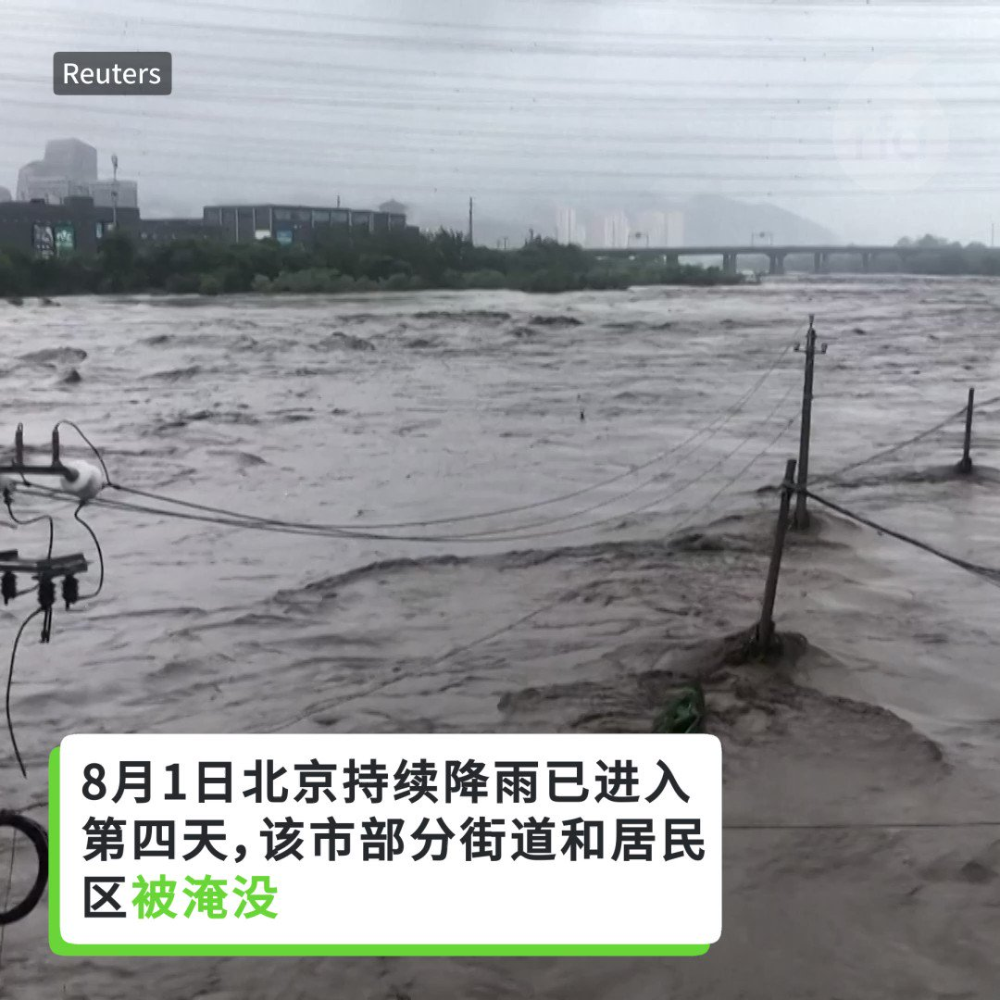
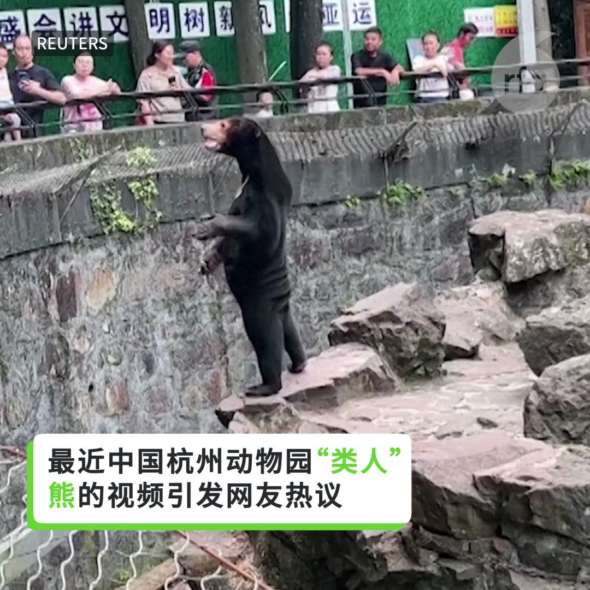
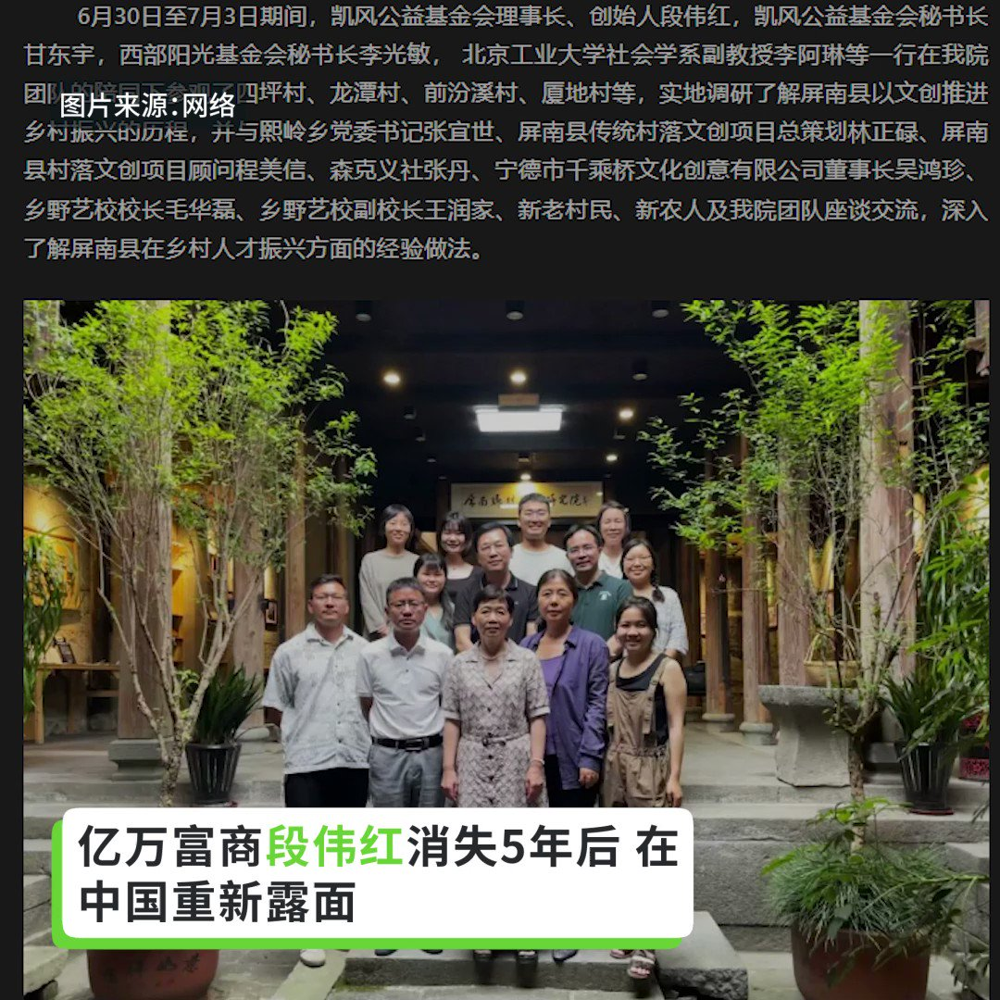

自由亚洲电台 北京时间 2023-08-02T13:41:17Z 1686613116950573056 【赖清德将出访巴拉圭 过境纽约及旧金山】
台湾的副总统 #赖清德 率特使团定于8月12号周六下午启程，同日抵达美国纽约过境。13日晚间离美，14日早上抵达 #巴拉圭 访问。15日出席巴拉圭新任总统圣地亚哥·培尼亚的就职典礼，16日早晨离巴，下午至美国旧金山过境，17日凌晨离美。
https://t.co/if0sZBAtMr https://t.co/3XffrQw4Co   自由亚洲电台 北京时间 2023-08-02T11:23:58Z 1686578561199579136 RT @RFA_Chinese: 据半岛电视台报道，7月31日，巴拿马移民局移民局副局长玛丽亚·伊莎贝尔·萨拉维亚 (Maria Isabel Saravia) 向记者表示，自1月份以来，已有超过 248,901 人冒着生命危险穿越了哥伦比亚和巴拿马之间长达265公里的危险地带…   自由亚洲电台 北京时间 2023-08-02T09:57:34Z 1686556815272628224 RT @RFA_Chinese: 【#亚太报道（2023-78-1）】
欢迎收听和订阅播客【亚太报道】 https://t.co/MjLNSvVMqc

中国前法官欲探视 #卢思位 遭老挝警察抢手机 / 北京及周边 #暴雨 成灾致重大伤亡 / “#中国行动”组织发起征集 #中国…   自由亚洲电台 北京时间 2023-08-02T09:58:26Z 1686557035041595392 RT @RFA_Chinese: 亿万富商段伟红消失5年后，在中国重新露面。
据“屏南乡村振兴研究院”与“中国长期照护”微信公众号文章，6月底至7月初，段伟红在福建屏南县参加了乡村振兴研讨会。5月12日，她参观了江苏省南京市的一家养老院。
段伟红曾被称为温家宝家族财富的“白手套…   自由亚洲电台 北京时间 2023-08-02T09:58:39Z 1686557088116248581 RT @RFA_Chinese: 【卢思位在老挝被捕】
【中国前法官李建峰欲探视 遭8警抢手机扭打】
原打算取道泰国赴美的中国维权律师 #卢思位，上周在 #老挝 被捕。在旅程中与卢思位不期而遇的中国前法官 #李建峰，1日赴老挝的移民总局拘留中心探视卢思位却遭到留置审讯，老挝警察…   自由亚洲电台 北京时间 2023-08-02T10:16:55Z 1686561686902476800 #404共和国 | 中共是全球 #威权主义 的技术帮凶
 https://t.co/L6zGNOgkh8   自由亚洲电台 北京时间 2023-08-02T10:17:46Z 1686561902208409601 RT @RFA_Chinese: 【北京暴雨 活久见】
#北京暴雨 引发严重洪涝，已造成至少11人死亡。
北京和邻近的河北省发生了大范围的洪水。
中国财政部宣布将拨款1.1亿元人民币用于京津冀地区的救援工作。 https://t.co/9EN0rZ1ETw   自由亚洲电台 北京时间 2023-08-02T04:28:48Z 1686474080898502656 一场就中国当前局势征集《#讨专制檄文》和《#全民非暴力不合作行动方案》的征文活动正在展开，这场活动由多个民间人权团体发起，旨在征集反对中国当局专制统治及推动中国未来转型的行动方案。

 https://t.co/QEhV6TXC6i   自由亚洲电台 北京时间 2023-08-02T05:15:13Z 1686485762475450368 【马来熊“人里人气”？上热搜受并非头回】
最近中国杭州动物园的“类人”熊视频登上热搜。动物园轻松回应质疑。 https://t.co/4KzCGJRIUz   自由亚洲电台 北京时间 2023-08-02T07:00:09Z 1686512167837974529 【#亚太报道（2023-78-1）】
欢迎收听和订阅播客【亚太报道】 https://t.co/MjLNSvVMqc

中国前法官欲探视 #卢思位 遭老挝警察抢手机 / 北京及周边 #暴雨 成灾致重大伤亡 / “#中国行动”组织发起征集 #中国非暴力不合作方案 / 中国 #核电厂 新项目引发民众担忧 / 中国对高性能 #无人机 实施 #出口管制 https://t.co/5gSeT2cf8T   自由亚洲电台 北京时间 2023-08-02T03:38:34Z 1686461436875194368 亿万富商段伟红消失5年后，在中国重新露面。
据“屏南乡村振兴研究院”与“中国长期照护”微信公众号文章，6月底至7月初，段伟红在福建屏南县参加了乡村振兴研讨会。5月12日，她参观了江苏省南京市的一家养老院。
段伟红曾被称为温家宝家族财富的“白手套”，传因与前政治新星孙政才有关而于2018年被拘留。
段伟红前夫沈栋近日在美国国会就在华经商的风险与挑战作证，并曾出版《红色赌盘》一书曝光中国权钱交易内幕。
有评论认为，段伟红的重新露面表明中国当局可能已经结束对她与孙政才关联的调查。您怎么看？   自由亚洲电台 北京时间 2023-08-02T05:01:16Z 1686482251398381578 【北京暴雨 活久见】
#北京暴雨 引发严重洪涝，已造成至少11人死亡。
北京和邻近的河北省发生了大范围的洪水。
中国财政部宣布将拨款1.1亿元人民币用于京津冀地区的救援工作。 https://t.co/9EN0rZ1ETw   自由亚洲电台 北京时间 2023-08-02T05:16:57Z 1686486195910426624 #事实查核｜#美国网军 被授权“合法攻击”其他国家关键基础设施吗？
https://t.co/ZQNeiLJhjB   自由亚洲电台 北京时间 2023-08-02T05:22:12Z 1686487519129374720 据半岛电视台报道，7月31日，巴拿马移民局移民局副局长玛丽亚·伊莎贝尔·萨拉维亚 (Maria Isabel Saravia) 向记者表示，自1月份以来，已有超过 248,901 人冒着生命危险穿越了哥伦比亚和巴拿马之间长达265公里的危险地带达连隘口(The Darien Gap)，其中有8500名中国人。

达连隘口是哥伦比亚和巴拿马之间的一片危险丛林，一度被认为非常危险，无法跨越。在达连峡，走线者面临着陡峭的山脉和错综复杂的雨林，以及对走线者实施暴力、勒索和性侵的犯罪集团。

联合国国际移民组织 (IOM) 的代表指出，许多在达连隘口丧生的人从未被记录或被发现。

您认为，这些中国人冒着生命危险走线来到美国，是什么原因？他们值得冒这么大的风险吗？   自由亚洲电台 北京时间 2023-08-02T05:30:01Z 1686489487571042304 #美国笔会 周二（8月1日）发布声明，表示与全球其他63个非政府组织一起，呼吁释放前不久从中国前往美国与家人团聚途中被老挝政府拘留的中国人权律师 #卢思位。
 https://t.co/Y4u7BiINu2   自由亚洲电台 北京时间 2023-08-02T00:38:57Z 1686416237176520704 时事评论人士王正: “法律是给大家制定一个标准，《办法》更多的是给执法者针对老百姓的。等于它（官方）把这些执法权力下放了，比如下放到邮局、快递公司，甚至下放到快递员，下放到加油站的加油人员，对租车公司也会下放这种权力，因为他们不可能在这些地方派驻警察。” https://t.co/u3SilNCpjB   自由亚洲电台 北京时间 2023-08-02T03:40:53Z 1686462022257606658 纽约城市大学政治系教授 夏明 @XiaBamboohermit 在接受本台采访时表示，过去四十年里，中共当局以“急行军”的方式大力发展“#面子工程”而忽视下水系统这类基建，最终隐患会在灾害发生时暴露无遗：““而且很多基础设施不仅要建，更重要的是维修。”
#北京暴雨 https://t.co/pptddat7HU   自由亚洲电台 北京时间 2023-08-02T01:56:33Z 1686435764043943937 #事实查核｜#美国网军 被授权“合法攻击”其他国家关键基础设施吗？   