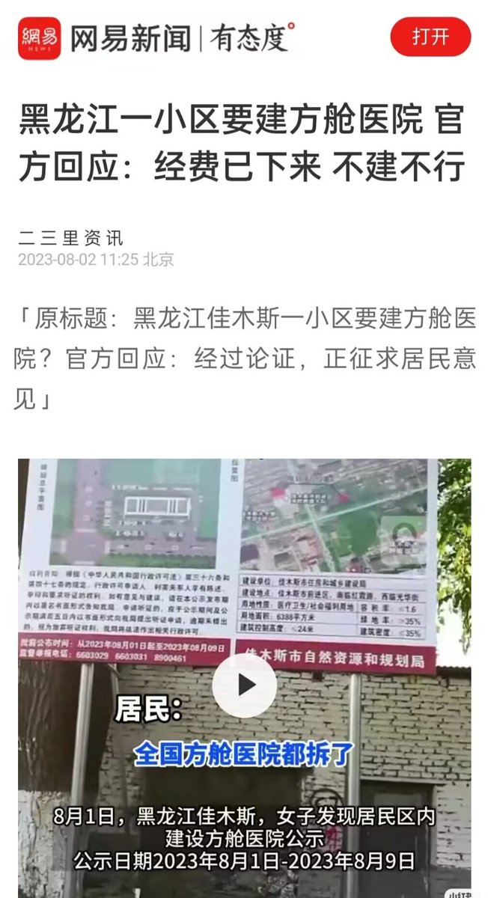
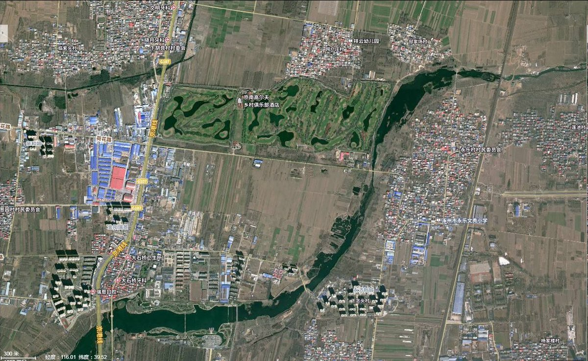
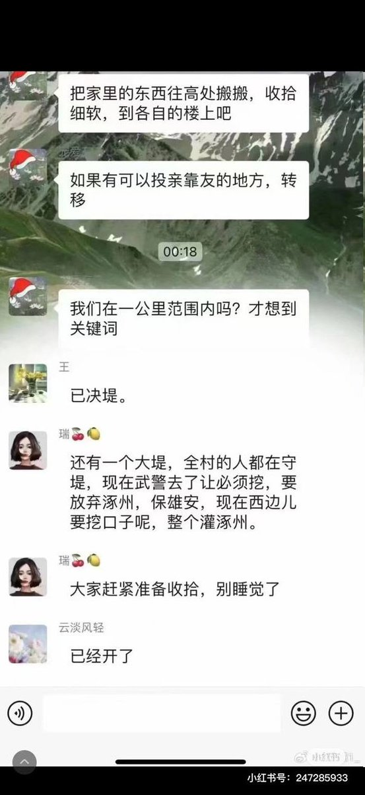
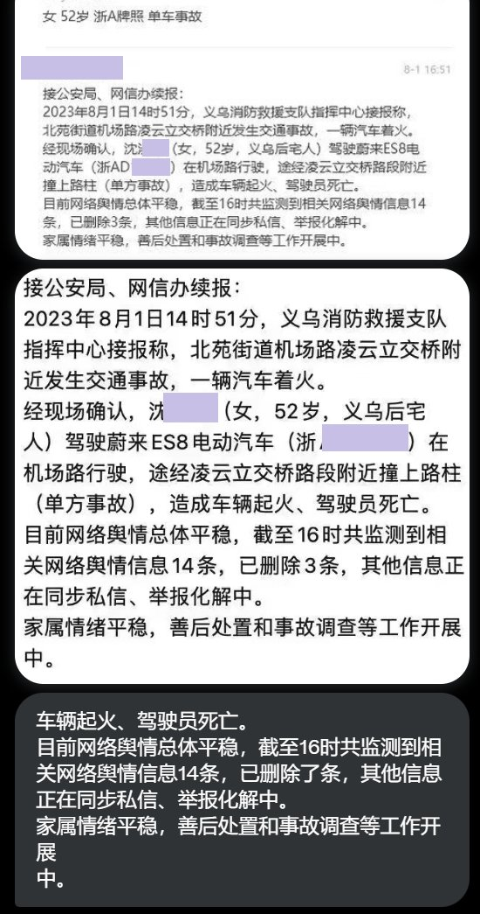
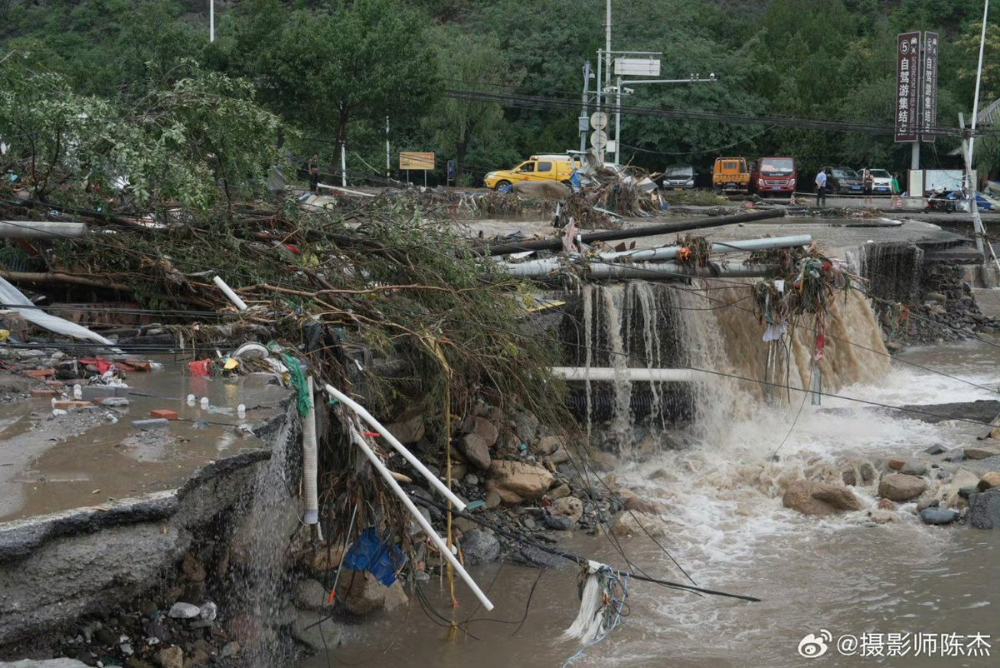
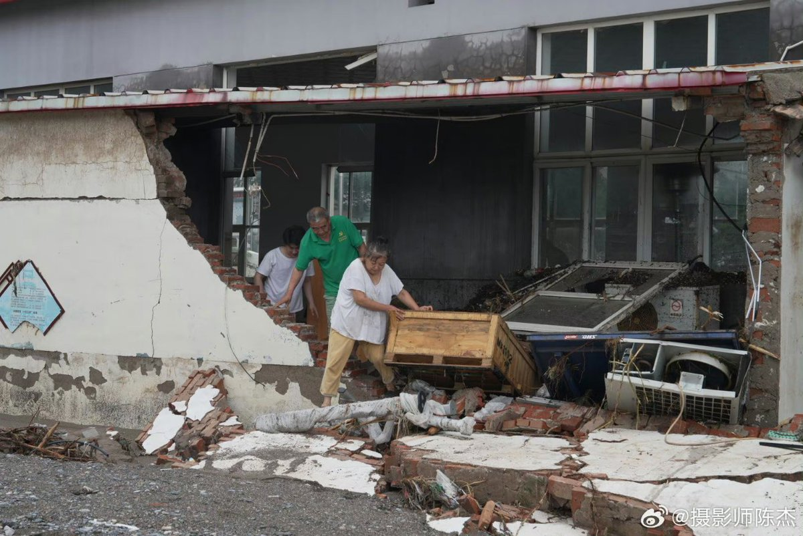
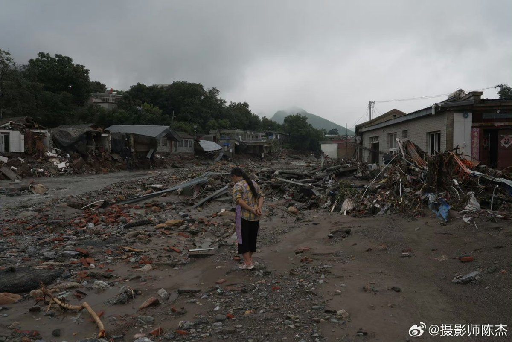

谁将十万横扫三江 北京时间 2023-08-02T13:40:37Z 1686612948855480320 2023年8月，黑龙江要建方舱了 https://t.co/ILip1Up0je   谁将十万横扫三江 北京时间 2023-08-02T11:51:09Z 1686585399421054977 网友投稿：慈善项目用小女孩当幌子给成年健康男性募资，真正的小女孩反而在打工给男子钱 https://t.co/tksraKQxgj   谁将十万横扫三江 北京时间 2023-08-02T12:07:05Z 1686589411595857921 RT @22HomoPoliticus: 我反对向京津冀洪泛区捐献，并呼吁推友不要因为看见煽情广告就捐献。

中国政府一遇到灾害就转嫁责任向社会寻求捐款。灾害一过去就向别国大撒币。你捐献的物资被人扔弃山沟里，被官员贪污、挪用和高价贩卖。你就算捐一亿美元，落到灾民手里不足一百元人…   谁将十万横扫三江 北京时间 2023-08-02T08:45:23Z 1686538649465417728 河北涿州，这个高尔夫俱乐部被淹了吗？洪水有党性 https://t.co/9lPrSNcg8x   谁将十万横扫三江 北京时间 2023-08-02T09:23:05Z 1686548136788180993 好消息：解放军来了
坏消息：他们是来解放洪水的
雄安才是未来，华夏的脊梁
一两个县嘛，皇上心里装的是九州万方 https://t.co/Rfy3opNMlq   谁将十万横扫三江 北京时间 2023-08-02T08:21:07Z 1686532544030965762 人民警察执法必严，搞不死你就搞你弟弟 https://t.co/YhDObM8U04   谁将十万横扫三江 北京时间 2023-08-02T08:23:12Z 1686533068478464000 RT @whyyoutouzhele: 8月2日凌晨，河北白沟因泄洪紧急疏散，上演深夜大逃亡，车辆在马路上排起长龙。
根据视频中称，目前周围村落已经沦陷，数万人正在往高碑店聚集避难。 https://t.co/5dfkRraDtI   谁将十万横扫三江 北京时间 2023-08-02T08:23:25Z 1686533124442947587 RT @whyyoutouzhele: https://t.co/c1bQt764Z3   谁将十万横扫三江 北京时间 2023-08-02T08:23:31Z 1686533147369013248 RT @whyyoutouzhele: 网友投稿
8月2日凌晨，网传涿州一个村子的村民反对强行泄洪，与警察发生冲突 https://t.co/L1ahmvq3br   谁将十万横扫三江 北京时间 2023-08-02T08:44:55Z 1686538535124504576 RT @jakobsonradical: 一名北京的摄影师镜头下的门头沟现场。具体位置是潭柘寺下边的南辛房村，此次受灾极其严重。 https://t.co/RoDedbPSr8   谁将十万横扫三江 北京时间 2023-08-02T08:46:14Z 1686538863437807621 RT @KillAllofAnar: 马克思建立的马政经体系不是只有一句剥削剩余价值，它对市场经济的解释能力无与伦比。反而是新古典经济学不承认社会关系只研究技术关系，这其实更适用于价值规律退居次要地位的社会主义的计划经济，经济学诺奖得主斯蒂格利茨就明确说过，如果我的理论正确那只…   谁将十万横扫三江 北京时间 2023-08-02T09:01:37Z 1686542736122576902 RT @nytchinese: 影评 |《隐入尘烟》：李睿珺这部感人至深的作品在中国上映后被下架。影片以两个贫困农民的爱情故事揭露了统治阶级和意识形态的弊端，其美感和人情味大概就是这部电影如此具有威胁性的原因。https://t.co/DxZO8euNbk   