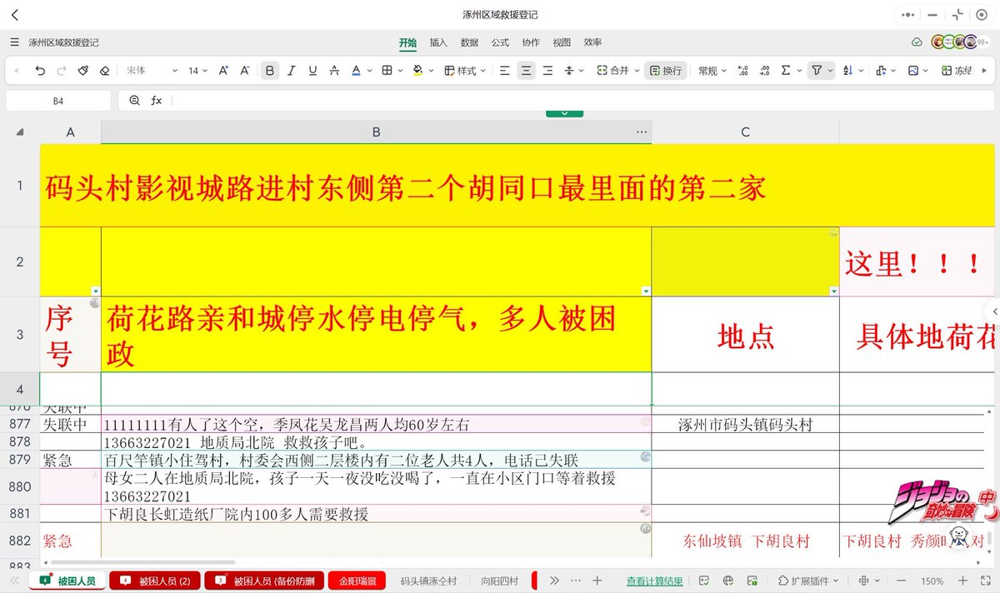
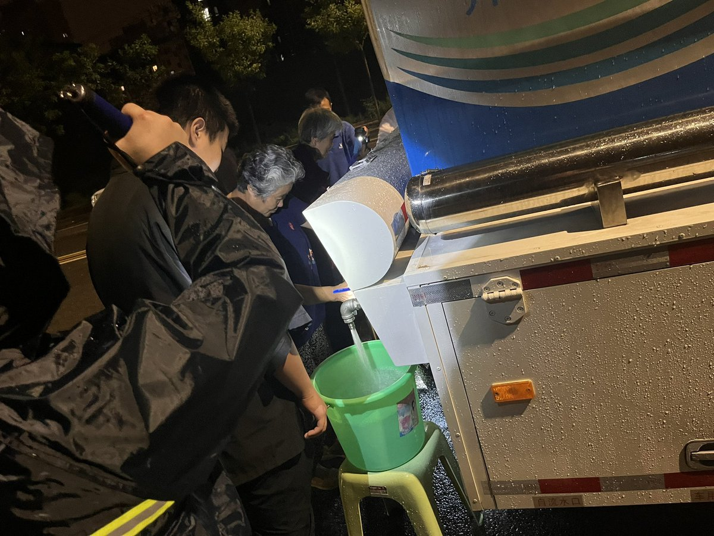

A李老师不是你老师 北京时间 2023-08-01T14:29:11Z 1686262784177111040 目前，河北涿州的在线求助文档已经更新到八百多条 https://t.co/F5bq77sZBr   A李老师不是你老师 北京时间 2023-08-01T15:54:49Z 1686284334297182209 目前，河北多地网友都收到了秦皇岛禁飞无人机的通知 https://t.co/Gzp5mXqmIB   A李老师不是你老师 北京时间 2023-08-01T16:11:16Z 1686288472535965696 8月1日下午，救援人员在抖音发布信息，保定涿州市永乐村5000人还没有救出，但是现在已经开始泄洪，急需救援 https://t.co/wTDar2zLSn   A李老师不是你老师 北京时间 2023-08-01T13:03:49Z 1686241298347409408 8月1日，河北沧州宣布启用献县泛区泄洪 https://t.co/4eCteOQqyO   A李老师不是你老师 北京时间 2023-08-01T00:53:13Z 1686057439488094208 31日晚，政府派遣应急供水车支援门头沟居民 https://t.co/RDI6qcbO4E   A李老师不是你老师 北京时间 2023-08-01T00:03:46Z 1686044995914969089 目前，门头沟全区大部分区域通讯中断 https://t.co/J85qj6C8vu   A李老师不是你老师 北京时间 2023-08-01T00:12:04Z 1686047085034889216 目前，受暴雨影响，K396次列车滞留时间已超过30小时。
今天晚上21:20分消息，由于铁路损毁，救援人员无法继续前进，改为就地救援当地村民。
对于被困旅客，目前计划安排空投所需物资。 https://t.co/GGrLAqhWNW   