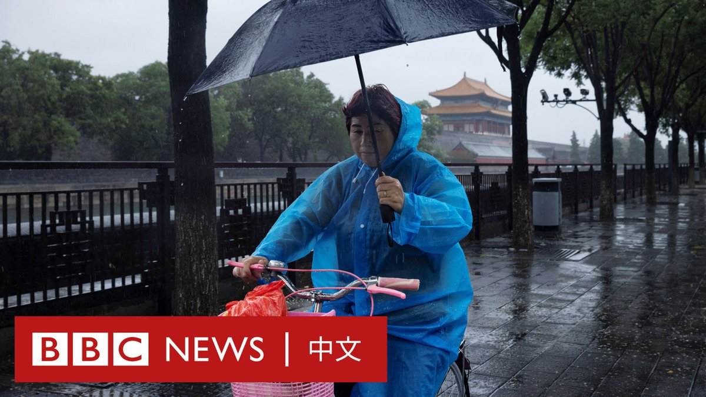
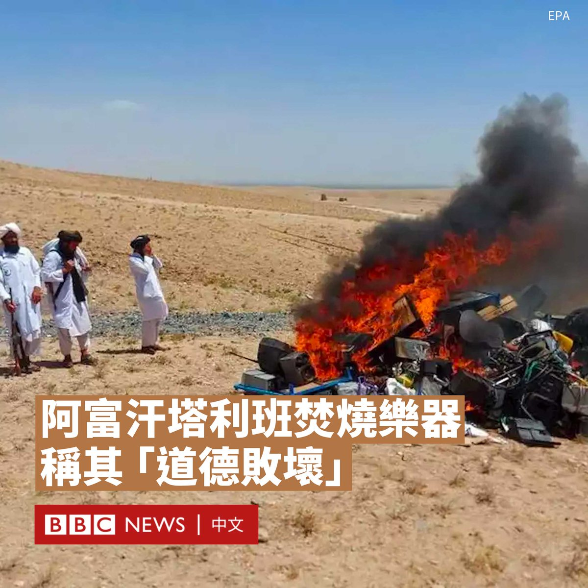
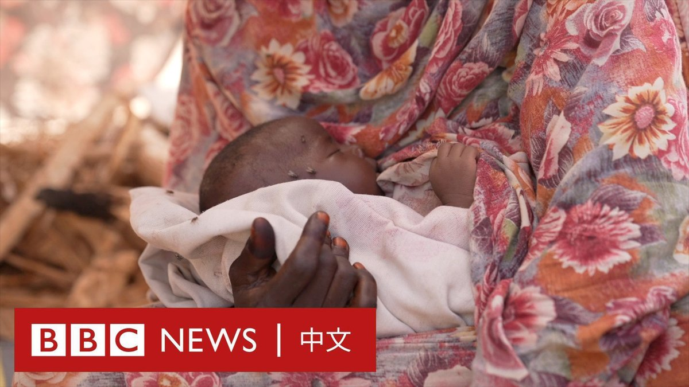

D英国广播公司BBC 北京时间 2023-08-01T17:53:07Z 1686314106129985536 “（我）活这么大了，第一次见到这么可怕的洪水。”

台风“杜苏芮”残余环流北上，为中国华北地区带来连续强降雨。北京多地严重淹水，洪水湍急、桥梁被冲毁，西部的门头沟和房山区首当其冲。

官方媒体报道称，暴雨和洪水目前已导致北京11人死亡，相邻的河北省则有9人死亡。 https://t.co/rNVUy1S5ub   D英国广播公司BBC 北京时间 2023-08-01T14:49:09Z 1686267806680297474 联合国教科文组织（UNESCO）表示，意大利威尼斯应该被列入世界濒危遗产名录。

根据教科文组织的一份报告，威尼斯面临着来自过多游客、过度开发以及因气候变化导致的海平面上升等问题，可能会遭受“不可逆”的破坏，所以该机构希望推动更好地保护威尼斯，为未来留下遗产。

据路透社报道，威尼斯市政府发言人表示，他们将“仔细阅读”这份提案，并与意大利政府进行讨论。

联合国教科文组织报告指责意大利当局在解决这座古老城市所面临的问题上“缺乏战略远见”，其被指未能妥善保护这座水城。

但威尼斯前市长马西莫·卡恰里（Massimo Cacciari）指责教科文组织是“地球上最昂贵和最没用的机构之一”。

“他们不给我们任何资金来做出改变，他们所做的只是批评......就好像威尼斯需要联合国教科文组织才能成为世界遗产一样！我们需要更多的行动和更少的言语。”

联合国教科文组织早在两年前就曾提议将威尼斯列入濒危名录，但由于意大利政府采取的一些紧急措施而在最后一刻被搁置。

其中一项措施是决定禁止大型船只（如游轮）进入圣马可运河，并承诺启动一项大规模城市保护计划。   D英国广播公司BBC 北京时间 2023-08-01T11:01:12Z 1686210442258182144 在声称音乐会导致“道德败坏”后，阿富汗塔利班在西部的赫拉特省焚烧乐器，价值数千美元的乐器被付之一炬。

自2021年掌权以来，塔利班政权对民众实施了许多限制措施，包括在公共场合禁止播放音乐，一些在行驶时播放音乐的车辆会被截停。

阿富汗国家音乐学院创始人艾哈迈德·萨尔马斯特（Ahmad Sarmast）将塔利班的行为比作“文化灭绝和音乐破坏”。

现居葡萄牙的萨马斯特说：“阿富汗人民被剥夺了艺术自由……在赫拉特焚烧乐器只是塔利班领导下阿富汗发生的文化灭绝的一个小例子。”

网络图片显示，在赫拉特被点燃的物品包括吉他、风琴和手鼓，以及一些音箱和扬声器。其中许多是在该市的婚礼场所缴获的。

塔利班劝善惩恶部的一名官员表示，播放音乐会“让年轻人误入歧途”。

7月19日，塔利班组织了另一场类似的乐器焚烧仪式。当局当时在推特上发布了焚烧的照片，但没有说明是在该国的哪个地区。

1990年代塔利班第一次在阿富汗掌权期间，所有形式的音乐都被禁止在社交聚会、电视和广播中播放。

在随后的二十年里，音乐得到复苏和发展，但塔利班于2021年8月重掌政权促使许多音乐家逃离该国，一些留下来的歌手和音乐家遭到殴打和歧视。

在过去两年，塔利班还依据他们对伊斯兰教法的保守解释，实施了其他严厉限制，包括禁止女性独自长途旅行，禁止高中以上的女生和妇女进入学校、健身房和公园。

上个月，塔利班还关闭了该国所有的美发和美容院。   D英国广播公司BBC 北京时间 2023-08-01T13:11:15Z 1686243172677238784 美国饶舌歌手卡蒂·B（Cardi B）在拉斯维加斯演出期间，遭一名观众向她泼洒液体。她随即把麦克风扔向人群并飙骂。

演唱会早些时候的片段显示，卡蒂·B曾要求另一名观众从背后向她泼水。

她后来在演出中解释说，此前的泼水是在她的指示下而进行的，而她反对另一位观众擅自泼水，并溅到了她的脸上。 https://t.co/1zRg8apTTs   D英国广播公司BBC 北京时间 2023-08-01T11:46:24Z 1686221819324547072 【最新消息】据中国官方媒体报道，截至8月1日6时，北京发生的暴雨和洪水已经造成11人遇难，其中包括2名救援人员，另有27人失踪。 https://t.co/AEpcDCDl6g   D英国广播公司BBC 北京时间 2023-08-01T09:35:31Z 1686188878871535616 苏丹的政府军和武装组织“快速支援部队”（Rapid Support Forces）从今年四月开始发生激烈冲突。为逃离战火，大批民众跨越边境前往邻国乍得。

由于男性较易被军事组织针对，成功抵达者多为女性与儿童，有妇女被迫在边境生产。 https://t.co/tqDkUu0Y4V   D英国广播公司BBC 北京时间 2023-08-01T00:21:00Z 1686049330384314368 直到去年，中国的大多数未婚女性实际上很难成为母亲。但现在，政策的改变和经济独立的可能，正在帮助这个国家的一些未婚女性独力养育自己的小孩。https://t.co/tRiNJjzmo7   